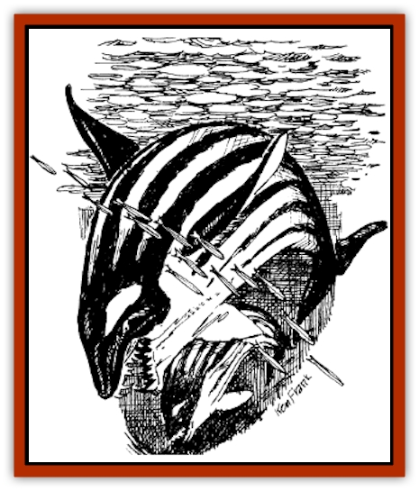

# Monolisk

| Statistic | **Monolisk** |
| --- | --- |
| **Activity Cycle:** | Day |
| **Alignment:** | Neutral |
| **Armor Class:** | -1 |
| **Climate/Terrain:** | Deep Waters |
| **Damage/Attack:** | 2d4/1d6 |
| **Diet:** | Carnivore |
| **Frequency:** | Very rare |
| **Hit Dice:** | 14 |
| **Intelligence:** | Animal (1) |
| **Magic Resistance:** | Nil |
| **Morale:** | Elite (13) |
| **Movement:** | 21 |
| **No. Appearing:** | 1 |
| **No. of Attacks:** | 2 |
| **Organization:** | Solitary |
| **Size:** | G (50' long) |
| **Special Attacks:** | Electrical |
| **Special Defenses:** | Strategy |
| **THAC0:** | 7 |
| **Treasure:** | Nil |
| **XP Value:** | 5,000 |

The monolisk is a large, water breathing mammal that hunts schools of fish. It electrically charges the water to stun these creatures, so that it can then scoop them into its huge maw. Its diet consists of any flesh (sea-dwelling or otherwise), up to and including creatures larger than itself. What it cannot swallow whole, it eats in as few bites as necessary. It does not hunt in packs as [[Shark|sharks]] or many other water dwelling carnivores do, which is very convenient for fishermen. The creature's smooth skin is mainly shiny black, with gray stripes from nose to tail.

**Combat:** These creatures do not intentionally harm other life forms, except when feeding, The monolisk uses its electrical generative capabilities to electrify the water in a 30-foot radius around itself. When it does this, everything in the water is shocked and stunned for 2d4 rounds and floats to the surface. A successful saving throw versus spell banishes the stunning effect. It can shock the water once every hour.

If this creature is attacked, it retaliates reflexively. It can bite an opponent for 2d4 points, or it can attack with a tail swipe for 1d6 points of damage. It cannot attack the same opponent with both attack forms, although it can attack two separate opponents at one time. The tail always attacks at a -4, because the monolisk cannot see beyond its normal peripheral vision.

For every twenty points of damage the creature takes, it must roll a morale check. If it fails, it turns tail and swims away.

This creature has a natural advantage over land creatures when they are in its element. as it can attack from any side as well as above and below a target. Targets must remember that a monolisk can dive at them or ram them from beneath, as well as attacking from the front, back, or sides.

**Habitat/Society:** These creatures usually hunt in solitary, unless one is aiding a sick or injured companion. They usually even fight among themselves over a feeding area. Monolisks have even been known to fight over an area that was completely void of prey.

**Ecology:** These creatures live approximately fifty years, and breed only ten times. The incubation period is three years, and they litter only one pup at a time. Twins kill the birthing mother 90% of the time. The young stay with the mother for two years, and then are sent off on their own. These creatures are one of the few water-breathing mammals in all of Nehwon. They are a favorite food of the [[Squid_Giant|kraken]], which have been known to hunt a single monolisk for weeks.

---
## Discovery & Documentation

**Source Publication:** LNR1 Wonders of Lankhmar (1992)
**Campaign Setting:** Lankhmar
**Author(s):** Dale "Slade" Henson

### Other Creatures Found in This Source Book
   * [[Smog_Deadly|Smog, Deadly]]
   * [[Stalking_Death|Stalking Death]]
   * [[Wolvern|Wolvern]]
