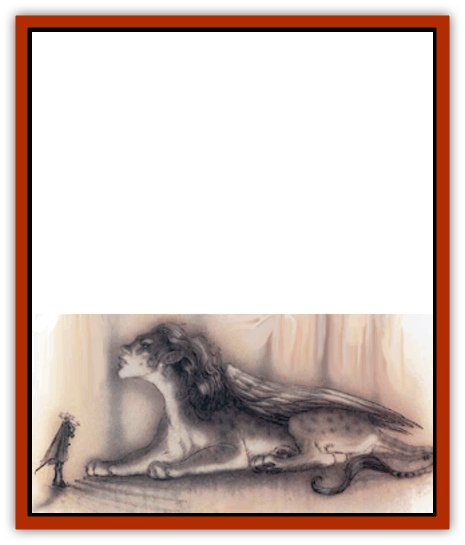

# Monster of Legend

| Statistic | **Monster of Legend** |
| --- | --- |
| **Activity Cycle:** | Any |
| **Alignment:** | Per prime-material monster |
| **Armor Class:** | 0 or better (-6) |
| **Climate/Terrain:** | Any |
| **Damage/Attack:** | Varies (4d6/4d6/2d10) |
| **Diet:** | Carnivore |
| **Frequency:** | Very rare |
| **Hit Dice:** | 75-150 hit points (120 hp) |
| **Intelligence:** | Per prime-material monster |
| **Magic Resistance:** | Special (80%) |
| **Morale:** | Fearless (19-20) |
| **Movement:** | Per prime-material monster (18, Fl 30 (D)) |
| **No. Appearing:** | 1 |
| **No. of Attacks:** | Per prime-material monster (3) |
| **Organization:** | Solitary |
| **Size:** | Varies (H, 12' tall) |
| **Special Attacks:** | Vanes (roar) |
| **Special Defenses:** | Varies |
| **THAC0:** | 5 |
| **Treasure:** | G,Z&times;2 |
| **XP Value:** | Special (35,000) |

**Note:** Parenthetical statistics refer to a legendary [[Sphinx|sphinx]]. See text for details.

  [[Hydra|Hydras]], [[Chimera|chimaeras]], [[Gorgon|gorgons]], [[Medusa|medusae]] - any number of bashers have encountered these creatures in the Prime Material Plane, but there aren't so many of 'em out on the Great Ring. In fact, there's usually just one, and that's the archetype for all monsters of that sort, the one they made up all the stories about. Creatures of this type're known on the planes as monsters of legend; they're found throughout the Great Wheel, in places where mighty heroes can try to best them. The hills and gorges of Olympus, the first layer of Arborea, are home to unique examples of each of the creatures above. Similar examples for almost all pantheons can be found in their own celestial or infernal realms.

A monster of legend's very similar to its terrestrial counterpart, but it's usually got even more of what makes its lesser kin dangerous. It's bigger, stronger, meaner, and tougher than any normal member of its species. In most cases, it has enhanced variations of the creature's normal powers or special immunities; for example, a legendary hydra might grow two heads each time one's cut off, or a legendary [[Cat_Great|lion]] might be completely invulnerable to all slashing and piercing weapons, or the stare of a legendary [[Basilisk|basilisk]] might be able to petrify characters who aren't even looking at it. Naturally, this makes a monster of legend a downright dangerous beast to tangle with unless a cutter knows what its special vulnerability is.

Monsters of legend�re never randomly encountered or just blundered into. Player characters run across one only when they're seeking it out or it's after them. A PC party might be ordered by a power to retrieve a legendary monster's treasure, or they might need the creature's blood or whatever as an ingredient for a magical mixture. Similarly, a berk�s got to find a way to make a power angry to get one of these on his trail.

**Combat:** Monsters of legend are *tough*. They're unique creatures, gifted with special powers and attack modes. The DM should create each one individually and assign it appropriate numbers and abilities. The numbers in parentheses above reflect the stats of a legendary sphinx, guarding an oracle of forbidden knowledge. It's intended as an example of how the DM might stat out a monster of legend.

**Armor Class: **At least four places better than a terrestrial equivalent. Normally an [[Sphinx|androsphinx]] is AC -2, so this legendary sphinx is AC -6. The DM decides that's pretty tough.

**Movement: **The monster's movement rate should be equal to its lesser counterpart's unless there's a good justification for a change. The androsphinx's movement stays the same.

**Hit Dice: **Monsters of legend have a flat hit point total that should be at least equal to the maximum possible hit points for a normal creature of that type. An androsphinx has 12 Hit Dice, so at a minimum the legendary sphinx should have (12x8) 96 hit points. The DM assigns it 10 hit points per die for 120 total.

**THAC0: **Divide the hit point total by 5 to come up with an approximate number of Hit Dice for the monster of legend. In the example above, the legendary sphinx is effectively a 20-Hit-Die monster. Its THACO and saving throws should be calculated from this total. Table 39 in the DMG lists the THACO for a 16 HD+ monster as 5.

**Number of Aitacks: **Generally the same as a normal member of the species, although a creature such as a hydra or kraken might have more heads or tentacles than normal. In the example of the sphinx, the DM decides that it attacks with two claws, just like an androsphinx, but that it also gains a bite attack since some other varieties of sphinx do.

**Damage/Attack: **Double or triple the base damage of the monster's attacks to reflect the superior size and power of a creature of legend. The androsphinx normally claws for 2d6 pofnts of damage, so the DM doubles it to 4d6 and assigns an arbitrary bite for another 2d10.

**Special Attacks: **As per the base creature, but possibly enhanced or slightly modified. Androsphinxes have the ability to cast spells as a 6th-level priest, so the DM decides that the legendary sphinx can cast spells as a 9th-level priest and use some of the gynosphinx's spell-like powers to boot. The second special ability of an androsphinx is its roar; the DM decides that the roar of a legendary sphinx has the effects of the third and most powerful roar of an androsphinx, but causes double normal damage and acts as a *horn of blasting*.

**Special defenses: **Any special defenses possessed by the normal monster'll be present in the legendary variety, possibly in enhanced form. Even if the creature doesn't normally have any special defenses, a legendary monster almost always has defenses of an unusual nature. Some examples:

<ul><li>Complete invulnerability to slashing and piercing weapons, like the Nemean Lion: Hercules slew the beast by strangling it since nothing could pierce its hide.</li><li>Blood so corrosive or poisonous that any edged weapon damaging the creature must survive an item saving throw versus acid or be destroyed: Blood splashed on a hero fighting the monster might force a saving throw versus poison to avoid death! Or, optionally, drops of blood spilled on the ground might turn into [[Scorpion|scorpions]], [[Snake|snakes]], or some other complication.</li><li>A coat of shining scales that reflects any magical attack onto its caster, or that *blinds* any hero who gazes on the creature.</li><li>Complete immunity to a category of attacks: A creature immune to attacks of earth suffers no damage from stone or metal weapons and is immune to elemental earth spells.</li><li>Invulnerability or complete regeneration while a certain condition persists: For example, a monster might constantly regenerate damage while it's in contact with the earth, but if it's lifted into the air it can be damaged normally. Another monster might be immune to physical damage while the sun is in the sky, and so on.</li></ul>The DM can be creative, but it's only sporting to leave some weakness or vulnerability for a clever hero to exploit. The search for a means to deal with an apparently invulnerable monster could be quite a challenge for a group of PCs! The DM decides that his legendary sphinx possesses a visage so incredibly beautiful that a hero who sees its face must successfully save versus spell or be *fascinated* an helpless for 2 to 12 rounds. The defense against this special attack power is a veil of gauze or some other thin fabirc worn over the eyes.

**Magic Resistance: **Ususally legendary monsters are immune to all spells except those that exploit a certain weakness or vulnerability in the creature. A legendary medusa may be affected by *gaze reflection*, while alegendary hydra might be damaged only by a spell that could physically remove on of is heads - for example, *flame blade* or *disintegrate*.

Since the sphinx is a creature of the desert, the DM rules that it can be damaged only by spells capable of harming or affecting stone or sand - *stone shape*, *passwall*, *transmute rock to mud*, and the like. He decides that the sphinx suffers 1d6 points of damage per level of the caster when struck by such a spell. Otherwise magic is useless against the creature.

**Size: **As per the normal variety of monster, but slightly larger. An androsphinx is size L (8' tall), so the DM decides that a legendary sphinx is size H (12' tall).

**Morale: **Monsters of legend are generally fearless (20). Otherwise, they wouldn't be legendary.

**XP Value: **Generally, about 5 to 10 times the value for the base monster is probably appropriate, depending on how difficult it is to figure out the monster's vulnerability. In the case of the sphinx, the DM multiplies the XP value of an androsphinx by 5 to arrive at a value of 35,000 XP.

**Habitat/Society:** Monsters of legend are closely associated with various pantheons and powers. As often as not, a legendary monster was created by a power to serve some specific purpose. A legendary serpent might be responsible for guarding a magical garden, or a legendary gorgon might have been ordered to destroy a particular realm and then left there to haunt the ruins after its task was accomplished.

Consequently, slaying a monster of legend can be a chancy affair. Even if the heroes are successful, it's possible that the act might attract the attention of the power that placed the beast where it was. Hades'd be profoundly irritated if a band of mortal heroes came along and managed to slay Cerberus, and he'd be likely to look for ways to punish them.

'Course, slaying a monster of legend can win a character great renown, fame, and firtune as well. That's the stuff that stories are made of.

**Ecology:** As larger-than-life figures, legendary monsters typically exist outside if the local ecology or alter it utterly. A fire-breathing monster might reduce an entire realm to charred ruins and blowing ash, or a monster with poisonous blood might render a stream permanently poisonous just by passing over it. The effects are always spectacular and long-lasting.

---
## Discovery & Documentation

**Source Publication:** Planescape II (1996)
**Campaign Setting:** Planescape
**Author(s):** Rich Baker, Karen S. Boomgarden

### Other Creatures Found in This Source Book
   * [[Aasimar|Aasimar]]
   * [[Abrian|Abrian]]
   * [[Arcane|Arcane]]
   * [[Balaena|Balaena]]
   * [[Beholder-kin_Observer|Beholder-kin, Observer]]
   * [[Bloodthorn|Bloodthorn]]
   * [[Bonespear|Bonespear]]
   * [[Darkweaver|Darkweaver]]
   * [[Demarax|Demarax]]
   * [[Dhour|Dhour]]
   * [[Eater_of_Knowledge|Eater of Knowledge]]
   * [[Eladrin_Greater_Firre|Eladrin, Greater, Firre]]
   * [[Eladrin_Greater_Ghaele|Eladrin, Greater, Ghaele]]
   * [[Eladrin_Greater_Tulani|Eladrin, Greater, Tulani]]
   * [[Eladrin_Lesser_Bralani|Eladrin, Lesser, Bralani]]
   * [[Eladrin_Lesser_Coure|Eladrin, Lesser, Coure]]
   * [[Eladrin_Lesser_Noviere|Eladrin, Lesser, Noviere]]
   * [[Eladrin_Lesser_Shiere|Eladrin, Lesser, Shiere]]
   * [[Fhorge|Fhorge]]
   * [[Ghostlight|Ghostlight]]
   * [[Guardinal_Avoral|Guardinal, Avoral]]
   * [[Guardinal_Cervidal|Guardinal, Cervidal]]
   * [[Guardinal_General_Information|Guardinal, General Information]]
   * [[Guardinal_Equinal|Guardinal, Equinal]]
   * [[Guardinal_Leonal|Guardinal, Leonal]]
   * [[Guardinal_Lupinal|Guardinal, Lupinal]]
   * [[Guardinal_Ursinal|Guardinal, Ursinal]]
   * [[Hollyphant|Hollyphant]]
   * [[Incantifer|Incantifer]]
   * [[Ironmaw|Ironmaw]]
   * [[Keeper|Keeper]]
   * [[Khaasta|Khaasta]]
   * [[Leomarh|Leomarh]]
   * [[Mortai|Mortai]]
   * [[Noctral|Noctral]]
   * [[Quill|Quill]]
   * [[Razorvine|Razorvine]]
   * [[Reave|Reave]]
   * [[Retriever|Retriever]]
   * [[Rilmani_Abiorach|Rilmani, Abiorach]]
   * [[Rilmani_General_Information|Rilmani, General Information]]
   * [[Rilmani_Argenach|Rilmani, Argenach]]
   * [[Rilmani_Aurumach|Rilmani, Aurumach]]
   * [[Rilmani_Cuprilach|Rilmani, Cuprilach]]
   * [[Rilmani_Ferrumach|Rilmani, Ferrumach]]
   * [[Rilmani_Plumach|Rilmani, Plumach]]
   * [[Shadowdrake|Shadowdrake]]
   * [[Spellhaunt|Spellhaunt]]
   * [[Spider_Hook|Spider, Hook]]
   * [[Sunfly|Sunfly]]
   * [[Sword_Spirit|Sword Spirit]]
   * [[Tanar'ri_Lesser_Bulezau|Tanar'ri, Lesser, Bulezau]]
   * [[Tanar'ri_Lesser_Maurezhi|Tanar'ri, Lesser, Maurezhi]]
   * [[Tanar'ri_Lesser_Yochlol|Tanar'ri, Lesser, Yochlol]]
   * [[Tanar'ri_General_Information|Tanar'ri, General Information]]
   * [[Tanar'ri_True_Alkilith|Tanar'ri, True, Alkilith]]
   * [[Terlen|Terlen]]
   * [[Tso|Tso]]
   * [[T'uen-rin|T'uen-rin]]
   * [[Vaporighu|Vaporighu]]
   * [[Vorr|Vorr]]
   * [[Wastrel|Wastrel]]
   * [[Wraithworm|Wraithworm]]
   * [[Yugoloth_Lesser_Canoloth|Yugoloth, Lesser, Canoloth]]
   * [[Zoveri|Zoveri]]
