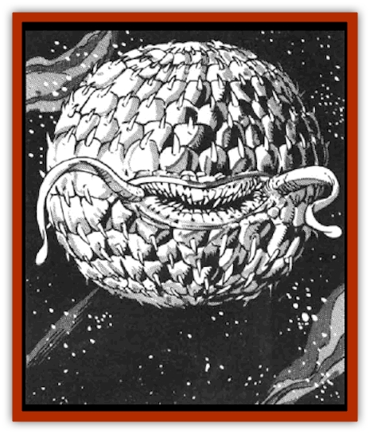

# Moon - Rogue

| Statistic | **Moon, Rogue** |
| --- | --- |
| **Activity Cycle:** | Any |
| **Alignment:** | Neutral |
| **Armor Class:** | 5 |
| **Climate/Terrain:** | Wildspace |
| **Damage/Attack:** | 1-10, Special |
| **Diet:** | Omnivore |
| **Frequency:** | Very rare |
| **Hit Dice:** | 15 |
| **Intelligence:** | Animal to low (1-7) |
| **Magic Resistance:** | Nil |
| **Morale:** | Steady (11) |
| **Movement:** | 3, Fl 18 (D) |
| **No. Appearing:** | 1 |
| **No. of Attacks:** | 1, Special |
| **Organization:** | None |
| **Size:** | H to G |
| **Special Attacks:** | Paralyzing spines |
| **Special Defenses:** | Nil |
| **THAC0:** | 5 |
| **Treasure:** | Nil (incidental) |
| **XP Value:** | 9,000 |

The rogue moon, a wandering monster the size of a [[Whale|whale]], earned its name from the fact that it resembles a ball glowing in the dark. It dwells in the more remote regions of wildspace where, from a distance, it may be mistaken for a moon.

The rogue moon has a roughly spherical body covered with scales that are orange to bright yellow. The scales form a thick, flexible armor. The rogue moon has two stalks and a large mouth on one side, and small openings regularly spaced about the rest of its body. The stalks are flexible and move constantly. The rogue moon's teeth are well adapted for a variety of different foods. Dozens of spikes lie flat on the scales, pointing away from the stalks and the mouth area.

**Combat:** Over the centuries, the rogue moon developed the uncanny ability to fool those who travel through wildspace. Unwary travelers and occasional monsters tend to move toward unknown sources of light. When the prey comes within several hundred yards, the rogue moon stops glowing and slowly drifts forward in the dark.

If the rogue moon gets within 30 feet of a prey, it suddenly increases its size tenfold, erecting its spikes. As it enlarges, the rogue moon sucks smaller prey toward it, unless they make a successful Dexterity check (success means they managed to grab onto their ship). Victims automatically impale themselves on the spikes when falling, suffering 1d12 points of damage. They must roll a successful saving throw vs. poison at the beginning of the next round or remain paralyzed for 1d6 turns.

Even a ship can be affected by the rogue moon's inhalation. Generally, a very large object, such as a ship, will hit the rogue moon one round after smaller objects, such as passengers. The rogue moon can avoid the ship by moving to one side. Otherwise, the impact causes 1 point of hull damage to the ship, 1d10 points of damage to all passengers (including those who impaled themselves on the moon's spikes, and 5d8 points of damage to the rogue moon itself.

If attacked, the rogue moon uses its sharp teeth to fight back, inflicting 1d10 points of damage per successful attack. After combat, the rogue moon returns to its normal size, shakes off any paralyzed prey, and devours them.

**Habitat/Society:** The rogue moon is by nature a wandering monster. It lives in the darker regions of wildspace, moving about erratically. The rogue moon generally drifts in space, covering several hundred miles in a month.

The rogue moons are solitary creatures. They do not mate, but have a peculiar way of reproducing. Every five years, a rogue moon exudes moonspawn, a thin, glowing cloud consisting of gases and microscopic eggs. The moonspawn does not dissipate into wildspace, as its cohesive properties enable it to stay together. The moonspawn then drifts away from the rogue moon. The smell of moonspawn can attract another rogue moon from thousands of miles away. When it reaches the moonspawn, the other rogue moon is fertilized. A year later, the "mother" casts away a dozen 1-HD rogue moons that immediately wander away in space. If anything or anyone else comes in contact with moonspawn, the moonspawn is wasted.

Rogue moons can move by compressing air out of the openings in their scales. They can retain air found in occasional pockets of air in space or around large objects. This how rogue moons move in combat, or leave the surface of larger objects. If a rogue moon accidentally lands on a large ship, it would use the air on that ship to propel itself away. They also can "walk" by slowly moving their spikes in the manner of sea urchins. In total vacuum, they are stranded, helpless against attackers, and would eventually perish. Rogue moons do not need to breathe air.

**Ecology:** Rogue moons can live without food for months. If starving, they go into a state of lethargy that lasts up to ten years or until they sense something or someone approaching. Beyond ten years, rogue moons wither and die.

The liver of rogue moons makes an excellent component for *reverse gravity potions*. The glands producing their venom can be used as an ingredient in various soporific drugs. (These glands are located at the base of the spikes, under the scales.) Treasure belonging to previous victims may be found inside the creatures, provided it was made of, or encased in, acid-resistant material.

---
## Discovery & Documentation

**Source Publication:** MC7 Spelljammer Appendix I (1990)
**Campaign Setting:** Advanced Dungeons & Dragons 2nd Edition
**Author(s):** various

### Other Creatures Found in This Source Book
   * [[Aartuk|Aartuk]]
   * [[Albari|Albari]]
   * [[Ancient_Mariner|Ancient Mariner]]
   * [[Argos|Argos]]
   * [[Beholder_Abomination_Astereater|Beholder (Abomination), Astereater]]
   * [[Blazozoid|Blazozoid]]
   * [[Chattur|Chattur]]
   * [[Chevall|Chevall]]
   * [[Clockwork_Horror|Clockwork Horror]]
   * [[Colossus|Colossus]]
   * [[Delphinid|Delphinid]]
   * [[Dizantar|Dizantar]]
   * [[Dog|Dog]]
   * [[Dog_Bog_Hound|Dog, Bog Hound]]
   * [[Esthetic|Esthetic]]
   * [[Focoid|Focoid]]
   * [[Fractine|Fractine]]
   * [[Giant_Spacesea|Giant, Spacesea]]
   * [[Golem_Furnace|Golem, Furnace]]
   * [[Golem_Radiant|Golem, Radiant]]
   * [[Gravislayer|Gravislayer]]
   * [[Grommam|Grommam]]
   * [[Hadozee|Hadozee]]
   * [[Hamster_Giant_Space|Hamster, Giant Space]]
   * [[Jammer_Leech|Jammer Leech]]
   * [[Lakshu|Lakshu]]
   * [[Lumineaux|Lumineaux]]
   * [[Lutum|Lutum]]
   * [[Mimic_Space|Mimic, Space]]
   * [[Misi|Misi]]
   * [[Mortiss|Mortiss]]
   * [[Murderoid|Murderoid]]
   * [[Nay-Churr|Nay-Churr]]
   * [[Phlog-Crawler|Phlog-Crawler]]
   * [[Plasman|Plasman]]
   * [[Plasmoid_DeGleash|Plasmoid, DeGleash]]
   * [[Plasmoid_DelNoric|Plasmoid, DelNoric]]
   * [[Plasmoid_General_Information|Plasmoid, General Information]]
   * [[Plasmoid_Ontalak|Plasmoid, Ontalak]]
   * [[Puffer|Puffer]]
   * [[Q'nidar|Q'nidar]]
   * [[Rastipede|Rastipede]]
   * [[Reigar|Reigar]]
   * [[Rock_Hopper|Rock Hopper]]
   * [[Slinker|Slinker]]
   * [[Spider_Asteroid|Spider, Asteroid]]
   * [[Spiritjam|Spiritjam]]
   * [[Survivor|Survivor]]
   * [[Syllix|Syllix]]
   * [[Symbiont_Power|Symbiont, Power]]
   * [[Vine_Infinity|Vine, Infinity]]
   * [[Wiggle|Wiggle]]
   * [[Wizshade|Wizshade]]
   * [[Wryback|Wryback]]
   * [[Zard|Zard]]
   * [[Zodar|Zodar]]
