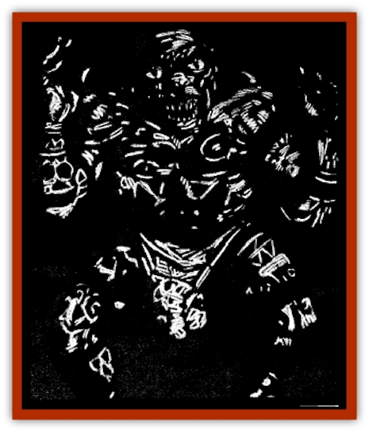

# Moor Man

| Statistic | **Moor Man** |
| --- | --- |
| **Activity Cycle:** | Night |
| **Alignment:** | Chaotic evil |
| **Armor Class:** | 8 |
| **Climate/Terrain:** | Moors |
| **Damage/Attack:** | By weapon |
| **Diet:** | Carnivore |
| **Frequency:** | Uncommon |
| **Hit Dice:** | 4+2 |
| **Intelligence:** | Average (8-10) |
| **Magic Resistance:** | Nil |
| **Morale:** | Unsteady (5-7) |
| **Movement:** | 12 |
| **No. Appearing:** | 4-24 (4d6) |
| **No. of Attacks:** | 1 |
| **Organization:** | Tribal |
| **Size:** | M |
| **Special Attacks:** | See below |
| **Special Defenses:** | See below |
| **THAC0:** | 17 |
| **Treasure:** | M (I) |
| **XP Value:** | 270 |

Moor men are a race of wild humanoids that live in the most dismal fens of Ravenloft. They hunt by ambushing unwary travelers by night and feasting on their steaming remains.

Moor men look like short humans with oversized eyes. They are completely hairless, and wear little more than a loincloth, or, for females, leather shirts made from the skins of their victims. Males very rarely wear shirts, preferring to decorate their bare flesh in tattoos made of mud, the blood of small animals, or any other ready stain.

**Combat:** Moor men have an acute sense of infravision that allows them to see heat emitting targets up to 300 yards distant on the cold moors. Unfortunately for them, this fantastic ability makes bright sunlight extremely painful. Moor men discovered in daylight or exposed to *continual lights* or other illumination of high intensity are blinded until the source is removed, and fight with a -4 to all Attack and Damage Rolls.

Most moor men (50%) use short swords taken from their past victims. Another quarter (25%) use axes, and the rest use clubs or daggers. Ten percent of the tribe will have short bows as well.

Moor men decorate themselves in a variety of tattoos that give them temporary abilities or powers. The tattoo is actually an amalgamation of several designs painted on key parts of the body, so no moor man can ever have more than one tattoo in effect at one time. When moor men are encountered, the DM should roll to see which tattoo each individual is wearing. The tattoos can not be made permanent, and must be replaced after any sort of combat or strenuous engagement.

**1. Defense. **This tattoo contains images of shields and mystical symbols. It gives the wearer a +1 to all saving throws, and imposes a 1-point penalty on the Attack and Damage Rolls of any enemy.

**2. Luck. **The designs of this tattoo are made of various flowers and other symbols that speak of good luck to the moor men. This allows the moor man to reroll a single die roll once per round, though the second roll supersedes the first.

**3. Veil of Darkness. **This tattoo is always black and contains images of eyes and suns. Moor men who wear it do not suffer from sunlight or other bright light.

**4. Invulnerability. **This tattoo automatically repels the first successful attack to hit the wearer in any given round, regardless of its nature. The design of this tattoo is the most distinctive. The moor man must draw a skeletal figure over his flesh that mimics his own. The coloration of the stain is always white.

**5. Berserking. **This tattoo shows axes and swords. During combat, it drives the wearer into a frenzied state that doubles the number of attacks he makes and his hit points. A moor man is mortally wounded when he loses his original hit points; the tattoo simply keeps him from realizing it.

**6. Bedazzlement. **These spiralling designs capture the attentions of anyone who gazes at the moor man and fails a saving throw vs. spell. The effect continues until the moor man or target is slain. A bedazzled victim may attempt an additional saving throw every round to shake off the effect. While under the tattoo's spell, a character cannot attack and loses any Dexterity bonuses to Armor Class.

**Habitat/Society:** Because of their aversion to sunlight, moor men spend most of their time in a state of quasi-hibernation buried in shallow pits by grasses, limbs, or other natural camouflage. As the sun sets, the clan emerges from its lair and members begin marking themselves with ceremonial tattoos. When that is done, the clan roams the moors looking for anyone unfortunate enough to cross their path.

**Ecology:** Moor men eat the meat of their prey. Usually they have to settle for marsh rats, raw fish, and the like, but it is humanoid flesh that they crave. Since few men dare to venture outdoors at night, the moor men's desire for this meat often overwhelms their fear of superior numbers or even their aversion to light.

---
## Discovery & Documentation

**Source Publication:** Ravenloft Appendix III (1991)
**Campaign Setting:** Ravenloft
**Author(s):** Kirk Botulla

### Other Creatures Found in This Source Book
   * [[Akikage|Akikage]]
   * [[Animator_Common|Animator, Common]]
   * [[Animator_Greater|Animator, Greater]]
   * [[Animator_Minor|Animator, Minor]]
   * [[Animator_General_Information|Animator, General Information]]
   * [[Bakhna_Rakhna|Bakhna Rakhna]]
   * [[Baobhan_Sith|Baobhan Sith]]
   * [[Beetle_Scarab|Beetle, Scarab]]
   * [[Boneless|Boneless]]
   * [[Boowray|Boowray]]
   * [[Bruja|Bruja]]
   * [[Carrionette|Carrionette]]
   * [[Carrion_Stalker|Carrion Stalker]]
   * [[Cat_Midnight|Cat, Midnight]]
   * [[Cat_Skeletal|Cat, Skeletal]]
   * [[Cloaker_Resplendent|Cloaker, Resplendent]]
   * [[Cloaker_Shadow|Cloaker, Shadow]]
   * [[Cloaker_Undead|Cloaker, Undead]]
   * [[Corpse_Candle|Corpse Candle]]
   * [[Death's_Head_Tree|Death's Head Tree]]
   * [[Doppelganger_Ravenloft|Doppelganger (Ravenloft)]]
   * [[Familiar_Pseudo-|Familiar, Pseudo-]]
   * [[Familiar_Undead|Familiar, Undead]]
   * [[Feathered_Serpent|Feathered Serpent]]
   * [[Fenhound|Fenhound]]
   * [[Figurine_Ceramic|Figurine, Ceramic]]
   * [[Figurine_Crystal|Figurine, Crystal]]
   * [[Figurine_Ivory|Figurine, Ivory]]
   * [[Figurine_Obsidian|Figurine, Obsidian]]
   * [[Figurine_Porcelain|Figurine, Porcelain]]
   * [[Figurine_General_Information|Figurine, General Information]]
   * [[Fleas_of_Madness|Fleas of Madness]]
   * [[Furies|Furies]]
   * [[Geist|Geist]]
   * [[Ghost_Animal|Ghost, Animal]]
   * [[Golem_Flesh_Ravenloft|Golem, Flesh (Ravenloft)]]
   * [[Golem_Mist_Ravenloft|Golem, Mist (Ravenloft)]]
   * [[Golem_Wax_Ravenloft|Golem, Wax (Ravenloft)]]
   * [[Gremishka|Gremishka]]
   * [[Hag_Spectral|Hag, Spectral]]
   * [[Head_Hunter|Head Hunter]]
   * [[Hearth_Fiend|Hearth Fiend]]
   * [[Hebi-No-Onna|Hebi-No-Onna]]
   * [[Hound_Phantom|Hound, Phantom]]
   * [[Hound_Skeletal|Hound, Skeletal]]
   * [[Imp_Wishing|Imp, Wishing]]
   * [[Ivy_Crawling|Ivy, Crawling]]
   * [[Jack_Frost|Jack Frost]]
   * [[Jolly_Roger|Jolly Roger]]
   * [[Kizoku|Kizoku]]
   * [[Lashweed|Lashweed]]
   * [[Leech_Magical|Leech, Magical]]
   * [[Leech_Psionic|Leech, Psionic]]
   * [[Lich_Defiler|Lich, Defiler]]
   * [[Lich_Drow|Lich, Drow]]
   * [[Lich_Elemental|Lich, Elemental]]
   * [[Lich_Psionic|Lich, Psionic]]
   * [[Living_Tattoo|Living Tattoo]]
   * [[Lycanthrope_Loup-garou|Lycanthrope, Loup-garou]]
   * [[Lycanthrope_Werejackal|Lycanthrope, Werejackal]]
   * [[Lycanthrope_Werejaguar_Ravenloft|Lycanthrope, Werejaguar (Ravenloft)]]
   * [[Lycanthrope_Wereleopard|Lycanthrope, Wereleopard]]
   * [[Lycanthrope_Wereray|Lycanthrope, Wereray]]
   * [[Mist_Ferryman|Mist Ferryman]]
   * [[Obedient|Obedient]]
   * [[Odem|Odem]]
   * [[Paka|Paka]]
   * [[Plant_Blood_Rose|Plant, Blood Rose]]
   * [[Plant_Fearweed|Plant, Fearweed]]
   * [[Radiant_Spirit|Radiant Spirit]]
   * [[Recluse|Recluse]]
   * [[Remnant_Aquatic|Remnant, Aquatic]]
   * [[Rushlight|Rushlight]]
   * [[Sea_Spawn_Master|Sea Spawn, Master]]
   * [[Sea_Spawn_Minion|Sea Spawn, Minion]]
   * [[Shadow_Asp|Shadow Asp]]
   * [[Shattered_Brethren|Shattered Brethren]]
   * [[Skeleton_Archer|Skeleton, Archer]]
   * [[Skeleton_Insectoid|Skeleton, Insectoid]]
   * [[Skin_Thief|Skin Thief]]
   * [[Spirit_Psionic|Spirit, Psionic]]
   * [[Strahd_Skeleton|Strahd Skeleton]]
   * [[Strahd_Zombie|Strahd Zombie]]
   * [[Unicorn_Shadow|Unicorn, Shadow]]
   * [[Vampire_Drow|Vampire, Drow]]
   * [[Vampire_Nosferatu|Vampire, Nosferatu]]
   * [[Vampire_Oriental|Vampire, Oriental]]
   * [[Virus_General_Information|Virus, General Information]]
   * [[Virus_I|Virus I]]
   * [[Virus_II|Virus II]]
   * [[Virus_III|Virus III]]
   * [[Vorlog|Vorlog]]
   * [[Will_O'Dawn|Will O'Dawn]]
   * [[Will_O'Deep|Will O'Deep]]
   * [[Will_O'Mist|Will O'Mist]]
   * [[Will_O'Sea|Will O'Sea]]
   * [[Zombie_Cannibal|Zombie, Cannibal]]
   * [[Zombie_Desert|Zombie, Desert]]
   * [[Zombie_Wolf|Zombie Wolf]]
   * [[Zombie_Fog|Zombie Fog]]
