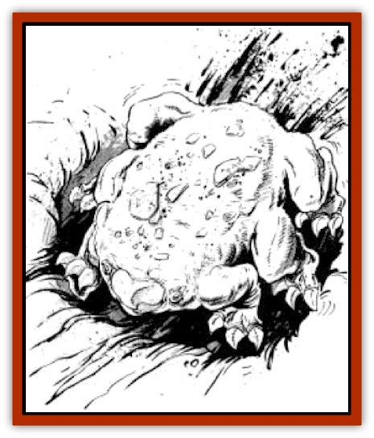

# Morin

| Statistic | **Morin** |
| --- | --- |
| **Activity Cycle:** | Dusk |
| **Alignment:** | Neutral |
| **Armor Class:** | 7 |
| **Climate/Terrain:** | Plains or steppe |
| **Damage/Attack:** | 1-2 each |
| **Diet:** | Scavenger |
| **Frequency:** | Uncommon |
| **Hit Dice:** | 2 |
| **Intelligence:** | Animal (1) |
| **Magic Resistance:** | Nil |
| **Morale:** | Special |
| **Movement:** | 18 |
| **No. Appearing:** | 3-12 |
| **No. of Attacks:** | 6 |
| **Organization:** | Pack |
| **Size:** | S (1-2') |
| **Special Attacks:** | Swarm |
| **Special Defenses:** | Burrowing |
| **THAC0:** | 19 |
| **Treasure:** | (Z) |
| **XP Value:** | 120 |

The morin is a dangerous, but rarely seen, creature of the steppes. However, when it does appear, its ferocity, speed, and numerous attacks make it dangerous.

The morin is a small creature, oblate in shape. The head and rear are difficult to distinguish, except for the beaklike mouth. The creature's eyes are small and weak. It has six short legs that end in thick claws good for burrowing and slashing. The creature is dirty mauve, pale and sickly in appearance. It is almost hairless.

**Combat:** The morin is a pack animal and is never encountered singly. Individually, it is not a fearsome creature, although its numerous attacks do pose a threat.

When attacking, the morin springs at its target. The creature can only leap 3', but this is sufficient to take down most of its prey. In the first round of combat, it attacks with all six legs, becoming a miniature whirlwind of claws. If four or more attacks hit, the creature grips its target and thereafter automatically causes 1 point of damage per gripping claw each round. It retains its hold until someone - it or the victim - dies. Those encumbered by a gripping morin suffer a -1 on their chance to hit for each creature. Thus, a warrior with three of the beasts clinging to him has a -3 modifier on his rolls to hit.

What makes the morin truly fearsome, however, is the swarm. Whenever eight or more morin are encountered, the creatures are swarming. A swarm will attack any living creature the size of a horse or less. The entire swarm attacks a single target. Instead of calculating each attack individually, a single roll is made for the entire swarm (THAC0 17 for their ferocity). The swarm attack causes 2 points of damage for each creature in the swarm. Thus, a swarm of 11 creatures causes 22 points of damage. If the target is not killed in the first attack, 2-12 morin cling to it. These creatures cause an automatic 4 points of damage per creature in subsequent rounds. Once the victim is slain the morin immediately begin burrowing, taking their prey with them.

Perhaps once in a score of years, the morin gather into a great swarm of 100 or more creatures. They are the stuff of terrifying tales when they appear. When this happens, there is little for normal folk to do but leave the area. Such swarms eventually disintegrate through attrition and natural events.

Morin normally have a morale of 12. However, while swarming they never make morale checks.

**Habitat/Society:** The morin are burrowing pack creatures, living in colonies known as pods. During most of the day they live in colonies beneath the surface. These are collections of tunnels, dens, bolt holes, and storage chambers. On the surface, a morin colony looks very much like a prairie dog town - mounds built up around holes. One or two morin are always on watch, although they have few predators to fear.

The morin are exceptionally fast diggers, using this ability to hunt, lying in wait just below the surface. More often they rely on their speed to run down their prey.

The morin are adapted to life in the plains in other ways. They breed quickly, producing litters of two to five young every year. They drink little, getting most of their moisture from their kills. During times of drought the morin hibernate in large underground nests, sealed off from the surface. All the members of the pod hibernate in a single chamber. When the rains return, the morin surge forth and immediately swarm in search of food. The chance to encounter morin increases after a thunderstorm, making such times dangerous on the steppe.

**Ecology:** The morin are predators and scavengers. While they prefer to make their own kills, the pack will also scavenge carrion on the steppe. They normally hunt [[Mammal_Small|small mammals]] and [[Mammal_Herd_I|antelope]] and only attack humans or larger targets when they are swarming. They are a plague on shepherds, since [[Mammal_Herd_I|sheep]] are a favorite prey.

---
## Discovery & Documentation

**Source Publication:** MC11 Forgotten Realms Appendix II (1991)
**Campaign Setting:** Advanced Dungeons & Dragons 2nd Edition
**Author(s):** Tim Beach, Tim Brown, William W. Connors, Dale Donovan, Ed Greenwood, Jeff Grubb, Bruce Heard, Slade Henson, Rob King, Colin McComb, Roger E. Moore, Bruce Nesmith, Jon Pickens, Jean Rabe, Dori Watry, Skip Williams

### Other Creatures Found in This Source Book
   * [[Alaghi|Alaghi]]
   * [[Alguduir|Alguduir]]
   * [[Beguiler|Beguiler]]
   * [[Bird_Toril|Bird (Toril)]]
   * [[Cantobele|Cantobele]]
   * [[Carapace|Carapace]]
   * [[Cat_Toril|Cat (Toril)]]
   * [[Chitine|Chitine]]
   * [[Cildabrin|Cildabrin]]
   * [[Dimensional_Warper|Dimensional Warper]]
   * [[Dragon_Deep|Dragon, Deep]]
   * [[Fachan_Toril|Fachan (Toril)]]
   * [[Fael|Fael]]
   * [[Feyr|Feyr]]
   * [[Firetail|Firetail]]
   * [[Frost|Frost]]
   * [[Gaund|Gaund]]
   * [[Gloomwing|Gloomwing]]
   * [[Golden_Ammonite|Golden Ammonite]]
   * [[Golem_Lightning|Golem, Lightning]]
   * [[Hamadryad|Hamadryad]]
   * [[Harrier|Harrier]]
   * [[Harrla|Harrla]]
   * [[Haun|Haun]]
   * [[Haundar|Haundar]]
   * [[Hendar|Hendar]]
   * [[Inquisitor|Inquisitor]]
   * [[Lhiannan_Shee|Lhiannan Shee]]
   * [[Loxo|Loxo]]
   * [[Manni|Manni]]
   * [[Manscorpion|Manscorpion]]
   * [[Mara|Mara]]
   * [[Naga_Dark|Naga, Dark]]
   * [[Orpsu|Orpsu]]
   * [[Plant_Carnivorous_Black_Willow|Plant, Carnivorous, Black Willow]]
   * [[Plant_Carnivorous_Toril|Plant, Carnivorous (Toril)]]
   * [[Plant_Dangerous_I|Plant, Dangerous I]]
   * [[Ring-Worm|Ring-Worm]]
   * [[Rohch|Rohch]]
   * [[Sand_Cat|Sand Cat]]
   * [[Saurial|Saurial]]
   * [[Sha'az|Sha'az]]
   * [[Silver_Dog|Silver Dog]]
   * [[Simpathetic|Simpathetic]]
   * [[Skuz|Skuz]]
   * [[Spider_Monkey|Spider, Monkey]]
   * [[Tren|Tren]]
