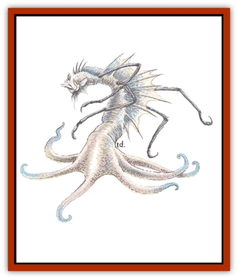

# Morkoth

| Statistic | **Morkoth** |
| --- | --- |
| **Activity Cycle:** | Night |
| **Alignment:** | Chaotic evil |
| **Armor Class:** | 3 |
| **Climate/Terrain:** | Any aquatic |
| **Damage/Attack:** | 1-10 |
| **Diet:** | Carnivore |
| **Frequency:** | Very rare |
| **Hit Dice:** | 7 |
| **Intelligence:** | Exceptional (15-16) |
| **Magic Resistance:** | Nil |
| **Morale:** | Elite (14) |
| **Movement:** | Sw 18 |
| **No. Appearing:** | 1 |
| **No. of Attacks:** | 1 |
| **Organization:** | Solitary |
| **Size:** | M (6' long) |
| **Special Attacks:** | Hypnosis |
| **Special Defenses:** | Spell reflection |
| **THAC0:** | 13 |
| **Treasure:** | (G) |
| **XP Value:** | 1,400 |

Of all the creatures that inhabit the deep, only the [[Squid_Giant|kraken]] exceeds the morkoth in malice and cruelty. Also known as the "wraith of the deep", the morkoth lurks in tunnels hoping to lure its victims into a trap from which they cannot escape.

The descriptions given by those who have encountered morkoths contain considerable variation, so no one is certain what they really look like. They are usually said to resemble an intelligent [[Fish|fish]] with an [[Octopus_Giant|octopus's]] beak. They are most frequently described as being between 5 to 6 feet long, inky black in color, with faint luminescent silver patches. They may have fins for arms and legs that vaguely resemble those of humans, and a number of fins for navigation and propulsion in the depths. Morkoths have infravision with a 90-foot range. They speak their own language.

**Combat:** A morkoth attacks by snapping with its squid-like beak, which inflicts 1d10 points of damage. A morkoth lives at the center of six spiraling tunnels, each of which leads to a central chamber. These tunnels are narrow (only one size M creature may enter at a time, and no size L). As a victim passes over a tunnel, he is drawn in by a hypnotic pattern, which leads him toward the central chamber. As the victim is drawn into the central chamber, he approaches the morkoth without realizing it and must roll a successful saving throw vs. spell with a -4 penalty or be *charmed*. A *charmed* victim is devoured at the morkoth's leisure. If the morkoth doesn't *charm* the victim before he comes within 60 feet, the hypnotic effect of the tunnels is broken.

A morkoth is highly resistant to magic. It reflects any spell that is cast at it back to the caster, including spells with an area of effect. If a *dispel magic* is simultaneously cast with a spell, there is a 50% chance the morkoth will be unable to reflect it, though it is entitled to a saving throw vs. the *dispel*.

**Habitat/Society:** Morkoths are normally solitary creatures. They sometimes make alliances with kraken, offering their help in exchange for an occasional slave. If approached by evil sea humanoids for assistance, morkoths may strike a bargain but often betray their "allies" at the most opportune moment.

Morkoths rarely leave their tunnels. The tunnels are originally natural, but are slowly carved over the course of centuries by the morkoths so that the central chamber grows larger. Morkoths sometimes build their tunnels near hot air vents, so the water in morkoth lairs may be warmer than normal.

Morkoths realize that other intelligent creatures like treasure, so they collect belongings from the creatures they kill to use in bargaining with other creatures. They place no value on gold or gems or even magical items. Morkoths enjoy deception above all else. They do not enslave their victims, if only because their appetites are so fierce that slaves would not survive long.

**Ecology:** According to the most popular theories, morkoths are a species of fish with human and [[Squid_Giant|squid]] influences. Sages are unsure if this species occurred by chance or design. Morkoths are carnivorous and will eat nearly any sea creature. Their usual diet is deep-water creatures such as [[Shark|sharks]], octopi, [[Kuo-Toa|kuo-toas]], and [[Sahuagin|sahuagin]]. The life spans of male morkoths are about 80 to 100 years, while females die after egg-laying.

Once every ten years, a morkoth leaves its tunnels and wanders the seas searching for a mate, leaving a distinctive odor trail that is easy for morkoths to identify and follow. After mating, the male morkoth returns to its tunnels and the female lays a clutch of about 25 eggs, which she buries in the ocean floor. She then dies. The eggs hatch in two months, and the immature morkoths struggle to survive, instinctively searching for vacant tunnels. Most hatchlings die on this journey.

After six months, a young morkoth is mature enough to survive (it now has 2 hp/HD, for 14 hit points). It grows into a full-sized, exceptionally intelligent morkoth adult by its fifth year.

---
## Discovery & Documentation

**Source Publication:** MC2 Volume II (1993)
**Campaign Setting:** Advanced Dungeons & Dragons 2nd Edition
**Author(s):** Jay Batista, Scott Bennie, Grant Boucher, William W. Connors, Steve Gilbert, Heike Kubasch, James Lowder, David Edward Martin, Bruce Nesmith, Jean Rabe, Rick Swan, John J. Terra, Gary L. Thomas

### Other Creatures Found in This Source Book
   * [[Ant|Ant]]
   * [[Ant_Lion_Giant|Ant Lion, Giant]]
   * [[Ape_Carnivorous|Ape, Carnivorous]]
   * [[Baboon|Baboon]]
   * [[Badger|Badger]]
   * [[Barracuda|Barracuda]]
   * [[Beetle_Giant|Beetle, Giant]]
   * [[Bulette|Bulette]]
   * [[Bullywug|Bullywug]]
   * [[Dwarf_Duergar|Dwarf, Duergar]]
   * [[Dwarf_Gully|Dwarf, Gully]]
   * [[Eagle|Eagle]]
   * [[Eel|Eel]]
   * [[Elemental_Air_Kin|Elemental, Air Kin]]
   * [[Elemental_Water_Kin|Elemental, Water Kin]]
   * [[Elemental_Water_Kin_Water_Weird|Elemental, Water Kin, Water Weird]]
   * [[Firestar|Firestar]]
   * [[Firetail|Firetail]]
   * [[Fish_Giant|Fish, Giant]]
   * [[Frog|Frog]]
   * [[Gorgon|Gorgon]]
   * [[Hawk|Hawk]]
   * [[Heucuva|Heucuva]]
   * [[Hippocampus|Hippocampus]]
   * [[Hippogriff|Hippogriff]]
   * [[Kelpie|Kelpie]]
   * [[Kenku|Kenku]]
   * [[Killmoulis|Killmoulis]]
   * [[Kuo-Toa|Kuo-Toa]]
   * [[Lamia|Lamia]]
   * [[Lammasu|Lammasu]]
   * [[Lamprey|Lamprey]]
   * [[Leech|Leech]]
   * [[Leprechaun|Leprechaun]]
   * [[Leucrotta|Leucrotta]]
   * [[Locathah|Locathah]]
   * [[Lycanthrope_Wereboar|Lycanthrope, Wereboar]]
   * [[Lycanthrope_Werefox|Lycanthrope, Werefox]]
   * [[Mammal_Minimal|Mammal, Minimal]]
   * [[Mammal_Small|Mammal, Small]]
   * [[Mimic|Mimic]]
   * [[Muckdweller|Muckdweller]]
   * [[Myconid|Myconid]]
   * [[Naga|Naga]]
   * [[Obliviax|Obliviax]]
   * [[Octopus_Giant|Octopus, Giant]]
   * [[Otyugh|Otyugh]]
   * [[Piranha|Piranha]]
   * [[Plant_Dangerous_I|Plant, Dangerous I]]
   * [[Plant_Intelligent|Plant, Intelligent]]
   * [[Poltergeist|Poltergeist]]
   * [[Porcupine|Porcupine]]
   * [[Rat_Osquip|Rat, Osquip]]
   * [[Roc|Roc]]
   * [[Roper|Roper]]
   * [[Rot_Grub|Rot Grub]]
   * [[Rust_Monster|Rust Monster]]
   * [[Sahuagin|Sahuagin]]
   * [[Sea_Lion|Sea Lion]]
   * [[Sea_Horse_Giant|Sea Horse, Giant]]
   * [[Shambling_Mound|Shambling Mound]]
   * [[Shark|Shark]]
   * [[Sphinx|Sphinx]]
   * [[Squid_Giant|Squid, Giant]]
   * [[Stirge|Stirge]]
   * [[Swanmay|Swanmay]]
   * [[Tarrasque|Tarrasque]]
   * [[Tasloi|Tasloi]]
   * [[Triton|Triton]]
   * [[Troglodyte|Troglodyte]]
   * [[Urchin|Urchin]]
   * [[Urd|Urd]]
   * [[Weasel|Weasel]]
   * [[Wolverine|Wolverine]]
   * [[Yellow_Musk_Creeper|Yellow Musk Creeper]]
