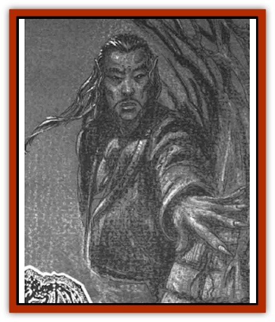

# Morpheus

| Statistic | **Morpheus** |
| --- | --- |
| **Activity Cycle:** | Night |
| **Alignment:** | Chaotic evil |
| **Armor Class:** | 0 |
| **Climate/Terrain:** | The Nightmare Lands |
| **Damage/Attack:** | 1d4+2 |
| **Diet:** | Special |
| **Frequency:** | Unique |
| **Hit Dice:** | 12 |
| **Intelligence:** | Genius (17) |
| **Magic Resistance:** | 60% |
| **Morale:** | Steady (12) |
| **Movement:** | 12, Fl 12 (B) |
| **No. Appearing:** | 1 |
| **No. of Attacks:** | 1 |
| **Organization:** | Solitary |
| **Size:** | M (60' tall) |
| **Special Attacks:** | Change form, gate |
| **Special Defenses:** | +2 or better to hit |
| **THAC0:** | 9 |
| **Treasure:** | Nil |
| **XP Value:** | 12,000 |

Morpheus is one of the strangest members of the [[Nightmare_Court_The|Nightmare Court]], a chaotic imp who loves to confuse, confound, and shock the dreamers who provide the energy to sustain him.

Morpheus is a red-skinned, powerfully built male with dark hair and eyes, a thin mustache, and pointed ears. He adorns himself in expensive, formal suits, though only from the waist up. His lower body tapers off into vaporous trails.

Due to his connection to the dream plane, Morpheus can speak any language he has ever come in contact with.

**Combat:** Though he appears physically strong, Morpheus is not a fighter. His huge fist can inflict 1d4+2 points of damage, but this member of the Court rarely resorts to such crude methods. In addition to the common powers he shares with the rest of the Nightmare Court, Morpheus has his own special abilities to call upon.

Morpheus has the ability to fly, and he uses it to stay out of the reach of any who would strike him physically. When a situation presents itself that requires brute force, Morpheus has the power to *gate* an [[Dream_Spawn_Greater_Ennui|ennui]] or [[Dream_Spawn_Lesser_Morph|shadow morph]] to his side at will. All morphs must obey the commands of this Court member, and he can control 15 HD of the creatures at a time.

Perhaps Morpheus's most potent personal power is his ability to *change form*. He can use this power on himself or on others, and it seems to work much like the common *terrain change* power, but with a broader application. There are three primary ways Morpheus can use the *change form* power: on himself, on his minions, or on his victims.

Morpheus can *change form* into any creature once per round. The power functions like the *polymorph self* spell except that Morpheus gains all of the powers, abilities, and weaknesses of the form he assumes. He can become any creature with 12 HD or less. He enjoys turning into [[Dragon_General_Information|dragons]] or other beasts with ranged attacks.

When used on a minion, *change form* can turn a morph into a monster up to 2 HD more powerful than its natural state. For example, a shadow morph can be altered to become a terrifying creature with 7 HD instead of 5 HD, or an ennui into a 10 HD monster instead of 8 HD.

If used on wanderers or dreamers, *change form* is employed to increase the chaos and confusion of the moment. The victim gets no saving throw, but also does not need to make a system shock check. The new form lasts for 1d2+1 rounds. Morpheus enjoys forcing his victims to assume the forms of loved ones or despised enemies, of nameless people who loved ones do not recognize, or even hapless creatures unable to stand against the horror of the moment.

**Habitat/Society:** Morpheus controls the Forest of Everchange, where he wanders aimlessly when not observing events in a dreamscape. [[Human_Abber_Shaman|Abber shamans]] call him the Changing Man, for the forest warps into a different place in the wake of his passage.

**Ecology:** Morpheus cannot tolerate order or stability. If the world around him is not caught up in a storm of change, Morpheus becomes bored and depressed. He revels in confusion and change - especially change brought about through misery. He feeds on dreams of madness, where scenes shift for no reason and patterns cannot be detected.

---
## Discovery & Documentation

**Source Publication:** The Nightmare Lands (1995)
**Campaign Setting:** Ravenloft
**Author(s):** Shane Lacy Hensley

### Other Creatures Found in This Source Book
   * [[Arcane_Head|Arcane Head]]
   * [[Dreamweaver|Dreamweaver]]
   * [[Dream_Spawn_General_Information|Dream Spawn, General Information]]
   * [[Dream_Spawn_Greater_Ennui|Dream Spawn, Greater, Ennui]]
   * [[Dream_Spawn_Lesser_Morph|Dream Spawn, Lesser, Morph]]
   * [[Ghost_Dancer_The|Ghost Dancer, The]]
   * [[Human_Abber_Shaman|Human, Abber Shaman]]
   * [[Hypnos|Hypnos]]
   * [[Lost_Souls|Lost Souls]]
   * [[Mullonga|Mullonga]]
   * [[Nightmare_Court_The|Nightmare Court, The]]
   * [[Nightmare_Man_The|Nightmare Man, The]]
   * [[Night_Terror_Mandalain|Night Terror, Mandalain]]
   * [[Rainbow_Serpent_The|Rainbow Serpent, The]]
