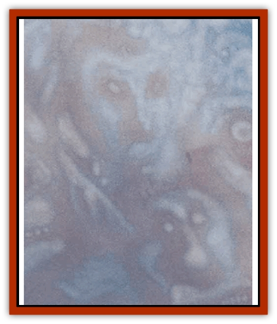

# Mortai

| Statistic | **Mortai** |
| --- | --- |
| **Activity Cycle:** | Any |
| **Alignment:** | Neutral good (chaotic) |
| **Armor Class:** | -5 |
| **Climate/Terrain:** | Beastlands |
| **Damage/Attack:** | 10d6 (special) |
| **Diet:** | Unknown |
| **Frequency:** | Rare |
| **Hit Dice:** | 20 |
| **Intelligence:** | Godlike (21+) |
| **Magic Resistance:** | 80% |
| **Morale:** | Fearless (19-20) |
| **Movement:** | Fl 48 (A) |
| **No. Appearing:** | 1 |
| **No. of Attacks:** | 1 (special) |
| **Organization:** | Solitary |
| **Size:** | G (undetermined dimensions) |
| **Special Attacks:** | Wind magic |
| **Special Defenses:** | Immune to weapons |
| **THAC0:** | 5 |
| **Treasure:** | None |
| **XP Value:** | 25,000 |

Mortai are a mystery of the Beastlands, enigmatic creatures of immense intelligence and power. They keep their own darks close in the chest, but they're glad to help a cutter out with just about any problem he might bring before 'em. Mortai specialize in issues of philosophy, but a clever blood can often direct the conversation the way he'd like it to go and get some useful information out of a mortai.

Also known as the "faces in the clouds", mortai are creatures of the air. They appear as great clouds spanning the horizon, covering miles from side to side and towering thousands of feet in the air. In fact, a basher who doesn'tknow what he's looking for'll walk right under a mortai wihout even realizing that the creature is just drifting along a half mile or so over his head. Most of the time, mortai are happy to remain unnoticed, and can imitate a natural cloud perfectly. But when they want a basher to know they're present, the mortai begin to pulsate with a golden glow, crackling with immense power like a lightning storm. When a mortai reveals itself this way, great faces of wisdom and beauty begin to appear on the surface of its clouds.

Mortai speak with booming voices of wind and thunder, when they bother to speak at all. They know all languages. Mortai are generally pacifistic creatures, and they'll usually just leave if a mortal tries to pick a fight with 'em. However, they're not so generous with creatures of evil alignment and might decide to teach a nasty sod a lesson.

**Combat:** If a mortai is somehow driven to combat, it can attack once per round with a great bolt of lightning 10 feet in diameter and possibly miles in length. Any creature in the path of the bolt suffers 10d6 points of damage (a save versus spell for half damage applies). A creature standing on the ground when struck by a bolt must make an additional successful throw versus spell or be stunned for 2 to 20 rounds. Mortai can throw lightning bolts all day if that's what it takes to get their point across to their antagonists.

For most nonfliers, just getting in position to injure a mortai's a serious challenge. Mortai can hover a few hundred feet above the ground, or they can float at altitudes of 20,000 feet or more. Their superior speed and maneuverability almost guarantee that they can leave a situation whenever they want. Mortai aare so huge that no physical weapon wielded by a mortal can injure them; a *vorpal sword +5* just waves through cloud-stuff even if a blood gets close enough to wield it. Only magical spells, [[Dragon_General_Information|dragon]] breath, or similar effects can cause actual injury to a mortai.

It's not widely known, but mortai have a secret core - a place where their power's collected in one spot, a glowing nimbus of light no more than 10 feet across in the heart of the cloud. This nucleus is vulnerable to enchanted weapons, although it is AC -5. 'Course, finding a sphere 10 feet across in a clown encompassing a couple of cubic miles wouldn't be an easy feat, especially if the mortai were throwing lightning at the bashers trying to find the needle in the haystack.

Mortai can command the atmosphere around them with perfect control and precision, duplicating the following spells: *control weather* (3/day), *control wind*, *dust devil*, *fog cloud*, *gust of wind*, *ice storm*, *whispering wind*, and *wind wall*.

They can also call upon their innnate magical abilities to use the spell-like powers of *aerial servant*, *air walk* (cast on another creature), *call lightning* (given to another), *conjure air elemental*, *rainbow*, *rainbow pattern*, and *wind walk*.

**Habitat/Society:** Mortai are seemingly godlike in their position, answering to no higher powers. They don't interfere in the life of mortals and hold themselves apart from affairs on the ground. While a mortai won't initiate contact with humans or the like, it's not avers to aiding a mortal by answering questions or providing information if the cutter approaches it with a bit of respect and asks nicely. To this end, a mortai can use a legend lore at will that is always accurate. Nortai occasionally conceal their advice in riddles or provide only part of the answer, but only when revelation of the entire dark'd do the mortal less good than learning some of it himself.

Mortai are known to favor practical jokes, especially on creatures that take themselves too seriously. These pranks're always non-damaging (except to a cutter's pride). Their favorites're creating a small raincloud to follow a sid around for a few days, or plaguing a body with a trailing wind that keeps blowing his hat from his head.

**Ecology:** There are three theories about what a mortai really is. The first theory's simple, if mind-boggling: Mortai are just manifestations or emanations of the Beastlands, a sentient life-force of the entire plane. The second theory states that mortai are demipowers of air, subserviant to sky and storm gods across the Upper Planes. The most likely theory's that mortai are collections of slightly chaotic good spirits. Some bloods claim that a cutter who talks to a mortai long enough'll hear laughter and voices within the cloud, as if unseen presences were listening in.

Mortai don't seem to eat or drink anything, nor do they seem to affect the weather of the Beastlands unless they want to. Mortai've been seen appearing as several different types of clouds, including dark and foreboding storm clouds. Mortai can rain heavily when they want to, and often do so if they're bothered by a particular obnoxious groundling.

---
## Discovery & Documentation

**Source Publication:** MC8 Outer Planes Appendix (1990)
**Campaign Setting:** Planescape
**Author(s):** Timothy B. Brown, Jamie LaFountain

### Other Creatures Found in This Source Book
   * [[Aasimon_Agathinon|Aasimon, Agathinon]]
   * [[Aasimon_Deva|Aasimon, Deva]]
   * [[Aasimon_Light|Aasimon, Light]]
   * [[Aasimon_General_Information|Aasimon, General Information]]
   * [[Aasimon_Planetar|Aasimon, Planetar]]
   * [[Aasimon_Solar|Aasimon, Solar]]
   * [[Air_Sentinel|Air Sentinel]]
   * [[Animal_Lord|Animal Lord]]
   * [[Archon|Archon]]
   * [[Baatezu_Lesser_Abishai|Baatezu, Lesser, Abishai]]
   * [[Baatezu_Greater_Amnizu|Baatezu, Greater, Amnizu]]
   * [[Baatezu_Lesser_Barbazu|Baatezu, Lesser, Barbazu]]
   * [[Baatezu_Greater_Cornugon|Baatezu, Greater, Cornugon]]
   * [[Baatezu_Lesser_Erinyes|Baatezu, Lesser, Erinyes]]
   * [[Baatezu_General_Information|Baatezu, General Information]]
   * [[Baatezu_Greater_Gelugon|Baatezu, Greater, Gelugon]]
   * [[Baatezu_Lesser_Hamatula|Baatezu, Lesser, Hamatula]]
   * [[Baatezu_Lemure|Baatezu, Lemure]]
   * [[Baatezu_Least_Nupperibo|Baatezu, Least, Nupperibo]]
   * [[Baatezu_Lesser_Osyluth|Baatezu, Lesser, Osyluth]]
   * [[Baatezu_Greater_Pit_Fiend|Baatezu, Greater, Pit Fiend]]
   * [[Baatezu_Least_Spinagon|Baatezu, Least, Spinagon]]
   * [[Balaena|Balaena]]
   * [[Bariaur|Bariaur]]
   * [[Bebilith|Bebilith]]
   * [[Bodak|Bodak]]
   * [[Dog_Moon|Dog, Moon]]
   * [[Dragon_Adamantite|Dragon, Adamantite]]
   * [[Einheriar|Einheriar]]
   * [[Gehreleth|Gehreleth]]
   * [[Githyanki|Githyanki]]
   * [[Githzerai|Githzerai]]
   * [[Hordling|Hordling]]
   * [[Lammasu_Celestial|Lammasu, Celestial]]
   * [[Larva|Larva]]
   * [[Maelephant|Maelephant]]
   * [[Marut|Marut]]
   * [[Mediator|Mediator]]
   * [[Night_Hag|Night Hag]]
   * [[Nightmare|Nightmare]]
   * [[Noctral|Noctral]]
   * [[Per|Per]]
   * [[Phoenix|Phoenix]]
   * [[Slaad|Slaad]]
   * [[Tanar'ri_Greater_Babau|Tanar'ri, Greater, Babau]]
   * [[Tanar'ri_Greater_Chasme|Tanar'ri, Greater, Chasme]]
   * [[Tanar'ri_Greater_Nabassu|Tanar'ri, Greater, Nabassu]]
   * [[Tanar'ri_Least_Dretch|Tanar'ri, Least, Dretch]]
   * [[Tanar'ri_Least_Manes|Tanar'ri, Least, Manes]]
   * [[Tanar'ri_Least_Rutterkin|Tanar'ri, Least, Rutterkin]]
   * [[Tanar'ri_Lesser_Alu-Fiend|Tanar'ri, Lesser, Alu-Fiend]]
   * [[Tanar'ri_Lesser_Bar-Lgura|Tanar'ri, Lesser, Bar-Lgura]]
   * [[Tanar'ri_Lesser_Cambion|Tanar'ri, Lesser, Cambion]]
   * [[Tanar'ri_Lesser_Succubus|Tanar'ri, Lesser, Succubus]]
   * [[Tanar'ri_Guardian_Molydeus|Tanar'ri, Guardian, Molydeus]]
   * [[Tanar'ri_General_Information|Tanar'ri, General Information]]
   * [[Tanar'ri_True_Balor|Tanar'ri, True, Balor]]
   * [[Tanar'ri_True_Glabrezu|Tanar'ri, True, Glabrezu]]
   * [[Tanar'ri_True_Hezrou|Tanar'ri, True, Hezrou]]
   * [[Tanar'ri_True_Marilith|Tanar'ri, True, Marilith]]
   * [[Tanar'ri_True_Nalfeshnee|Tanar'ri, True, Nalfeshnee]]
   * [[Tanar'ri_True_Vrock|Tanar'ri, True, Vrock]]
   * [[Titan|Titan]]
   * [[Translator|Translator]]
   * [[T'uen-rin|T'uen-rin]]
   * [[Vaporighu|Vaporighu]]
   * [[Warden_Beast|Warden Beast]]
   * [[Yugoloth_Greater_Arcanaloth|Yugoloth, Greater, Arcanaloth]]
   * [[Yugoloth_Lesser_Dergoloth|Yugoloth, Lesser, Dergoloth]]
   * [[Yugoloth_Lesser_Hydroloth|Yugoloth, Lesser, Hydroloth]]
   * [[Yugoloth_General_Information|Yugoloth, General Information]]
   * [[Yugoloth_Lesser_Mezzoloth|Yugoloth, Lesser, Mezzoloth]]
   * [[Yugoloth_Greater_Nycaloth|Yugoloth, Greater, Nycaloth]]
   * [[Yugoloth_Lesser_Piscoloth|Yugoloth, Lesser, Piscoloth]]
   * [[Yugoloth_Greater_Ultroloth|Yugoloth, Greater, Ultroloth]]
   * [[Yugoloth_Lesser_Yagnoloth|Yugoloth, Lesser, Yagnoloth]]
   * [[Zoveri|Zoveri]]
