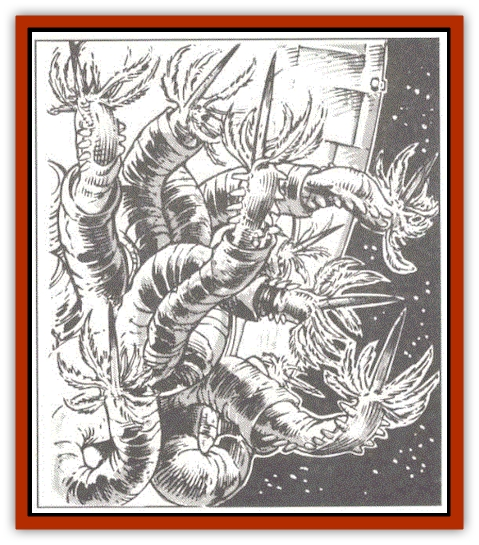

# Mortiss

| Statistic | **Mortiss** |
| --- | --- |
| **Activity Cycle:** | Constant |
| **Alignment:** | Neutral |
| **Armor Class:** | 4 |
| **Climate/Terrain:** | Space/Non-moon, non-planet |
| **Damage/Attack:** | 1 |
| **Diet:** | Organic debris & solar energy |
| **Frequency:** | Rare |
| **Hit Dice:** | 1-100 |
| **Intelligence:** | Non- (0) |
| **Magic Resistance:** | Nil |
| **Morale:** | Fearless (20) |
| **Movement:** | 1 |
| **No. Appearing:** | 1 |
| **No. of Attacks:** | 1-6 per foe |
| **Organization:** | Colony |
| **Size:** | Varies (2&rdquo; to 6' long) |
| **Special Attacks:** | Sting |
| **Special Defenses:** | Withdraw into tubes, webs |
| **THAC0:** | 20 |
| **Treasure:** | Nil |
| **XP Value:** | Varies |

Mortiss are called the "termites of  wildspace" though scholars draw a closer analogy to aquatic coral. Mortiss are a colony of wildspace worms that bore through vegetable and mineral matter. They are a hazard to the hulls of all spelljamming ships. The gravity planes and oppressive air envelopes of moons and worlds prove fatal to the worm after a month of continued exposure.

Mortiss young are about two inches long, while adults may grow to a length of six feet. Mortiss are unsegmented roundworms with a dorsal and ventral rib. They are eyeless, sensing by smell and vibration. They have a collar of leathery tendrils ringing their head. In addition, they have a poisonous stinger on the top of their heads and can extrude two pairs of opposing jaws to latch onto and suck blood from prey.

**Combat:** Mortiss infestation may occur from a collision with egg casings, from bringing mortiss-infested artifacts on board, or from docking near a mortiss-infested asteroid or ship for several hours. Mortiss cause 1d3 points of hull damage per week, and they may also infest the upper decks and lower hold through the hulls. Burrow tubes begin to appear within three to four weeks, always on the side of the ship that receives the most light. As with termites, burrows weaken the decking and superstructure, causing breakthroughs when excessive weight is applied to the undermined deck. Mortiss infestations may be destroyed by fire; a *cure disease* spell destroys a 10'x10' nest of mortiss.

Mortiss attack any creatures that try to destroy their burrows. They may sting the invading creatures with their head spines, causing 1 point of damage per sting. Victims must roll successful saving throws vs. poison (with a -2 penalty) or suffer 1d6 additional points of damage and a delusional side effect. Deluded individuals start to see dangers as greater or lesser than they really are, or they may experience hallucinations of being elsewhere, shutting out reality altogether. Victims suffer the delusion for 1d6 hours. A deluded victim may roll Intelligence checks to disbelieve an aspect of his delusion each round, but he suffers a +1 penalty per poisoned sting suffered.

Mortiss also may lunge at a victim and latch onto him with their jaws, draining 1 point per round. Up to six mortiss can attack for every five-foot-square area the intruders enter. Each mortiss has 1 Hit Die; the number of worms in the colony equals the total number of Hit Dice. A mortiss colony increases by 1d6 Hit Dice for every point of hull damage it causes.

**Habitat/Society:** Mortiss generally do not get along with other life. However, certain wildspace denizens seem to coexist with mortiss just fine, such as [[Scavver|scavvers]], [[Krajen|krajens]], [[Kindori|kindori]], and [[Elmarin|elmarins]]. Indeed, one effect of a mortiss colony is to replenish the air envelope. Thus wildspace denizens often lair among mortiss, waiting for prey to wander near.

Mortiss have the magical ability to convert light energy into magic, enabling them to burrow through wood and rock as if it were soil. The digested material is converted into a clay that is used to construct coral castles atop their burrows. Early infestations of mortiss may go undetected, until the stone-like tubes appear on the hull. Left to their own, mortiss will encase a ship within a year with their constructions, destroying the hull. Scholars hypothesize that many asteroids, and perhaps even some smaller moons, may contain some hidden structure at their heart, thanks to the mortiss' endeavors.

Mortiss are hermaphroditic and mutually fertilize each others egg casings. Casings are then deposited on spelljammer hulls to hatch within a week of laying. Mortiss egg cases resemble geodes.

**Ecology:** Mortiss can burrow through wood and stone at a rate of one yard per turn. They must expose themselves to light for up to one hour before they can burrow for an equal amount of time. They cannot store more than one hour's worth of energy and must return to the surface after an hour of burrowing to soak up more light energy.

A colony covers a five-foot-square area for every Hit Die. In addition, for every 4 Hit Dice, the colony erects one ten-foot-square castle to a height of 1d6 feet.

Spelljammers should be warned to regularly check their hull, and periodically make landfalls of a month or more to rid their vessels of these parasites.

---
## Discovery & Documentation

**Source Publication:** MC7 Spelljammer Appendix I (1990)
**Campaign Setting:** Advanced Dungeons & Dragons 2nd Edition
**Author(s):** various

### Other Creatures Found in This Source Book
   * [[Aartuk|Aartuk]]
   * [[Albari|Albari]]
   * [[Ancient_Mariner|Ancient Mariner]]
   * [[Argos|Argos]]
   * [[Beholder_Abomination_Astereater|Beholder (Abomination), Astereater]]
   * [[Blazozoid|Blazozoid]]
   * [[Chattur|Chattur]]
   * [[Chevall|Chevall]]
   * [[Clockwork_Horror|Clockwork Horror]]
   * [[Colossus|Colossus]]
   * [[Delphinid|Delphinid]]
   * [[Dizantar|Dizantar]]
   * [[Dog|Dog]]
   * [[Dog_Bog_Hound|Dog, Bog Hound]]
   * [[Esthetic|Esthetic]]
   * [[Focoid|Focoid]]
   * [[Fractine|Fractine]]
   * [[Giant_Spacesea|Giant, Spacesea]]
   * [[Golem_Furnace|Golem, Furnace]]
   * [[Golem_Radiant|Golem, Radiant]]
   * [[Gravislayer|Gravislayer]]
   * [[Grommam|Grommam]]
   * [[Hadozee|Hadozee]]
   * [[Hamster_Giant_Space|Hamster, Giant Space]]
   * [[Jammer_Leech|Jammer Leech]]
   * [[Lakshu|Lakshu]]
   * [[Lumineaux|Lumineaux]]
   * [[Lutum|Lutum]]
   * [[Mimic_Space|Mimic, Space]]
   * [[Misi|Misi]]
   * [[Moon_Rogue|Moon, Rogue]]
   * [[Murderoid|Murderoid]]
   * [[Nay-Churr|Nay-Churr]]
   * [[Phlog-Crawler|Phlog-Crawler]]
   * [[Plasman|Plasman]]
   * [[Plasmoid_DeGleash|Plasmoid, DeGleash]]
   * [[Plasmoid_DelNoric|Plasmoid, DelNoric]]
   * [[Plasmoid_General_Information|Plasmoid, General Information]]
   * [[Plasmoid_Ontalak|Plasmoid, Ontalak]]
   * [[Puffer|Puffer]]
   * [[Q'nidar|Q'nidar]]
   * [[Rastipede|Rastipede]]
   * [[Reigar|Reigar]]
   * [[Rock_Hopper|Rock Hopper]]
   * [[Slinker|Slinker]]
   * [[Spider_Asteroid|Spider, Asteroid]]
   * [[Spiritjam|Spiritjam]]
   * [[Survivor|Survivor]]
   * [[Syllix|Syllix]]
   * [[Symbiont_Power|Symbiont, Power]]
   * [[Vine_Infinity|Vine, Infinity]]
   * [[Wiggle|Wiggle]]
   * [[Wizshade|Wizshade]]
   * [[Wryback|Wryback]]
   * [[Zard|Zard]]
   * [[Zodar|Zodar]]
