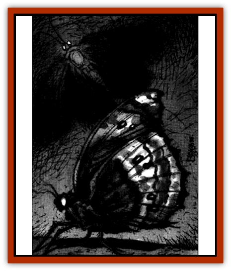

# Moth - Plague

| Statistic | **Moth, Plague** |
| --- | --- |
| **Activity Cycle:** | Night |
| **Alignment:** | Neutral |
| **Armor Class:** | 6 |
| **Climate/Terrain:** | Sewers |
| **Damage/Attack:** | 1d4 |
| **Diet:** | Blood |
| **Frequency:** | Uncommon |
| **Hit Dice:** | 1+4 |
| **Intelligence:** | Animal (1) |
| **Magic Resistance:** | T (1' wingspan) |
| **Morale:** |  |
| **Movement:** | Fly 15 (MC B) |
| **No. Appearing:** | 1-20 (special) |
| **No. of Attacks:** | 1 |
| **Organization:** | Swarm |
| **Size:** | -8 |
| **Special Attacks:** | Venom |
| **Special Defenses:** | See below |
| **THAC0:** | 18 |
| **Treasure:** | Nil |
| **XP Value:** |  |

These peculiar creatures were created by the wizard in an attempt to manufacture potions "naturally". The moths turned out less than perfect, with a tendency to produce bad potions and an intense craving for blood. They are huge gray moths with luminescent green eyes. They feast on blood much as do [[Stirge|stirges]], but their magical venom slays more often - and more spectacularly - than does their physical attack.

**Combat:** Plague moths typically attack in large swarms, but no more than three moths assault the same target - the others seek out other victims rather than fight over the same prey. While plague moths are agile and nearly immune to magic, their greatest asset is a magically venomous bite. Each moth has its own venom, equivalent to a randomly-determined potion from Table 89 in the DMG. Treat any result of *potion of healing*, any oil, or any potion with an XP value of 300 or higher as a *potion of delusion* (of *extra healing*, *giant strength*, or some other beneficial effect). The most dangerous result of a plague moth attack comes when a victim is bitten by more than one moth; then the victim must roll on Table 111: Potion Compatibility, ignoring the rule that makes a *potion of delusion* compatible with all other potions. Plague moths are immune to the venom of all of their kind. Note that unlike stirges, plague moths typically wait until their prey is dead before feeding.

**Habitat/Society:** Plague moths live in swarms that are dormant half the time, hunting the other half. As they live in the sewers, day and night have no meaning to them. On the very rare instances in which plague moths have emerged from the sewers, they have been active only at night.

**Ecology:** As a blood-drinking predator, the plague moth tends to attack all living things and therefore has a huge impact on the food chain. However, being fairly weak, they are easily killed by other monsters and have so far failed to overrun the sewers. The more intelligent sewer creatures have learned not to eat the plague moths after witnessing or experiencing firsthand the dangerous and unpredictable effects of their venom. Attempts to harness their potion-generation ability have thus far failed by those few who have managed to capture one alive, as the moths soon wither and die in captivity.

---
## Discovery & Documentation

**Source Publication:** Dragon238 (1997)
**Campaign Setting:** Dragon Magazine
**Author(s):** John Baichtal, Brian Walton, Tom Baxa

### Other Creatures Found in This Source Book
   * [[Cat_Water|Cat, Water]]
   * [[Crocodile_Albino|Crocodile, Albino]]
   * [[Lich's_Blood|Lich's Blood]]
   * [[Mummy_Ice|Mummy, Ice]]
