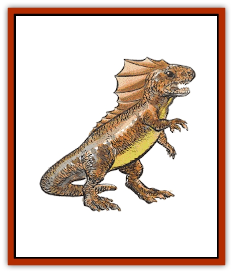

# Muckdweller

| Statistic | **Muckdweller** |
| --- | --- |
| **Activity Cycle:** | Day |
| **Alignment:** | Lawful evil |
| **Armor Class:** | 6 |
| **Climate/Terrain:** | Temperate or tropical/Swamp |
| **Damage/Attack:** | 1-2 |
| **Diet:** | Omnivore |
| **Frequency:** | Rare |
| **Hit Dice:** | ½ |
| **Intelligence:** | Average (8-10) |
| **Magic Resistance:** | Nil |
| **Morale:** | Average (10) |
| **Movement:** | 3, Sw 12 |
| **No. Appearing:** | 5-20 |
| **No. of Attacks:** | 1 |
| **Organization:** | Tribal |
| **Size:** | T (1' high) |
| **Special Attacks:** | Water jet |
| **Special Defenses:** | Nil |
| **THAC0:** | 20 |
| **Treasure:** | Q, (J,K,L,M,N) |
| **XP Value:** | 15 |

Muckdwellers are a species of small intelligent bipedal amphibians that lurks in swamps, marshes, or still, mud-bottomed waters. They have been known to serve [[Lizard_Man|lizard men]] and [[Kuo-Toa|kuo-toa]].

Muckdwellers are only 1-foot tall and resemble upright gila monsters with large, partially webbed rear feet. Their forepaws are prehensile, but very small and weak. Their backs are colored a mottled gray and brown, and their underbellies are yellow. They have short tails that are used for swimming and keeping their balance on land. They speak their own hissing language and possibly (50% chance) the lizard man tongue.

**Combat:** Muckdwellers use ambush techniques. Packs of muckdwellers wait for a victim; when one arrives, several squirt water (at up to a ten-yard range) into the victim's eyes, which temporarily blinds it (a successful saving throw vs. wands negates this, but surprised creatures get no saving throw). A blinded victim cannot act in that round, loses all Dexterity bonuses, and all attacks against the victim gain a +2 bonus to the attack roll. Furthermore, if the muckdwellers lure the victim into knee-deep muddy waters, the victim loses all Dexterity bonuses and fights with a -1 penalty to its attack roll, due to unsteady ground. If the water is waist-high, the penalty increases to -2; if the water is chest-high, the penalty is -3. A *ring of free action* or equivalent magic negates these penalties. These disadvantages do not apply to the amphibious muckdwellers. Usually, a muckdweller fights only if it is cornered or if it is certain it can score an easy kill.

**Habitat/Society:** The lair of these creatures is underwater, but they always have a muddy, above-water area for resting, sunning themselves, and eating. There are 5d4 muckdwellers in each lair. They keep shiny-things (gold, gems, etc.) in hoards in their above ground lairs. If 16 or more monsters are encountered in this lair, they have double the given type Q treasure.

Muckdwellers are an intelligent species, but they have very little culture. They have a very primitive nature worship that emphasizes the supremacy of water over land. They like shiny things because they gleam like the sea. Due to the weakness of their hands, they do not use or produce tools and use their back paws for burrowing and their teeth for cutting. They occasionally build tiny rafts of cut reeds and mud to float on the surface of the water, and propel themselves quickly with their hind legs (movement 18). They infrequently build crude shelters of reeds, twigs, and mud. These shelters are designed to protect them from predators, not to shelter them, as weather doesn't bother them very much.

Because of the size difference between muckdwellers and lizard men, muckdwellers consider lizard men to be a superior species and occasionally serve them. Muckdwellers believe in the "survival of the fittest" and have no room for love, mercy, or compassion. Scoring the deathbite on a much larger creature gives the individual elite status in the community, while being killed by a bigger creature is a mark of shame, for it demonstrates poor hunting ability.

**Ecology:** The omnivorous muckdwellers will eat plants, insects, and aquatic animals, but fresh, warm-blooded meat is their preferred diet.

Muckdwellers are amphibians that spend their larval stage in the water but their adult stage on land. Their average life span is 9 to 12 years. It takes three years to grow to full-size. Muckdwellers in temperate climates hibernate during the winter months. Their natural enemies are snakes and certain giant carnivorous fishes. A muckdweller community has a hunting range of about two miles' radius.

---
## Discovery & Documentation

**Source Publication:** MC2 Volume II (1993)
**Campaign Setting:** Advanced Dungeons & Dragons 2nd Edition
**Author(s):** Jay Batista, Scott Bennie, Grant Boucher, William W. Connors, Steve Gilbert, Heike Kubasch, James Lowder, David Edward Martin, Bruce Nesmith, Jean Rabe, Rick Swan, John J. Terra, Gary L. Thomas

### Other Creatures Found in This Source Book
   * [[Ant|Ant]]
   * [[Ant_Lion_Giant|Ant Lion, Giant]]
   * [[Ape_Carnivorous|Ape, Carnivorous]]
   * [[Baboon|Baboon]]
   * [[Badger|Badger]]
   * [[Barracuda|Barracuda]]
   * [[Beetle_Giant|Beetle, Giant]]
   * [[Bulette|Bulette]]
   * [[Bullywug|Bullywug]]
   * [[Dwarf_Duergar|Dwarf, Duergar]]
   * [[Dwarf_Gully|Dwarf, Gully]]
   * [[Eagle|Eagle]]
   * [[Eel|Eel]]
   * [[Elemental_Air_Kin|Elemental, Air Kin]]
   * [[Elemental_Water_Kin|Elemental, Water Kin]]
   * [[Elemental_Water_Kin_Water_Weird|Elemental, Water Kin, Water Weird]]
   * [[Firestar|Firestar]]
   * [[Firetail|Firetail]]
   * [[Fish_Giant|Fish, Giant]]
   * [[Frog|Frog]]
   * [[Gorgon|Gorgon]]
   * [[Hawk|Hawk]]
   * [[Heucuva|Heucuva]]
   * [[Hippocampus|Hippocampus]]
   * [[Hippogriff|Hippogriff]]
   * [[Kelpie|Kelpie]]
   * [[Kenku|Kenku]]
   * [[Killmoulis|Killmoulis]]
   * [[Kuo-Toa|Kuo-Toa]]
   * [[Lamia|Lamia]]
   * [[Lammasu|Lammasu]]
   * [[Lamprey|Lamprey]]
   * [[Leech|Leech]]
   * [[Leprechaun|Leprechaun]]
   * [[Leucrotta|Leucrotta]]
   * [[Locathah|Locathah]]
   * [[Lycanthrope_Wereboar|Lycanthrope, Wereboar]]
   * [[Lycanthrope_Werefox|Lycanthrope, Werefox]]
   * [[Mammal_Minimal|Mammal, Minimal]]
   * [[Mammal_Small|Mammal, Small]]
   * [[Mimic|Mimic]]
   * [[Morkoth|Morkoth]]
   * [[Myconid|Myconid]]
   * [[Naga|Naga]]
   * [[Obliviax|Obliviax]]
   * [[Octopus_Giant|Octopus, Giant]]
   * [[Otyugh|Otyugh]]
   * [[Piranha|Piranha]]
   * [[Plant_Dangerous_I|Plant, Dangerous I]]
   * [[Plant_Intelligent|Plant, Intelligent]]
   * [[Poltergeist|Poltergeist]]
   * [[Porcupine|Porcupine]]
   * [[Rat_Osquip|Rat, Osquip]]
   * [[Roc|Roc]]
   * [[Roper|Roper]]
   * [[Rot_Grub|Rot Grub]]
   * [[Rust_Monster|Rust Monster]]
   * [[Sahuagin|Sahuagin]]
   * [[Sea_Lion|Sea Lion]]
   * [[Sea_Horse_Giant|Sea Horse, Giant]]
   * [[Shambling_Mound|Shambling Mound]]
   * [[Shark|Shark]]
   * [[Sphinx|Sphinx]]
   * [[Squid_Giant|Squid, Giant]]
   * [[Stirge|Stirge]]
   * [[Swanmay|Swanmay]]
   * [[Tarrasque|Tarrasque]]
   * [[Tasloi|Tasloi]]
   * [[Triton|Triton]]
   * [[Troglodyte|Troglodyte]]
   * [[Urchin|Urchin]]
   * [[Urd|Urd]]
   * [[Weasel|Weasel]]
   * [[Wolverine|Wolverine]]
   * [[Yellow_Musk_Creeper|Yellow Musk Creeper]]
