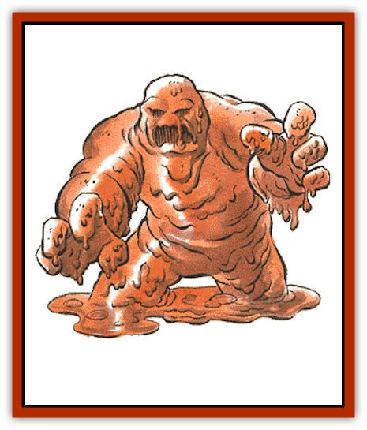

# Mudman

| Statistic | **Mudman** |
| --- | --- |
| **Activity Cycle:** | Any |
| **Alignment:** | Neutral |
| **Armor Class:** | 10 |
| **Climate/Terrain:** | Any pool |
| **Damage/Attack:** | Special |
| **Diet:** | Dweomer |
| **Frequency:** | Very rare |
| **Hit Dice:** | 2 |
| **Intelligence:** | Non- (0) |
| **Magic Resistance:** | Nil |
| **Morale:** | Special |
| **Movement:** | 3 |
| **No. Appearing:** | 2-12 (2d6) |
| **No. of Attacks:** | 1 |
| **Organization:** | Pack |
| **Size:** | S (4' high) |
| **Special Attacks:** | Mud-throwing, suffocation |
| **Special Defenses:** | See below |
| **THAC0:** | 19 |
| **Treasure:** | Nil |
| **XP Value:** | 175 |

Mudmen are formed in pools of mud where enchanted rivers (even mildly enchanted ones, such as a stream eroding a magical structure) collect and evaporate and concentrate the dweomer. Because they are creatures of magic, mudmen are sometimes called dweomerlings. Mudmen are unintelligent life forces with but one goal - to protect their pools against intruders.

When aroused into a physical form, mudmen take on the appearance of animated mud in a stocky humanoid shape, about 4' tall. Their coloration varies between a dirty brown and tar black. They have four thick fingers on each hand. Their legs stay submerged within the pool, and are not usually visible. Their eyes are pools of jet black shadow.

Mudmen speak no languages and are incapable of communicating with any living creature.

**Combat:** In their dormant state, mudmen wait beneath the surface of the pool, spread on the bottom, feeding on the dweomer. In this state they are immune to all weapons, even magical ones. Spells that normally harm a mudmen will still affect it, although damage is divided evenly among all the mudmen in the pool (the entire group counts as one creature for these effects, and fractions are rounded down). When a creature enters the pool the mudmen immediately sense its presence and take but a single round to draw their substance together and rise to the surface, ready to attack on the following round. Once fully formed and standing, a mudmen can be harmed by magical weapons.

Mudmen attack by hurling mud at their opponents, who are considered AC 10 (modified by Dexterity) for the purpose of determining hits. Mud hardens on impact and slows the creature's movement rate by 1 if it hits. While hurling mud, a mudman will also advance on its victim at its full movement rate. Once within 10 feet, it will hurl itself (literally) at the victim. A sucessful hit means the death of the mudman, but slows the victim's movement by 4. A miss means the mudman must spend the next round re-forming in order to attack again.

Once a victim's movement is brought to 0, he becomes immobilized and suffocates, suffering 1-8 points of damage per round until the mouth or nose is clear. The victim will die of suffocation in five consecutive rounds unless rescued. Hardened mud can be cleared from a character's nose and mouth in one round. Movement can be restored at a rate of 1 per five rounds.

If the creature flees the pool, the mudmen will not pursue, as their senses do not extend beyond the pool. Instead, they sink into the depths, return to their dormant state, and wait until the next time someone enters the pool.

Mudmen are affected by all spells that cause damage to living creatures (e.g., *cause light wounds*, *magic missile*, *fireball*, *flame strike*). *Dispel magic* and *dig* act as *fireballs* cast at the same level as the mage.

*Transmute mud to rock* kills all mudmen within its area of effect, with no saving throw allowed.

Mudmen are immune to all poisons, natural and magical, and are unaffected by spells that affect the mind (e.g., *hold*, *charm*, and *sleep*).

**Habitat/Society:** Mudmen have two states: rest and activity, the latter of which solely involves killing intruders. A mudman's pool varies in size between 20 and 200 feet in diameter. Such pools are often found near waterfalls.

**Ecology:** Mudmen are not natural creatures and not part of the ecosystem. They try to kill all natural creatures that encounter them and have no natural enemies. Over a long period of time they absorb flesh, wood, and bone, extracting whatever dweomer they can get from it, so they rarely possess any treasure - only if they were attacked within the last month by someone who was bearing treasure. Though no uses have been recorded for a mudman's mud, it is logical that mages would not ignore its magical properties.

---
## Discovery & Documentation

**Source Publication:** MC1 Volume I (w/binder #1) (1991)
**Campaign Setting:** Advanced Dungeons & Dragons 2nd Edition
**Author(s):** Jay Batista, Scott Bennie, Grant Boucher, William W. Connors, Steve Gilbert, Heike Kubasch, James Lowder, David Edward Martin, Bruce Nesmith, Jean Rabe, Rick Swan, John J. Terra, Gary L. Thomas

### Other Creatures Found in This Source Book
   * [[Bat|Bat]]
   * [[Bear|Bear]]
   * [[Behir|Behir]]
   * [[Boar|Boar]]
   * [[Bookworm|Bookworm]]
   * [[Brownie|Brownie]]
   * [[Bugbear|Bugbear]]
   * [[Carrion_Crawler|Carrion Crawler]]
   * [[Cat_Great|Cat, Great]]
   * [[Catoblepas|Catoblepas]]
   * [[Dragon_General_Information|Dragon, General Information]]
   * [[Dragonfish|Dragonfish]]
   * [[Elemental_Air_Kin_Aerial_Servant|Elemental, Air Kin, Aerial Servant]]
   * [[Elemental_Earth_Kin_Sandling|Elemental, Earth Kin, Sandling]]
   * [[Elephant|Elephant]]
   * [[Gnoll|Gnoll]]
   * [[Hobgoblin|Hobgoblin]]
   * [[Homunculus|Homunculus]]
   * [[Hornet_Giant|Hornet, Giant]]
   * [[Horse|Horse]]
   * [[Hyena|Hyena]]
   * [[Jackal|Jackal]]
   * [[Jackalwere|Jackalwere]]
   * [[Korred|Korred]]
   * [[Lich|Lich]]
   * [[Lizard|Lizard]]
   * [[Lizard_Man|Lizard Man]]
   * [[Lycanthrope_General_Information|Lycanthrope, General Information]]
   * [[Lycanthrope_Seawolf|Lycanthrope, Seawolf]]
   * [[Lycanthrope_Werebear|Lycanthrope, Werebear]]
   * [[Lycanthrope_Weretiger|Lycanthrope, Weretiger]]
   * [[Lycanthrope_Werewolf|Lycanthrope, Werewolf]]
   * [[Manticore|Manticore]]
   * [[Medusa|Medusa]]
   * [[Mind_Flayer|Mind Flayer]]
   * [[Minotaur|Minotaur]]
   * [[Mummy|Mummy]]
   * [[Nixie|Nixie]]
   * [[Nymph|Nymph]]
   * [[Ogre|Ogre]]
   * [[Ooze_Slime_Jelly_I|Ooze/Slime/Jelly I]]
   * [[Ooze_Slime_Jelly_II|Ooze/Slime/Jelly II]]
   * [[Orc|Orc]]
   * [[Owl|Owl]]
   * [[Owlbear_I|Owlbear I]]
   * [[Pegasus|Pegasus]]
   * [[Piercer|Piercer]]
   * [[Pudding_Deadly|Pudding, Deadly]]
   * [[Rakshasa|Rakshasa]]
   * [[Rat|Rat]]
   * [[Ray|Ray]]
   * [[Remorhaz|Remorhaz]]
   * [[Satyr|Satyr]]
   * [[Scorpion|Scorpion]]
   * [[Selkie|Selkie]]
   * [[Shadow|Shadow]]
   * [[Skeleton|Skeleton]]
   * [[Skunk|Skunk]]
   * [[Snake|Snake]]
   * [[Spectre|Spectre]]
   * [[Spider|Spider]]
   * [[Sprite|Sprite]]
   * [[Toad_Giant|Toad, Giant]]
   * [[Treant|Treant]]
   * [[Troll|Troll]]
   * [[Umber_Hulk|Umber Hulk]]
   * [[Unicorn|Unicorn]]
   * [[Vampire|Vampire]]
   * [[Wight|Wight]]
   * [[Will_O'Wisp|Will O'Wisp]]
   * [[Wolf|Wolf]]
   * [[Wolfwere|Wolfwere]]
   * [[Wraith|Wraith]]
   * [[Wyvern|Wyvern]]
   * [[Yeti|Yeti]]
   * [[Yuan-ti|Yuan-ti]]
   * [[Zombie|Zombie]]
