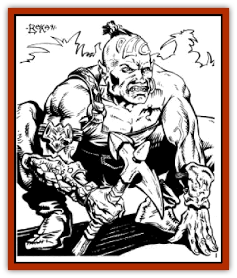

# Mul - Wild

| Statistic | **Mul, Wild** |
| --- | --- |
| **Activity Cycle:** | Any |
| **Alignment:** | Any |
| **Armor Class:** | 8 (10) |
| **Climate/Terrain:** | Tablelands |
| **Damage/Attack:** | 1-8 (weapon) +1 (strength) |
| **Diet:** | Omnivore |
| **Frequency:** | Common |
| **Hit Dice:** | 5+5 |
| **Intelligence:** | Average (8-10) |
| **Magic Resistance:** | Nil |
| **Morale:** | Steady (11-12) |
| **Movement:** | 9 |
| **No. Appearing:** | 2-7 (1d6+1) |
| **No. of Attacks:** | 1 |
| **Organization:** | Clans |
| **Size:** | M (6-7' tall) |
| **Special Attacks:** | Psionics |
| **Special Defenses:** | Nil |
| **THAC0:** | 15 |
| **Treasure:** | L (C) |
| **XP Value:** | 270 |

**Psionics Summary**

| Level | Dis/Sci/Dev | Attack/Defense | Score | PSPs |
| --- | --- | --- | --- | --- |
| 3 | 2/2/7 | MT/M-,TS | 13 | 80 |

**Psychokinesis -** *Science:* telekinesis; *Devotions:* levitation, control body.

**Telepathy -** *Science:* mind link; *Devotions:* conceal thoughts, inflict pain, mind thrust, mind blank, thought shield, contact, invisibility.

[[Mul|Muls]] are a cross-breed of dwarf and human that are raised for the gladiatorial games often played on Athas. While all are born into captivity, some escape and make their homes in the plains and oasis of the Athasian deserts.

Muls are stout humanoids, averaging 6 to 6½ feet tall, and weighing up to 300 pounds. While their height comes from their human side, muls also have strong, stocky bodies, an obvious trait from their dwarven parentage. Muls are light skinned, sometimes having a copperish skin coloration. Muls have a face that is undeniably human looking, though their ears are swept back and mildly pointed. All muls, both male and female, have no head or facial hair of any kind.

**Combat:** Wild muls will often end up in combat situations during the course of their life. Muls are commonly tracked by bounty hunters hired by the templars and noblemen who operate the gladiatorial games. When a wild mul engages in combat, they are most effective fighters.

Most muls encountered wear leather armor, it being the most common type found on Athas. This is usually the same armor worn by the muls at the time of their escape, and it provides adequate protection (AC 8). Many times they also carry a small- to medium-sized shield, an additional carry over from their gladiatorial days.

Most muls are armed with long swords, though occasionally some are found with either short swords (less often) or polearms, flails, or maces (more often). Most muls encountered will have either bone or stone weapons, and wild muls have been known to carry obsidian and even metal weapons. When using any weapon, a wild muls receives a +1 bonus to their damage rolls due to unusual strength.

Additionally, like many creatures of Athas, muls are naturally psionic. Most muls (75%) are wild talents, possessing only one or two psionic abilities. Some (25%), however, are fullfledged psionicists, able to use a variety of psionic powers.

**Habitat/Society:** Wild muls seldom form large groups, preferring to gather in small clans (ranging in size from two to seven members). These clans will often consist of muls who manage to escape together and remain together for mutual protection. Clans of wild muls usually settle in the rocky barren areas of Athas, near where the plains and the deserts of the Tablelands meet. With plant life being as scarce as it is, many muls have turned to animals, and even other humanoid races, as a source of food. This behavior causes most other races to greatly fear wild muls. This feeling is reciprocated by the muls, as they are particularly paranoid that any who find them are hunting them for the templars and noblemen of the gladiatorial games. Clans of muls are very unlikely to trust any who encounter them, except adventuring parties that have a mul among them. Even then, mul clans are overly suspicious, believing that they can trust no one.

All muls are born sterile, and no clans have offspring among them. The only time that young muls are found in the wild is when they escape with a group of adults. Since by definition, wild muls are escaped slaves, they very rarely enter cities once they have escaped. Any wild mul discovered within the walls of an Athasian city would be captured and, most likely, publicly executed as a discouragement to any muls who might consider escape in the future.

**Ecology:** Just as muls occasionally hunt and eat other humanoid races, they are hunted themselves. Some [[Thri-kreen|thri-kreen]] tribes hunt wild muls, which serves to foster an animosity between these two races.

---
## Discovery & Documentation

**Source Publication:** MC12 Dark Sun Appendix I - Terrors of the Desert (1991)
**Campaign Setting:** Dark Sun
**Author(s):** Tom Prusa, Louis J. Prosperi, Walter M. Baas

### Other Creatures Found in This Source Book
   * [[Animal_Herd_Athas|Animal, Herd (Athas)]]
   * [[Animal_Household_Athas|Animal, Household (Athas)]]
   * [[Antloid_Desert|Antloid, Desert]]
   * [[Banshee_Dwarf|Banshee, Dwarf]]
   * [[Beetle_Agony|Beetle, Agony]]
   * [[Bog_Wader|Bog Wader]]
   * [[Brambleweed|Brambleweed]]
   * [[B'rohg|B'rohg]]
   * [[Burnflower|Burnflower]]
   * [[Cat_Psionic|Cat, Psionic]]
   * [[Cha'thrang|Cha'thrang]]
   * [[Cistern_Fiend|Cistern Fiend]]
   * [[Clam_Giant|Clam, Giant]]
   * [[Cloud_Ray|Cloud Ray]]
   * [[Drake_Athas_Air|Drake (Athas), Air]]
   * [[Drake_Athas_Earth|Drake (Athas), Earth]]
   * [[Drake_Athas_Fire|Drake (Athas), Fire]]
   * [[Drake_Athas_Water|Drake (Athas), Water]]
   * [[Dune_Runner|Dune Runner]]
   * [[Dune_Trapper|Dune Trapper]]
   * [[Elemental_Athas_Greater_Air|Elemental (Athas), Greater, Air]]
   * [[Elemental_Athas_Greater_Earth|Elemental (Athas), Greater, Earth]]
   * [[Elemental_Athas_Greater_Fire|Elemental (Athas), Greater, Fire]]
   * [[Elemental_Athas_Greater_Water|Elemental (Athas), Greater, Water]]
   * [[Elemental_Athas_Lesser_Air_Earth|Elemental (Athas), Lesser, Air/Earth]]
   * [[Elemental_Athas_Lesser_Fire_Water|Elemental (Athas), Lesser, Fire/Water]]
   * [[Elemental_Athas_General_Information|Elemental (Athas), General Information]]
   * [[Erdland|Erdland]]
   * [[Esperweed|Esperweed]]
   * [[Flailer|Flailer]]
   * [[Floater|Floater]]
   * [[Giant_Athas|Giant (Athas)]]
   * [[Golem_Athas_I|Golem (Athas) I]]
   * [[Golem_Athas_II|Golem (Athas) II]]
   * [[Golem_Athas_III|Golem (Athas) III]]
   * [[Golem_Athas_General_Information|Golem (Athas), General Information]]
   * [[Halfling_Renegade|Halfling, Renegade]]
   * [[Hej-kin|Hej-kin]]
   * [[Id_Fiend|Id Fiend]]
   * [[Insect_Swarm_Athas|Insect Swarm (Athas)]]
   * [[Kank_Wild|Kank, Wild]]
   * [[Kirre|Kirre]]
   * [[Megapede|Megapede]]
   * [[Nightmare_Beast|Nightmare Beast]]
   * [[Plant_Carnivorous_Athas|Plant, Carnivorous (Athas)]]
   * [[Pterran|Pterran]]
   * [[Pterrax|Pterrax]]
   * [[Pulp_Bee|Pulp Bee]]
   * [[Pyreen|Pyreen]]
   * [[Rasclinn|Rasclinn]]
   * [[Razorwing|Razorwing]]
   * [[Roc_Athas|Roc (Athas)]]
   * [[Sand_Bride|Sand Bride]]
   * [[Sand_Cactus|Sand Cactus]]
   * [[Sand_Vortex|Sand Vortex]]
   * [[Scrab|Scrab]]
   * [[Silt_Horror|Silt Horror]]
   * [[Silt_Runner|Silt Runner]]
   * [[Sink_Worm|Sink Worm]]
   * [[Sloth_Athas|Sloth (Athas)]]
   * [[So-ut|So-ut]]
   * [[Spider_Cactus|Spider Cactus]]
   * [[Spider_Crystal|Spider, Crystal]]
   * [[Spirit_of_the_Land|Spirit of the Land]]
   * [[T'Chowb|T'Chowb]]
   * [[Thrax|Thrax]]
   * [[Tohr-kreen_I|Tohr-kreen I]]
   * [[Villichi|Villichi]]
   * [[Zhackal|Zhackal]]
   * [[Zombie_Plant|Zombie Plant]]
