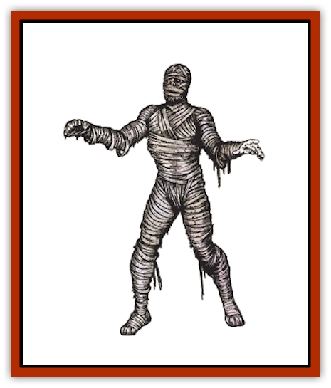

# Mummy

| Statistic | **Mummy** |
| --- | --- |
| **Activity Cycle:** | Night |
| **Alignment:** | Lawful evil |
| **Armor Class:** | 3 |
| **Climate/Terrain:** | Desert subterranean |
| **Damage/Attack:** | 1-12 |
| **Diet:** | None |
| **Frequency:** | Rare |
| **Hit Dice:** | 6+3 |
| **Intelligence:** | Low (5-7) |
| **Magic Resistance:** | Nil |
| **Morale:** | Champion (15) |
| **Movement:** | 6 |
| **No. Appearing:** | 2-8 (2d4) |
| **No. of Attacks:** | 1 |
| **Organization:** | Pack |
| **Size:** | M (6') |
| **Special Attacks:** | Fear, disease |
| **Special Defenses:** | See below |
| **THAC0:** | 13 |
| **Treasure:** | P (D) |
| **XP Value:** | 3,000 |

Mummies are corpses native to dry desert areas, where the dead are entombed by a process known as mummification. When their tombs are disturbed, the corpses become animated into a weird unlife state, whose unholy hatred of life causes them to attack living things without mercy.

Mummies are usually (but not always) clothed in rotting strips of linen. They stand between 5 and 7 feet tall and are supernaturally strong.

**Combat:** Mummies are horrific enemies. A single blow from one's arm inflicts 1-12 points of damage, and worse, its scabrous touch infects the victim with a rotting disease which is fatal in 1-6 months. For each month the rot progresses, the victim permanently loses 2 points of Charisma. The disease can be cured only with a *cure disease* spell. *Cure wounds* spells have no effect on a person inflicted with mummy rot and his wounds heal at 10% of the normal rate. A regenerate spell will restore damage but will not otherwise affect the course of the disease.

The mere sight of a mummy causes such terror in any creature that a saving throw versus spell must be made or the victim becomes paralyzed with fright for 1 to 4 rounds. Numbers will bolster courage; for each six creatures present, the saving throw is improved by +1. Humans save against mummies at an additional +2.

Mummies can be harmed only by magical weapons, which inflict only half damage (all fractions round down). *Sleep*, *charm*, *hold*, and cold-based spells have no effect. Poison and paralysis do not harm them. A *resurrection* spell will turn the creature into a normal human (a fighter at 7th level ability) with the memories of its former life; or will have no effect if the mummy is older than the maximum age the priest can resurrect. A *wish* will also restore a mummy to human form but a *remove curse* will not.

Mummies are vulnerable to fire, even nonmagical varieties. A blow with a torch inflicts 1-3 points of damage. A flask of burning oil inflicts 1-8 points of damage on the first round it hits and 2-16 on the second round. Magical fires are +1 damage/die. Vials of holy water inflict 2-8 points of damage per direct hit.

Any creature killed by a mummy rots immediately and cannot be raised from death unless both a *cure disease* and a *raise dead* spell are cast within six rounds.

**Habitat/Society:** Mummies are the product of an embalming process used on wealthy and important personages. Most mummies are corpses without magical properties. On occasion, perhaps due to powerful evil magic or perhaps because the individual was so greedy in life that he refuses to give up his treasure, the spirit of the mummified person will not die, but taps into energy from the Positive Material plane and is transformed into an undead horror. Most mummies remain dormant until their treasure is taken, but then they become aroused and kill without mercy.

A mummy lives in its ancient burial chamber, usually in the heart of a crypt or pyramid. The tomb is a complex series of chambers filled with relics (mostly nonmagical). These relics include models of the mummy's possessions, favorite items and treasures, the bodies of dead pets, and foodstuffs to feed the spirit after death. Particularly evil people will have slaves or family members slain when they die so the slaves can be buried with them. Because of their magical properties, mummies exist on both Prime and Positive Material planes.

**Ecology:** To create a mummy, a corpse should be soaked in a preserving solution (typically carbonate of soda) for several weeks and covered with spices and resins. Body organs, such as the heart, brain, and liver, are typically removed and sealed in jars. Sometimes gems are wrapped in the cloth (if the treasure listing for the mummy indicates it possesses gems, a few may be placed in the wrappings). Mummies are not part of the natural ecosystem and have no natural enemies.

Mummy dust is a component for rotting and disease magical items.

---
## Discovery & Documentation

**Source Publication:** MC1 Volume I (w/binder #1) (1991)
**Campaign Setting:** Advanced Dungeons & Dragons 2nd Edition
**Author(s):** Jay Batista, Scott Bennie, Grant Boucher, William W. Connors, Steve Gilbert, Heike Kubasch, James Lowder, David Edward Martin, Bruce Nesmith, Jean Rabe, Rick Swan, John J. Terra, Gary L. Thomas

### Other Creatures Found in This Source Book
   * [[Bat|Bat]]
   * [[Bear|Bear]]
   * [[Behir|Behir]]
   * [[Boar|Boar]]
   * [[Bookworm|Bookworm]]
   * [[Brownie|Brownie]]
   * [[Bugbear|Bugbear]]
   * [[Carrion_Crawler|Carrion Crawler]]
   * [[Cat_Great|Cat, Great]]
   * [[Catoblepas|Catoblepas]]
   * [[Dragon_General_Information|Dragon, General Information]]
   * [[Dragonfish|Dragonfish]]
   * [[Elemental_Air_Kin_Aerial_Servant|Elemental, Air Kin, Aerial Servant]]
   * [[Elemental_Earth_Kin_Sandling|Elemental, Earth Kin, Sandling]]
   * [[Elephant|Elephant]]
   * [[Gnoll|Gnoll]]
   * [[Hobgoblin|Hobgoblin]]
   * [[Homunculus|Homunculus]]
   * [[Hornet_Giant|Hornet, Giant]]
   * [[Horse|Horse]]
   * [[Hyena|Hyena]]
   * [[Jackal|Jackal]]
   * [[Jackalwere|Jackalwere]]
   * [[Korred|Korred]]
   * [[Lich|Lich]]
   * [[Lizard|Lizard]]
   * [[Lizard_Man|Lizard Man]]
   * [[Lycanthrope_General_Information|Lycanthrope, General Information]]
   * [[Lycanthrope_Seawolf|Lycanthrope, Seawolf]]
   * [[Lycanthrope_Werebear|Lycanthrope, Werebear]]
   * [[Lycanthrope_Weretiger|Lycanthrope, Weretiger]]
   * [[Lycanthrope_Werewolf|Lycanthrope, Werewolf]]
   * [[Manticore|Manticore]]
   * [[Medusa|Medusa]]
   * [[Mind_Flayer|Mind Flayer]]
   * [[Minotaur|Minotaur]]
   * [[Mudman|Mudman]]
   * [[Nixie|Nixie]]
   * [[Nymph|Nymph]]
   * [[Ogre|Ogre]]
   * [[Ooze_Slime_Jelly_I|Ooze/Slime/Jelly I]]
   * [[Ooze_Slime_Jelly_II|Ooze/Slime/Jelly II]]
   * [[Orc|Orc]]
   * [[Owl|Owl]]
   * [[Owlbear_I|Owlbear I]]
   * [[Pegasus|Pegasus]]
   * [[Piercer|Piercer]]
   * [[Pudding_Deadly|Pudding, Deadly]]
   * [[Rakshasa|Rakshasa]]
   * [[Rat|Rat]]
   * [[Ray|Ray]]
   * [[Remorhaz|Remorhaz]]
   * [[Satyr|Satyr]]
   * [[Scorpion|Scorpion]]
   * [[Selkie|Selkie]]
   * [[Shadow|Shadow]]
   * [[Skeleton|Skeleton]]
   * [[Skunk|Skunk]]
   * [[Snake|Snake]]
   * [[Spectre|Spectre]]
   * [[Spider|Spider]]
   * [[Sprite|Sprite]]
   * [[Toad_Giant|Toad, Giant]]
   * [[Treant|Treant]]
   * [[Troll|Troll]]
   * [[Umber_Hulk|Umber Hulk]]
   * [[Unicorn|Unicorn]]
   * [[Vampire|Vampire]]
   * [[Wight|Wight]]
   * [[Will_O'Wisp|Will O'Wisp]]
   * [[Wolf|Wolf]]
   * [[Wolfwere|Wolfwere]]
   * [[Wraith|Wraith]]
   * [[Wyvern|Wyvern]]
   * [[Yeti|Yeti]]
   * [[Yuan-ti|Yuan-ti]]
   * [[Zombie|Zombie]]
