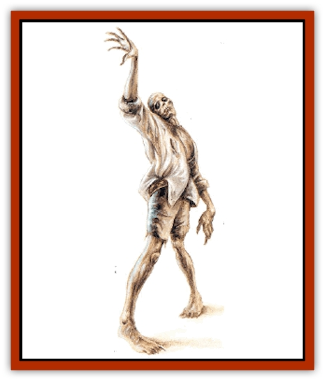

# Mummy - Bog

| Statistic | **Mummy, Bog** |
| --- | --- |
| **Activity Cycle:** | Any |
| **Alignment:** | Chaotic evil |
| **Armor Class:** | 3 |
| **Climate/Terrain:** | Swamp |
| **Damage/Attack:** | 1d12 |
| **Diet:** | None |
| **Frequency:** | Rare |
| **Hit Dice:** | 6 |
| **Intelligence:** | Low (5-7) |
| **Magic Resistance:** | Immune to <i>charm</i> and <i>sleep</i> spells |
| **Morale:** | Champion (15-16) |
| **Movement:** | 9 |
| **No. Appearing:** | 1 |
| **No. of Attacks:** | 1 |
| **Organization:** | Solitary |
| **Size:** | M (5-6' tall) |
| **Special Attacks:** | Disease. fear aura |
| **Special Defenses:** | Rejuvenation, +1 or better magical weapons to hit, half damage from copper weapons |
| **THAC0:** | 15 |
| **Treasure:** | Nil |
| **XP Value:** | 3,000 |

Bog [[Mummy|mummies]] are formed when a corpse comes to rest in a marsh or swamp and is naturally mummified by being coated in a layer of mud. Eventually the body takes on the dark coloration of the earth and becomes as tough as tanned leather. The clothing is partially preserved and sticks to the corpse in patches, as does hair. The facial features are distorted in a permanent grimace and the hands are stiffened into clawlike hooks. When the corpse at last rises as an undead creature, it walks with an uneven gait, due to the stiffness of its limbs.

**Combat:** Despite its shambling gait, a bog mummy has great strength and can inflict 1d12 points of damage with a single blow. Any wounds produced by a bog mummy also inflict a peculiar form of mummy rot in which the flesh stiffens and darkens in spotty patches around the wound. Unless treated, this disease proves fatal in 1d12 weeks. For each month that the disease goes untreated, it reduces both the victim's Dexterity and Charisma by 1 point.

This disease can only be eliminated with a *cure disease* spell; other curative spells are ineffective in treating it. While infected, the victim's wounds heal at 10% of the normal rate. A *regenerate* spell will undo physical damage but will not otherwise affect the course of the disease.

A bog mummy is immune to normal weapons, but does suffer half damage (rounded down) from weapons made of copper. After resting for two full days, an injured bog mummy begins to rejuvenate at a rate of 6 hit points per hour, unless it has been reduced to 0 hit points, at which point it is permanently destroyed.

Those sighting a bog mummy must make a successful saving throw vs. spell with a -1 penalty to withstand the mummy's fear aura. Those who fail this roll are paralyzed with fright for 1d6 rounds.

A bog mummy has limited infravision, with a range of 30 feet. Unlike other mummies, it retains moisture and thus is not at all affected by normal fire. Even magical fire inflicts only half damage upon a bog mummy. It is instead vulnerable to cold, which can cause ice crystals to grow inside its tissues causing its body to rupture. Cold-based spells thus inflict double the normal amount of damage.

A bog mummy is immune to *sleep* and *charm* spells, and to poison and paralysis. A *resurrection* spell will turn the creature into a normal human (a 6th-level fighter) with memories of its former life, particularly of its death, but will have no effect if the mummy is older than the maximum age the priest can resurrect. A *wish* spell will also restore a bog mummy to human form, but a *remove curse* will not.

Any creature killed by a bog mummy immediately stiffens and petrifies and cannot be raised from death unless both a *cure disease* and a *raise dead* spell are cast upon it within six rounds.

A bog mummy has the special ability to create a passage up to 10 feet long through the water-logged soil of a swamp or marsh, as if it were using the spell *phase door*. Any passage thus created may only be used once. In addition, a bog mummy has limited control over the elements of earth and water. It can, twice per day, cast the spell transmute *rock to mud*.

**Habitat/Society:** Bog mummies encountered in Necropolis are most often the former victims of murder or ritual sacrifice and are driven by an overwhelming need for revenge. Because those responsible for their deaths are usually themselves decades or even centuries in the grave, the bog mummy instead takes out its rage upon any living creature. It is extremely chaotic in nature and exists only to frighten and harass the living.

**Ecology:** A bog mummy rises as an undead creature when a powerful burst of positive energy causes the dead person's spirit to rejoin with the preserved body. Bog mummies may be created by a priest or another mummy from the raw material of a corpse or may be the result of powerful emotional forces. In the domain of Necropolis, however, bog mummies are an accidental creation.

It is theorized that, when the *doomsday device* was activated, the resulting shock wave of negative energy that it sent out pushed before it a wave of positive energy. When this wave struck Stagnus Lake and the Great Salt Swamp, it also sent a positive wave through the large number of bodies that lay beneath the mud. The swamps were, after all, a favorite place to dispose of murder victims and contained a great many corpses that were already charged with strong emotional energy. Bog mummies began to climb out of the mud and stalk the living of Necropolis.

Due to its connection with the Positive Energy Plane, a bog mummy is not capable of entering Il Aluk, since that city is so awash with negative energy.

---
## Discovery & Documentation

**Source Publication:** Requiem: The Grim Harvest (1996)
**Campaign Setting:** Ravenloft
**Author(s):** William W. Connors, Lisa Smedman

### Other Creatures Found in This Source Book
   * [[Dream_Stalker|Dream Stalker]]
   * [[Golem_Maggot|Golem, Maggot]]
   * [[Siren_Ravenloft|Siren (Ravenloft)]]
