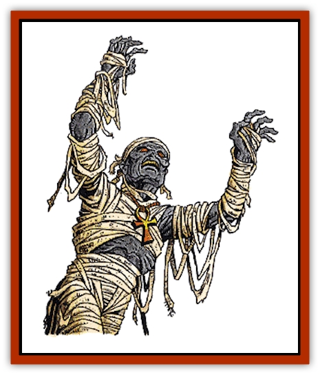

# Mummy - Greater

| Statistic | **Mummy, Greater** |
| --- | --- |
| **Activity Cycle:** | Night |
| **Alignment:** | Lawful evil |
| **Armor Class:** | 2 |
| **Climate/Terrain:** | Any/Desert, Subterranean |
| **Damage/Attack:** | 3d6 |
| **Diet:** | None |
| **Frequency:** | Very rare |
| **Hit Dice:** | 8+3 (base) |
| **Intelligence:** | Genius (17-18) |
| **Magic Resistance:** | Nil |
| **Morale:** | Fanatic (17-18) |
| **Movement:** | 9 |
| **No. Appearing:** | 1 |
| **No. of Attacks:** | 1 |
| **Organization:** | Solitary |
| **Size:** | M (6' tall) |
| **Special Attacks:** | See below |
| **Special Defenses:** | See below |
| **THAC0:** | 11 (base) |
| **Treasure:** | V (A&times;2) |
| **XP Value:** | 8,000 (base) |

Also known as *Anhktepot's Children*, greater [[Mummy|mummies]] are a powerful form of undead created when a high-level lawful evil priest of certain religions is mummified and charged with the guarding of a burial place. It can survive for centuries as the steadfast protector of its lair, killing all who would defile its holy resting place.

Greater mummies look just like their more common cousins save that they are almost always adorned with (un)holy symbols and wear the vestments of their religious order. They give off an odor that is said to be reminiscent of a spice cupboard because of the herbs used in the embalming process that created them.

Greater mummies are keenly intelligent and are able to communicate just as they did in life. Further, they have an inherent ability to telepathically command all normal mummies created by them. They have the ability to control other mummies, provided that they are not under the domination of another mummy, but this is possible only when verbal orders can be given.

**Combat:** Greater mummies radiate an aura of fear that causes all creatures who see them to make a fear check. A modifier is applied to this fear check based on the age of the monster, as indicated on the Age &amp; Abilities table at the end of this section. The effects of failure on those who miss their checks are doubled because of the enormous power and presence of this creature. The mummy's aura can be defeated by a *remove fear*, *cloak of bravery*, or similar spell.

In combat, greater mummies have the option of attacking with their own physical powers or with the great magic granted to them by the gods they served in life. In the former case, they may strike but once per round, inflicting 3d6 points of damage per attack.

Anyone struck by the mummy's attack suffers the required damage and becomes infected with a horrible rotting disease that is even more sinister than that of normal mummies for it manifests itself in a matter of days, not months. The older the mummy, the faster this disease manifests itself (see the Age &amp; Ability table at the end of this entry for exact details). The disease causes the person to die within a short time unless proper medical care can be obtained. Twenty four hours after the infecting blow lands, the character loses 1 point from his Strength and Constitution due to the effects of the virus on his body. Further, they lose 2 points of Charisma as their skin begins to flake and whither like old parchment. No normal healing is possible while the disease is spreading through the body, and the shaking and convulsions that accompany it make spell casting or memorization impossible for the character. Only one form of magical healing has any effect - a regenerate spell will cure the disease and restore lost hit points, but not ability scores. All others healing spells are wasted. A series of *cure disease* spells (one for each day that has passed since the rotting was contracted) will temporarily halt the infection until a complete cure can be affected. Regaining lost ability score points is not possible through any means short of a *wish*.

The body of a person who dies from mummy rot begins to crumble into dust as soon as death occurs. The only way to resurrect a character who dies in this way is to cast both a *cure disease* and a *raise dead* spell on the body within 6 turns (1 hour) of death. If this is not done, the body (and the spirit within it) are lost forever.

Greater mummies can be turned by those who have the courage and conviction to attempt this feat; however, the older the mummy, the harder it is to overcome in this fashion. Once again, the details are provided on the Age &amp; Abilities Table. They are immune to damage from holy water, but contact with a holy symbol from a non-evil faith inflicts 1d6 points of damage on them. Contact with a holy symbol of their own faith actually restores 1d6 hit points.

Perhaps the most horrible aspect of these creatures, however, is their spell casting ability. All greater mummies were priests in their past lives and now retain the spell casting abilities they had then. They will cast spells as if they were of 16th through 20th level (see below) and will have the same spheres available to them that they did in life. Greater mummies receive the same bonus spells for high Wisdom scores that player characters do. Dungeon Masters are advised to select spells for each greater mummy in an adventure before the adventure starts. For those using *Legends &amp; Lore* in their games, greater mummies are most often priests of Osiris, Set, and Nephythys. For those using The *Complete Priest's Handbook*, they are usually associated with the worship of ancestors, darkness, death, disease, evil, guardianship, and revenge. (If neither of these works is being used in the campaign, simply assign the mummy powers as if it were a standard high-level cleric.)

Greater mummies can be harmed only by magical weapons, with older ones being harder to hit than younger ones. Even if a weapon can affect them, however, it will inflict only half damage because of the magical nature of the creature's body.

Spells are also less effective against greater mummies than they are against other creatures. Those that rely on cold to inflict damage are useless against the mummy, while those that depend on fire inflict normal damage. Unlike normal mummies, these foul creatures are immune to non-magical fire. The enchanting process that creates them, however, leaves them vulnerable to attacks involving electricity; all spells of that nature inflict half again their normal damage. In addition, older mummies develop a magic resistance that makes even those spells unreliable.

Greater mummies, like [[Vampire_General_Information|vampires]], become more powerful with the passing of time in Ravenloft. The following table lists the applicable changes to the listed statistics (which are for a newly created monster) brought on by the passing of time:

| Age | To Hit | AC | HD | THAC0 | Align | Wis | Magic | Disease | Level | XP | Fear | Mummies |
| --- | --- | --- | --- | --- | --- | --- | --- | --- | --- | --- | --- | --- |
| 99 or less | +1 | 2 | 8+3 | 11 | LE | 18 | Nil | 1d12 days | 16 | 8,000 | -1 | 1d4 |
| 100-199 | +1 | 1 | 9+3 | 11 | LE | 19 | 5% | 1d10 days | 17 | 10,000 | -2 | 2d4 |
| 200-299 | +2 | 0 | 10+3 | 9 | LE or CE | 20 | 10% | 1d8 days | 18 | 12,000 | -2 | 3d4 |
| 300-399 | +2 | -1 | 11+3 | 9 | CE or LE | 21 | 15% | 1d6 days | 19 | 14,000 | -3 | 5d4 |
| 400-499 | +3 | -2 | 12+3 | 7 | CE | 22 | 20% | 1d4 days | 20 | 16,000 | -3 | 6d4 |
| 500 or more | +4 | -3 | 13+3 | 7 | CE | 23 | 25% | 1d3 days | 20 | 18,000 | -4 | 7d4 |

**Notes:**

<b class="bk">To Hit** indicates the magical plus that must be associated with a weapon before it will inflict damage to the mummy.

<b class="bk">AC** is the Armor Class of the monster.

<b class="bk">HD** are the number of hit dice that the mummy has. Greater mummies are turned as if they had one more Hit Die than they actually do, so a 250 year old (10+3) is turned as if it had 11 Hit Dice. Any mummy 300 years old or older is turned as a "special" undead.

<b class="bk">THAC0** is listed for the various Hit Dice levels of the mummy to allow for easy reference during play.

<b class="bk">Alignment** As the mummy grows older, it becomes darker and more evil. In cases where two alignments are listed, there is a 75% chance that the mummy will be of the first alignment and a 25% chance that it will be of the second. Thus, a 300 year old mummy is 75% likely to be chaotic evil.

<b class="bk">Wisdom** is the creature's Wisdom score. When employing their spells, greater mummies receive all of the bonus spells normally associated with a high Wisdom. Further, as they pass into the higher ratings (19 and beyond) they gain an immunity to certain magical spells as listed in the *Player's Handbook*.

<b class="bk">Magic** is the creature's natural magic resistance. As can be seen from the table, old mummies can be very deadly indeed.

<b class="bk">Disease** is the length of time it takes for a person infected with the mummy's rotting disease to die.

<b class="bk">Level** indicates the creature's level as a priest. Older mummies have access to far greater magics than younger ones and are thus more dangerous than younger ones.

<b class="bk">XP** lists the number of experience points awarded to a party for battling and defeating a greater mummy of a given age.

<b class="bk">Mummies** indicates the number of normal mummies that the creature will have serving it when encountered.

<b class="bk">Fear** indicates the penalty to those making fear checks due to the evil influence of the greater mummy's foul aura.

**Habitat/Society:** Greater mummies are powerful undead creatures that are usually created from the mummified remains of powerful, evil priests. This being the case, the greater mummy now draws its mystical abilities from evil powers and darkness. In rare cases, however, the mummified priests served non-evil god in life and are still granted the powers they had in life from those gods.

Greater mummies often dwell in large temple complexes or tombs where they guard the bodies of the dead from the disturbances of grave robbers. Unlike normal mummies, however, they have been known to leave their tombs and strike out into the world -- bringing a dreadful shroud of evil down upon every land they touch.

When a greater mummy wishes to create normal mummies as servants, it does so by mummifying persons infected with its rotting disease. This magical process requires 12-18 hours (10+2d4) and cannot be disturbed without ruining the enchantment. Persons to be mummified are normally held or charmed so that they cannot resist the mummification process. Once the process is completed, victims are helpless to escape the bandages that bind them. If nothing happens to free them, they will die of the mummy rot just as they would have elsewhere. Upon their death, however, a strange transformation takes place. Rather than crumbling away into dust, these poor souls rise again as normal mummies. Obviously, this process is too time consuming to be used in actual combat, but the greater mummy will often attack a potential target in hopes of capturing and transforming it into a mummy. All mummies created by a greater mummy are under its telepathic command.

**Ecology:** The first of these creatures is known to have been produced by Anhktepot, the Lord of Har'akir, in the years before he became undead himself. It is believed that most, if not all, of the greater mummies he created in his life were either destroyed or drawn into Ravenloft with him when he was granted a domain. A number of these creatures are believed to serve Anhktepot in his domain, acting as his agents in other lands he wishes to learn what is transpiring in other portions of Ravenloft.

The process by which a greater mummy is created remains a mystery to all but Anhktepot. It is rumored that this process involves a great sacrifice to gain the favor of the gods and an oath of eternal loyalty to the Lord of Har'akir. If the latter is true, then it may lend credence to the claim of many sages that Anhktepot can command every greater mummy in existence to do his bidding. If this is indeed the case, it makes the power of this dark fiend far greater than is generally supposed.

---
## Discovery & Documentation

**Source Publication:** MC10 Ravenloft Appendix I (1989)
**Campaign Setting:** Planescape
**Author(s):** William W. Connors

### Other Creatures Found in This Source Book
   * [[Bastellus|Bastellus]]
   * [[Bat_Ravenloft|Bat (Ravenloft)]]
   * [[Bowlyn|Bowlyn]]
   * [[Broken_One|Broken One]]
   * [[Bussengeist|Bussengeist]]
   * [[Darkling|Darkling]]
   * [[Doom_Guard|Doom Guard]]
   * [[Doppelganger_Plant|Doppelganger Plant]]
   * [[Elemental_Ravenloft|Elemental (Ravenloft)]]
   * [[Ermordenung|Ermordenung]]
   * [[Ghoul_Lord|Ghoul Lord]]
   * [[Goblyn|Goblyn]]
   * [[Golem_III|Golem III]]
   * [[Golem_IV|Golem IV]]
   * [[Golem_Ravenloft|Golem (Ravenloft)]]
   * [[Grim_Reaper|Grim Reaper]]
   * [[Human_Abber_Nomad|Human, Abber Nomad]]
   * [[Human_Ravenloft|Human (Ravenloft)]]
   * [[Imp_Assassin|Imp, Assassin]]
   * [[Impersonator|Impersonator]]
   * [[Lycanthrope_Werebat|Lycanthrope, Werebat]]
   * [[Lycanthrope_Wereraven|Lycanthrope, Wereraven]]
   * [[Mist_Horror|Mist Horror]]
   * [[Quevari|Quevari]]
   * [[Quickwood|Quickwood]]
   * [[Ravenkin|Ravenkin]]
   * [[Reaver|Reaver]]
   * [[Scarecrow_Ravenloft|Scarecrow (Ravenloft)]]
   * [[Shadow_Fiend|Shadow Fiend]]
   * [[Skeleton_Giant|Skeleton, Giant]]
   * [[Strahd's_Skeletal_Steed|Strahd's Skeletal Steed]]
   * [[Treant_Evil|Treant, Evil]]
   * [[Treant_Undead|Treant, Undead]]
   * [[Valpurgeist|Valpurgeist]]
   * [[Vampire_Dwarf|Vampire, Dwarf]]
   * [[Vampire_Elf|Vampire, Elf]]
   * [[Vampire_Gnome|Vampire, Gnome]]
   * [[Vampire_Halfling|Vampire, Halfling]]
   * [[Vampire_General_Information|Vampire, General Information]]
   * [[Vampire_Kender|Vampire, Kender]]
   * [[Vampyre|Vampyre]]
   * [[Widow_Red|Widow, Red]]
   * [[Wolfwere_Greater|Wolfwere, Greater]]
   * [[Zombie_Lord|Zombie Lord]]
