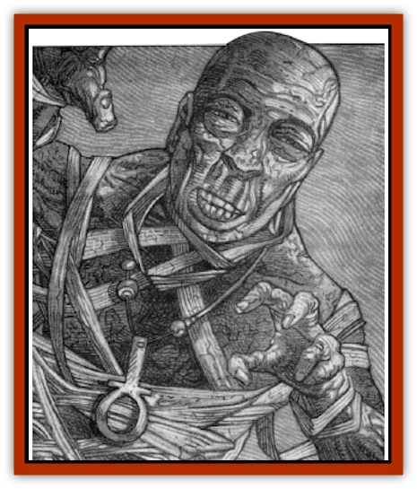

# Mummy - Greater - Senmet

| Statistic | **Mummy, Greater, Senmet** |
| --- | --- |
| **Activity Cycle:** | Night |
| **Alignment:** | Lawful evil |
| **Armor Class:** | 2 |
| **Climate/Terrain:** | Har'Akir |
| **Damage/Attack:** | 3-18 (3d6) |
| **Diet:** | None |
| **Frequency:** | Unique |
| **Hit Dice:** | 8+3 (45 hp) |
| **Intelligence:** | Genius (17) |
| **Magic Resistance:** | Nil |
| **Morale:** | Fanatic (18) |
| **Movement:** | 9 |
| **No. Appearing:** | 1 |
| **No. of Attacks:** | 1 |
| **Organization:** | Solitary |
| **Size:** | M (6'3&rdquo; tall) |
| **Special Attacks:** | Fear aura; disease |
| **Special Defenses:** | Immune to normal weapons; half-damage from magical weapons; immune to cold and non-magical fire. |
| **THAC0:** | 11 (10) |
| **Treasure:** | V (A&times;2) |
| **XP Value:** | 8,000 |

The so-called [[Mummy_Greater|*Children of Anhktepot*]] are a horrible and sinister lot. Most were created by the dread lord of Har'Akir himself and are wholly loyal to that vile creature. Senmet, however, was given his power and undead stature by Isu Rehkotep, a priestess who stumbled upon a magical scroll. Now free to act as he will, Senmet has vowed to bring down Anhktepot and replace him as the lord of Har'Akir.

Like all [[Mummy|mummies]], Senmet is a desiccated corpse wrapped in funereal cloth and bearing an unholy symbol on a chain around his neck. An odor of spices and herbs lingers in the air about him. In places Senmet's wraps have fallen away, revealing withered brown flesh stretched tightly over a skeletal frame. It is impossible to distinguish Senmet from a normal mummy.

Senmet is highly intelligent and speaks many languages in addition to that of Har'Akir. Further, he has a natural ability to command all normal mummies that he might encounter. This power is telepathic, requiring neither words nor motions, and functions on any mummy of whose presence Senmet is aware.

**Combat:** Senmet is a terrible enemy. Like all greater mummies, he radiates an *aura of fear* that forces everyone who sees him to make a fear check at a -1 penalty. If this check is failed, the normal results are doubled due to the great power with which Senmet has been infused. Spells like a <*cloak of bravery* or *remove fear* can enable adventures to overcome this power.

When Senmet attacks in close combat, he does so by striking with his powerful fists. This allows him to make a single attack (at +1 to hit) that delivers a staggering 3d6 points of damage with each blow that lands.

Anyone hit by Senmet will contract a terrible rotting disease which will prove fatal in 1d12 days. On the day after the disease is contracted, the victim begins to suffer uncontrollable shaking and tremors, making spell casting and feats requiring fine Dexterity impossible. Further, the victim loses 1 point of Strength and Constitution from the debilitating effects of the disease and 2 points of Charisma as his or her skin begins to flake and wither away. Ridding oneself of this disease is only possible through use of a *regeneration* spell. A strickened character without access to regenerative magic can be kept alive through receiving *cure disease* spells, one for each day that has passed since the disease was contracted. Note, however, that this merely halts the rot from progressing, and the disease remains in the victim's system until a permament cure is affected. In most cases, a diseased person crumbles into dust when he or she dies. If Senmet choses, however, he can convert someone infected with his rotting disease into a unique breed of [[Zombie|zombie]] or an actual mummy. In either case, the newly created horror is completely under Senmet's control.

 When he wishes to create a zombie, Senmet strangles his victim. Within 8 hours, the body rises from the dead as a [[Zombie_Desert|desert zombie]].

In order to create a mummy, Senmet captures someone infected with his disease and takes his victim to his hidden temple. Here, he mummifies the person alive (a terrible and gruesome fate, to be certain). When the process is complete, the victim dies and promptly rises again as a mummy.

Unlike other greater mummies, Senmet is unable to employ clerical spells, having sacrificed this ability for the power to make and control desert zombies. The means by which he made this exchange is unknown and may well tie into Isu Rehkotep's dark worship of the evil Set. If any have learned this secret, they did not live long enough to share it with the world.

Senmet is immune to attacks made with non-magical weapons, while magical weapons inflict only half their normal damage. Spells and other attacks that depend upon cold, ice, or non-magical fire to inflict damage do not harm him at all. However, Senmet is very vulnerable to lightning-based attacks, which do half again their normal damage when used against him.

Like all undead, Senmet is immune to *charm*, *hold*, *sleep*, or similar spells and cannot be harmed by poisons or disease. He is further immune to damage from holy water, although contact with a non-evil holy symbol burns him for 1d6 points. Contact with an unholy symbol of Set actually restores 1d6 hit points per round. For this reason, Senmet always wears a coiled cobra medallion around his neck and regenerates 1d6 hit points per round so long as it remains in place.

**Habitat/Society:** Long before the domain of Har'Akir was drawn into Ravenloft, Senmet was a priest who served the powerful Anhktepot. An ambitious man, he was not content with his servitor's role and began to plan the downfall of his master. When Anhktepot discovered Senmet's treasonous plotting, he had him mummified and entombed alive. In order to provide the illusion that his reign was unchallenged, Anhktepot buried Senmet with full honors and cast him as a martyr who died to support his pharaoh.

Centuries later, long after Anhktepot's evil earned him a domain in Ravenloft, a young priestess named Isu Rehkotep discovered a magical scroll. She saw at once that it was the process by which Anhktepot created his dreadful greater mummies.

As a noble priestess of the good Osiris, Rehkotep attempted to destroy the scroll, recognizing that it had great power for evil. Her attempts failed, for the magic of the thing would not let it be so easily cast aside. Anxious to see that none should find and use so terrible a treasure, Isu hid it away, naively thinking that it would be lost forever.

Over the years, the power of this evil began to gnaw at her heart. She began to study the works and teachings of Set, the blackest of the dark gods. At first, she believed that she did this only to learn how to recognize evil and thwart it. Gradually, these sinister writings began to take their toll on her. In the end, she began to worship Set as devoutly as she had venerated Osiris.

Now a minion of evil, Rehkotep recovered the mysterious scroll that she had hidden away so long ago. She began to study it and to make plans for its use. What Rehkotep did not fully understand at the time was that her scroll fragments were incomplete. She was able to awaken Senmet, but not to exercise complete control over his actions as she had expected. Still, she does have a limited power upon Senmet, commanding him for 2-8 (2d4) rounds each day. The rest of the time, Senmet is free to do whatever evil deeds he to force her will pleases.

Once he was reanimates, Senmet set about plotting to destroy Anhktepot and claim Har'Akir for his own.

**Ecology:** Unlike all of the other greater mummies that guard Har'Akir's temples and tombs, Senmet was not created by Anhktepot. As such, he cannot be commanded by the lord of Har'Akir.

---
## Discovery & Documentation

**Source Publication:** Ravenloft Appendix II: Children of the Night (1991)
**Campaign Setting:** Ravenloft
**Author(s):** William W. Connors

### Other Creatures Found in This Source Book
   * [[Brain_Living|Brain, Living]]
   * [[Ermordenung_Nostalia_Romaine|Ermordenung, Nostalia Romaine]]
   * [[Ghoul_Ghast_Jugo_Hesketh|Ghoul, Ghast, Jugo Hesketh]]
   * [[Golem_Half-|Golem, Half-]]
   * [[Golem_Mechanical_Ahmi_Vanjuko|Golem, Mechanical, Ahmi Vanjuko]]
   * [[Human_Cursed_Jacqueline_Montarri|Human, Cursed (Jacqueline Montarri)]]
   * [[Human_Madman_The_Midnight_Slasher|Human, Madman (The Midnight Slasher)]]
   * [[Human_Voodan|Human, Voodan]]
   * [[Lich_Bardic|Lich, Bardic]]
   * [[Lycanthrope_Weretiger_Jahed|Lycanthrope, Weretiger (Jahed)]]
   * [[Meazel_Salizarr|Meazel (Salizarr)]]
   * [[Medusa_Ravenloft|Medusa (Ravenloft)]]
   * [[Night_Hag_Styrix|Night Hag, Styrix]]
   * [[Spectre_Jezra_Wagner|Spectre, Jezra Wagner]]
   * [[Thrax_Pelik|Thrax (Pelik)]]
   * [[Treant_Evil_Blackroot|Treant, Evil (Blackroot)]]
   * [[Vampire_Eastern_Mayónaka|Vampire, Eastern (Mayónaka)]]
   * [[Vampire_Illithid_Athaekeetha|Vampire, Illithid (Athaekeetha)]]
   * [[Vampyre_Vladimir_Ludzig|Vampyre (Vladimir Ludzig)]]
