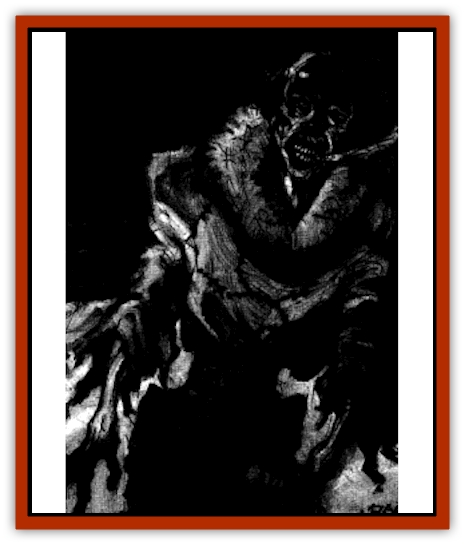

# Mummy - Ice

| Statistic | **Mummy, Ice** |
| --- | --- |
| **Activity Cycle:** | Any |
| **Alignment:** | Chaotic evil |
| **Armor Class:** | 3 |
| **Climate/Terrain:** | Mountain glacier |
| **Damage/Attack:** | 1-12 or by weapon type +1 |
| **Diet:** | None |
| **Frequency:** | Rare |
| **Hit Dice:** | 7 |
| **Intelligence:** | High to genius (11-18) |
| **Magic Resistance:** | Nil |
| **Morale:** | Champion (15) |
| **Movement:** | 6 |
| **No. Appearing:** | 1 |
| **No. of Attacks:** | 1 |
| **Organization:** | Solitary |
| **Size:** | M (5'-6') |
| **Special Attacks:** | Fear, breath weapon, withering touch, spell use |
| **Special Defenses:** | See below |
| **THAC0:** | 12 |
| **Treasure:** | P (D) |
| **XP Value:** | 4,000 |

Leathery, desiccated brown skin is drawn tight over the bones of an ice [[Mummy|mummy]]. The hair and clothing remain intact but show the effects of centuries of entombment. The clothing and weapons are ancient, perhaps including a flint knife, a copperbladed ax, a spear with a stone points, or arrows with obsidian heads. The eyes are sunken and opaque, though open and visible, filled with a blank hatred. The ice mummy's mouth is agape in an eternal scream.

**Combat:** The ice mummy is intelligent as well as cunning. It creates false trails to lead travelers onto fragile snow bridges over crevasses. The only warning of its attack may be the brief glimpse of a figure traveling through the fog on a glacier. When the figure staggers and falls, travelers may go to its aid, only to stumble into its ambush. The ice mummy seldom fights at a disadvantage. When it has its intended victims isolated, it strikes. If the fear it generates has not sent all of the ice mummy's prey into a trap, it uses magic or resorts to its breath weapon, a *cone of cold* that blasts from the hideous, gaping mouth. It then moves away to wait for the cumulative effects of the magical cold and the natural cold to take their toll. If any brave souls are still able to pursue, so much the better.

Although ice mummies are so rare that one can spend a lifetime traveling the high mountains and never encounter one outside of old songs and stories, most of them have the power to work magic as a 9th-level wizard, except that the mummy can employ only spells of 3rd level or lower. Furthermore, ice mummies can never use spells that involve fire as a weapon. Thus, an ice mummy can cast *affect normal fires* to reduce the campfire lit by a group of travelers, but the monster cannot cast a *fireball* spell to attack them. Ice mummies are known to use the following unique spells as well as those commonly employed by human wizards: *slippery slope*, *ice shatter*, and *call blizzard*.

If forced into melee combat, an ice mummy uses weapons. Its inhuman strength lends a +1 bonus both to THAC0 and to damage rolls. Missile weapons used by an ice mummy, usually barbed arrows, also enjoy a +1 THAC0 bonus and also cause 2 hp damage for each round they remain embedded in the victim, because of the supernatural cold with which they are imbued. Removing the barbed arrow of an ice mummy without the help of a character with the healing proficiency inflicts an additional 1d6 hp damage. A *dispel magic*, *limited wish*, or *wish* spell negates the chill effect completely.

If encountered without weapons, an ice mummy can strike for 1d12 hp damage with its cold fists, which also cause damage as per a staff of withering. Three times a day, an ice mummy can breath a blast of cold that inflicts 4d6 hp damage to all within its area of effect, a 20' long cone that is 10' wide at its base.

The supernatural cold exuded by an ice mummy numbs all warm-blooded creatures that come within 25' of the creature. Non-magical weapons used against the creature must save vs. crushing blow each time they hit the creature or freeze so cold that they shatter. Additionally, those who remain within 25' of the ice mummy suffer 1d3 hp damage per round from severe frostbite. Finally, ice mummies cause fear as do normal mummies.

**Ecology:** Ice mummies are the freeze-dried remains of travellers who lost their way in the icy wastes of the mountains. Bitter and afraid, they died alone, hating those who never came to their rescue. At every opportunity, they seek to punish those who mock their demise by traveling the same dangerous terrain that once ruined them.

---
## Discovery & Documentation

**Source Publication:** Dragon238 (1997)
**Campaign Setting:** Dragon Magazine
**Author(s):** John Baichtal, Brian Walton, Tom Baxa

### Other Creatures Found in This Source Book
   * [[Cat_Water|Cat, Water]]
   * [[Crocodile_Albino|Crocodile, Albino]]
   * [[Lich's_Blood|Lich's Blood]]
   * [[Moth_Plague|Moth, Plague]]
