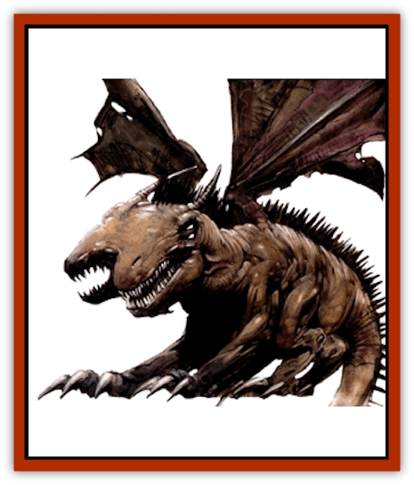

# Murdakus

| Statistic | **Murdakus** |
| --- | --- |
| **Activity Cycle:** | See below |
| **Alignment:** | Neutral evil |
| **Armor Class:** | -4 |
| **Climate/Terrain:** | Empire of Iuz |
| **Damage/Attack:** | 2-12/2-12/3-30/3-30/2-24 |
| **Diet:** | Carnivore |
| **Frequency:** | Very rare |
| **Hit Dice:** | 18 |
| **Intelligence:** | Semi- (2-4) |
| **Magic Resistance:** | Nil |
| **Morale:** | Fanatic (17-18) |
| **Movement:** | 15, fly 18 (D), sprint 30 |
| **No. Appearing:** | 1 |
| **No. of Attacks:** | 5 |
| **Organization:** | Solitary |
| **Size:** | G (50' long, 45' tail) |
| **Special Attacks:** | Death frenzy, severing, breath weapon |
| **Special Defenses:** | Immunities, regeneration, absorb heat |
| **THAC0:** | 7 |
| **Treasure:** | Nil |
| **XP Value:** | 25,000 |

These behemoths are more than 90' long when fully grown and vaguely resemble [[Dragon_General_Information|dragons]]. They have six powerful legs, a pair of batlike wings, and a long prehensile tail tipped with a scythelike stinger. A triple row of spines extend from the base of their thick necks to the stinger. Murdakus have two separate sets of saurian jaws filled with razor-sharp teeth as well as two eyes on each side of their horned heads.

**Combat:** A murdakus attacks five times per round and can split these attacks among separate attackers. Two of the creature's attacks are bites from its twin jaws for 3d1O points of damage each. It can also rear up on its hind four feet, allowing attacks with its claws for 2d6 points of damage each. Finally, the murdakus can strike at anything within 45' with its tail blade, inflicting 2d12 points of damage on a hit and severing a random limb from the target if it scores a natural 20.

Against creatures beyond melee range, a murdakus has only one attack: its breath weapon, usable once per turn. This consists of a pair of narrow beams of intense heat that lance forth from each of its jaws. The murdakus must aim these twin beams in different directions in up to a 90 degree arc; creatures of size L or smaller can be hit by only one beam. Each beam causes 12d6+24 points of damage to all creatures in its path (120' long and 5' wide). The murdakus loathes to use this attack, however, since it loses the ability to regenerate for the next turn as its body heat replenishes. If reduced to less than 1 hit point, a murdakus goes into a frenzy, gaining double its normal amount of attacks for 1 round. At the end of this round, it loses a further 3d8 hit points and drops to the ground.

The murdakus regenerates damage at the rate of 1d4 hit points per round as it draws heat from the surrounding environment to magically repair its wounds. Whorls of fire and shimmering radiance play over the body of a regenerating murdakus; anyone touching a regenerating murdakus must make a successful saving throw vs. breath weapon or suffer 1d4 points of heat-based damage. A murdakus cannot regenerate damage caused by acid or negative energy. A sure way to slay a murdakus permanently is to reduce it to negative hit points within a turn of its use of its breath weapon.

The murdakus is immune to mind-affecting attacks and suffers half damage from poisons that do not slay outright. Fire attacks heal damage on a point-for-point basis. Although resistant to natural cold, it suffers normal damage from magical cold.

**Habitat/Society:** Murdakus are ravenous; just one of them can depopulate all life within 2 square miles in less than a day. Luckily, they have terribly inefficient metabolisms. After 1d3 days of activity, a murdakus must rest for 2d4 weeks. Until it rests, it suffers a +4 penalty to its AC, a -4 penalty to its THACO, and a 50% reduction to its movement. A very hot fire (like dragon breath or a *fireball*) revitalizes a murdakus for 1d3 days.

**Ecology:** During the dark times of the Greyhawk wars, the Bonehart decided to create a chimerical monstrosity to devastate their enemies. Their first attempt spawned a lesser form of murdakus that functioned for a short period of time before collapsing into a fatal coma. Seeking to improve their creation, the Bonehart infused the beast with the ability to metabolize heat. Unfortunately, the murdakus quickly built up an immunity to magical control and rebelled against their allies, causing great damage to Iuz's forces before retreating into the northern wilderness. Iuz was angered at the turn of events, and ordered the deaths of all those who knew the secrets of murdakus creation and destroyed all of their notes. Since then, no new murdakus have been created, and none have been known to breed.

---
## Discovery & Documentation

**Source Publication:** Dragon270 (2000)
**Campaign Setting:** Dragon Magazine
**Author(s):** 

### Other Creatures Found in This Source Book
   * [[Blackroot_Marauder|Blackroot Marauder]]
   * [[Dirtwraith|Dirtwraith]]
   * [[Kyuss_Hound_of|Kyuss, Hound of]]
