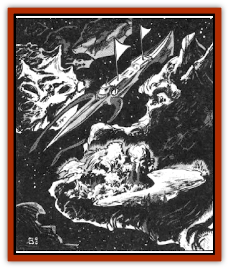

# Murderoid

| Statistic | **Murderoid** |
| --- | --- |
| **Activity Cycle:** | Any |
| **Alignment:** | Neutral evil |
| **Armor Class:** | 0 |
| **Climate/Terrain:** | Wildspace |
| **Damage/Attack:** | 5-50 each |
| **Diet:** | Omnivore |
| **Frequency:** | Very rare |
| **Hit Dice:** | 50 |
| **Intelligence:** | High (13-14) |
| **Magic Resistance:** | Nil |
| **Morale:** | Champion (16) |
| **Movement:** | Fl 12 (E) |
| **No. Appearing:** | 1 or 1-4 |
| **No. of Attacks:** | 1-3 |
| **Organization:** | Solitary |
| **Size:** | G (100-600 miles diameter) |
| **Special Attacks:** | Spells |
| **Special Defenses:** | Spells |
| **THAC0:** | 5 |
| **Treasure:** | Nil |
| **XP Value:** | 51,000 |

Murderoids, so named by travelers because of their aggressive, evil nature, are perhaps the largest denizens of space. These living asteroids are fierce rock creatures that possess their own gravity and atmosphere and move about systems in search of food. Their air envelope is 1d4 miles thick. They attack all creatures smaller than themselves.

Most murderoids are 100 miles long, or longer, and their weight ranges from billions to trillions of tons. Murderoids have a coarse, rock-like skin that is several feet thick and ranges in color from dark brown to dark gray. Their sensory organs, similar to eyes and ears, appear as craters and small hills. They speak no language, but they are able to communicate their emotions to other murderoids by changing the color of their skin. Lighter shades represent satisfaction and pleasure. darker shades represent hunger and anger.

**Combat:** Murderoids can sense creatures up to 60,000 miles away. They attack by luring living creatures to land on their rocklike skin. Once a creature is on its surface, the murderoid uses spells and its physical attacks to prevent the creature from leaving.

Each murderoid can cast *grease*, *dig*, *hallucinatory terrain*, *stone shape*, and *earthquake*, as a 14th-level spellcaster (though only three times a day). The range of the spell is the murderoid's surface and air envelope.

Murderoids usually begin their assault by casting a special *hallucinatory terrain* spell to make their surfaces appear to be paradise.

Once a ship or creature has landed, the murderoid casts *stone shape* to form a part of itself around the ship or creature to prevent its escape. Additional tactics include casting *grease* or *dig* spells so creatures cannot stand, or *earthquake* so ships are damaged. After its spell assault, the murderoid attacks physically by opening up a "mouth" on its surface and biting its victim. A murderoid can create up to three mouths in each one-square-mile area, and 12 mouths over its entire form. A mouth can sustain 30 points of damage before being destroyed. It takes 30 minutes to regenerate a mouth.

Murderoids are immune to *earthquake* spells. However, *move earth* stuns a square-mile area of the creature for 1d6 rounds, and *stone to flesh* stuns a square-mile area for 1d4 turns.

**Habitat/Society:** Murderoids live to eat and continuously hunt for food. They consider all living things smaller than themselves fair game. They have no established territory, forever wandering space in search of food.

Murderoids are solitary creatures; only in extremely rare circumstanccs is a group encountered. Such groups contain juvenile murderoids, each of which is less than 50 miles long. From an early age, murderoids learn that status is important. And status is usually measured by the number of ships a murderoid has gathered. While the bulk of a captured ship is consumed, a murderoid usually leaves a section of the ship on its skin to display to any passing murderoids. The oldest murderoids usually have the most trophies. Unfortunate spacefarers have discovered that occasionally the section of a ship which is being used as a trophy transmits a distress beacon; this beacon lures yet more spacefarers to their doom. Such beacons include flashing lights or magical items that transmit light or energy.

Murderoids mate once every 50 years. A mating results in one egg, which is laid on a small asteroid. The infant murderous eats the asteroid and takes its place - much to the chagrin of space travelers who thought that body to be a lifeless rock. In infant stage, the murderoid is a 10-Hit Die creature and can generate only three mouths over its entire body. Infant stage lasts five years, then the creature is considered a 50-Hit Die adult.

Murderoids live to be about 6,000 years old. generally growing at a rate of one mile in diameter for every 100 years.

**Ecology:** Murderoids' favorite food are [[Kindori|kindori]] and [[Dragon_Radiant|radiant dragons]]. Their natural enemies are spacefaring [[Dwarf|dwarves]]. Evil humanoids have been known to hunt infant murderoids, which they attempt to *charm* for their own malign purposes.

The skin of a murderous can be used as spell components for *stone shape* and *hallucinatory terrain* spells.

---
## Discovery & Documentation

**Source Publication:** MC7 Spelljammer Appendix I (1990)
**Campaign Setting:** Advanced Dungeons & Dragons 2nd Edition
**Author(s):** various

### Other Creatures Found in This Source Book
   * [[Aartuk|Aartuk]]
   * [[Albari|Albari]]
   * [[Ancient_Mariner|Ancient Mariner]]
   * [[Argos|Argos]]
   * [[Beholder_Abomination_Astereater|Beholder (Abomination), Astereater]]
   * [[Blazozoid|Blazozoid]]
   * [[Chattur|Chattur]]
   * [[Chevall|Chevall]]
   * [[Clockwork_Horror|Clockwork Horror]]
   * [[Colossus|Colossus]]
   * [[Delphinid|Delphinid]]
   * [[Dizantar|Dizantar]]
   * [[Dog|Dog]]
   * [[Dog_Bog_Hound|Dog, Bog Hound]]
   * [[Esthetic|Esthetic]]
   * [[Focoid|Focoid]]
   * [[Fractine|Fractine]]
   * [[Giant_Spacesea|Giant, Spacesea]]
   * [[Golem_Furnace|Golem, Furnace]]
   * [[Golem_Radiant|Golem, Radiant]]
   * [[Gravislayer|Gravislayer]]
   * [[Grommam|Grommam]]
   * [[Hadozee|Hadozee]]
   * [[Hamster_Giant_Space|Hamster, Giant Space]]
   * [[Jammer_Leech|Jammer Leech]]
   * [[Lakshu|Lakshu]]
   * [[Lumineaux|Lumineaux]]
   * [[Lutum|Lutum]]
   * [[Mimic_Space|Mimic, Space]]
   * [[Misi|Misi]]
   * [[Moon_Rogue|Moon, Rogue]]
   * [[Mortiss|Mortiss]]
   * [[Nay-Churr|Nay-Churr]]
   * [[Phlog-Crawler|Phlog-Crawler]]
   * [[Plasman|Plasman]]
   * [[Plasmoid_DeGleash|Plasmoid, DeGleash]]
   * [[Plasmoid_DelNoric|Plasmoid, DelNoric]]
   * [[Plasmoid_General_Information|Plasmoid, General Information]]
   * [[Plasmoid_Ontalak|Plasmoid, Ontalak]]
   * [[Puffer|Puffer]]
   * [[Q'nidar|Q'nidar]]
   * [[Rastipede|Rastipede]]
   * [[Reigar|Reigar]]
   * [[Rock_Hopper|Rock Hopper]]
   * [[Slinker|Slinker]]
   * [[Spider_Asteroid|Spider, Asteroid]]
   * [[Spiritjam|Spiritjam]]
   * [[Survivor|Survivor]]
   * [[Syllix|Syllix]]
   * [[Symbiont_Power|Symbiont, Power]]
   * [[Vine_Infinity|Vine, Infinity]]
   * [[Wiggle|Wiggle]]
   * [[Wizshade|Wizshade]]
   * [[Wryback|Wryback]]
   * [[Zard|Zard]]
   * [[Zodar|Zodar]]
