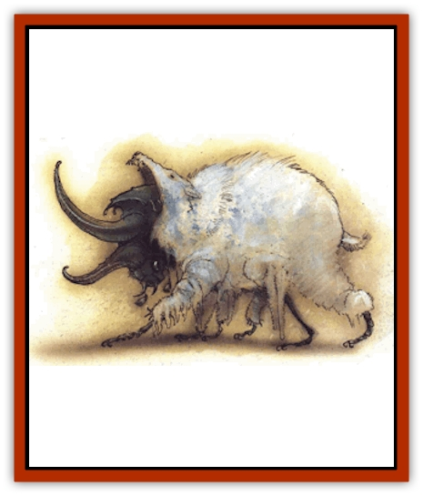

# Murska

| Statistic | **Murska** |
| --- | --- |
| **Activity Cycle:** | Any |
| **Alignment:** | Chaotic evil |
| **Armor Class:** | 2 (variable) |
| **Climate/Terrain:** | Pandemonium |
| **Damage/Attack:** | 2d12 |
| **Diet:** | Carnivore |
| **Frequency:** | Very rare |
| **Hit Dice:** | 7 |
| **Intelligence:** | Varies |
| **Magic Resistance:** | Nil |
| **Morale:** | Fearless (19) |
| **Movement:** | 12 |
| **No. Appearing:** | 1d4+1 |
| **No. of Attacks:** | 1 |
| **Organization:** | Colony |
| **Size:** | L (8' long) |
| **Special Attacks:** | Hold for 2d6 |
| **Special Defenses:** | Immune to charms and gases, ½ damage from fire |
| **THAC0:** | 13 |
| **Treasure:** | Nil |
| **XP Value:** | 1,400 |

"Am I the friend you sent out into the night to check on the [[Howler|howlers]], howlers that screamed so deliciously in their stables? They are silent now - did you notice? I quieted them well.

"It was not kind of you to send me out into the night. I had to endure the winds of Pandemonium while all of you were safe. Things lurk in the darkness that make even the walk from the inn to the stable unsafe.

"Why won't you let me in? That's not kind, either. Can't you see it's me standing at the window? Or do you no longer know who I am? Perhaps you fear this body is a husk, holding something terrible within it - that eventually the energies will build and tear through this feeble shell.

"You think I'm a murska, one or the great beetle beasts out on the plains. You've seen their tracks today, the molted shreds of skin they leave behind. Now you fear the friend you see has become one of them, that he is only the last unmolted remains of the beast's dinner. I know - you fear that below this wlndow-sill my human flesh ends in shreds and tatters as the hardened carapace of the murska erupts from within. You imagine its shell still glistening and fresh as it flickers green and gold in the windowlight. Even now it might hunger outside the door.

"Or maybe I'm me and the murska's hunting out here. Let me in, you berkzzz, before it's too late!

"What'zzz wrong? It's only the wind that makes my voice buzz like an insect's. Why are you staring at my face? lzzz something happening?"

**Combat:** The murska is a ravenous hunter in Pandemonium, made all the more dangerous by its special powers and cooperative hunting habits. Murskas are almost never encountered singly. It is far more common to meet three to four of these foul [[Beetle|beetle]] things. When initially encountered, murskas attack in a coordinated fashion. Typically one blocks the forward path while the others circle the prey to strike on the flanks. The beetle beasts seldom fight to the death. They are hunting, not slaughtering, so a murska attack ends as soon as a victim can be seized and dragged off, to be killed and eaten later.

A murska attacks by seizing its target in its powerful eating mandibles. Only after the victim has been seized does the beast gnaw at the held victim with a small series of razored teeth. Its grinding mandibles cause 2d12 points of damage. Furthermore, victims seized by the mandibles can be held without further attack rolls. In subsequent rounds, a held victim can be gnawed for 2d6 points of damage. No attack roll is needed for this since the mandibles hold the victim in place.

Those held by a murska are severely limited. Breaking free of a murska's grasp requires all of a held creature's efforts, along with a successful open door die roll (to pry the mandibles apart). Just as with a door, others can help in the attempt, but they automatically suffer 1d6 points of damage as the murska thrashes about in their grip. Regardless of the success or failure or the effort, the held victim still suffers 2d12 points of damage that round. A person can voluntarily forgo an attempt to break free in order to use a mental or innate power, but spells, magical items, and weapons cannot be used.

Like its appearance, the Armor Class of these creatures can vary. In its true insectoid form, the murska has an Armor Class of 2. The murska is very seldom met in its pure form, however. Each time the murska feeds, it assumes some of the physical properties of its latest dinner. Constantly growing and shedding old skin, the murska assumes the form of its latest meal. Having eaten a [[Horse|horse]], the murska's carapace gradually molts to reveal the dapple-gray hide of a horse beneath. Mane and head form, misshapen and blobby, stretched awfully over the cursed insect's shell. In time the horsehide peels back to reveal the beetle beneath once more. Thus, a murska looks like the grotesque parody of anything it can eat. As time passes between meals, the assumed skin itself is gradually replaced by the murska's true form. In its molting skin, the murska's carapace is not as firm, reducing its effective Armor Class to 4.

In addition to their formidable attacks and hideous appearance, murskas have several special defenses and immunities. Although they adopt many of the mental features of their repast - particularly wit and memories - murskas are always considered mindless. They cannot be charmed or controlled through mental dominations. They are immune to gases (not that these are effective in the winds of Pandemonium) and suffer only half damage from fire-based attacks. They are vulnerable to cold, with a -2 penalty on their saving throws versus such attacks.

**Habitat/Society:** Unlike many other insectoid creatures, the murska has no nest or fixed territory. It follows its prey - virtually any creature of man or larger size. About the only beast of size it does not attack are howlers, probably due to the howler's irritating quills. In times of famine, murska have even been seen devouring each other.

Fortunately, the murska does not need to feed continually. Like certain other species of creatures, the beetle periodically gorges itself and then withdraws until hunger forces it to hunt again. Since the creature grows and then molts the form of its latest meal, it is possible to estimate just how hungry a given murska might be. Those nearly completely covered in their stolen skin are well fed. As time passes. more of the beetle shell breaks through, and the greater the beast's hunger. A murska in pure beetle form is starving and therefore the most dangerous.

One great variable in all murska attacks is their cunning, because murskas do not just assume the skin of their victims. Some of the intelligence, memories, and nature of their last meal is also absorbed. While these fade just as the skin peels, in the meanwhile murskas use the knowledge they have gained. Their behavior becomes a horrid mixup of both the beetle and its dinner. For example, a murska that ate a character's horse might follow the party, invade stables, and otherwise behave like that horse. As time passes, the memories weaken and the beast's true nature asserts itself.

More dangerous is the murska that eats an intelligent creature, for then the beetle beast becomes intelligent. It gains no spells, proficiences, class, or psionic abilities from its victim, but it does possess all the creature's native cunning. It can speak and often uses its stolen memories to lure others to their doom. An intelligent murska is often no longer content to eat and gorge, but may attempt to build a larder of new victims.

There are rumors within Pandemonium of murskas who, having tasted the fruit of intelligence, continually seek it out. They have become aware of what they are and now use the minds of others to sustain their own, newly intelligent selves. This may be nothing more than the howling of madmen, borne on the winds or the plane.

**Ecology:** Like so many other oddities of Pandemonium, no one has yet fathomed the true role of the murskas in the multiverse. Revolutionary League legend holds that the beasts are the spirits of their lost brethen, forever assuming the identity of others. Desperate Anarchists sometimes bring their concerns to the "revolutionaries who have been" in hopes the god-beetles will grant them aid.

---
## Discovery & Documentation

**Source Publication:** Planes of Chaos (1994)
**Campaign Setting:** Planescape
**Author(s):** Wolfgang Baur, L. W. Smith

### Other Creatures Found in This Source Book
   * [[Asrai|Asrai]]
   * [[Astral_Dreadnought|Astral Dreadnought]]
   * [[Bacchae|Bacchae]]
   * [[Chaos_Beast|Chaos Beast]]
   * [[Fensir|Fensir]]
   * [[Abyssal_Lord|Abyssal Lord]]
   * [[Howler|Howler]]
   * [[Imp_Chaos|Imp, Chaos]]
   * [[Lillend|Lillend]]
   * [[Oread|Oread]]
   * [[Ratatosk|Ratatosk]]
   * [[Tanar'ri_Greater_Goristro|Tanar'ri, Greater, Goristro]]
   * [[Tanar'ri_Lesser_Armanite|Tanar'ri, Lesser, Armanite]]
   * [[Varrangoin|Varrangoin]]
   * [[Viper_Tree|Viper Tree]]
