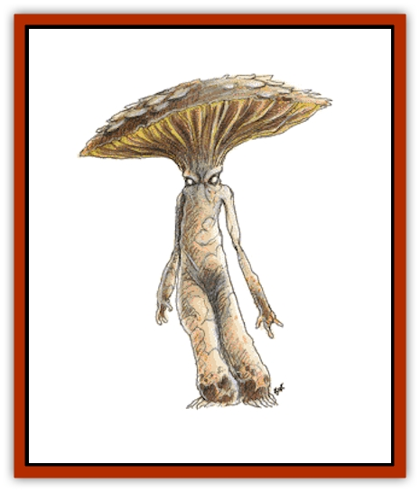

# Myconid

| Statistic | **Myconid** |
| --- | --- |
| **Activity Cycle:** | Day |
| **Alignment:** | Lawful neutral |
| **Armor Class:** | 10 |
| **Climate/Terrain:** | Subterranean |
| **Damage/Attack:** | 1d4&times;HD |
| **Diet:** | Herbivore |
| **Frequency:** | Rare |
| **Hit Dice:** | 1-6 |
| **Intelligence:** | Average (8-10) |
| **Magic Resistance:** | Nil |
| **Morale:** | Steady (12) to Elite (13) |
| **Movement:** | 9 |
| **No. Appearing:** | 1-12; 20-200 in lair |
| **No. of Attacks:** | 1 |
| **Organization:** | Communal |
| **Size:** | T-L (2' per HD) |
| **Special Attacks:** | Spore Clouds |
| **Special Defenses:** | Poisonous Skin |
| **THAC0:** | 1-2 HD: 19 / 3-4 HD: 17 / 5-6 HD: 15 |
| **Treasure:** | S&times;2 |
| **XP Value:** | 1 HD: 65 / 2 HD: 120 / 3 HD: 175 / 4 HD: 270 / 5 HD: 420 / 6 HD: 650 |

Myconids, or [[Fungus|fungus]] men, are a race of intelligent fungi that live in the remote reaches of the Underdark. They are cautious creatures that deplore violence; myconids have no desire to conquer anybody and would prefer to be left alone.

Myconids resemble walking toadstools in human form. Their flesh is bloated and spongy and varies in color from purple to gray. Their wide feet have vestigial toes and their pudgy hands have two stubby fingers and a thumb on either side. Myconids' Hit Dice determine their social status and abilities. They have no spoken language.

**Combat:** Fungus men fight by clubbing with their clasped hands, causing 1d4 points of damage per Hit Die. Thus a 1-Hit Die myconid inflicts 1d4 points of damage, a 2-Hit Die myconid causes 2d4 points of damage, etc., up to the 6-Hit Dice king that inflicts 6d4 points of damage on a hit.

Myconids also have the ability to spew forth clouds of special spores. The number and kind of spores increase as they grow. As each myconid advances to another size level, it gains the ability to spray another type of spores, and the number of times per day that each spore type can be emitted also increases. A myconid can emit each of its spore types a number of times per day equal to its Hit Dice. For example, a 3-HD myconid (6 feet tall) can spray three types of spores, and it may use each type three times per day. These spore types include the following:

<ul><li>*Distress:* This spore type is used to alert other myconids to danger or a need for aid. The cloud expands at a rate of 40 feet per round, expanding to its maximum of 120 feet in three rounds. This ability is gained at the 1-Hit Die level.</li><li>*Reproducer:* These spores are only emitted at the proper time for growing new myconids so the population can be rigidly controlled. They are also automatically ejected by a dying myconid. This ability is gained at the 2-Hit Dice level.</li><li>*Rapport:* These spores are primarily used in the melding process. However, they can be used by the myconids to communicate with other species, since the fungus men do not talk. A small cloud of spores is aimed at one person; if the person fails a saving throw vs. poison (it can choose to fail), it can go into telepathic rapport, speaking mind-to-mind with the myconid as if it were normal speech. The range of this effect is 40 feet. The duration is a number of turns equal to the Hit Dice of the myconid. This ability is gained at the 3-Hit Dice level.</li><li>*Pacifier:* This type of spore cloud may be spewed at a single creature. If the creature fails its saving throw vs. poison, it becomes totally passive, unable to do anything. The affected creature only observes; it is unable to perform any action even if attacked. The range of this effect is 40 feet. The duration of this effect is a number of rounds equal to the Hit Dice of the myconid. This ability is gained at the 4-Hit Dice level.</li><li>*Hallucinator:* This type of spore is usually used in the melding ritual, but a myconid can project them at an attacker. The spore cloud may be shot at one creature, and if that creature fails its saving throw vs. poison, it suffers violent hallucinations for a number of turns equal to the Hit Dice of the myconid. Hallucinating creatures react as follows (roll 1d20):</li></ul>
| D20 | Roll Reaction |
| --- | --- |
| 1-10 | Cower and whimper |
| 11-15 | Stare into nothingness |
| 16-18 | Flee shrieking in a random direction |
| 19-20 | Try to kill the closest creature |

The range of this effect is 40 feet. This ability is gained at the 5-Hit Dice level.

<ul><li>*Animator:* This ability is gained at the 6-Hit Dice level, the level only the king may achieve. The king uses these spores to infect a dead animal or creature. A purple fungus quickly covers the corpse, taking over the dead body systems and putting it to work, animating the corpse to resemble a [[Zombie|zombie]] (AC 10, Move 9, HD 1, hp 4, #AT 2, Dmg bony claws for 1-3/1-3). It is not undead and cannot be turned by priests. It always strikes last in a round. The body continues to rot and the fungus gradually replaces the missing parts, becoming specialized to take over their functions. Eventually, however, the decay proceeds too far, and the body stops functioning, able to rest at last. Animation takes place 1d4 days after infection, and the corpse is animated for 1d4+1 weeks before it decays. Animated creatures will follow simple orders given by the animator (with rapport spores) to the best of their ability. Orders take priority over self-preservation.</li></ul>A myconid has a deathly fear of sunlight and will not willingly travel to the surface world. The exact effects of sunlight on a myconid are unknown, but they must be highly detrimental for the fungus men to fear sunlight as they do.

**Habitat/Society:** Myconid society is based on "circles", extremely tight social groups that are linked by group work and melding sessions. Myconid circles usually consist of 20 members: four of each size from 1-5 Hit Dice (i.e., four 1-HD, four 2-HD, etc.). Each community consists of 1d10 circles.

Each circle's day is rigidly structured: eight hours of rest, followed by eight hours of farming the fungus crops, followed by eight hours of melding. For the myconids, melding is entertainment, worship, and social interaction combined. The fungus men gather in a tight circle and the elder myconid release rapport and hallucinatory spores. The entire group then merges into a collective telepathic hallucination for eight hours. Myconids consider this melding to be the reason for their existence. Only distress spores will bring a circle out of its meld before the eight hours have elapsed.

The myconid king is always the largest member of the colony and is the only member at the 6-Hit Dice level. It is also the only myconid that is not the member of a circle. The other myconids regard separation from the circles with horror and pity the lonely king. The leadership role is thought of as an unpleasant duty, almost a condemnation. However, when the old king dies, the strongest 5-Hit Dice myconid always assumes the role of the new king. The king must remain outside of circles to retain objectivity and to pay close attention to the duties of leadership. The king animates guardians for the colony so the myconids need not commit violence. It coordinates the work schedule and pays attention to affairs outside the colony that could affect the fungus men. The king also practices fungal alchemy, brewing special potions that may be useful in times of trouble.

In general, myconids are a peaceful race, desiring only to work and meld in peace. There are no recorded instances of disharmony, or any sort of violence or disagreement between myconids. If forced into combat, they avoid killing if at all possible; violence adversely affects their melding.

Accord has never been reached between fungoid and humanoid. Each views the other as a disgusting threat; humanoids see myconids as ugly monsters. Myconids view humanoids as a violent, insane species out to conquer anything in their path, destroy anything they can't conquer, then go back down the path to make sure there isn't anything they forgot to destroy or conquer. Myconids find it difficult to believe that humanoids are not going to immediately use violence against them, and so they are very reluctant to deal with them. Given population pressures in the underworld in which the myconids live, further conflicts seem inevitable. If the myconids are approached in peace, it is possible that they will communicate, though they will be suspicious.

Myconids live in Underdark regions, which are large cavernous underground areas that range in size form a large cavern complex to an entire secret continent beneath the ground. Myconids try to find isolated spots away from civilized areas. These communities will usually be near water, for they like dampness. Work details sometimes patrol the Underdark, looking for signs of battles and unburied dead, which they bring to the king to animate; these are the only myconids that will be found outside of their lair. A myconid community is arranged around mounds of moss-covered stones, on which the circle members sit when they meld, and on which they sleep. There will also be a large garden area; the myconids feed on water and small fungi, and the king uses the garden ingredients to make his potions. Dead myconid kings are buried with honor beneath the mounds, while dead myconids are buried near the gardens.

**Ecology:** Myconids are an unusual species of fungi. They grow fungi, which later decay, and the myconids feed from these soil nutrients.

A myconid has a life span of 24 years. It requires four years to grow to each Hit Die, thus a 1-Hit Die myconid is four years old, a 2-Hit Die myconid is eight years old, etc., to a maximum of 5 Hit Dice at 20 years of age. It requires a special regimen for a myconid to reach 6 Hit Dice (king).

A myconid king has the ability to brew magical potions from fungi. In addition to standard magical potions, a myconid king can brew the following:

*Potion of Fungus Growth:* This is used in times of population shortage, when myconid circles need their young members to grow quickly. This potion increases a myconid's Hit Dice by 1. It can only be used on a myconid once in its lifetime; repeated doses have no effect.

*Potion of Fungus Healing:* This potion only works on fungi. It heals 1d6+1 lost hit points. Potion of Decay: This poison affects a humanoid creature as if it were a dead creature infected with purple fungi spores. The victim must roll a successful saving throw vs. poison or die, replaced within 1d4+1 days by a fungal intelligence friendly to the myconids, which lasts for 1d4+1 weeks before permanently decaying. A cure disease spell will prevent the victim's death if cast within three minutes of the infection. The combination of a cure disease spell and a raise dead spell will bring back victims of the fungus disease after 48 hours. This potion is rarely used by the fungus men.

*Powders of Hallucination:* This is used when hallucinatory spores are in short supply due to the death of 4- and 5-Hit Die members of the circles. It is also used as a defensive measure when myconids are certain they are going to be attacked; a powder is bundled and placed on a spider-silk film inside the entrance to their circle. Creatures of size M will break the powder free, affecting all creatures in a 20-foot radius as hallucinatory spores.

*Potion of Anointment:* This is the special regimen that enables a 5-Hit Die fungus to grow to 6 Hit Dice and become king. Growth is immediate and painful. It affects a myconid only once. It is poisonous to humans (successful saving throw vs. poison or die).

There is always one potion of anointment in the community. If other potions are indicated, consult the following table:

| Roll | Effect |
| --- | --- |
| 01-10 | Another potion of anointment |
| 11-20 | Potion of fungi growth |
| 21-30 | Potion of fungus healing |
| 31-40 | Powder of hallucination |
| 41-45 | Potion of decay |
| 46-00 | Roll on standard potion table |

Alchemists have found a number of uses for myconid spores, typically in poisons and *potions of delusion*. Other than their potions, myconids produce little of value to humanoid creatures.

---
## Discovery & Documentation

**Source Publication:** MC2 Volume II (1993)
**Campaign Setting:** Advanced Dungeons & Dragons 2nd Edition
**Author(s):** Jay Batista, Scott Bennie, Grant Boucher, William W. Connors, Steve Gilbert, Heike Kubasch, James Lowder, David Edward Martin, Bruce Nesmith, Jean Rabe, Rick Swan, John J. Terra, Gary L. Thomas

### Other Creatures Found in This Source Book
   * [[Ant|Ant]]
   * [[Ant_Lion_Giant|Ant Lion, Giant]]
   * [[Ape_Carnivorous|Ape, Carnivorous]]
   * [[Baboon|Baboon]]
   * [[Badger|Badger]]
   * [[Barracuda|Barracuda]]
   * [[Beetle_Giant|Beetle, Giant]]
   * [[Bulette|Bulette]]
   * [[Bullywug|Bullywug]]
   * [[Dwarf_Duergar|Dwarf, Duergar]]
   * [[Dwarf_Gully|Dwarf, Gully]]
   * [[Eagle|Eagle]]
   * [[Eel|Eel]]
   * [[Elemental_Air_Kin|Elemental, Air Kin]]
   * [[Elemental_Water_Kin|Elemental, Water Kin]]
   * [[Elemental_Water_Kin_Water_Weird|Elemental, Water Kin, Water Weird]]
   * [[Firestar|Firestar]]
   * [[Firetail|Firetail]]
   * [[Fish_Giant|Fish, Giant]]
   * [[Frog|Frog]]
   * [[Gorgon|Gorgon]]
   * [[Hawk|Hawk]]
   * [[Heucuva|Heucuva]]
   * [[Hippocampus|Hippocampus]]
   * [[Hippogriff|Hippogriff]]
   * [[Kelpie|Kelpie]]
   * [[Kenku|Kenku]]
   * [[Killmoulis|Killmoulis]]
   * [[Kuo-Toa|Kuo-Toa]]
   * [[Lamia|Lamia]]
   * [[Lammasu|Lammasu]]
   * [[Lamprey|Lamprey]]
   * [[Leech|Leech]]
   * [[Leprechaun|Leprechaun]]
   * [[Leucrotta|Leucrotta]]
   * [[Locathah|Locathah]]
   * [[Lycanthrope_Wereboar|Lycanthrope, Wereboar]]
   * [[Lycanthrope_Werefox|Lycanthrope, Werefox]]
   * [[Mammal_Minimal|Mammal, Minimal]]
   * [[Mammal_Small|Mammal, Small]]
   * [[Mimic|Mimic]]
   * [[Morkoth|Morkoth]]
   * [[Muckdweller|Muckdweller]]
   * [[Naga|Naga]]
   * [[Obliviax|Obliviax]]
   * [[Octopus_Giant|Octopus, Giant]]
   * [[Otyugh|Otyugh]]
   * [[Piranha|Piranha]]
   * [[Plant_Dangerous_I|Plant, Dangerous I]]
   * [[Plant_Intelligent|Plant, Intelligent]]
   * [[Poltergeist|Poltergeist]]
   * [[Porcupine|Porcupine]]
   * [[Rat_Osquip|Rat, Osquip]]
   * [[Roc|Roc]]
   * [[Roper|Roper]]
   * [[Rot_Grub|Rot Grub]]
   * [[Rust_Monster|Rust Monster]]
   * [[Sahuagin|Sahuagin]]
   * [[Sea_Lion|Sea Lion]]
   * [[Sea_Horse_Giant|Sea Horse, Giant]]
   * [[Shambling_Mound|Shambling Mound]]
   * [[Shark|Shark]]
   * [[Sphinx|Sphinx]]
   * [[Squid_Giant|Squid, Giant]]
   * [[Stirge|Stirge]]
   * [[Swanmay|Swanmay]]
   * [[Tarrasque|Tarrasque]]
   * [[Tasloi|Tasloi]]
   * [[Triton|Triton]]
   * [[Troglodyte|Troglodyte]]
   * [[Urchin|Urchin]]
   * [[Urd|Urd]]
   * [[Weasel|Weasel]]
   * [[Wolverine|Wolverine]]
   * [[Yellow_Musk_Creeper|Yellow Musk Creeper]]
