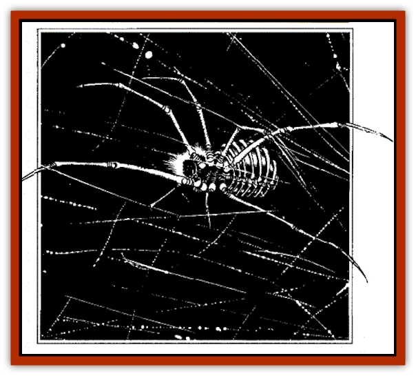

# Myrlochar

| Statistic | **Myrlochar** |
| --- | --- |
| **Activity Cycle:** | Any |
| **Alignment:** | Chaotic evil |
| **Armor Class:** | 4 |
| **Climate/Terrain:** | Any |
| **Damage/Attack:** | 2-5/2-5/2-12 |
| **Diet:** | Carnivore |
| **Frequency:** | Very rare (Uncommon in Abyss) |
| **Hit Dice:** | 6+6 |
| **Intelligence:** | Very (11-12) |
| **Magic Resistance:** | 30% |
| **Morale:** | Champion (15) |
| **Movement:** | 8, Wb 16 |
| **No. Appearing:** | 1-12 |
| **No. of Attacks:** | 3 |
| **Organization:** | Hunting packs |
| **Size:** | M (6' diameter) |
| **Special Attacks:** | See below |
| **Special Defenses:** | See below |
| **THAC0:** | 1 5 |
| **Treasure:** | Nil |
| **XP Value:** | 4,000 |

Myrlochar, or "soul spiders," are the servants of Lolth most often summoned from her dark otherplanar domain by rituals of worship or supplication to the Spider Queen. In the Abyss, they are tireless hunters, and often discover and pass through interplanar gates, portals, and other methods of transit, to reach other planes. There, they roam freely, wreaking havoc until destroyed.

Vicious and cruel in their hunting down and slaying of weaker creatures, myrlochar appear as skeletal spiders, whose brown, russet, or ivory-yellow bones glow with a faint greenish-yellow radiance, and whose eyes glow a fiery cherry red.

Lolth's dictates force them to obey a single command from any summoner - to their own destruction, if necessary. Thereafter they are free to roam the plane they have been summoned to at will, so long as they do not harm the persons or activities of beings who openly worship the Spider Queen. Typically, they find cover, and from it begin an almost playful hunting and killing spree - until they finally encounter an opponent powerful enough to slay them. Myrlochar summoned together tend to remain in a hunting group during this period of freedom

  **Combat:**  The skeletal bodies of myrlochar are surprisingly strong and agile. In battle, they strike with the bony points of two elongated forelegs (sometimes with enough force to penetrate a shield), and with saw-edged jaws

The magical bite of a soul spider does 2-12 damage. There is always a 1 in 6 chance that 1 hit point of any myrlochar bite damage will be permanently drained from the victim—and gained by the soul spider. It is this power that gave the myrlochar its nickname, among long-ago Calishite desert nomads and northern barbarian tribes of the Realms.

In addition, the bite of a myrlochar can also affect its victim with one of two magical effects (the intended victim receives a saving throw versus spell, at -3, to avoid either effect): *hold person* (lasting 4 rounds) or *reverse gravity*. Except as noted, these effects are identical to the wizard spells of the same names.

Myrlochar can navigate and fight normally even in magical *darkness*, by means of acute hearing, smell, vibratory senses, and a sort of active sonar sense, and are not adversely affected by bright light. They make no sound in normal movement, and can pass through webs without hindrance (including the sticky effects of a *web* spell, to which they are immune).

Myrlochar produce no webs of their own, but can adhere to walls, ceilings, the webs of others, weapons (especially polearms) and other items. Soul spiders use these as tools and reaching-aids rather than weapons.

Myrlochar can *levitate* at a vertical movement rate of 6 per round. They can use this ability to slow themselves when falling or leaping, with effects equal to a *feather fall* spell. Myrlochar typically employ polearms or other reaching aids to pull themselves closer to a ledge or quarry when *levitating*.

Myrlochar produce and use no poison, but are immune to all poisons. They are not undead and cannot be turned - but share immunities to *sleep*, *charm*, and *hold*-related spells with many undead.

**Habitat/Society:** Myrlochar form hunting packs both on the Abyssal layers and on other planes. No one has ever seen young soul spiders, nor do they seem to form family groupings or mating pairs.

**Ecology:** Myrlochar never seem to age. They regenerate lost bony matter very slowly (at the rate of 1 hp/4 days), can reattach severed legs and body parts, and will eat the flesh of any creature they can catch. Nothing hunts them except fearful intelligent opponents trying to be rid of them— and foolhardy adventurers, often in the employ of alchemists. Powdered soul spider bone is a potent ingredient in the making of items and enchantments involving *free action* and *levitation*

---
## Discovery & Documentation

**Source Publication:** The Drow of the Underdark (1991)
**Campaign Setting:** Forgotten Realms
**Author(s):** Ed Greenwood

### Other Creatures Found in This Source Book
   * [[Bat_Deep|Bat, Deep]]
   * [[Dragon_Deep|Dragon, Deep]]
   * [[Pedipalp|Pedipalp]]
   * [[Rothe_Deep|Rothe, Deep]]
   * [[Solifugid|Solifugid]]
   * [[Spider_Subterranean|Spider, Subterranean]]
   * [[Spitting_Crawler|Spitting Crawler]]
   * [[Yochlol_Underdark|Yochlol (Underdark)]]
