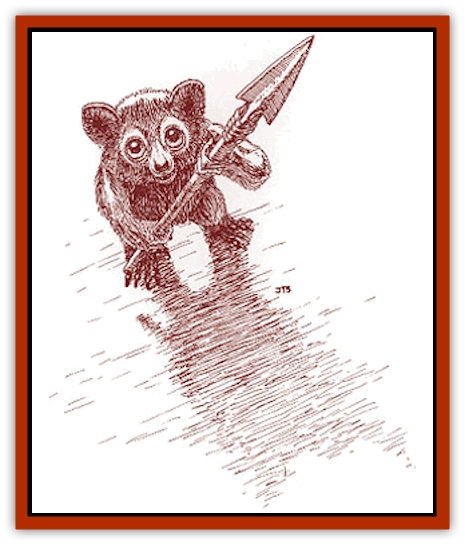

# Mythuínn Folk

| Statistic | **Mythuínn Folk** |
| --- | --- |
| **Activity Cycle:** | Any |
| **Alignment:** | Any good |
| **Armor Class:** | 3 |
| **Climate/Terrain:** | Any arctic or mountain-top |
| **Damage/Attack:** | 1d2 |
| **Diet:** | Omnivore |
| **Frequency:** | Rare |
| **Hit Dice:** | ½ |
| **Intelligence:** | Average (8-10) |
| **Magic Resistance:** | Nil |
| **Morale:** | Steady (11-12) |
| **Movement:** | 6 |
| **No. Appearing:** | 2d4 |
| **No. of Attacks:** | 1 |
| **Organization:** | Village |
| **Size:** | T (6-9&rdquo; tall) |
| **Special Attacks:** | Nil |
| **Special Defenses:** | Invisibility, <i>dimension door</i> |
| **THAC0:** | 20 |
| **Treasure:** | Nil (A) |
| **XP Value:** | 65 |

Mythuínn folk look like cute, shaggy teddy bears, roughly the size of a human hand. They have big, deep-brown eyes and white, brown, or black fur. They are ice-dwellers who live high in the mountains surrounding the ee'aar kingdom on the Arm of the Immortals.

Mythuínn folk have a completely different name for themselves, but no outsider can pronounce it. They have their own language, but their voices are too high pitched and fast for humanoid hearing. Some mythuínn speak the [[Ee'aar|ee'aar]] dialect, which they must speak very slowly. Any man-sized or larger humanoid must make a successful hear noise check to understand the speech of the mythuínn.

**Habitat/Society:** Most mythuínn are extremely curious, wanting to see everything - and the sooner the better. Mythuínn sometimes even accompany adventurers of good alignment for brief periods of time. Such adventurous mythuínn quickly learn the language of their "Big Folk" friends so that they can communicate. Ee'aar travelers often carry mythuínn for good luck.

Mythuínn are sociable and dwell in icy caves high on the mountain-tops. Their wondrous villages are carved and shaped from the ice - miniature fairy-villages, sparkling like cut diamond in the light. Mythuínn protect their villages with patrols, each carrying a horn to sound an alert if necessary. A village can contain several hundred mythuínn.

Individual mythuínn carry little or no treasure. However, their villages contain at least a full treasure type A.

**Ecology:** [[Tyminid|Tyminids]] prey upon mythuínn, pursuing the tiny folk relentlessly. Mythuínn folk sometime hide in [[Golem_Savage_Coast|aeldar]] webs to elude these predators.

Mythuínn live fast - about ten times as fast as most humanoids. A one year sojourn to see the world with a "Big Folk" friend seems like a decade to one of the adventurous mythuínn. They live eight to ten years, although to them it seems like 80 to 100 years.

Mythuínn mate for life; if one partner dies, the other partner then sickens and dies. A mated pair of mythuínn will have three to five offspring during their fertile years. Twins are fairly common.

---
## Discovery & Documentation

**Source Publication:** Monstrous Compendium Savage Coast Appendix (Online Exclusive) (1995)
**Campaign Setting:** Mystara
**Author(s):** Loren L Coleman, Ted James, Thomas Zuvich, Cindi M. Rice

### Other Creatures Found in This Source Book
   * [[Aranea_Savage_Coast|Aranea (Savage Coast)]]
   * [[Arashaeem|Arashaeem]]
   * [[Batracine|Batracine]]
   * [[Cat_Marine|Cat, Marine]]
   * [[Cinnavixen|Cinnavixen]]
   * [[Clockwork_Swordsman|Clockwork Swordsman]]
   * [[Critter_Temple|Critter, Temple]]
   * [[Cursed_One|Cursed One]]
   * [[Deathmare|Deathmare]]
   * [[Dragon_Savage_Coast_Crimson|Dragon (Savage Coast), Crimson]]
   * [[Dragon_Savage_Coast_Red_Hawk|Dragon (Savage Coast), Red Hawk]]
   * [[Echyan|Echyan]]
   * [[Ee'aar|Ee'aar]]
   * [[Enduk|Enduk]]
   * [[Fachan_Savage_Coast|Fachan (Savage Coast)]]
   * [[Feliquine|Feliquine]]
   * [[Fiend_Narvaezan|Fiend, Narvaezan]]
   * [[Frelôn|Frelôn]]
   * [[Ghriest|Ghriest]]
   * [[Glutton_Sea|Glutton, Sea]]
   * [[Goatman|Goatman]]
   * [[Golem_Naâruk|Golem, Naâruk]]
   * [[Golem_Savage_Coast|Golem (Savage Coast)]]
   * [[Grudgling|Grudgling]]
   * [[Heraldic_Servant_I|Heraldic Servant I]]
   * [[Heraldic_Servant_II|Heraldic Servant II]]
   * [[Heraldic_Servant_III|Heraldic Servant III]]
   * [[Heraldic_Servant_IV|Heraldic Servant IV]]
   * [[Heraldic_Servant_V|Heraldic Servant V]]
   * [[Heraldic_Servant_General_Information|Heraldic Servant, General Information]]
   * [[Hermit_Sea|Hermit, Sea]]
   * [[Jorri|Jorri]]
   * [[Juhrion|Juhrion]]
   * [[Kla'a-tah|Kla'a-tah]]
   * [[Leech_Legacy|Leech, Legacy]]
   * [[Lich_Inheritor|Lich, Inheritor]]
   * [[Lizard_Kin_Savage_Coast|Lizard Kin (Savage Coast)]]
   * [[Lupasus|Lupasus]]
   * [[Lupin|Lupin]]
   * [[Lyra_Bird_Saragón|Lyra Bird, Saragón]]
   * [[Malfera|Malfera]]
   * [[Manscorpion_Nimmurian|Manscorpion, Nimmurian]]
   * [[Neshezu|Neshezu]]
   * [[Nikt'oo|Nikt'oo]]
   * [[Nosferatu|Nosferatu]]
   * [[Omm-wa|Omm-wa]]
   * [[Omshirim|Omshirim]]
   * [[Parasite_Savage_Coast|Parasite (Savage Coast)]]
   * [[Phanaton|Phanaton]]
   * [[Plant_Savage_Coast|Plant (Savage Coast)]]
   * [[Pudding_Vermilion|Pudding, Vermilion]]
   * [[Rakasta|Rakasta]]
   * [[Ray_Forest|Ray, Forest]]
   * [[Shedu_Greater_Savage_Coast|Shedu, Greater (Savage Coast)]]
   * [[Shimmerfish|Shimmerfish]]
   * [[Skinwing|Skinwing]]
   * [[Spawn_of_Nimmur|Spawn of Nimmur]]
   * [[Spider-spy|Spider-spy]]
   * [[Spirit_Heroic|Spirit, Heroic]]
   * [[Spirit_Walleran|Spirit, Walleran]]
   * [[Succulus|Succulus]]
   * [[Swampmare|Swampmare]]
   * [[Symbiont_Shadow|Symbiont, Shadow]]
   * [[Tortle|Tortle]]
   * [[Troll_Legacy|Troll, Legacy]]
   * [[Trosip|Trosip]]
   * [[Tyminid|Tyminid]]
   * [[Utukku|Utukku]]
   * [[Voat|Voat]]
   * [[Voat_Herathian|Voat, Herathian]]
   * [[Vulturehound|Vulturehound]]
   * [[Wallara|Wallara]]
   * [[Wurmling|Wurmling]]
   * [[Wynzet|Wynzet]]
   * [[Yeshom|Yeshom]]
   * [[Zombie_Red|Zombie, Red]]
