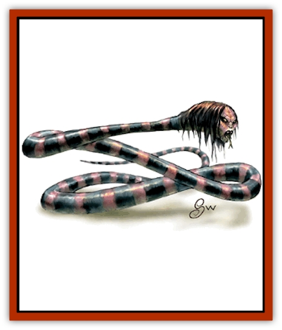

# Naga

| Statistic | **Guardian** | **Spirit** | **Water** |
| --- | --- | --- | --- |
| **Activity Cycle:** | Day | Night | Any |
| **Alignment:** | Lawful good | Chaotic evil | Neutral |
| **Armor Class:** | 3 | 4 | 5 |
| **Climate/Terrain:** | Any land | Subterranean | Freshwater |
| **Damage/Attack:** | 1-6/2-8 | 1-3 | 1-4 |
| **Diet:** | Omnivore | Carnivore | Omnivore |
| **Frequency:** | Very rare | Rare | Uncommon |
| **Hit Dice:** | 11-12 | 9-10 | 7-8 |
| **Intelligence:** | Exceptional (16) | High (13) | Very (11) |
| **Magic Resistance:** | Nil | Nil | Nil |
| **Morale:** | Champion (15) | Elite (14) | Steady (11) |
| **Movement:** | 15 | 12 | 9, Sw 18 |
| **No. Appearing:** | 1-2 | 1-3 | 1-4 |
| **No. of Attacks:** | 2 | 1 | 1 |
| **Organization:** | Solitary | Solitary | Solitary |
| **Size:** | H (20' long) | H (15' long) | L (10' long) |
| **Special Attacks:** | See below | See below | See below |
| **Special Defenses:** | Nil | Nil | Nil |
| **THAC0:** | 9 | 11 | 13 |
| **Treasure:** | X (H) | X (B,T) | X (D) |
| **XP Value:** | 7,000 | 5,000 | 3,000 |

Possessing high intelligence and magical abilities, naga are [[Snake|snake]]-like creatures with human heads. They prefer warmer climates and tend not to wander far from their lairs.

The cold-blooded naga have glittering scales and grow to an adult length of 10 to 20 feet. Their lidless eyes are bright and wide, almost luminescent, and their spines are armored with sharp triangular extensions that grow in a line from the napes of their necks to the tips of their tails. Wise and  patient, these creatures can stay still for hours but move swiftly when alarmed. They favor resting in a semi-aware state that conserves their energy and makes them very hard to surprise. Occasionally, naga fashion a pouch to carry items under their chins. Both land types have a distinctive smell that pervades their lair and nearby areas.

Naga can usually speak four or more languages.

**Combat:** Naga often set traps to snare trespassers. Magical spells are always attempted first, since naga have few melee skills. Once their magic is expended, naga rely on their poisonous bites - only the largest of these creatures can actually constrict victims like a giant snake.

**Habitat/Society:** Naga live solitary lives, hunting or foraging over an area usually only a quarter mile square. They favor dwelling in a deep hole, but sometimes are found curled up in ruins or in a darkened room. While the sexes are impossible to tell apart, there is a 10% chance that an encounter includes one or more mates. These matings are temporary, as a pregnant naga quickly leaves the male to hide her eggs in a secluded spot. Young naga resemble giant snakes until they reach adulthood; then their human-like head emerges after a long and painful molting.

**Ecology:** While naga do not produce trade goods, their lives span many human generations and they keep a detailed oral history, so they are good sources of information. They are often protectors of treasures or artifacts for centuries. Their hides can be fashioned into *scale mail +2*, and their eyes and teeth have been sold for use in arcane spells.

**Guardian Naga**

  Surrounded with a flowery sweet scent, the guardian naga is marked by green-gold scales, silvery spines, and flashing golden eyes. It is so called because its lawful good nature makes it a perfect sentinel over a like-aligned being's treasure or some evil. This naga always warns off trespassers, and often buries those defeated in battle. The guardian naga can spit poison at an individual attacker at up to 30-foot range, and the poison kills all who fail their saving throws vs. poison. In addition to a poisonous bite and constriction, these naga have the ability to use priest spells as 6th-level priests.

**Spirit Naga**

  These black-and-crimson-banded naga have a most human-like head, with stringy hair and deep brown eyes, and they smell of rotting flesh, which happens to be their preferred food! Hiding in deserted ruins or caverns, these evil and cunning spirit naga seek to cause harm to any creature that passes through their domains. They set traps and frequently attack without warning. While they are not big enough to constrict their prey, they have a poisonous bite, a gaze that charms (as a charm spell) all those who look into their eyes and fail a saving throw vs. paralyzation, and can use wizard spells at 5th-level ability and priest spells at 4th-level ability.

**Water Naga**

  The beautiful water naga are emerald green to turquoise in reticulated patterns with chocolate brown and pale jade green or dark grey and olive, and their spines have red spikes that raise like hackles when they are angry. Their eyes are pale green to amber. These naga are found in clear, fresh water. Curious but neutral in attitude, water naga seldom attack unless threatened. In addition to their poisonous bite that inflicts 1d4 points of damage, these naga have 5th-level wizard spell abilities. They never know spells that deal with fire.

---
## Discovery & Documentation

**Source Publication:** MC2 Volume II (1993)
**Campaign Setting:** Advanced Dungeons & Dragons 2nd Edition
**Author(s):** Jay Batista, Scott Bennie, Grant Boucher, William W. Connors, Steve Gilbert, Heike Kubasch, James Lowder, David Edward Martin, Bruce Nesmith, Jean Rabe, Rick Swan, John J. Terra, Gary L. Thomas

### Other Creatures Found in This Source Book
   * [[Ant|Ant]]
   * [[Ant_Lion_Giant|Ant Lion, Giant]]
   * [[Ape_Carnivorous|Ape, Carnivorous]]
   * [[Baboon|Baboon]]
   * [[Badger|Badger]]
   * [[Barracuda|Barracuda]]
   * [[Beetle_Giant|Beetle, Giant]]
   * [[Bulette|Bulette]]
   * [[Bullywug|Bullywug]]
   * [[Dwarf_Duergar|Dwarf, Duergar]]
   * [[Dwarf_Gully|Dwarf, Gully]]
   * [[Eagle|Eagle]]
   * [[Eel|Eel]]
   * [[Elemental_Air_Kin|Elemental, Air Kin]]
   * [[Elemental_Water_Kin|Elemental, Water Kin]]
   * [[Elemental_Water_Kin_Water_Weird|Elemental, Water Kin, Water Weird]]
   * [[Firestar|Firestar]]
   * [[Firetail|Firetail]]
   * [[Fish_Giant|Fish, Giant]]
   * [[Frog|Frog]]
   * [[Gorgon|Gorgon]]
   * [[Hawk|Hawk]]
   * [[Heucuva|Heucuva]]
   * [[Hippocampus|Hippocampus]]
   * [[Hippogriff|Hippogriff]]
   * [[Kelpie|Kelpie]]
   * [[Kenku|Kenku]]
   * [[Killmoulis|Killmoulis]]
   * [[Kuo-Toa|Kuo-Toa]]
   * [[Lamia|Lamia]]
   * [[Lammasu|Lammasu]]
   * [[Lamprey|Lamprey]]
   * [[Leech|Leech]]
   * [[Leprechaun|Leprechaun]]
   * [[Leucrotta|Leucrotta]]
   * [[Locathah|Locathah]]
   * [[Lycanthrope_Wereboar|Lycanthrope, Wereboar]]
   * [[Lycanthrope_Werefox|Lycanthrope, Werefox]]
   * [[Mammal_Minimal|Mammal, Minimal]]
   * [[Mammal_Small|Mammal, Small]]
   * [[Mimic|Mimic]]
   * [[Morkoth|Morkoth]]
   * [[Muckdweller|Muckdweller]]
   * [[Myconid|Myconid]]
   * [[Obliviax|Obliviax]]
   * [[Octopus_Giant|Octopus, Giant]]
   * [[Otyugh|Otyugh]]
   * [[Piranha|Piranha]]
   * [[Plant_Dangerous_I|Plant, Dangerous I]]
   * [[Plant_Intelligent|Plant, Intelligent]]
   * [[Poltergeist|Poltergeist]]
   * [[Porcupine|Porcupine]]
   * [[Rat_Osquip|Rat, Osquip]]
   * [[Roc|Roc]]
   * [[Roper|Roper]]
   * [[Rot_Grub|Rot Grub]]
   * [[Rust_Monster|Rust Monster]]
   * [[Sahuagin|Sahuagin]]
   * [[Sea_Lion|Sea Lion]]
   * [[Sea_Horse_Giant|Sea Horse, Giant]]
   * [[Shambling_Mound|Shambling Mound]]
   * [[Shark|Shark]]
   * [[Sphinx|Sphinx]]
   * [[Squid_Giant|Squid, Giant]]
   * [[Stirge|Stirge]]
   * [[Swanmay|Swanmay]]
   * [[Tarrasque|Tarrasque]]
   * [[Tasloi|Tasloi]]
   * [[Triton|Triton]]
   * [[Troglodyte|Troglodyte]]
   * [[Urchin|Urchin]]
   * [[Urd|Urd]]
   * [[Weasel|Weasel]]
   * [[Wolverine|Wolverine]]
   * [[Yellow_Musk_Creeper|Yellow Musk Creeper]]
