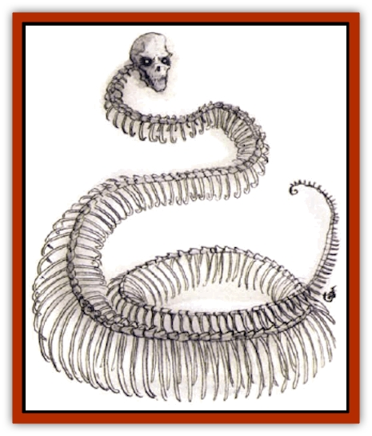

# Naga - Bone

| Statistic | **Naga, Bone** |
| --- | --- |
| **Activity Cycle:** | Any |
| **Alignment:** | Lawful evil |
| **Armor Class:** | 6 |
| **Climate/Terrain:** | Any land |
| **Damage/Attack:** | 1d4 plus special/3d4 |
| **Diet:** | None |
| **Frequency:** | Very rare |
| **Hit Dice:** | 7 |
| **Intelligence:** | Exceptional (15-16) |
| **Magic Resistance:** | Nil |
| **Morale:** | Fearless (19-20) |
| **Movement:** | 12 |
| **No. Appearing:** | 1 or 1d12 |
| **No. of Attacks:** | 2 |
| **Organization:** | Solitary or groups (guardians) |
| **Size:** | L (up to 12' long) |
| **Special Attacks:** | Spells |
| **Special Defenses:** | See below |
| **THAC0:** | 13 |
| **Treasure:** | Any (as guardian) |
| **XP Value:** | 4,000 |

Bone [[Naga|nagas]] are created undead. They appear as [[Golem_Necrophidius|skeletal worms with humanlike skull]]heads that appear larger than one would assume to be usual for their bodies. Their empty eye sockets glow with the hatred of fell unlife. Created by [[Naga_Dark|dark nagas]] and a few evil mages to serve as guardians, these spellcasting worms serve their master with absolute loyalty. Their creation is an exacting process, hence their rarity.

Bone nagas do not speak. They have limitsed (60-foot range) telepathy, with which they communicate with their creator. Though they can broadcast thoughts for others to receive, they cannot use this as any sort of attack, and most of the time they prefer to shield their thoughts from others, retreating behind a screen of mental chaos whenever they feel another mind.

**Combat:** In battle, bone nagas bite with their long fangs for 1d4 points of damage, plus the victim must successfully save vs. spell or suffer an additional 1d4 damage and lose 1 Strength point. (Creatures not rated for Strength suffer a -1 penalty to subsequent attack rolls.) Lost Strength returns at the rate of 1 point per hour. Bone nagas also sting with their powerful barbed tails, inflicting 2d4 points of physical damage plus 1d4 points of chilling damage (no save allowed).

In addition to their physical attacks, bone nagas can cast one spell per round. They work magic as a 6th-level wizard (4/2/2), but these spells are cast by silent force of will and do not require verbal, material, or somatic components. A bone naga's spells are set when it is created and cannot be changed, but whenever one is cast, it returns without study exactly 20 hours later. Bone nagas can't normally employ magical items, but one may be fitted (by another creature possessing the necessary limbs to do the work) with protective magical items that are worn.

Typically chosen spells are magic missile (x4), blindness, flaming sphere, and lightning bolt (x2).

Like most other undead, bone nagas are immune to *charm*, *death* (related), *hold* (and related), *sleep*, and cold-based spells. They are also immune to poison, but they suffer 2d4 points of corrosive damage per vial of holy water that strikes them. Acids and venoms do not harm bone nagas, and they are also immune to the effects of gases and other attacks that affect the respiratory system.

Bone nagas attack creatures with psionic powers whenever they recognize such ability, and they cannot be compelled by anyone except their creator(s) to cast spells. Attempts to do so psionically will result in temporary confusion on the part of the bone naga, coupled with great anger at the source of the mental assault.

**Habitat/Society:** Bone nagas are usually created by the nagara (evil nagakind, or dark nagas) to be guardians, especially of young nagas and nonmagical treasure. If their creators are destroyed or abandon them, their loyalty ends and they travel freely in the world. Such rare bone nagas may be found in ruins, subterranean areas, and deep woods, often surrounded by lesser undead they have gathered around them.

**Ecology:** Bone nagas eat nothing and fill no niche in any life cycle, save that they sometimes kill large, aggressive natural predators (including humankind) for sport or to practice with their spells. Some mages have found uses for their powers bones in magic involving telepathy. Bone-naga powder can also be used as a substitute for powdered iron (by wizards) or unholy water or smoldering dung (by priests) when making the circle for a *protection from good* spell (without altering the spell's casting or effects in any way).

---
## Discovery & Documentation

**Source Publication:** Monstrous Compendium, 1994 Annual, Volume 1 (1995)
**Campaign Setting:** Advanced Dungeons & Dragons 2nd Edition
**Author(s):** David Wise

### Other Creatures Found in This Source Book
   * [[Abyss_Ant|Abyss Ant]]
   * [[Achaierai|Achaierai]]
   * [[Afanc|Afanc]]
   * [[Al-Jahar|Al-Jahar]]
   * [[Baelnorn|Baelnorn]]
   * [[Baneguard|Baneguard]]
   * [[Banelar|Banelar]]
   * [[Bird_Talking|Bird, Talking]]
   * [[Blazing_Bones|Blazing Bones]]
   * [[Campestri|Campestri]]
   * [[Caniquine|Caniquine]]
   * [[Cat_Winged|Cat, Winged]]
   * [[Crypt_Servant|Crypt Servant]]
   * [[Death's_Head_Tree|Death's Head Tree]]
   * [[Dog_Saluqi|Dog, Saluqi]]
   * [[Dragon_Electrum|Dragon, Electrum]]
   * [[Dragon_Fang|Dragon, Fang]]
   * [[Dragon_Linnorm_Corpse_Tearer|Dragon, Linnorm, Corpse Tearer]]
   * [[Dragon_Linnorm_Dread|Dragon, Linnorm, Dread]]
   * [[Dragon_Linnorm_Flame|Dragon, Linnorm, Flame]]
   * [[Dragon_Linnorm_Forest|Dragon, Linnorm, Forest]]
   * [[Dragon_Linnorm_Frost|Dragon, Linnorm, Frost]]
   * [[Dragon_Linnorm_Gray|Dragon, Linnorm, Gray]]
   * [[Dragon_Linnorm_Land|Dragon, Linnorm, Land]]
   * [[Dragon_Linnorm_Midgard|Dragon, Linnorm, Midgard]]
   * [[Dragon_Linnorm_Rain|Dragon, Linnorm, Rain]]
   * [[Dragon_Linnorm_Sea|Dragon, Linnorm, Sea]]
   * [[Dragon_Neutral_Jacinth|Dragon, Neutral, Jacinth]]
   * [[Dragon_Neutral_Jade|Dragon, Neutral, Jade]]
   * [[Dragon_Neutral_Pearl|Dragon, Neutral, Pearl]]
   * [[Dread|Dread]]
   * [[Dragon-kin|Dragon-kin]]
   * [[Elemental_Earth_Kin_Chrysmal|Elemental, Earth Kin, Chrysmal]]
   * [[Elemental_Earth_Kin_Earth_Weird|Elemental, Earth Kin, Earth Weird]]
   * [[Elemental_Fire_Kin_Azer|Elemental, Fire Kin, Azer]]
   * [[Elemental_Sandman|Elemental, Sandman]]
   * [[Elemental_Wind_Walker|Elemental, Wind Walker]]
   * [[Elemental_Vermin|Elemental Vermin]]
   * [[Feystag|Feystag]]
   * [[Flame_Skull|Flame Skull]]
   * [[Foulwing|Foulwing]]
   * [[Gambado|Gambado]]
   * [[Garbug|Garbug]]
   * [[Genie_Tasked_Administrator|Genie, Tasked, Administrator]]
   * [[Genie_Tasked_Deceiver|Genie, Tasked, Deceiver]]
   * [[Genie_Tasked_Harim_Servant|Genie, Tasked, Harim Servant]]
   * [[Genie_Tasked_Messenger|Genie, Tasked, Messenger]]
   * [[Genie_Tasked_Miner|Genie, Tasked, Miner]]
   * [[Genie_Tasked_Oathbinder|Genie, Tasked, Oathbinder]]
   * [[Gibbering_Mouther|Gibbering Mouther]]
   * [[Gnasher|Gnasher]]
   * [[Gnasher_Winged|Gnasher, Winged]]
   * [[Golem_Brain|Golem, Brain]]
   * [[Golem_Hammer|Golem, Hammer]]
   * [[Golem_Metagolem|Golem, Metagolem]]
   * [[Golem_Spiderstone|Golem, Spiderstone]]
   * [[Gorynych|Gorynych]]
   * [[Greelox|Greelox]]
   * [[Helmed_Horror|Helmed Horror]]
   * [[Jarbo|Jarbo]]
   * [[Laraken|Laraken]]
   * [[Lich_Psionic|Lich, Psionic]]
   * [[Living_Steel|Living Steel]]
   * [[Lock_Lurker|Lock Lurker]]
   * [[Loxo|Loxo]]
   * [[Lycanthrope_Loup_de_Noir|Lycanthrope, Loup de Noir]]
   * [[Lycanthrope_Werebadger|Lycanthrope, Werebadger]]
   * [[Lycanthrope_Werejaguar|Lycanthrope, Werejaguar]]
   * [[Lythlyx|Lythlyx]]
   * [[Magebane|Magebane]]
   * [[Marrashi|Marrashi]]
   * [[Metalmaster|Metalmaster]]
   * [[Mimic_House_Hunter|Mimic, House Hunter]]
   * [[Nautilus_Giant|Nautilus, Giant]]
   * [[Nightshade_Toril|Nightshade (Toril)]]
   * [[Nishruu|Nishruu]]
   * [[Noran|Noran]]
   * [[Opinicus|Opinicus]]
   * [[Ormyrr|Ormyrr]]
   * [[Parasite|Parasite]]
   * [[Pasari-Niml|Pasari-Niml]]
   * [[Plant_Vampire_Moss|Plant, Vampire Moss]]
   * [[Pteraman|Pteraman]]
   * [[Rautym|Rautym]]
   * [[Shadeling|Shadeling]]
   * [[Skum|Skum]]
   * [[Snake_Giant_Cobra|Snake, Giant Cobra]]
   * [[Snake_Stone|Snake, Stone]]
   * [[Spectral_Wizard|Spectral Wizard]]
   * [[Spell_Weaver|Spell Weaver]]
   * [[Spider_Brain|Spider, Brain]]
   * [[Suwyze|Suwyze]]
   * [[Tatalla|Tatalla]]
   * [[Tick_Heart|Tick, Heart]]
   * [[Tree_Dark|Tree, Dark]]
   * [[Tree_Singing|Tree, Singing]]
   * [[Tressym|Tressym]]
   * [[Troll_Snow|Troll, Snow]]
   * [[Tuyewera|Tuyewera]]
   * [[Ulitharid|Ulitharid]]
   * [[Undead_Dwarf|Undead Dwarf]]
   * [[Undead_Lake_Monster|Undead Lake Monster]]
   * [[Whipsting|Whipsting]]
   * [[Windghost|Windghost]]
   * [[Wolf_Dread|Wolf, Dread]]
   * [[Wolf_Stone|Wolf, Stone]]
   * [[Wolf_Vampiric|Wolf, Vampiric]]
   * [[Wraith_Shimmering|Wraith, Shimmering]]
   * [[Xantravar|Xantravar]]
   * [[Xaver|Xaver]]
