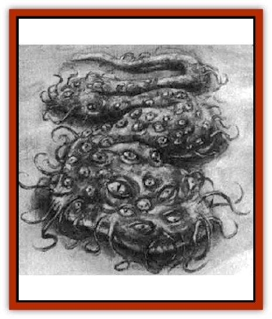
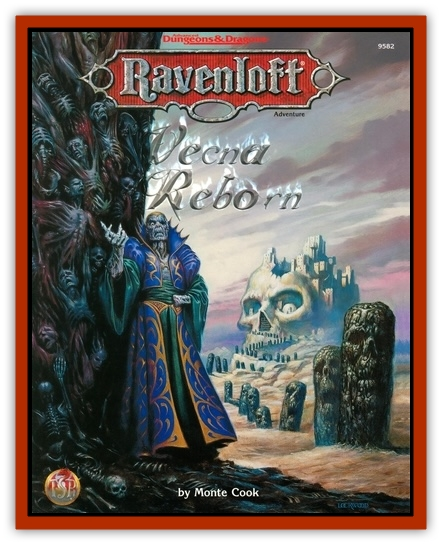

# Narek

| Statistic | **Narek** |
| --- | --- |
| **Activity Cycle:** | Any |
| **Alignment:** | Neutral evil |
| **Armor Class:** | 6 |
| **Climate/Terrain:** | The Library of Kas (Tovag) |
| **Damage/Attack:** | 1d6 each |
| **Diet:** | None |
| **Frequency:** | Unique |
| **Hit Dice:** | 14 (94 hp) |
| **Intelligence:** | High (14) |
| **Magic Resistance:** | Nil |
| **Morale:** | Elite (13) |
| **Movement:** | 6 |
| **No. Appearing:** | 1 |
| **No. of Attacks:** | 2d6 |
| **Organization:** | Solitary |
| **Size:** | G (25' across) |
| **Special Attacks:** | onstriction |
| **Special Defenses:** | Immune to fire and some spells |
| **THAC0:** | 7 |
| **Treasure:** | Nil |
| **XP Value:** | 9,000 |

Alas, poor Narek! One of the many bastard children of Kas the Destroyer, he - it - now resides forever in a prison forged of betrayal and jealousy. Kas the Bloody, Kas the Wicked, Kas the Warlord sired a son and called him Narek. Narek had great talents for the sorcerous arts. Even Kas's master was impressed with the youth. Narek was too young to have learned never to outshine Kas in his master's eyes. Kas imprisoned the young man in a tomb, trapping him there for all eternity with his magical books.

Narek, filled with not quite enough skill and a little too much confidence, attempted a spell that was beyond him. Its energies transformed him into an unspeakable monstrosity. Now Narek is nothing more than the Thing in the Shaft. Nameless, soulless, loveless, the son of Kas seeks nothing but the pain and suffering of others.

**Combat:** The Thing in the Shaft is a horrible slimy mass with hundreds of tendrils. It attacks with 2d6 of these tendrils each round, which grasp and lunge for any and all victims. The Thing can attack up to four different targets in a round, and the tendrils can stretch to strike at targets up to forty feet away.

If a foe is hit with four or more tendrils in the same round, the ropy appendages grasp and snare the victim, who is now immobilized. Characters so grasped suffer 2d6 hp of constriction damage. The Thing draws grappled victims in close to it at a rate of ten feet per round. It does not eat its prey, however (since it does not even have a mouth) but merely continues to squeeze the drawn-in victim into its mass until it is dead. Slain foes are haphazardly tossed aside. To break free, the tendrils holding the victim must be severed (each can sustain 4 hp of damage) or the victim must make a successful Strength check for each constricting appendage.

Due to the slime and ooze that covers the Thing, it cannot burn and is thus immune to fire. No *charm* spells or magic of a controlling or form-altering nature (such as *polymorph* spells) can affect it.

**Habitat/Society:** The Thing in the Shaft dwells alone in its prison. If freed, the creature would begin a silent reign of terror and madness as it lurked in dark places large enough to accommodate it (dark alleyways, wide wells, cellars, and so forth), striking out at anyone who would dare to come near.

**Ecology:** If a sage learned in the ways of monstrous biology ever got the chance to examine the Thing, it is likely that he might suggest that it possesses many characteristics similar to the monster known as the [[Roper|roper]]. Perhaps this has something to do with the spell Narek attempted and failed so long ago.

The Thing needs no nourishment, sustained merely by its own hatred and chagrin. It attacks others out of cruelty and rage, not hunger or need.

---
## Discovery & Documentation

**Source Publication:** Vecna Reborn (1998)
**Campaign Setting:** Ravenloft
**Author(s):** Monte Cook
