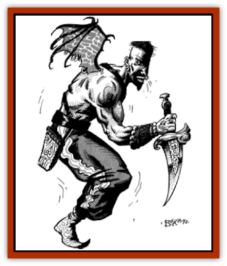

# Nasnas

| Statistic | **Nasnas** |
| --- | --- |
| **Activity Cycle:** | Any |
| **Alignment:** | Lawful Evil |
| **Armor Class:** | 6 |
| **Climate/Terrain:** | Isolated strongholds and ruins |
| **Damage/Attack:** | By weapon type +5 |
| **Diet:** | Omnivore |
| **Frequency:** | Uncommon |
| **Hit Dice:** | 2+2 |
| **Intelligence:** | Low (7) |
| **Magic Resistance:** | Nil |
| **Morale:** | Steady (12) |
| **Movement:** | 9 |
| **No. Appearing:** | 3-30 |
| **No. of Attacks:** | 1 |
| **Organization:** | Tribal |
| **Size:** | M |
| **Special Attacks:** | Fear |
| **Special Defenses:** | Iron or magic weapons to hit |
| **THAC0:** | 17 (19) |
| **Treasure:** | M (Q,D) |
| **XP Value:** | 270 |

Nasnas are humanoid with only half a body: one arm, one leg, half a face and half a torso. They are the creation of evil priests and wizards desiring vigilant guardians to secure their strongholds.

Nasnas look like normal human fighters, except that the right or left half of their body is missing. Their skin has a grayish tinge to it, and their single eye glints with evil insanity. They move about by hopping on their single leg. Although this may appear awkward, they can achieve a reasonable movement rate (9). They are tireless warriors, needing very little food and sleep to survive. They are loyal to the wizard or priest who created them and follow their creators to the death.

A few variants have been encountered with a small, black, bat-like wing protruding from their single shoulder. This wing merely contributes to their fearsome appearance (and perhaps their balance as well). Even with a wing, these nasnas are incapable of flight.

Although nasnas can understand Midani perfectly, they never speak themselves, since they are missing half their vocal cords. Nasnas are only capable of uttering a strange, high-pitched, hooting noise, which can be terrifying to hear. Depending on the volume and tone of the hooting, one can discern the nasnas's current emotipnal state.

**Combat:** Nasnas usually wear armor, which reduces their AC to 6, and rely on weapons for their attacks. Most nasnas (75%) wield scimitars, but some have been known to fight using battle axes (15%) or maces (10%) instead. All nasnas have extraordinary Strength in their single arm (18/95), giving them a bonus of +2 on their attack rolls and +5 bonus on damage.

In combat, their hoots and screams can cause a chilling fear in all opponents within a 10' radius. Those hearing a nasnas's hooting screams must save vs. spells or stand paralyzed with fear for 2-5 rounds.

Because of their supernatural origins, nasnas can only be hit with iron or magical weapons.

**Habitat/Society:** Nasnas are vicious guardians and are typically found in the strongholds of evil priests and wizards or near ruins. Nasnas are the product of depraved magic. First, a special potion is required, which can only be made by an evil wizard or priest of 9th level or higher. The concoction is relatively easy and cheap to make once the formula has been researched. A drop of the wizard's or priest's blood poured into the magical brew creates a magical bond between the spell-caster and the nasnas after it is born. A few shady alchemists have been known to make the potion if offered the right price (the buyer must still supply his own blood).

After the potion has been concocted, it must be injected into a succulent fruit, which is then sliced in half. If the spell-caster can somehow convince a woman to eat one of the halves (methods range from conventional trickery to magical coercion), the woman will conceive and in nine months give birth to a nasnas. The mage usually arrives soon afterward to claim his creation.

One nasna can thus be created from each half of an enchanted fruit. However, a woman can only bear one nasna at a time. Evil spell-casters, intent upon creating an army of nasnas, usually have 10-100 innocent women languishing in their strongholds.

However, the depravity of creating nasnas en masse does not usually go unnoticed for long. Women talk, word gets around, people make visits to the ruling caliph, and pretty soon paladins are dispatched to put an end to this evil. As a result, nasnas are most often used as guardians in remote, isolated strongholds.

**Ecology:** Nasnas are sterile. They mature quickly and live a relatively short life. The twisted magic used in their creation renders them quite insane for the duration of their lives, although, in the interim, they are quite obedient servants. Most find a way to kill themselves before they reach the age of 30.

Nasnas have little or no role in the world's ecology, living only to protect and serve their creator. If their creator should ever die, they lose their reason for existence. In such a situation, over half choose suicide, throwing themselves off the nearest cliff or drowning themselves in the closest ocean. The rest wander about the wilderness, supporting themselves by hunting and scavenging for the remainder of their short, tragic lives.

---
## Discovery & Documentation

**Source Publication:** MC13 Al-Qadim Appendix (1992)
**Campaign Setting:** Al-Qadim (Forgotten Realms)
**Author(s):** C. Terry Phillips

### Other Creatures Found in This Source Book
   * [[Ammut|Ammut]]
   * [[Ashira|Ashira]]
   * [[Asuras|Asuras]]
   * [[Black_Cloud_of_Vengeance|Black Cloud of Vengeance]]
   * [[Buraq|Buraq]]
   * [[Camel|Camel]]
   * [[Camel_of_the_Pearl|Camel of the Pearl]]
   * [[Centaur_Desert|Centaur, Desert]]
   * [[Copper_Automaton|Copper Automaton]]
   * [[Debbi|Debbi]]
   * [[Elephant_Bird|Elephant Bird]]
   * [[Gen|Gen]]
   * [[Genie_Noble_Dao|Genie, Noble Dao]]
   * [[Genie_Noble_Djinni|Genie, Noble Djinni]]
   * [[Genie_Noble_Efreeti|Genie, Noble Efreeti]]
   * [[Genie_Noble_Marid|Genie, Noble Marid]]
   * [[Genie_Tasked_Architect_Builder|Genie, Tasked, Architect/Builder]]
   * [[Genie_Tasked_Artist|Genie, Tasked, Artist]]
   * [[Genie_Tasked_Guardian|Genie, Tasked, Guardian]]
   * [[Genie_Tasked_Herdsman|Genie, Tasked, Herdsman]]
   * [[Genie_Tasked_Slayer|Genie, Tasked, Slayer]]
   * [[Genie_Tasked_Warmonger|Genie, Tasked, Warmonger]]
   * [[Genie_Tasked_Winemaker|Genie, Tasked, Winemaker]]
   * [[Ghost_Mount|Ghost Mount]]
   * [[Ghul|Ghul]]
   * [[Giant_Desert|Giant, Desert]]
   * [[Giant_Jungle|Giant, Jungle]]
   * [[Giant_Reef|Giant, Reef]]
   * [[Giant_Zakhara_General_Information|Giant (Zakhara), General Information]]
   * [[Hama|Hama]]
   * [[Heway|Heway]]
   * [[Living_Idol|Living Idol]]
   * [[Lycanthrope_Werehyena|Lycanthrope, Werehyena]]
   * [[Lycanthrope_Werelion|Lycanthrope, Werelion]]
   * [[Markeen|Markeen]]
   * [[Maskhi|Maskhi]]
   * [[Mason_Wasp_Giant|Mason Wasp, Giant]]
   * [[Pahari|Pahari]]
   * [[Rom|Rom]]
   * [[Sabu_Lord|Sabu Lord]]
   * [[Sakina|Sakina]]
   * [[Serpent_Lord|Serpent Lord]]
   * [[Serpent_Winged|Serpent, Winged]]
   * [[Silat|Silat]]
   * [[Simurgh|Simurgh]]
   * [[Stone_Maiden|Stone Maiden]]
   * [[Vishap|Vishap]]
   * [[Zaratan|Zaratan]]
   * [[Zin|Zin]]
