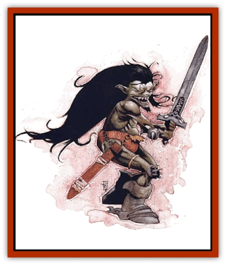

# Nathri

| Statistic | **Nathri** |
| --- | --- |
| **Activity Cycle:** | Any |
| **Alignment:** | Chaotic neutral |
| **Armor Class:** | 6 |
| **Climate/Terrain:** | Ethereal Plane |
| **Damage/Attack:** | 1d4 or by weapon |
| **Diet:** | Omnivore |
| **Frequency:** | Uncommon |
| **Hit Dice:** | 1+1 |
| **Intelligence:** | Low to high (7-13) |
| **Magic Resistance:** | Nil |
| **Morale:** | Steady (11-12) |
| **Movement:** | 18 |
| **No. Appearing:** | 2d20 (rarely, 2d100) |
| **No. of Attacks:** | 1 |
| **Organization:** | Clan |
| **Size:** | S (4' tall) |
| **Special Attacks:** | Poison |
| **Special Defenses:** | +1 to saves vs. charm |
| **THAC0:** | 19 |
| **Treasure:** | K |
| **XP Value:** | 120 |

The nathri are 4-foot-tall humanoids with dark greenish skin and long, unruly black hair. Fierce and wild, they nevertheless wear clothes and use weapons, so they're not totally barbaric. They normally speak only their own language, but the most intelligent nathri have learned to speak planar common as well.

**Combat:** Nathri attack in swarms. They're aware that they don't amount to much alone, but their great numbers make them formidable indeed. They strike at opponents with a small but sharp barb on the backs of their right hands; the barbs inflict 1d4 points of damage and require the targeted sods to make saving throws versus poison. If they fail, the victims fall prey to the mild venom coating the barb. This poison makes them dizzy and disoriented, imposing a -1 penalty to attack rolls, ability checks, and saving throws for 2d10 rounds. Subsequent barb attacks and failed saving throws can extend the duration, but not the overall effect (the penalty is not cumulative).

Despite this natural attack ability, many nathri adopt the use of weapons. These are scavenged from other cultures, and therefore vary greatly. Nathri never use weapons longer than 5 feet long, however, so (for example) a basher won't find one wielding a polearm.

Nathri are divided into essentially two types: warriors and rogues. Non-nathri can't tell the difference between the two, but nathri warriors gain a +1 to attack and damage rolls when using weapons, while rogues have the abilities of 4th level thieves. Neither sort ever wears armor.

Should they ever happen to leave the Misty Shore, nathri can see into the Ethereal Plane from its adjoining planes and the demiplanes. Additionally, these fiercely independent creatures gain a +1 to saving throws versus *charm* and similar spells.

**Habitat/Society:** Nathri clans are groups linked by familial ties (although some are very distant). These bashers roam the Deep Ethereal like nomads, slipping in and out of the demiplanes by means of paths only they know. They wander through these tiny worlds scavenging food, weapons, and anything else the might need.

Demiplanes with intelligent inhabitants are their favored targets. Typically, a few rogues first infiltrate an area about to be raided, scouting out the place and determining what can be taken. Rich or poorly defended areas are hit again and again by nathri raids. If the demiplane has no civilizations, the nathri take whatever they can use or eat and move on, probably not returning again.

These bloods know the dark of the demiplanes. The nathri know where most of the demiplanes lie, and what can be found within them. However, this isn't a secret that they'll part with easily. They know the chant, but they're not willing to lann just anybody without good reason.

Negotiating with the nathri can be difficult. They would rather take things than trade for them, so offering gifts or services in exchange for information about a certain demiplane usually fails - and often provokes an attack, as the nathri attempt to seize the proffered gifts. Only nathri clans in dire need (those that are particularly hungry, beleaguered by a powerful foe, or in some other desperate circumstance) stoop to barter.

Each clan has a single leader, no matter how big or small the group. This leader, called a targai, is a 3-Hit Dice nathri who often wields a magical weapon or other item that the clan has procured. Small clans (consisting of 20-30 members) are more common than the larger clans (which sometimes have well over 100 members). Not surprisingly, the lager the clan, the more power and prestige the targai possesses.

**Ecology:** These tiny humanoids can eat virtually anything organic. This makes their scavenger lifestyle easier. However, they prefer more sophisticated foodstuffs, so nathri often steal their food from the intelligent inhabitants of various demiplanes.

Within the demiplanes, the nathri are despised as thieves, scavengers, and vermin. On the Ethereal Plane, they serve as the lower end or the food chain for large predators like [[Magran|magran]] or [[Xill|xill]]. Nathri spend most of their time in the very deep Ethereal, supposedly deeper than most creatures go. Their trips to the demiplanes or even the other inhabited portions of the Ethereal Plane are brief. "Get in, take what you need, and get out" is the nathri way.

---
## Discovery & Documentation

**Source Publication:** Planescape III (1996)
**Campaign Setting:** Planescape
**Author(s):** Monte Cook

### Other Creatures Found in This Source Book
   * [[Animental|Animental]]
   * [[Archomental_Evil|Archomental, Evil]]
   * [[Archomental_Good|Archomental, Good]]
   * [[Belker|Belker]]
   * [[Bzastra|Bzastra]]
   * [[Chososion|Chososion]]
   * [[Darklight|Darklight]]
   * [[Devete|Devete]]
   * [[Devourer_Planescape|Devourer (Planescape)]]
   * [[Dharum_Suhn|Dharum Suhn]]
   * [[Egarus|Egarus]]
   * [[Elemental_Athas_Lesser_Air_Earth|Elemental (Athas), Lesser, Air/Earth]]
   * [[Elemental_Athas_Lesser_Fire_Water|Elemental (Athas), Lesser, Fire/Water]]
   * [[Elemental_Fire_Kin_Salamander_II|Elemental, Fire Kin, Salamander II]]
   * [[Entrope|Entrope]]
   * [[Facet|Facet]]
   * [[Frost_Salamander|Frost Salamander]]
   * [[Fundamental_Air_Earth|Fundamental, Air/Earth]]
   * [[Fundamental_Fire_Water|Fundamental, Fire/Water]]
   * [[Fundamental_All_Elements|Fundamental, All Elements]]
   * [[Garmorm|Garmorm]]
   * [[Homunculus_Elemental|Homunculus, Elemental]]
   * [[Immoth|Immoth]]
   * [[Khargra|Khargra]]
   * [[Klyndes|Klyndes]]
   * [[Magran|Magran]]
   * [[Menglis|Menglis]]
   * [[Ooze_Sprite|Ooze Sprite]]
   * [[Paraelemental|Paraelemental]]
   * [[Phirblas|Phirblas]]
   * [[Psurlon|Psurlon]]
   * [[Quasielemental_Negative|Quasielemental, Negative]]
   * [[Quasielemental_Positive|Quasielemental, Positive]]
   * [[Rast|Rast]]
   * [[Ravid|Ravid]]
   * [[Ruvoka|Ruvoka]]
   * [[Scile|Scile]]
   * [[Shad|Shad]]
   * [[Shocker|Shocker]]
   * [[Sislan|Sislan]]
   * [[Suisseen|Suisseen]]
   * [[Terithran|Terithran]]
   * [[Thoqqua|Thoqqua]]
   * [[Trilloch|Trilloch]]
   * [[Tsnng|Tsnng]]
   * [[Ungulosin|Ungulosin]]
   * [[Vacuous|Vacuous]]
   * [[Wavefire|Wavefire]]
   * [[Xag-Ya_Xeg-Yi|Xag-Ya/Xeg-Yi]]
   * [[Xill|Xill]]
