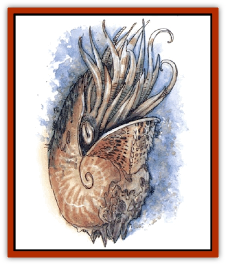

# Nautilus - Giant

| Statistic | **Nautilus, Giant** |
| --- | --- |
| **Activity Cycle:** | Any |
| **Alignment:** | Neutral |
| **Armor Class:** | -3 (shell) or 3 (body) |
| **Climate/Terrain:** | Any sea |
| **Damage/Attack:** | 1d8 (&times;20)/5d4 |
| **Diet:** | Carnivore |
| **Frequency:** | Very rare |
| **Hit Dice:** | 14 |
| **Intelligence:** | Genius (17-18) |
| **Magic Resistance:** | 20% |
| **Morale:** | Champion (15-16) |
| **Movement:** | Sw 18 |
| **No. Appearing:** | 1 |
| **No. of Attacks:** | 21 |
| **Organization:** | Solitary |
| **Size:** | G (50'+ diameter) |
| **Special Attacks:** | See below |
| **Special Defenses:** | See below |
| **THAC0:** | 7 |
| **Treasure:** | Nil |
| **XP Value:** | 15,000 |

The giant nautilus is a native of the Elemental Plane of Water. It has also been encountered on Thalasia, a layer of Elysium; the ocean Lunia, on the first layer of Mount Celestia; and on Arborea, in the depths of Poseidon's realm. On the Prime Material Plane it wanders the depths of the deepest oceans.

In appearance the giant nautilus seems to be but a gigantic version of its diminutive cousin. The creature is often called the "druid of the deep" because of its neutral alignment and insistence upon maintaining balance in the underwater world. The giant nautilus considers a sunken ship a terrible eyesore and actively helps in its removal, usually by protecting those removing the ship from the fearsome predators of the depths. The creature is uninterested in treasure of any kind, but it is not completely naive; it has a basic understanding of avarice and greed. Therefore, the nautilus demands that sunken vessels carrying more mundane cargo be removed before it allows the removal of a sunken treasure ship. It also demands the removal of the entire ship, not just the cargo.

The giant nautilus has a form of telepathy that allows it to communicate with any intelligent creature, regardless of language barriers.

**Combat:** Twenty strong tentacles encircle the creature's mouth. It can grab and constrict opponents with these tentacles while bringing the unfortunate victims into its huge mouth. The mouth is large enough to swallow a man-sized creature whole on a natural attack roll of 18 or better. The mouth can also bite for 5d4 points of damage.

Depending on the attacker's size, the nautilus can bring all 20 tentacles to bear on a single opponent or it may elect to attack 20 separate targets. It generally uses three tentacles per man-sized target. Any character constricted by a tentacle may have one arm (01-50%), neither arm (51-75%), or both arms (76-100%) pinned down. A constricted character cannot cast any spells, but can strike the constricting tentacle with a -3 attack penalty (one arm free) or a -1 penalty (both arms free). Each rubbery tentacle cannot be broken by force and requires 15 points of damage from a sharp or edged weapon before severing. (Severed tentaclee regenerate in about one week.)

The nautilus can drag a small ship below the water and can stop the movement of a larger one after one turn of winding its tentacles around the ship and dragging. If six or more tentacles squeeze a hull for three consecutive rounds, the vessel suffers damage as if it had been rammed and begins to sink.

This creature uses the following spell-like powers, one per round, at will: *charm person or mammal*; *conjure water elemental* (3 times per day); *control temperature 10' radius*; *detect evil/good*; *detect magic*; *know alignment* (always active); *locate fish or plants*; *lower water*; *monster summoning I, II, and III*; *part water*; *wall of coral (stone)*.

**Habitat/Society:** The giant nautilus is a solitary wanderer of the depths and maintains no lair. It has a natural life span of 3,000-4,000 years. Sages speculate the creature uses magic to return at times to the plane of Water, to reproduce.

The nautilus is on good terms with most of the underwater races, including the [[Sahuagin|sahuagin]] and [[Ixitxachitl|ixitxachitl]]. In fact, the giant nautilus is often used by the [[Triton|tritons]], [[Merman|mermen]], and [[Locathah|locathah]] as an impartial judge to mediate disputes. For all its peaceful intent, the giant nautilus puts a stop to anyone overfilling a particular location or polluting the sea, first through negotiation, then by warning, and finally through force.

**Ecology:** The giant nautilus preys on huge crustacea such as [[Crustacean_Giant|giant crabs]] and lobsters. It has no natural enemies, but is sometimes in conflict with the [[Squid_Giant|kraken]]. The shell of the giant nautilus is a great prize. It can be converted into a roomy, virtually crush-proof submarine.

---
## Discovery & Documentation

**Source Publication:** Monstrous Compendium, 1994 Annual, Volume 1 (1995)
**Campaign Setting:** Advanced Dungeons & Dragons 2nd Edition
**Author(s):** David Wise

### Other Creatures Found in This Source Book
   * [[Abyss_Ant|Abyss Ant]]
   * [[Achaierai|Achaierai]]
   * [[Afanc|Afanc]]
   * [[Al-Jahar|Al-Jahar]]
   * [[Baelnorn|Baelnorn]]
   * [[Baneguard|Baneguard]]
   * [[Banelar|Banelar]]
   * [[Bird_Talking|Bird, Talking]]
   * [[Blazing_Bones|Blazing Bones]]
   * [[Campestri|Campestri]]
   * [[Caniquine|Caniquine]]
   * [[Cat_Winged|Cat, Winged]]
   * [[Crypt_Servant|Crypt Servant]]
   * [[Death's_Head_Tree|Death's Head Tree]]
   * [[Dog_Saluqi|Dog, Saluqi]]
   * [[Dragon_Electrum|Dragon, Electrum]]
   * [[Dragon_Fang|Dragon, Fang]]
   * [[Dragon_Linnorm_Corpse_Tearer|Dragon, Linnorm, Corpse Tearer]]
   * [[Dragon_Linnorm_Dread|Dragon, Linnorm, Dread]]
   * [[Dragon_Linnorm_Flame|Dragon, Linnorm, Flame]]
   * [[Dragon_Linnorm_Forest|Dragon, Linnorm, Forest]]
   * [[Dragon_Linnorm_Frost|Dragon, Linnorm, Frost]]
   * [[Dragon_Linnorm_Gray|Dragon, Linnorm, Gray]]
   * [[Dragon_Linnorm_Land|Dragon, Linnorm, Land]]
   * [[Dragon_Linnorm_Midgard|Dragon, Linnorm, Midgard]]
   * [[Dragon_Linnorm_Rain|Dragon, Linnorm, Rain]]
   * [[Dragon_Linnorm_Sea|Dragon, Linnorm, Sea]]
   * [[Dragon_Neutral_Jacinth|Dragon, Neutral, Jacinth]]
   * [[Dragon_Neutral_Jade|Dragon, Neutral, Jade]]
   * [[Dragon_Neutral_Pearl|Dragon, Neutral, Pearl]]
   * [[Dread|Dread]]
   * [[Dragon-kin|Dragon-kin]]
   * [[Elemental_Earth_Kin_Chrysmal|Elemental, Earth Kin, Chrysmal]]
   * [[Elemental_Earth_Kin_Earth_Weird|Elemental, Earth Kin, Earth Weird]]
   * [[Elemental_Fire_Kin_Azer|Elemental, Fire Kin, Azer]]
   * [[Elemental_Sandman|Elemental, Sandman]]
   * [[Elemental_Wind_Walker|Elemental, Wind Walker]]
   * [[Elemental_Vermin|Elemental Vermin]]
   * [[Feystag|Feystag]]
   * [[Flame_Skull|Flame Skull]]
   * [[Foulwing|Foulwing]]
   * [[Gambado|Gambado]]
   * [[Garbug|Garbug]]
   * [[Genie_Tasked_Administrator|Genie, Tasked, Administrator]]
   * [[Genie_Tasked_Deceiver|Genie, Tasked, Deceiver]]
   * [[Genie_Tasked_Harim_Servant|Genie, Tasked, Harim Servant]]
   * [[Genie_Tasked_Messenger|Genie, Tasked, Messenger]]
   * [[Genie_Tasked_Miner|Genie, Tasked, Miner]]
   * [[Genie_Tasked_Oathbinder|Genie, Tasked, Oathbinder]]
   * [[Gibbering_Mouther|Gibbering Mouther]]
   * [[Gnasher|Gnasher]]
   * [[Gnasher_Winged|Gnasher, Winged]]
   * [[Golem_Brain|Golem, Brain]]
   * [[Golem_Hammer|Golem, Hammer]]
   * [[Golem_Metagolem|Golem, Metagolem]]
   * [[Golem_Spiderstone|Golem, Spiderstone]]
   * [[Gorynych|Gorynych]]
   * [[Greelox|Greelox]]
   * [[Helmed_Horror|Helmed Horror]]
   * [[Jarbo|Jarbo]]
   * [[Laraken|Laraken]]
   * [[Lich_Psionic|Lich, Psionic]]
   * [[Living_Steel|Living Steel]]
   * [[Lock_Lurker|Lock Lurker]]
   * [[Loxo|Loxo]]
   * [[Lycanthrope_Loup_de_Noir|Lycanthrope, Loup de Noir]]
   * [[Lycanthrope_Werebadger|Lycanthrope, Werebadger]]
   * [[Lycanthrope_Werejaguar|Lycanthrope, Werejaguar]]
   * [[Lythlyx|Lythlyx]]
   * [[Magebane|Magebane]]
   * [[Marrashi|Marrashi]]
   * [[Metalmaster|Metalmaster]]
   * [[Mimic_House_Hunter|Mimic, House Hunter]]
   * [[Naga_Bone|Naga, Bone]]
   * [[Nightshade_Toril|Nightshade (Toril)]]
   * [[Nishruu|Nishruu]]
   * [[Noran|Noran]]
   * [[Opinicus|Opinicus]]
   * [[Ormyrr|Ormyrr]]
   * [[Parasite|Parasite]]
   * [[Pasari-Niml|Pasari-Niml]]
   * [[Plant_Vampire_Moss|Plant, Vampire Moss]]
   * [[Pteraman|Pteraman]]
   * [[Rautym|Rautym]]
   * [[Shadeling|Shadeling]]
   * [[Skum|Skum]]
   * [[Snake_Giant_Cobra|Snake, Giant Cobra]]
   * [[Snake_Stone|Snake, Stone]]
   * [[Spectral_Wizard|Spectral Wizard]]
   * [[Spell_Weaver|Spell Weaver]]
   * [[Spider_Brain|Spider, Brain]]
   * [[Suwyze|Suwyze]]
   * [[Tatalla|Tatalla]]
   * [[Tick_Heart|Tick, Heart]]
   * [[Tree_Dark|Tree, Dark]]
   * [[Tree_Singing|Tree, Singing]]
   * [[Tressym|Tressym]]
   * [[Troll_Snow|Troll, Snow]]
   * [[Tuyewera|Tuyewera]]
   * [[Ulitharid|Ulitharid]]
   * [[Undead_Dwarf|Undead Dwarf]]
   * [[Undead_Lake_Monster|Undead Lake Monster]]
   * [[Whipsting|Whipsting]]
   * [[Windghost|Windghost]]
   * [[Wolf_Dread|Wolf, Dread]]
   * [[Wolf_Stone|Wolf, Stone]]
   * [[Wolf_Vampiric|Wolf, Vampiric]]
   * [[Wraith_Shimmering|Wraith, Shimmering]]
   * [[Xantravar|Xantravar]]
   * [[Xaver|Xaver]]
