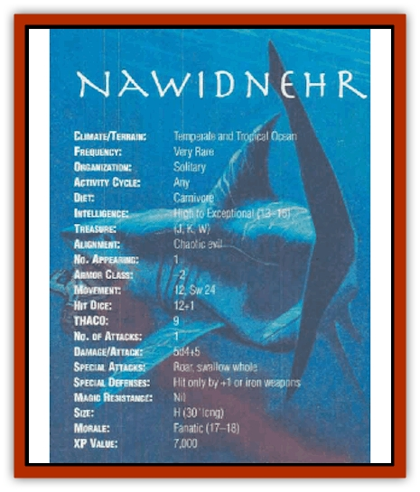
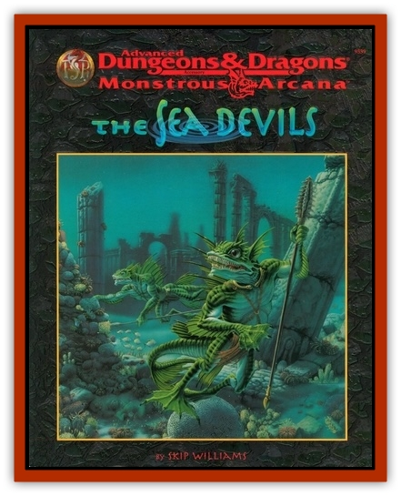

# Nawidnehr

| Statistic | **Nawidnehr** |
| --- | --- |
| **Activity Cycle:** | Any |
| **Alignment:** | Chaotic evil |
| **Armor Class:** | -2 |
| **Climate/Terrain:** | Temperate and Tropical Ocean |
| **Damage/Attack:** | 5d4+5 |
| **Diet:** | Carnivore |
| **Frequency:** | Very rare |
| **Hit Dice:** | 12+1 |
| **Intelligence:** | High to Exceptional (13-16) |
| **Magic Resistance:** | Nil |
| **Morale:** | Fanatic (17-18) |
| **Movement:** | 12, Sw 24 |
| **No. Appearing:** | 1 |
| **No. of Attacks:** | 1 |
| **Organization:** | Solitary |
| **Size:** | H (30' long) |
| **Special Attacks:** | Roar, swallow whole |
| **Special Defenses:** | Hit only by +1 or iron weapons |
| **THAC0:** | 9 |
| **Treasure:** | (J,K,W) |
| **XP Value:** | 7,000 |

The nawidnehr (NAH-widd-near) is a great [[Shark|shark]] capable of assuming humanoid form. This powerful marine predator has an insatiable desire to kill. Also called the roaring shark, or sharkwere, the nawidnehr uses its shape-shifting abilities to pursue its prey onto land or insinuate itself into an unsuspecting party for a surprise attack.

In their natural forms, nawidnehrs resemble great white sharks. Nawidnehrs, however, boast much more complex coloration. Specimens dwelling in cooler waters tend toward dark blue, with dots or bands of gray or muddy yellow. Some cool water specimens are brown overall, with red and tan speckles. Warm water specimens tend toward brighter colors - such as blue-green or yellow - with yellow or white spots, or stripes. All nawidnehrs have pale underbellies, usually a lighter shade of the prevailing color on their upper bodies.

All newidnehrs speak the common tongue of humanity. Each individual sharkwere speaks several (1d4+1) other demihuman racials tongues as well.

**Combat:** Nawidnehr relish battle. They usually begin attacking with a roar. In shark form, this roar is a thunderous boom taht fills a cone 5 feet wide at the creatures mouth, 50 feet long, and 25 feet wide at the far end. Creatures within the cone suffer a shockwave that renders them unconscious for 2d4 rounds - unless they make successful saving throws vs. breath weapon.

When in humanoid form, the creature's roar takes the form of a haunting song. All listeners within 50 feet must make a saving throw vs. spell. Failure leaves the listener paralyzed with fright for 1d4+4 rounds.

Sometimes the creature decides not to roar when attacking in natural form. Rather, it lunges at swimmers from below, imposing a -3 penalty to its opponents' surprise rolls.

In melee, a nawidnehr's jagged teeth and powerful jaws can tear away huge chunks of flesh, producing wounds that bleed profusely. A nawidnelu can swallow a man-sized or smaller creature whole on any attack roll that exceeds the minimum number required by 5 or more. For example, if a nawidnehr attacks a [[Sahuagin|sahuagin]] (AC 5). it swallows the sahuagin whole on a roll of 9 or higher.

A nawidnehr's stomach can hold two man-sized creatures at once, or the equivalent volume of smaller creatures (about four small or eight tiny creatures). Swallowed victims suffer 15 points of damage each round they remain inside the sharkwere. A swallowed creature can wield natural claws or small-sized slashing weapons (type S) normally against the crearure's internal Armor Class of 5. Larger weapons inflict only 1 point of damage per attack, plus any modifier for enchantment. No other damage bonuses apply. Victims escape after inflicting 20 points of damage; only one half of this damage total actually applies against the nawidnehr's hit points.

A nawidnehr is harmed by only +1 or better magical weapons, or by weapons forged from cold iron. A swallowed victim can cut his way free with normal weapons, but no damage accrues to the nawidnehr in the process.

Nawidnehrs can transform themselves into any humanoid creature they have seen. However, the assumed form cannot be greater than huge size. Each change requires but a moment; the creature can attack during the same round as it changes - though it can make only one change each round. The assumed form can be of either gender.

When nawidnehrs use their shape-shifting ability to fool humanoid victims, they try to lure the victim into the water before attacking. They usually leap into the sea, dragging paralyzed victims with them. However, sharkweres will grapple with an opponent and enter the water with a victim in their grasps. Nawidnehrs have effective Strength scores of 18/00 or 19 for this purpose.

**Habitat/Society:** Nawidnehrs hunt victims every waking moment; they can't stand to leave any other creature in peace. Even the sahuagin fear these powerful predators. Sharkweres swim the oceans, seeking prey as any natural predator. However, these crafty beasts often pose as fishermen, marooned sailors, or friendly natives to attract vitims. When encountered under the sea, there is a 40% chance that 2d4+1 large sharks (7-8 HD) accompany a newidnehr.

Newidnehrs and [[Lycanthrope_Wereshark|weresharks]] hate each other and will attack each other on sight.

**Ecology:** Nawidnehrs will happily deplete the fish stocks in an entire area before moving on to ravage another locale. Though they require food, destruction remains their true goal.

---
## Discovery & Documentation

**Source Publication:** The Sea Devils (1997)
**Campaign Setting:** Advanced Dungeons & Dragons 2nd Edition
**Author(s):** Skip Williams

### Other Creatures Found in This Source Book
   * [[Anguiliian|Anguiliian]]
