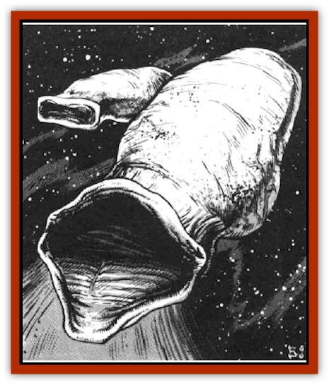

# Nay-Churr

| Statistic | **Nay-Churr** |
| --- | --- |
| **Activity Cycle:** | Any |
| **Alignment:** | Neutral |
| **Armor Class:** | -2/4/7 |
| **Climate/Terrain:** | Space |
| **Damage/Attack:** | See below |
| **Diet:** | Omnivore |
| **Frequency:** | Very rare |
| **Hit Dice:** | 15 to 25 |
| **Intelligence:** | Animal (1) |
| **Magic Resistance:** | Nil |
| **Morale:** | Nil |
| **Movement:** | Fl 3 (E); see below |
| **No. Appearing:** | 1 |
| **No. of Attacks:** | See below |
| **Organization:** | Solitary |
| **Size:** | H (200'+ long) |
| **Special Attacks:** | Swallowing |
| **Special Defenses:** | Convulsion |
| **THAC0:** | See below |
| **Treasure:** | See below |
| **XP Value:** | 10,000 |

The nay-churr (the name is singular and plural) are members of a very rare and widely dispersed species whose origin is lost in antiquity. These creatures ply the swirling eddies of the phlogiston, although they are occasionally found inside a crystal sphere. They can exist in any environment.

Body types vary slightly, but all nay-churr have certain physical properties in common. The dominant feature of the body is a rockhard - but still flexible - stomach in the shape of a tapered cylinder when it is empty. At the end of the creature is a mouth-like opening (called the maw) that is roughly the shape of an oblong rectangle when at rest. When the creature is feeding, the maw expands to several times its normal size; in the largest varieties, the maw can be as much as 500 feet in diameter.

Differences in size (and Hit Dice) run roughly according to this pattern:

| Hit Dice | Length | Maw Diam. (expanded) |
| --- | --- | --- |
| 15-17 | 200' | 150' |
| 18-21 | 300' | 200' |
| 22-24 | 400' | 350' |
| 25 | 500' | 500' |

**Combat:** The nay-churr does not engage in combat per se; it is virtually mindless and doesn't know anything about attacking. (A normal attack roll still applies, to see if the creature hits anything it comes into contact with.) However, it can certainly be dangerous to travelers.

The nay-churr spends its lifetime cruising through whatever environment it occupies, taking in any object or substance it happens to run across, as long as the object is small enough to fit in its maw. The object is not damaged by being swallowed: characters and ships - to name two examples of things that can be swallowed - can be carried around inside the creature's stomach for an indefinite length of time and then disgorged intact and unharmed. The creature's treasure consists of whatever it happens to be carrying around at the time, ranging from rocks and wreckage to undamaged and still useful items - up to and including entire ships.

The most effective way to fight a nay-churr is to simply avoid it; fortunately, because the creature moves very slowly and is very poor at changing direction, this is generally pretty easy to do. If combat is desirable or necessary (for instance, if a disabled companion is trapped inside the nay-churr), then the best approach is to strike at the sensitive area around the maw. If a nay-churr is reduced to 0 hit points by a series of hits on its maw, it immediately expels the contents of its stomach and becomes inert, neither moving nor swallowing, for a period of up to several weeks.

A nay-churr attacked in this fashion is not dead. The only way to kill the creature is to strike exclusively at the stomach until it is reduced to 0 hit points - whereupon the stomach explodes 1d6 rounds later, killing the nay-churr but also causing 10d10 points of damage to anyone or anything inside it and 5d10 points of damage to anything else within 200 feet. (From the standpoint of someone inside the creature, this sort of cure be worse than the disease.)

Trying to escape by hacking through the stomach from the inside can have disastrous consequences. If the inner wall of the stomach is damaged even slightly by an attack, the nay-churr will go immediately into a state of instinctive panic and convulsion - moving forward at a rate of 18 and thrashing violently from side to side as it does so. Any objects or creatures inside it are thrown around with such force that further attacking is impossible, and the victims suffer 1d10 points of damage per round from impacts with other objects or debris.

A nay-churr does voluntarily disgorge the contents of its stomach on occasion: whenever the creature happens to be inside the air envelope of some object that it isn't capable of swallowing, such as a planet or a large ship (100 tons or more). The result is a rain of debris in the direction of the gravity plane of the planet or ship.

**Habitat/Society:** Nay-churr are native to the phlogiston, and this is where they are the happiest (if such a term can be used). There they can cruise endlessly, sucking up a never-ending and never-filling supply of the ether. However, they have been known to drift into wildspace through a portal in a crystal sphere (nay-churr cannot penetrate a crystal sphere on their own).

**Ecology:** Aside from their mindless, chaotic propensity for swallowing anything they encounter, nay-churr play no part in the ecology of the multiverse. However, if a sufficiently large piece of the outer stomach wall of a nay-churr can be salvaged after an explosion, it can be formed into a breastplate that retains its Armour Class of -2.

---
## Discovery & Documentation

**Source Publication:** MC7 Spelljammer Appendix I (1990)
**Campaign Setting:** Advanced Dungeons & Dragons 2nd Edition
**Author(s):** various

### Other Creatures Found in This Source Book
   * [[Aartuk|Aartuk]]
   * [[Albari|Albari]]
   * [[Ancient_Mariner|Ancient Mariner]]
   * [[Argos|Argos]]
   * [[Beholder_Abomination_Astereater|Beholder (Abomination), Astereater]]
   * [[Blazozoid|Blazozoid]]
   * [[Chattur|Chattur]]
   * [[Chevall|Chevall]]
   * [[Clockwork_Horror|Clockwork Horror]]
   * [[Colossus|Colossus]]
   * [[Delphinid|Delphinid]]
   * [[Dizantar|Dizantar]]
   * [[Dog|Dog]]
   * [[Dog_Bog_Hound|Dog, Bog Hound]]
   * [[Esthetic|Esthetic]]
   * [[Focoid|Focoid]]
   * [[Fractine|Fractine]]
   * [[Giant_Spacesea|Giant, Spacesea]]
   * [[Golem_Furnace|Golem, Furnace]]
   * [[Golem_Radiant|Golem, Radiant]]
   * [[Gravislayer|Gravislayer]]
   * [[Grommam|Grommam]]
   * [[Hadozee|Hadozee]]
   * [[Hamster_Giant_Space|Hamster, Giant Space]]
   * [[Jammer_Leech|Jammer Leech]]
   * [[Lakshu|Lakshu]]
   * [[Lumineaux|Lumineaux]]
   * [[Lutum|Lutum]]
   * [[Mimic_Space|Mimic, Space]]
   * [[Misi|Misi]]
   * [[Moon_Rogue|Moon, Rogue]]
   * [[Mortiss|Mortiss]]
   * [[Murderoid|Murderoid]]
   * [[Phlog-Crawler|Phlog-Crawler]]
   * [[Plasman|Plasman]]
   * [[Plasmoid_DeGleash|Plasmoid, DeGleash]]
   * [[Plasmoid_DelNoric|Plasmoid, DelNoric]]
   * [[Plasmoid_General_Information|Plasmoid, General Information]]
   * [[Plasmoid_Ontalak|Plasmoid, Ontalak]]
   * [[Puffer|Puffer]]
   * [[Q'nidar|Q'nidar]]
   * [[Rastipede|Rastipede]]
   * [[Reigar|Reigar]]
   * [[Rock_Hopper|Rock Hopper]]
   * [[Slinker|Slinker]]
   * [[Spider_Asteroid|Spider, Asteroid]]
   * [[Spiritjam|Spiritjam]]
   * [[Survivor|Survivor]]
   * [[Syllix|Syllix]]
   * [[Symbiont_Power|Symbiont, Power]]
   * [[Vine_Infinity|Vine, Infinity]]
   * [[Wiggle|Wiggle]]
   * [[Wizshade|Wizshade]]
   * [[Wryback|Wryback]]
   * [[Zard|Zard]]
   * [[Zodar|Zodar]]
