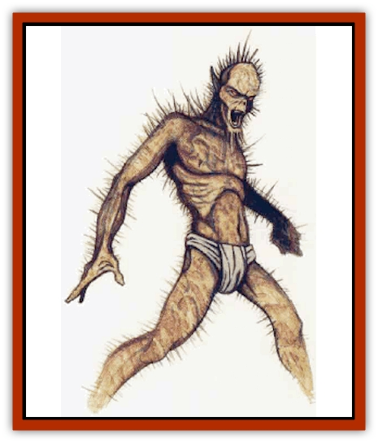

# Needleman

| Statistic | **Needleman** |
| --- | --- |
| **Activity Cycle:** | Day |
| **Alignment:** | Neutral |
| **Armor Class:** | 6 |
| **Climate/Terrain:** | Temperate forests |
| **Damage/Attack:** | 3d4 |
| **Diet:** | Photosynthetic carnivore |
| **Frequency:** | Very rare |
| **Hit Dice:** | 3+4 |
| **Intelligence:** | Low (5-7) |
| **Magic Resistance:** | Nil |
| **Morale:** | Steady (12) |
| **Movement:** | 9 |
| **No. Appearing:** | 5-50 |
| **No. of Attacks:** | 1 |
| **Organization:** | Grove |
| **Size:** | M (6' tall) |
| **Special Attacks:** | Surprise, needle volley |
| **Special Defenses:** | See below |
| **THAC0:** | 17 |
| **Treasure:** | M (G) |
| **XP Value:** | 120 |

This wood-dwelling, intelligent form of plant life has many similarities to a [[Zombie|zombie]], but it is in fact neither animal nor undead.

Needlemen appear ruddy green, mottled with browns and reds in autumn. They do not grow dormant in winter, as they lack roots to hold sap. Instead, they turn deep brown, to change to green again in the spring. Their eyes are coal-black, and their skin is covered with masses of small, sharp needles. When needlemen attack, they growl and shout in a gurgling, choking language that is incomprehensible to anyone else.

Needleman physiques are exclusively male. (Actually, like all complex plant life, needlemen are hermaphroditic, and can cross-pollinate.) From a human standpoint, most needlemen are emaciated. Some wear white woolen robes, but as this garment interferes with both the needleman's combat abilities and its skills at hiding in dense undergrowth, most needlemen shun these (perhaps ceremonial) robes in favor of a tight-fitting yellow breech-cloth.

**Combat:** A needleman attacks with its small, sharp needles. The traditional attack is a slap. The slap itself causes only 1d4 points of damage, but the sharp needles triple this injury for a total of 3d4 points. This damage should be treated as impaling, and large creatures with thick hides suffer only 2d4 points of damage.

Needlemen are also able to fire their needles at a distance. One of these creatures can launch a volley of 1d6 needles, each causing 1-2 points of damage (only 1 point to larger-than-man-sized opponents). A needleman has a range of 20 feet with this attack. For practical purposes, a needleman's supply of needles is infinite.

The creature is particularly vulnerable to magic. Attacks on it by magical means inflict triple normal damage, though it receives a saving throw. For example, a *magic missile* that would normally cause only 1d4+1 points of damage would inflict 3d4+3 points on a needleman. But it is only direct magical attacks that the needleman finds himself vulnerable against. A magically enlarged or strengthened character wielding a sword +2 finds the weapon's damage bonus (but not attack roll bonus) tripled to +6, but neither the weapon's normal damage nor the additional damage caused by the character's greater Strength would triple.

Spells of a nonoffensive nature, like *charm plants*, are triply effective against needlemen. Of course, the fact that it is a plant makes it immune to certain spells. Needlemen are intelligent and can be affected (at triple potency) by mind-influencing spells.

When amidst heavy undergrowth or conifers, needlemen are nearly undetectable (75% hidden from active searchers, or 40% against elves and thieves). In such areas, they impose a -5 penalty to their opponents'surprise rolls (-2 to elves and thieves). It is freakishly rare to encounter this creature outside of its natural habitat.

**Habitat/Society:** Needlemen lack the intelligence for a true society. They wander about their forests, picking up shiny trinkets (some few of which may be valuable) and moaning sadly to one another.

One clue to their origin is the virulent hatred needlemen have for [[Elf|elves]]. Needlemen can smell elves at a quarter-mile, and attack them furiously. One theory holds that needlemen were originally a band of humans who happened upon wood elves or [[Elf_Grugach|grugach]] in their home communities. If the elves had attempted to kill or incapacitate the intruders, as is likely, the humans might have invoked supernatural aid. And a evil or twisted trickster deity, such as Ralishaz, might have transformed the humans into woodland creatures better suited to battle elves.

**Ecology:** Needlemen derive most of their sustenance from sunlight, but they require water and nutrients as do most humanoids. They usually kill small creatures like squirrels, but, naturally, prefer the taste of elves.

---
## Discovery & Documentation

**Source Publication:** MC5 Greyhawk Appendix (1989)
**Campaign Setting:** Advanced Dungeons & Dragons 2nd Edition
**Author(s):** Grant Boucher, William W. Connors, Steve Gilbert, Bruce Nesmith, Chris Mortika, Skip Williams

### Other Creatures Found in This Source Book
   * [[Aspis|Aspis]]
   * [[Beastman|Beastman]]
   * [[Bonesnapper|Bonesnapper]]
   * [[Booka|Booka]]
   * [[Brownie_Buckawn|Brownie, Buckawn]]
   * [[Brownie_Quickling|Brownie, Quickling]]
   * [[Crystalmist|Crystalmist]]
   * [[Dragon_Cloud|Dragon, Cloud]]
   * [[Dragon_Oerth_Greyhawk|Dragon (Oerth), Greyhawk]]
   * [[Dragonfly_Giant|Dragonfly, Giant]]
   * [[Dragonnel|Dragonnel]]
   * [[Elf_Grugach|Elf, Grugach]]
   * [[Elf_Valley|Elf, Valley]]
   * [[Golem_Necrophidius|Golem, Necrophidius]]
   * [[Grell_Wild|Grell, Wild]]
   * [[Grung|Grung]]
   * [[Hobgoblin_Norker|Hobgoblin, Norker]]
   * [[Hook_Horror|Hook Horror]]
   * [[Horgar|Horgar]]
   * [[Hound_Yeth|Hound, Yeth]]
   * [[Iguana_Giant|Iguana, Giant]]
   * [[Ingundi|Ingundi]]
   * [[Kech|Kech]]
   * [[Kyuss_Son_of|Kyuss, Son of]]
   * [[Mite|Mite]]
   * [[Plant_Carnivorous_Oerth|Plant, Carnivorous (Oerth)]]
   * [[Plant_Carnivorous_Vampire_Cactus|Plant, Carnivorous, Vampire Cactus]]
   * [[Plasmoid_General_Information|Plasmoid, General Information]]
   * [[Rat_Oerth|Rat (Oerth)]]
   * [[Raven_Crow|Raven/Crow]]
   * [[Scarecrow|Scarecrow]]
   * [[Shadow_Slow|Shadow, Slow]]
   * [[Skulk|Skulk]]
   * [[Snail|Snail]]
   * [[Sprite|Sprite]]
   * [[Taer|Taer]]
   * [[Tentamort|Tentamort]]
   * [[Turtle_Giant|Turtle, Giant]]
   * [[Tyrg|Tyrg]]
   * [[Wolf_Mist|Wolf, Mist]]
   * [[Wraith_Oerth|Wraith (Oerth)]]
   * [[Zygom|Zygom]]
