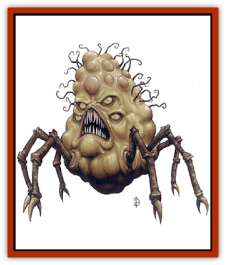

# Neh-thalggu

| Statistic | **Neh-thalggu** |
| --- | --- |
| **Activity Cycle:** | Any |
| **Alignment:** | Chaotic neutral |
| **Armor Class:** | 2 |
| **Climate/Terrain:** | Any |
| **Damage/Attack:** | 1d10 (bite) |
| **Diet:** | Brains |
| **Frequency:** | Very rare |
| **Hit Dice:** | 10 |
| **Intelligence:** | Very (11-12) |
| **Magic Resistance:** | Nil |
| **Morale:** | Elite (14) |
| **Movement:** | 18 |
| **No. Appearing:** | 1 |
| **No. of Attacks:** | 1 |
| **Organization:** | Solitary |
| **Size:** | L (10' long) |
| **Special Attacks:** | Spells |
| **Special Defenses:** | Spells |
| **THAC0:** | 11 |
| **Treasure:** | Nil |
| **XP Value:** | 2,000 |

Brain collectors (Neh-thalggu in their own language) are rare creatures who occasionally cross the barriers separating their distant home from the Prime Material Plane. Only near sources of great magical energy, where the fabric of time and space is twisted, can they find small gateways to Mystara, where they collect the brains of intelligent beings.

Each specimen of this hideous race has a yellow-orange body - bloated, oily, and amorphous - with dozens of short, writhing tentacles. Six crablike legs allow it to scuttle about. Four large, yellow, bulging eyes and a tooth-filled maw are set in its bulbous head. The head may also have a number of distinctive lumps (up to twelve), each one housing the brain of another intelligent creature.

Neh-thalggu do not think like any other creature. They speak their own tongue and that of [[Diabolus|diaboli]]. They can also speak and comprehend the languages known by any creatures whose brains they've swallowed.

**Combat:** The brain collector's method of attack is a powerful bite with its razor-toothed jaws, inflicting 1d10 points of damage with each bite that hits.

Each brain collector can cast spells, depending on how many brains it has collected. Roll 1d12 to determine how many transplanted brains the monster already has in its head. Each transplanted brain can hold a single wizard spell, no bigher than 3rd level (these can be chosen by the DM or randomly determined by dice roll; 1d3 for level and then according to wizard spell lists).

A brain collector can attack with its bite or with a single spell in a given round. Although the nature of its intelligence is unfathomable, brain collectors display a considerable tactical cunning in combat; they will use their available spells to the best possible effect.

A brain collector takes great care as it fights, to avoid doing damage to the cranium of its opponent. As its name suggests, the brains of sapient foes are very precious, indeed.

**Habitat/Society:** Though brain collectors have a completely alien psychology, "chaotic neutral" is the alignment that best describes them. The Neh-thalggu do not have hostile intentions as such; rather, they do not seem to regard humans or or other humanoids as people.

Brain collectors are known to exist on the Demiplane of Nightmares, where they hold a mythic position in the folklore of diaboli, like that of [[Dragon_General_Information|dragons]] in human tales. Diaboli regard Neh-thalggu as creatures of power, cunning, and inscrutability, and brain collector magic can affect diaboli.

While Neh-thalggu exist on the Demiplane of Nightmares and the Prime Material Plane, sages agree the creatures are native to neither. Brain collectors may also be found wandering other known planes, particularly the Astral or Ethereal Plane. On the Prime Material Plane, a brain collector prefers ruins and caverns and other places with little light and infrequent disturbances.

When a brain collector reaches the Prime Material Plane, it immediately begins acquiring as many brains as it can, as quickly as possible. Each collector can store up to 12 brains at any one time. When these creatures slay humans, demihumans, or humanoids, they carefully cut away the top of the head with surgical tools to expose the brain, and then swallow it. The swallowed brain then moves into one of several pockets witbin the brain collector's own head, forming a distinctive lump. For each brain collected, the creature gains the ability to cast one wizard spell of 1st to 3rd level once per day.

When a Neh-thalggu has collected its 12 brains, it immediately seeks to retum to its home plane. One theory holds that with 12 collected brains, these monsters can, in certain locations, re-open the link to their native world. Fortunately, few 12-brain Neh-thalggu have been encountered; since they can collect no more brains, they are more eager to move along than to engage opponents.

The brain collector may be related in some fashion to the [[Feyr|feyr]].

**Ecology:** Brain collectors have no interest in treasure of any kind; denizens of the Prime Material Plane are curious objects for dispassionate study and rutbless exploitation - cattle, in the brain collectors' eyes.

Neh-thalggu are predators of the highest order, but they exert little influence on the Mystaran environment.

---
## Discovery & Documentation

**Source Publication:** Monstrous Compendium, 1997 Annual, Volume 4 (1995)
**Campaign Setting:** Advanced Dungeons & Dragons 2nd Edition
**Author(s):** Jon Pickens

### Other Creatures Found in This Source Book
   * [[Anemone_Giant_Sea|Anemone, Giant Sea]]
   * [[Asperii|Asperii]]
   * [[Bainligor|Bainligor]]
   * [[Beast_of_Chaos|Beast of Chaos]]
   * [[Blindheim|Blindheim]]
   * [[Bloodsipper_Far_Realm|Bloodsipper (Far Realm)]]
   * [[Bulette_Gohlbrorn|Bulette, Gohlbrorn]]
   * [[Child_of_the_Sea|Child of the Sea]]
   * [[Clockwork_Horror|Clockwork Horror]]
   * [[Clockwork_Swordsman|Clockwork Swordsman]]
   * [[Coral|Coral]]
   * [[Darklore|Darklore]]
   * [[Dharculus|Dharculus]]
   * [[Dolphin_Athas|Dolphin (Athas)]]
   * [[Dragon_Neutral_Moonstone|Dragon, Neutral, Moonstone]]
   * [[Dragon_Prismatic|Dragon, Prismatic]]
   * [[Dream_Stalker|Dream Stalker]]
   * [[Dragon-kin_Albino_Wyrm|Dragon-kin, Albino Wyrm]]
   * [[Echyan|Echyan]]
   * [[Firestar|Firestar]]
   * [[Firetail|Firetail]]
   * [[Fish_Ascallion|Fish, Ascallion]]
   * [[Fish_Deep_Ocean|Fish, Deep Ocean]]
   * [[Fish_Tropical|Fish, Tropical]]
   * [[Fish_Vurgens|Fish, Vurgens]]
   * [[Fogwarden|Fogwarden]]
   * [[Fraal|Fraal]]
   * [[Giant_Crag|Giant, Crag]]
   * [[Gibberling_Brood|Gibberling, Brood]]
   * [[Glutton_Sea|Glutton, Sea]]
   * [[Golden_Ammonite|Golden Ammonite]]
   * [[Golem_Brass_Minotaur|Golem, Brass Minotaur]]
   * [[Golem_Gemstone|Golem, Gemstone]]
   * [[Golem_Maggot|Golem, Maggot]]
   * [[Groundling|Groundling]]
   * [[Hermit_Sea|Hermit, Sea]]
   * [[Hound_of_Law|Hound of Law]]
   * [[Human_Amazon|Human, Amazon]]
   * [[Human_Pygmy|Human, Pygmy]]
   * [[Inquisitor|Inquisitor]]
   * [[Kercpa|Kercpa]]
   * [[Kreel|Kreel]]
   * [[Lycanthrope_Lythari|Lycanthrope, Lythari]]
   * [[Mercurial|Mercurial]]
   * [[Mold_Chromatic|Mold, Chromatic]]
   * [[Mummy_Bog|Mummy, Bog]]
   * [[Nymph_Grain|Nymph, Grain]]
   * [[Nymph_Unseelie|Nymph, Unseelie]]
   * [[Octopus_Octo-Jelly|Octopus, Octo-Jelly]]
   * [[Puddingfish|Puddingfish]]
   * [[Sea_Demon|Sea Demon]]
   * [[Shade|Shade]]
   * [[Shadowrath|Shadowrath]]
   * [[Shark_Athas|Shark (Athas)]]
   * [[Siren_Ravenloft|Siren (Ravenloft)]]
   * [[Skeleton_Variant|Skeleton, Variant]]
   * [[Skyfish|Skyfish]]
   * [[Spectral_Scion|Spectral Scion]]
   * [[Spyder_Fiend|Spyder Fiend]]
   * [[Squid_Squark|Squid, Squark]]
   * [[Tanar'ri_Lesser_Uridezu|Tanar'ri, Lesser, Uridezu]]
   * [[Troll_Mutate|Troll Mutate]]
   * [[Vaati|Vaati]]
   * [[Vampire_Cerebral|Vampire, Cerebral]]
   * [[Varkha|Varkha]]
   * [[Wizshade|Wizshade]]
   * [[Worm_Lukhorn|Worm, Lukhorn]]
   * [[Wyste|Wyste]]
   * [[Yugoloth_Lesser_Gacholoth|Yugoloth, Lesser, Gacholoth]]
   * [[Zombie_Mud|Zombie, Mud]]
