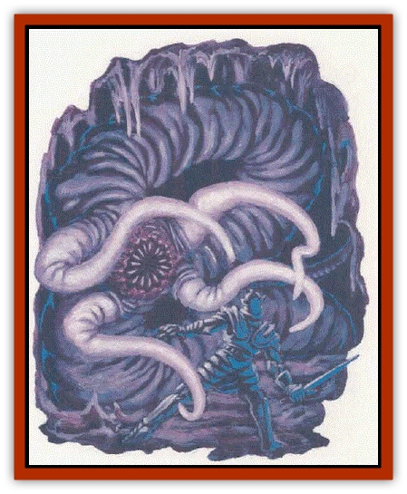
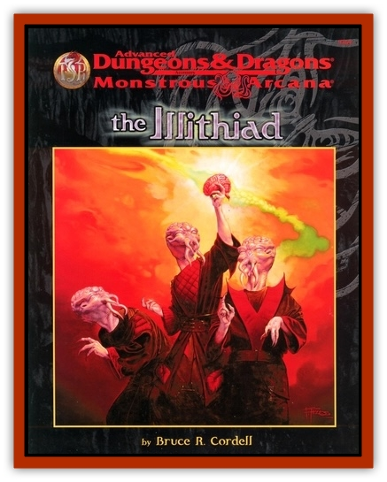

# Neothelid

| Statistic | **Neothelid** |
| --- | --- |
| **Activity Cycle:** | Any |
| **Alignment:** | Lawful evil |
| **Armor Class:** | 0 |
| **Climate/Terrain:** | Subterranean |
| **Damage/Attack:** | 1 (bite) or 4 (tentacles) |
| **Diet:** | Brains |
| **Frequency:** | Very rare (possibly unique) |
| **Hit Dice:** | 16 |
| **Intelligence:** | Genius (17-18) |
| **Magic Resistance:** | 0.45% |
| **Morale:** | Fearless (20) |
| **Movement:** | 9 |
| **No. Appearing:** | 1 |
| **No. of Attacks:** | 6d6 or 3d6 (x4) |
| **Organization:** | Solitary |
| **Size:** | G (120' tall) |
| **Special Attacks:** | Breath weapon, psionics |
| **Special Defenses:** | Nil |
| **THAC0:** | 5 |
| **Treasure:** | Nil |
| **XP Value:** | 20,000 |

**Psionics Summary**

| Level | Dis/Sci/Dev | Attack/Defense | Score | PSPs |
| --- | --- | --- | --- | --- |
| 9 | 4/2/8 | EW,II,MB/All | = Int | 1d100+350 |

**Psychokinesis -** *Sciences:* nil; *Devotions:* control body, telekinesis.

**Psychometabolism -** *Sciences:* nil; *Devotion:* body equilibrium.

**Psychoportation -** *Sciences:* nil; *Devotion:* dimension walk.

**Telepathy -** *Science:* domination; *Devotions:* awe, ESP, post-hypnotic suggestion, taste link.

A slime-covered [[Worm|worm]] of [[Dragon_General_Information|dragon]]like proportions, a neothelid leaves a poison trail of mucous in its wake. It brings its prey down with flesh-corroding exhalations that dissolve all but the fatty brain, an essential component of its diet. An adult reaches 10 feet in diameter, but its wormlike body grows longer throughout its existence - reaching lengths in excess of 120 feet.

Four 20-foot-long tentacles sprout from an adult's eyeless "face", thrashing around a circular maw large enough to swallow man-sized prey whole. Dangerous psionic talents round out what may be the underdark's most fearsome predator.

Its mauve coloration has caused some to mistake neothelids for [[Worm|purple worms]] at a distance; thankfully, both creatures are rare.

A neothelid senses its world via innate telepathy with a radius of 360 feet. Within this radius, the neothelid is aware of all non-psionically shielded sentient beings and can communicate with intelligent creatures via telepathy - even through solid rock.

**Combat:** When a neothelid corners its prey, it first resorts to its flesh-dissolving breath weapon. This weapon is not an acid, but rather an enzyme that liquefies most organic tissue. A neothelid can use its breath weapon twice per day, affecting a cone-shaped area 5 feet wide at its origin, 60 feet in length, and 20 feet wide at its extreme edge. Living creatures caught in the blast take 12d12+6 points of damage (successful saving throws vs. breath weapon reduce damage by half) as their flesh sloughs away. Any creature killed by the breath weapon completely melts, save for its clothing, possessions, and exposed brain.

Any prey that survives a breath weapon attack must face the neothelid's impressive physical arsenal. An attacking neuthelid coils and strikes with its gargantuan body from sufficiently large subterranean caverns - much like a surface python. If its attack is successful, the creature bites for 6d6 points of damage or flails with its four 20-foot-long tentacles for 3d6 points of damage each. If a neothelid needs to, it will brings its psionic abilities to bear on its victims.

A neothelid's body glistens with poisonous mucous; a slime trail marks its passage. Those who come in contact with the mucous murt make a successful saving throw vs. poison or face death in 1d10 turns ([[Mind_Flayer|mind flayers]] are immune to this poison).

**Habitat/Society:** In the remarkably rare event that mind flayer tadpoles develop in the absence of [[Mind_Flayer|illithid]] adults, a small number survive long enough on their own to develop into neothelids. These creatures indiscriminately hunt any illithids they may chance upon. Illithids, in turn, respond to the news of neothelid emergence with utter disgust, and they quickly organize hunting parties to exterminate the abominations.

**Ecology:** An illithid tadpole that fails to undergo ceremorphosis gradually grows into a neothelid - assuming it survives its first 100 years as a mindless slug eking out a living on subterranean vermin. Once a tadpole is powerful enough to be called a neothelid (triggered by the eating of its first sentient brain), it becomes a terrible danger, hunting all other living creatures (including illithids) wih an insatiable, insane hunger.

Unlike some other large predators of the underdark neothelids an unable to burrow through solid rock, forcing them to hunt naturally or previously delved tunnels and caverns. When a local subterrineai ecosystem is exhausted, neothelids may move to "greener" tunnels via their psychoportive abilities.

The existence of the neothelids engenders a host of unanswered questions regarding the actual nature and true origin of illithids - a mystery even to the illithids themselves.

---
## Discovery & Documentation

**Source Publication:** The Illithiad (1998)
**Campaign Setting:** Advanced Dungeons & Dragons 2nd Edition
**Author(s):** Bruce R Cordel

### Other Creatures Found in This Source Book
   * [[Bulette_Gohlbrorn|Bulette, Gohlbrorn]]
   * [[Elder_Brain|Elder Brain]]
   * [[Urophion|Urophion]]
