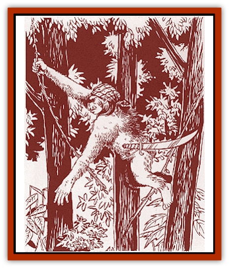

# Neshezu

| Statistic | **Neshezu** |
| --- | --- |
| **Activity Cycle:** | Night |
| **Alignment:** | Chaotic evil |
| **Armor Class:** | 6 (10) |
| **Climate/Terrain:** | Tropical or subtropical forest |
| **Damage/Attack:** | 1d8 (weapon) +1 (Strength bonus) |
| **Diet:** | Omnivore |
| **Frequency:** | Common |
| **Hit Dice:** | 1 |
| **Intelligence:** | Average (8-10) |
| **Magic Resistance:** | Nil |
| **Morale:** | Steady (11-12) |
| **Movement:** | 6, 15 (brachiating) |
| **No. Appearing:** | 3d10&times;10 |
| **No. of Attacks:** | 1 |
| **Organization:** | Tribal |
| **Size:** | M (4-5' tall) |
| **Special Attacks:** | Uses poison |
| **Special Defenses:** | Forest cover |
| **THAC0:** | 19 |
| **Treasure:** | L (C,O,Q&times;10,S) |
| **XP Value:** | 65 / 3 HD: 175 / 5 HD: 420 / 8 HD Priest: 3,000 |

Neshezues resemble large orang-utans, with slight [[Orc|orc]] and [[Goblin|goblin]] features. An adult male attains a height of about 5 feet and a weight of about 175 pounds. Females are about three-quarters of this size. All neshezues have thick reddish-brown hair and an orclike facial structure. Neshezues are almost exclusively arboreal, with limbs adapted to swinging through trees; their extremely long arms can have a span exceeding 7 feet. Their legs are short and ill-suited for walking or running. Neshezues are evil, cunning, and intelligent.

**Combat:** Some neshezu warriors (about 10%) carry wheellock pistols in addition to more conventional armaments. Neshezues favor scimitars, daggers, and other traditional pirate weapons. Neshezu warriors coat their weapons with poison as a matter of course, usually type O or P injected poison.

Neshezues are night creatures of the deep, shadowy forest. They dislike bright light and suffer a -1 penalty to their attack rolls in sunlight. Neshezues have infravision with a range of 60 feet. Because of their derivation from orang-utans, all neshezues are extremely strong, receiving a +1 damage bonus due to Strength on all melee attacks.

Neshezues can climb trees at MV 12 and can brachiate from limb to limb or vine to vine at high speed (MV 15).

Neshezues favor ambushes in combat, using a variety of vines and nets to entangle their enemies. They prefer to strike from cover with hit-and-run tactics. In the forest, a neshezu not directly engaged in melee combat has an AC of 2.

For every 25 neshezues in a tribe, there will be a 3 HD leader who fights as a 3rd-level fighter. The leader will have three assistants, each with 8 hit points and a wheellock pistol. For 150 or more neshezues, there will be a 5 HD chieftain who fights as a 5th-level fighter and his six 2 HD bodyguards, each with a wheellock pistol and a +2 damage bonus on melee attacks. There will also be one shaman (maximum 8th-level priest) for every 100 neshezues.

**Habitat/Society:** Neshezues form loose clans in the western Herathian forest, and the Herathians have tried unsuccessfully to rid their forests of these hairy beasts. The neshezu organization resembles that traditionally found among seagoing pirates. Leadership in the clans is based upon brute strength, cruelty, deceit, and betrayal.

Neshezu villages are built high in the treetops on platforms of wood and woven vines. Travel requires swinging on vines, balancing on narrow branches, and gripping "safe" points that are too far apart for most humanoids to reach.

The ancestors of neshezues had a patriarchal society with little use for females other than bearing children and doing hard work. This has changed for the neshezu, since the female neshezues possess the deadly poison lore. Female neshezues are particularly fond of subtle, multi-part ingested poisons. Victims will be unaware that they have been poisoned until it is far too late. The poison lore preserves an respectful truce between the two sexes. Many a neshezu leader has earned (and kept) his position because his wife was particularly skilled with poisons.

**Ecology:** Neshezues have an average life span of about 30 years. Although they prefer to eat raw, fresh meat, neshezues will eat just about anything.

---
## Discovery & Documentation

**Source Publication:** Monstrous Compendium Savage Coast Appendix (Online Exclusive) (1995)
**Campaign Setting:** Mystara
**Author(s):** Loren L Coleman, Ted James, Thomas Zuvich, Cindi M. Rice

### Other Creatures Found in This Source Book
   * [[Aranea_Savage_Coast|Aranea (Savage Coast)]]
   * [[Arashaeem|Arashaeem]]
   * [[Batracine|Batracine]]
   * [[Cat_Marine|Cat, Marine]]
   * [[Cinnavixen|Cinnavixen]]
   * [[Clockwork_Swordsman|Clockwork Swordsman]]
   * [[Critter_Temple|Critter, Temple]]
   * [[Cursed_One|Cursed One]]
   * [[Deathmare|Deathmare]]
   * [[Dragon_Savage_Coast_Crimson|Dragon (Savage Coast), Crimson]]
   * [[Dragon_Savage_Coast_Red_Hawk|Dragon (Savage Coast), Red Hawk]]
   * [[Echyan|Echyan]]
   * [[Ee'aar|Ee'aar]]
   * [[Enduk|Enduk]]
   * [[Fachan_Savage_Coast|Fachan (Savage Coast)]]
   * [[Feliquine|Feliquine]]
   * [[Fiend_Narvaezan|Fiend, Narvaezan]]
   * [[Frelôn|Frelôn]]
   * [[Ghriest|Ghriest]]
   * [[Glutton_Sea|Glutton, Sea]]
   * [[Goatman|Goatman]]
   * [[Golem_Naâruk|Golem, Naâruk]]
   * [[Golem_Savage_Coast|Golem (Savage Coast)]]
   * [[Grudgling|Grudgling]]
   * [[Heraldic_Servant_I|Heraldic Servant I]]
   * [[Heraldic_Servant_II|Heraldic Servant II]]
   * [[Heraldic_Servant_III|Heraldic Servant III]]
   * [[Heraldic_Servant_IV|Heraldic Servant IV]]
   * [[Heraldic_Servant_V|Heraldic Servant V]]
   * [[Heraldic_Servant_General_Information|Heraldic Servant, General Information]]
   * [[Hermit_Sea|Hermit, Sea]]
   * [[Jorri|Jorri]]
   * [[Juhrion|Juhrion]]
   * [[Kla'a-tah|Kla'a-tah]]
   * [[Leech_Legacy|Leech, Legacy]]
   * [[Lich_Inheritor|Lich, Inheritor]]
   * [[Lizard_Kin_Savage_Coast|Lizard Kin (Savage Coast)]]
   * [[Lupasus|Lupasus]]
   * [[Lupin|Lupin]]
   * [[Lyra_Bird_Saragón|Lyra Bird, Saragón]]
   * [[Malfera|Malfera]]
   * [[Manscorpion_Nimmurian|Manscorpion, Nimmurian]]
   * [[Mythuínn_Folk|Mythuínn Folk]]
   * [[Nikt'oo|Nikt'oo]]
   * [[Nosferatu|Nosferatu]]
   * [[Omm-wa|Omm-wa]]
   * [[Omshirim|Omshirim]]
   * [[Parasite_Savage_Coast|Parasite (Savage Coast)]]
   * [[Phanaton|Phanaton]]
   * [[Plant_Savage_Coast|Plant (Savage Coast)]]
   * [[Pudding_Vermilion|Pudding, Vermilion]]
   * [[Rakasta|Rakasta]]
   * [[Ray_Forest|Ray, Forest]]
   * [[Shedu_Greater_Savage_Coast|Shedu, Greater (Savage Coast)]]
   * [[Shimmerfish|Shimmerfish]]
   * [[Skinwing|Skinwing]]
   * [[Spawn_of_Nimmur|Spawn of Nimmur]]
   * [[Spider-spy|Spider-spy]]
   * [[Spirit_Heroic|Spirit, Heroic]]
   * [[Spirit_Walleran|Spirit, Walleran]]
   * [[Succulus|Succulus]]
   * [[Swampmare|Swampmare]]
   * [[Symbiont_Shadow|Symbiont, Shadow]]
   * [[Tortle|Tortle]]
   * [[Troll_Legacy|Troll, Legacy]]
   * [[Trosip|Trosip]]
   * [[Tyminid|Tyminid]]
   * [[Utukku|Utukku]]
   * [[Voat|Voat]]
   * [[Voat_Herathian|Voat, Herathian]]
   * [[Vulturehound|Vulturehound]]
   * [[Wallara|Wallara]]
   * [[Wurmling|Wurmling]]
   * [[Wynzet|Wynzet]]
   * [[Yeshom|Yeshom]]
   * [[Zombie_Red|Zombie, Red]]
