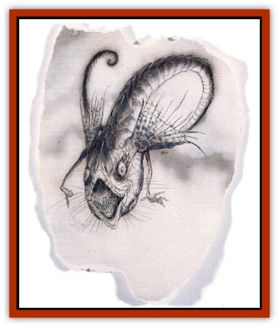

# Ni'iath

| Statistic | **Ni'iath** |
| --- | --- |
| **Activity Cycle:** | Night |
| **Alignment:** | Neutral |
| **Armor Class:** | 5 |
| **Climate/Terrain:** | Bytopia |
| **Damage/Attack:** | 1d3/1d3/1d4+1 or 1d6 + special |
| **Diet:** | Omnivore |
| **Frequency:** | Rare |
| **Hit Dice:** | 5 |
| **Intelligence:** | Low (5-7) |
| **Magic Resistance:** | Nil |
| **Morale:** | Steady (11-12) |
| **Movement:** | Fl 18 (A) |
| **No. Appearing:** | 1d8+1 |
| **No. of Attacks:** | 3 or 1 |
| **Organization:** | Pack |
| **Size:** | M (5' long) |
| **Special Attacks:** | Tail fling |
| **Special Defenses:** | Immune to gravity changes |
| **THAC0:** | 15 |
| **Treasure:** | Nil |
| **XP Value:** | 975 |

The propensity for creatures to adapt to environments both dangerous and varied is remarkable. No creature offers a beter example for this than the ni'iath. Planar explorer Guias Philbai writes:

"&hellip; were not able to hold on. The force of gravity itself was shifting, and our perspectives were forced to change. Up suddenly became down. For a moment, it seemed as though there was no longer an up, only two downs. Do I blather on like a simpleton? No. For such are the strange ways of Bytopia.

"The creatures that hounded us did not seem affected by this gravity change. While we tried to reorient ourselves, they moved in to attack. Reglof, my [[Bariaur|bariaur]] friend, was the first to be brought down by the floating creatures. With claw, tooth, and tail the ni'iaths (as we later learned they were called) relentlessly tore him apart.

"With a strength or power that must be somehow magically enhanced, they tossed Hiv, my [[Halfling|halfling]] henchman, into a tree sixty feet away. Hiv did not rise from that blow. Later, after Mera and I escaped, she said that she believed that the creatures were manipulating gravity somehow. At the time, I did not believe her - things of that sort don't live on Bytopia, right? I had a lot to learn about the planes&hellip;"

Ni'iaths are long, wormlike creatures with vicious mouths and four narrow eyes spaced equidistantly about their heads. Small arms with four clawed fingers sprout from either side of the beasts, and their long, narrowing tails end in a whiplike barb. They are completely immune to the effects of gravity, and use the two fanlike fins on either side of their head to "swim" through the air. They have no grasp of the concept of "up" or "down", being able to orient themselves in either vertical direction without flipping themselves around.

**Combat:** The ni'iath swoops in to attack its foes, usually attempting to maintain a position in the air that is difficult for its foe to reach yet still enables the ni'iath to make attacks of its own.

The most terrifying attack that the ni'iaths have at their command is the "tail fling". On a roll of 4 or more over the required number to hit a target with its tail attack (which inflicts 1d6 damage), the victim is caught by the barb and flung by a whipping of its tail. Worse, those flung are affected by a special type of *reverse gravity* which makes them "fall" in whatever direction they are flung by the ni'iath's tail.

This effect lasts until the victim strikes something or has fallen 100 feet. If the victim strikes a hard surface or object before the effect ends, 1d6 points of damage are inflicted. Either way, when the effect ends the normal pull of gravity takes over from wherever the victim is at the time. Further falls from that position also inflict normal damage. For example, if a ni'iath flings a foe 100 feet to the right,  but when the effect ends the victim is only 10 feet off the ground, only 1d6 damage is inflicted. If a foe is flung 100 feet straight up, however, that is another matter entirely. Falls and flings in the area of gravity shining between the layers of Bytopia can be tricky business, so close attention should be paid to the position of the combatants and the location of the gravity change. Flinging a foe upward may force him to cross the bounds between layers, meaning that he would continue to fall "up" in relation to the rest of the combat, even after the effect wore off.

As a general guideline, DMs can roll 1d12 to determine which direction a ni'iath flings its victim.

| Roll | Direction |
| --- | --- |
| 1-2 | left |
| 3-4 | right |
| 5-6 | backward |
| 7-8 | straight ahead |
| 9-10 | upward |
| 11 | straight down |
| 12 | into the victim's nearest companion (both take falling damage) |

Note that ni'iaths always prefer to throw a foe into a nearby object, and they never throw their prey so that they might lose it (over the side of a cliff or into a thick fog, for example).

After a foe is flung, the ni'ath flies to it to either finish it off with its claws and teeth (claw/claw/bite attacks which do 1d3/1d3/1d4+1 points of damage) or carry it away to its lair to feed upon it later.

Needless to say, ni'iaths are immune to *reverse gravity* spells. They are subject to wind changes, however, so conjured gusts may keep them at bay.

**Habitat/Society:** Ni'iaths can be found throughout both layers of Bytopia, but they prefer the crossover areas where gravity shifts between the layers. It is in these places that the ni'iaths developed, and it is here that they flourish, using the disorientation of other creatures to their advantage.

Ni'iaths resemble [[Wolf|wolves]] in mentality. They prefer to hunt in packs, bringing down their chosen prey as a group. Ni'iaths also purposefully hound their prey, tiring it out by chasing it until it is too tired to run or fight.

Within the pack the creatures vie for dominance, with a male of the species usually gaining control of the entire pack. The young of the pack are always well guarded by the rest of the ni'iaths, although they normally stay within the pack's lair.

Ni'iaths lair within high mountain caves, deep crevices, or on unreachable ledges. Young ni'iaths, which have 1-3 Hit Dice, are never left alone.

**Ecology:** Ni'iaths hunt and kill any and all other creatures, but they prefer large animals like moose, deer, and [[Mammal_Herd_I|cattle]]. They prey upon smaller creatures, such as rabbits, [[Bird|birds]], and even [[Ethyk|ethyks]]. Ni'iaths, in turn, are hunted and trapped by the humans and [[Gnome|gnomes]] that inhabit Bytopia.

Though many believe that there must be a magical "flight" organ within the creature that could be utilized in some way, none has ever been found. In truth, the ni'iaths do not fly - they simply ignore gravity in a manner still misunderstood.

---
## Discovery & Documentation

**Source Publication:** Planes of Conflict (1995)
**Campaign Setting:** Planescape
**Author(s):** Colin Mccomb, Dale Donovan

### Other Creatures Found in This Source Book
   * [[Aeserpent|Aeserpent]]
   * [[Asuras|Asuras]]
   * [[Buraq|Buraq]]
   * [[Delphon|Delphon]]
   * [[Diakk|Diakk]]
   * [[Ethyk|Ethyk]]
   * [[Gautiere|Gautiere]]
   * [[Linqua|Linqua]]
   * [[Phiuhl|Phiuhl]]
   * [[Quesar|Quesar]]
   * [[Slasrath|Slasrath]]
   * [[Warden_Beast|Warden Beast]]
   * [[Yugoloth_Greater_Baernaloth|Yugoloth, Greater, Baernaloth]]
