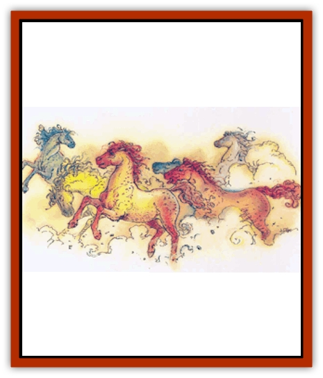

# Nic'Epona

| Statistic | **Nic'Epona** |
| --- | --- |
| **Activity Cycle:** | Any |
| **Alignment:** | Neutral |
| **Armor Class:** | 2 |
| **Climate/Terrain:** | Any plane |
| **Damage/Attack:** | 1d8/1d8/1d4 or 3d8 |
| **Diet:** | Herbivore |
| **Frequency:** | Very rare |
| **Hit Dice:** | 7 |
| **Intelligence:** | Exceptional (15-16) |
| **Magic Resistance:** | 30% |
| **Morale:** | Champion (15) |
| **Movement:** | 24 |
| **No. Appearing:** | 1 or 5d10 |
| **No. of Attacks:** | 3 (hoof/hoof/bite) or 1 (back kick) |
| **Organization:** | Solitary or herd |
| **Size:** | L |
| **Special Attacks:** | See below |
| **Special Defenses:** | See below |
| **THAC0:** | 13 |
| **Treasure:** | Nil |
| **XP Value:** | 2,000 |

Nic'Epona, also known as Epona's daughters, are among a few creatures with the ability to move between the planes at will. They are, rumor says, direct descendants of the horse-goddess Epona, and they derive their power from her. They are the defenders of her realm, Tir na Og (on the Outlands), and they ride in massive waves to overwhelm those who would threaten her.

The nic'Epona resemble ordinary [[Horse|horses]] almost exactly, although there is a sparkle of intelligence behind their eyes that belies the aspect of a common animal. They can appear in any color of the rainbow (stories are told of those whose color is beyond the deepest violet or above the brightest red), and they have an innate ability to change their coloration at will. Usually they adopt one color or color-pattern as their favorite, but they can change their hide to any hue as the mood takes them.

**Combat:** The nic'Epona, as the defenders of Epona's realm, are naturally fierce foes in combat. Each uses her hooves and her powerful teeth to good effect. They willingly bite those foolish enough to come close without permission, and their sharp forehooves can strike as powerfully as a battle axe. If there is an opponent behind her, a nic'Epona may choose to deliver a powerful kick with her hind legs. (However, this means the nic'Epona forgoes any other attack that round, as she spends the round bracing and balancing herself for the delivery of this mighty blow.) A nic'Epona attacks as though her entire body were a +2 weapon, allowing her to hit those beings that take damage only from magic or silver. Note that the nic'Epona do not actually gain the +2 bonus to hit or damage, but merely have the ability to hit creatures immune to lesser weapons.

When in a herd of 20 or greater, the nic'Epona can also create a stampede to sweep over their enemies. The stampede is 20 yards wide and at least two nic'Epona deep (one nic'Epona every two yards). Each additional group of 10 nic'Epona widens the stampede by 20 yards or adds another rank of the creatures - they spread out according to the number of opponents arrayed against them. The steeds charge without fear and never need to check Morale in a stampede. They require 50 yards to build up good speed, at which point anyone in their path suffers 10d6 points of damage per round for a number of rounds equal to the number of ranks of nic'Epona, divided by 4 (round up). For example, if there are three ranks of nic'Epona, anyone in their path suffers 10d6 points of damage for a single round. If there are eight ranks, opponents suffer 10d6 points for two rounds. Victims are allowed a save vs. spell for half damage.

The nic'Epona also boast an impressive defense. They can be hit only by weapons of +2 or greater power, or by those whose innate abilities allow them to strike as a +2 weapon, like themselves.

They are also completely immune to *charm*-related spells, and they're aware of it when someone attempts to use magic to gain their trust. Even magical items that charm animals have no effect on the nic'Epona, for they are not normal horses. However, since this immunity is not widely known, the nic'Epona delight in pretending to fall under the sway of such magic, then abandoning the caster on an unfriendly plane. often in a bad situation.

The most striking feature of the nic'Epona defense is their ability to *plane shift* (as the spell) at will, requiring but a few steps in which to work the magic. They can travel to any point in any of the Outer Planes that they have seen, although realms of unfriendly powers are closed to them unless they're specifically invited. If combat is not going her way, a nic'Epona takes a few steps back, charges at her foe, and plane shifts just before contact, leaving a rainbow silhouette that fades after a few moments. Her hooves glow with a faint purple fire when she activates this power.

Finally, nic'Epona are able to keep their footing on any surface, from water to quicksand to air. Their hooves create an momentary causeway upon which they gallop, giving the impression that they are flying, running across water, or performing some other apparently impossible feat. They can even run up vertical surfaces, treating the transition from horizontal to vertical as just another step. (This can be a bit jarring for riders who are unused to it.) The nic'Epona can activate this "fleeting causeway" for one turn/hour; when they do so, their hooves flare with a bright blue flame. No creature other than the nic'Epona can use the causeway (except a rider).

**Habitat/Society:** Though they appear to be solitary creatures, nic'Epona gather in great herds in the realm of Tir na Og, on the Outlands. Though they have free rein through the planes, they call Tir na Og home because it is the home of their patron power, Epona. When they are at home, they have little to do with the planars, primes, and petitioners who come to them for favors or transport through the planes. Since they have the company of their own kind in Tir na Og, they do not need that of ordinary mortals. They break this rule only for those they call friends, or for those whom they owe a debt of honor.

**Ecology:** Nic'Epona are all female, despite persistent rumors of male nic'Epona. They are produced by the union of a nic'Epona with a male equine (a horse, [[Pegasus|pegasus]], or [[Unicorn|unicorn]]). The offspring of such a union are nic'Epona if female, but take after the father if they are male. The herd is extremely protective of its foals and will turn en masse on anyone who attempts the theft of one, harrying the thief through the planes if necessary.

Epona's daughters are gregarious, enjoying the company and attentions of other beings. Occasionally they will come into contact with adventurer-types, engaging them in conversation in an attempt to learn interesting gossip and places to travel. If treated well and entertained, each nic'Epona may offer to carry a person from one plane to another.

Those who would ride one of Epona's daughters should have fine gifts and flattering words to court her affections. They must first win her trust, for if she has faith in the rider, she will provide transport - one time and one time only - to the destination of the rider's choice. If the rider does something to betray this trust, the nic'Epona can easily deposit the rider in some inhospitable plane. Baator is a favorite stopping point for nic'Epona burdened with irksome riders.

If the nic'Epona is particularly well-treated, or learns devotion for a being, she will allow that being to name her. Thereafter, she will respond to the name, treating it as a summons up to three times (more at the DM's discretion, though DMs should be advised that even three times is an exceptional number). She will arrive within 1d10 rounds, galloping across the planes to bear her friend away from whatever danger menaces.

---
## Discovery & Documentation

**Source Publication:** Planescape Campaign Setting (1994)
**Campaign Setting:** Planescape
**Author(s):** David Cook

### Other Creatures Found in This Source Book
   * [[Aleax|Aleax]]
   * [[Astral_Searcher|Astral Searcher]]
   * [[Barghest|Barghest]]
   * [[Bariaur|Bariaur]]
   * [[Cranium_Rat|Cranium Rat]]
   * [[Dabus|Dabus]]
   * [[Magman|Magman]]
   * [[Minion_of_Set|Minion of Set]]
   * [[Modron|Modron]]
   * [[Spirit_of_the_Air|Spirit of the Air]]
   * [[Vortex|Vortex]]
   * [[Yugoloth_Lesser_Marraenoloth|Yugoloth, Lesser, Marraenoloth]]
