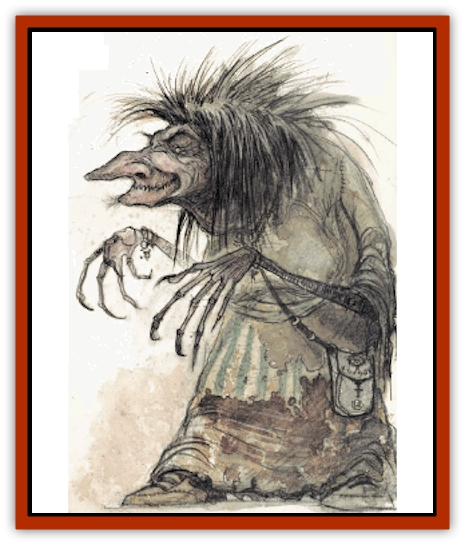

# Night Hag

| Statistic | **Night Hag** |
| --- | --- |
| **Activity Cycle:** | Any |
| **Alignment:** | Neutral evil |
| **Armor Class:** | 0 |
| **Climate/Terrain:** | Lower Planes |
| **Damage/Attack:** | 2d6 |
| **Diet:** | Carnivore |
| **Frequency:** | Very rare |
| **Hit Dice:** | 8 |
| **Intelligence:** | Exceptional (15-16) |
| **Magic Resistance:** | 65% |
| **Morale:** | Average (8-10) |
| **Movement:** | 9 |
| **No. Appearing:** | 1 |
| **No. of Attacks:** | 1 |
| **Organization:** | Solitary |
| **Size:** | M (5' tall) |
| **Special Attacks:** | Cause disease |
| **Special Defenses:** | Spell immunity, +3 weapons to hit |
| **THAC0:** | 13 |
| **Treasure:** | Nil |
| **XP Value:** | 12,000 |

Night [[Hag|hags]] inhabit the Gray Waste and, practically speaking, rule it. They are wretched females with hideous dark blue-violet skin, jet black hair, and glowing red eyes; long, wicked claws on their hands and feet; and foul rotting fangs protruding from their dry, festering lips.

Night hags speak multiple languages, preferring those that help them in their dealings with evil beings.

**Combat:** Night hags, thoroughly evil, attack any good creature without cause if they feel they have a reasonable chance of victory.

A night hag can bite (2d6 damage and save vs. poison or contract a disease). Night hags also have a bewildering variety of spell-like abilities they can use one at a time, once per turn, at will: *know alignment*, *magic missile* (4 missiles, 5 times per day), *polymorph self*, *ray of enfeeblement* (3 times per day), and *sleep*. A night hag's powerful *sleep* spell affects selfishly evil monsters or characters up to 12 Hit Dice or 12th level unless the victim saves vs. spells. The hag strangles her sleeping victim and takes its spirit to the Gray Waste as a [[Larva|larva]], where it becomes a macabre form of currency.

If the *sleep* spell fails, the night hag visits the evil victim nightly in ethereal form, which it can assume at will, intruding on the victim's dreams and riding on the victim's back until dawn. In this way the night hag hopes to drive the victim mad. The victim cannot remove the night hag, and each nightly ride permanently drains 1 from the victim's Constitution. When the victim's Constitution reaches zero, the victim dies, and the night hag returns to the Waste with the larval life force. The only way to defeat a riding night hag is to destroy it either in its normal or ethereal form. Both the *sleep* and dream intrusion work only against a mortal who displays selfish evil.

Night hags are immune to the effects of *charm*, *sleep*, *fear*, fire-, and cold-based attacks. A silver, cold iron, or +3 or better weapon is needed to harm them.

**Habitat/Society:** Night hags rule the Waste by default. They round up and herd larvae for barter with fiends of all types. [[Tanar'ri_General_Information|Tanar'ri]] and [[Baatezu_General_Information|baatezu]] alike require larvae for their [[Imp|quasits]] and [[Imp|imps]], and some [[Lich|liches]] use larvae to maintain their undead condition.

Night hags are said to see the multiverse as a place of eternal conflict. They believe it is unwise to form permanent alliances, for those who rule today are apt to be slaves tomorrow. Nevertheless, their keen minds and perfect memories cause many to seek the hags for wisdom and counsel.

Night hags are always willing to trade for knowledge, magical items, and spirits. However, if those trading with them do not match or exceed the hags in strength, the hags later track them down and make them into larvae.

Some lords of the Lower Planes take night hags for wives. From such unions are only born more night hags, equal to others of their race and not partaking of the characteristics of their sire. It is said that occasionally hags travel to other planes, assume the forms of beautiful women, and become wives of powerful wizards, that they might thereby gain further secrets of the universe.

Hags have no particular hatred for any one race or type of beings, even their own. Their inability to form permanent alliances is probably the only thing that has kept them from wielding greater power on the Lower Planes. Likewise, the only thing that keeps a hag's cruelty in check is her burning desire to know all things. Certain human colleges were founded by night hags, and some research projects - even those carried out by the most moral of wizards - have been ultimately found to be financed by hag gold.

Very few beings have ever outwitted a hag. In such cases the hag spends years coming up with an intricate plot to outtrick the trickster. Night hags do remember any kindness shown to them, as well, but they appear less motivated to repay it.

**Ecology:** Night hags are the only lower-planar inhabitants that actually seek out humans and kill them for their spirits. They destroy any life form they can overpower. Night hags are mercilessly wicked.

Night hags carry a special periapt called a *charm of blackness*. Created by hags deep in the pits of the Waste, they instantly cure any disease the possessor contracts and gives a +2 bonus to all saving throws. If a good creature gains a *charm*, it functions but shatters after ten uses. Night hags lose their ability to become ethereal without their periapt, but the ability does not transfer to others. Hags go to great pains to retrieve lost periapts; it takes one month and 100 larvae to create another.

---
## Discovery & Documentation

**Source Publication:** MC8 Outer Planes Appendix (1990)
**Campaign Setting:** Planescape
**Author(s):** Timothy B. Brown, Jamie LaFountain

### Other Creatures Found in This Source Book
   * [[Aasimon_Agathinon|Aasimon, Agathinon]]
   * [[Aasimon_Deva|Aasimon, Deva]]
   * [[Aasimon_Light|Aasimon, Light]]
   * [[Aasimon_General_Information|Aasimon, General Information]]
   * [[Aasimon_Planetar|Aasimon, Planetar]]
   * [[Aasimon_Solar|Aasimon, Solar]]
   * [[Air_Sentinel|Air Sentinel]]
   * [[Animal_Lord|Animal Lord]]
   * [[Archon|Archon]]
   * [[Baatezu_Lesser_Abishai|Baatezu, Lesser, Abishai]]
   * [[Baatezu_Greater_Amnizu|Baatezu, Greater, Amnizu]]
   * [[Baatezu_Lesser_Barbazu|Baatezu, Lesser, Barbazu]]
   * [[Baatezu_Greater_Cornugon|Baatezu, Greater, Cornugon]]
   * [[Baatezu_Lesser_Erinyes|Baatezu, Lesser, Erinyes]]
   * [[Baatezu_General_Information|Baatezu, General Information]]
   * [[Baatezu_Greater_Gelugon|Baatezu, Greater, Gelugon]]
   * [[Baatezu_Lesser_Hamatula|Baatezu, Lesser, Hamatula]]
   * [[Baatezu_Lemure|Baatezu, Lemure]]
   * [[Baatezu_Least_Nupperibo|Baatezu, Least, Nupperibo]]
   * [[Baatezu_Lesser_Osyluth|Baatezu, Lesser, Osyluth]]
   * [[Baatezu_Greater_Pit_Fiend|Baatezu, Greater, Pit Fiend]]
   * [[Baatezu_Least_Spinagon|Baatezu, Least, Spinagon]]
   * [[Balaena|Balaena]]
   * [[Bariaur|Bariaur]]
   * [[Bebilith|Bebilith]]
   * [[Bodak|Bodak]]
   * [[Dog_Moon|Dog, Moon]]
   * [[Dragon_Adamantite|Dragon, Adamantite]]
   * [[Einheriar|Einheriar]]
   * [[Gehreleth|Gehreleth]]
   * [[Githyanki|Githyanki]]
   * [[Githzerai|Githzerai]]
   * [[Hordling|Hordling]]
   * [[Lammasu_Celestial|Lammasu, Celestial]]
   * [[Larva|Larva]]
   * [[Maelephant|Maelephant]]
   * [[Marut|Marut]]
   * [[Mediator|Mediator]]
   * [[Mortai|Mortai]]
   * [[Nightmare|Nightmare]]
   * [[Noctral|Noctral]]
   * [[Per|Per]]
   * [[Phoenix|Phoenix]]
   * [[Slaad|Slaad]]
   * [[Tanar'ri_Greater_Babau|Tanar'ri, Greater, Babau]]
   * [[Tanar'ri_Greater_Chasme|Tanar'ri, Greater, Chasme]]
   * [[Tanar'ri_Greater_Nabassu|Tanar'ri, Greater, Nabassu]]
   * [[Tanar'ri_Least_Dretch|Tanar'ri, Least, Dretch]]
   * [[Tanar'ri_Least_Manes|Tanar'ri, Least, Manes]]
   * [[Tanar'ri_Least_Rutterkin|Tanar'ri, Least, Rutterkin]]
   * [[Tanar'ri_Lesser_Alu-Fiend|Tanar'ri, Lesser, Alu-Fiend]]
   * [[Tanar'ri_Lesser_Bar-Lgura|Tanar'ri, Lesser, Bar-Lgura]]
   * [[Tanar'ri_Lesser_Cambion|Tanar'ri, Lesser, Cambion]]
   * [[Tanar'ri_Lesser_Succubus|Tanar'ri, Lesser, Succubus]]
   * [[Tanar'ri_Guardian_Molydeus|Tanar'ri, Guardian, Molydeus]]
   * [[Tanar'ri_General_Information|Tanar'ri, General Information]]
   * [[Tanar'ri_True_Balor|Tanar'ri, True, Balor]]
   * [[Tanar'ri_True_Glabrezu|Tanar'ri, True, Glabrezu]]
   * [[Tanar'ri_True_Hezrou|Tanar'ri, True, Hezrou]]
   * [[Tanar'ri_True_Marilith|Tanar'ri, True, Marilith]]
   * [[Tanar'ri_True_Nalfeshnee|Tanar'ri, True, Nalfeshnee]]
   * [[Tanar'ri_True_Vrock|Tanar'ri, True, Vrock]]
   * [[Titan|Titan]]
   * [[Translator|Translator]]
   * [[T'uen-rin|T'uen-rin]]
   * [[Vaporighu|Vaporighu]]
   * [[Warden_Beast|Warden Beast]]
   * [[Yugoloth_Greater_Arcanaloth|Yugoloth, Greater, Arcanaloth]]
   * [[Yugoloth_Lesser_Dergoloth|Yugoloth, Lesser, Dergoloth]]
   * [[Yugoloth_Lesser_Hydroloth|Yugoloth, Lesser, Hydroloth]]
   * [[Yugoloth_General_Information|Yugoloth, General Information]]
   * [[Yugoloth_Lesser_Mezzoloth|Yugoloth, Lesser, Mezzoloth]]
   * [[Yugoloth_Greater_Nycaloth|Yugoloth, Greater, Nycaloth]]
   * [[Yugoloth_Lesser_Piscoloth|Yugoloth, Lesser, Piscoloth]]
   * [[Yugoloth_Greater_Ultroloth|Yugoloth, Greater, Ultroloth]]
   * [[Yugoloth_Lesser_Yagnoloth|Yugoloth, Lesser, Yagnoloth]]
   * [[Zoveri|Zoveri]]
