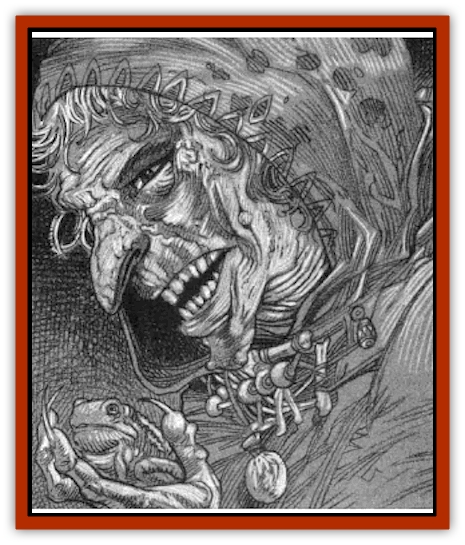
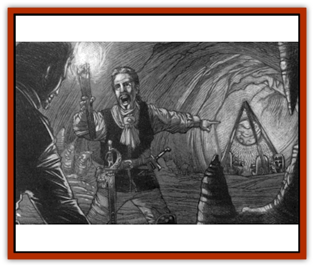

# Night Hag - Styrix

| Statistic | **Night Hag, Styrix** |
| --- | --- |
| **Activity Cycle:** | Night |
| **Alignment:** | Neutral evil |
| **Armor Class:** | 0 |
| **Climate/Terrain:** | Darkon |
| **Damage/Attack:** | 2-12 (2d6) |
| **Diet:** | Carnivore |
| **Frequency:** | Unique |
| **Hit Dice:** | 8 (40 hit points) |
| **Intelligence:** | Exceptional (16) |
| **Magic Resistance:** | 65% |
| **Morale:** | Average (8) |
| **Movement:** | 9 |
| **No. Appearing:** | 1 |
| **No. of Attacks:** | 1 |
| **Organization:** | Solitary |
| **Size:** | M (5' tall) |
| **Special Attacks:** | Disease; magical sleep |
| **Special Defenses:** | Spell immunities; cold iron, silver, or +3 weapon to hit |
| **THAC0:** | 13 |
| **Treasure:** | Nil |
| **XP Value:** | 16,000 |

From time to time, the misty tendrils of Ravenloft reach out into other lands and draw in unsuspecting beings. Often, these creatures are innocents, pulled in seemingly at random by the mysterious fluctuations of the Demiplane of Dread. Others are pulled in because of the evil things that they do. In rare cases, however, someone already trapped within the confines of Ravenloft reaches out to snare an outsider. Such is the case with the dreadful Styrix, a native of the lower planes. She was summoned into Ravenloft by one of the few people powerful enough to contain her: Azalin of Darkon. Hoping to escape the confines of Ravenloft, Styrix has created a device called the *Rip Spanner* which, she hopes, will see her clear of the misty borders.

Styrix is a [[Night_Hag|night hag]], a member of the foul and horrible race that rules Hades. In her normal form, she appears as a withered old crone with skin the color of a fresh bruise, tangled black hair, and eyes that burn a bright red in the darkness. Her lips are puffy and blistered, giving her a sickly look. Her teeth and nails are sharp and pointed, though the former look crooked and uneven while the latter are cracked and broken.

Like all her evil kind, Styrix is able to *polymorph* at will, so few ever see her true form. The shape that she most commonly takes is that of an elderly, gnarled human woman. In this guise, she often passes herself off as a kindly old woman who is alone and without family. Those kind souls who seek to comfort or befriend this poor creature run the risk of a dreadful fate.

Styrix seems to be able to speak any language known to those she encounters. Whether this is an aspect of some magical item in her possession or the product of some enchantment is unknown.

**Combat:** In melee combat, Styrix gellerally attacks with a frenzy of ripping claws and biting fangs. This is taken as a single attack that does 2-12 (2d6) points of damage. Anyone hit by her must make a Saving Throw vs. Poison or be infected with a debilitating disease. This ailment is treated exactly as if it had been produced by the 3rd-level clerical *cause disease* spell. While this disease runs its course, the victim's skin is mottled with patches of purple and black that look like open sores and bruises from a dreadful beating. Despite its vile appearance, the disease is not contagious.

In addition to her melee capability, Styrix is able to use many spell-like abilities. At will, she is able to employ *know alignment* and *polymorph self* (although the former is of limited use in Ravenloft because of the detrimental effect that the demiplane has on all detection spells).

As many as 5 times per day, she can release a volley of four *magic missiles*, each of which does 2-5 (1d4+1) points of damage. Styrix usually targets all of the missiles at a single foe, hoping to destroy that opponent utterly and to cow his or her companions in one stroke. Thrice per day, she is able to project a *ray of enfeeblement*.

Perhaps her most dreadful ability is her power to cast an unusually potent *sleep* spell. This spell can be targeted at any person of up to 12th level (or any monster with up to 12 Hit Dice). A Saving Throw vs. Spells is allowed, but failure indicates that the target has fallen into a deep magical slumber.

Once the victim is unable to defend himself or herself, Styrix will do one of two things. Most of her victims are simply consumed to satisfy her hunger for human flesh. When this happens, the life essence of her victim is torn from the body and transformed into a [[Larva|larva]]. In Styrix's home plane of Hades, these pathetic creatures are used as a sort of macabre currency. Because such things have no value in Ravenloft, Styrix employs them as mindless guardians. It is said that there are vast catacombs beneath her lair filled with these disgusting creatures.

Styrix's other victims are fed into her *Rift Spanner*, and this terrible devices absorbs their life energy to power itself. Styrix plans to use the *Rift Spanner* to escape from Ravenloft as soon as it is fully charged.

Those who make their saves against the *sleep* spell will become targeted for special torment and destruction later on through her use of a special ethereal *dreamform*. This state is similar to that induced by the *wraithform* spell but actually allows her to enter the dreams of others.

When she does this, an otherwise normal dream becomes tainted by her foul presence and turns into the veriest nightmare. As soon as she enters the dream, she leaps upon the back of the victim and begins to ride him or her like a horse. Throughout the night, the merciless hag beats and pokes at her mount to keep him or her running until dawn. When at last she leaves the dream and the victim awakes, Styryx has permanently drained away 1 point of his or her Constitution. No natural healing occurs on those fitful nights when Styrix intrudes upon a dream, nor can spells be memorized or psionic strength points be regained from such uneasy slumber. Once someone's Constitution is reduced to zero by this draining attack, his or her body dies and the spirit is transformed into a larva. The only way to halt this draining process is to destroy Styrix while the victim still has Constitution points left.

There is one restriction on the use of Styrix's *dreamform*: she cannot enter the dreams of anyone whose heart is pure. Thus, only those who have been forced to roll a Ravenloft Powers Check can be attacked in this manner. Whether or not the check was successful does not matter; only that the character committed some act which required the check in the first place.

Styrix wears a special amulet known as a *charm of blackness*, or *cob*. This periapt is made of dark iron cast in the shape of a 10-pointed star. This pendant has several magical powers and is Styrix's most prized possession. Anyone wearing the chain is instantly cured of any disease that he or she contracts. In addition, the periapt gives its wearer a +2 bonus on every saving throw he or she is required to make. Without her *cob*, Styrix is unable to assume her *dreamform* state. Curiously, the amulet does not bestow this power upon others who come into possession of it. When a good-aligned creature uses the cob, one of its ten points will break off with each use. When the last point cracks off, the amulet loses its power and becomes worthless. Creating a new *charm of blackness* requires one month of dedicated labor and the destruction of no fewer than 100 larvae.

In addition to her 65% resistance to any type of magic, Styrix is totally immune to any manner of *charm*, *sleep*, or *fear* spell, nor can she be injured by any fire- or cold-based attack, whether magical or mundane in nature. Most weapons are unable to harm Styrix as well, for only those cast from silver or cold iron, or those which have an enchantment of +3 or better, can "bite" on her withered skin.

**Habitat/Society:** In the lower planes, Styrix and her foul kindred are the de facto rulers of Hades. This is not through any plan or action of their own but is the result of their being the most numerous and most powerful natives of that plane.

Styrix was dragged from her comfortable home in Hades by the power of the [[Lich|lich]] Azalin. Knowing that the night hags frequently visited the Prime Material Plane seeking souls for the creation of new larvae, he realized that their knowledge of planar travel must be quite extensive - perhaps even sufficient to allow them to enter and leave the Demiplane of Dread at will. No longer able to learn new magics himself, Azalin hoped to cajole a night hag into helping him escape. With this in mind, the lich lord cast a potent spell and opened a gate to the depths of Hades and randomly drew one of the night hags into it.

Much to the surprise of them both, the night hag he summoned, Styrix, proved unable to escape Ravenloft. Like Azalin himself, she was now a prisoner of the demiplane. Although she was enraged by the lich's summoning, she dared not attack him - being an intelligent creature, Styrix recognized that she could not hope to defeat Azalin in a direct confrontation. Thus, she agreed to work with him in his attempts to escape from Ravenloft.

Unbeknownst to Azalin, Styrix made not one but two vows on the night she entered his service. The first was to devise a method by which she could escape from Ravenloft. The second and secret one was to see to it that Azalin both knew about her escape and was unable to follow.

Months passed, during which Azalin became less and less interested in Styrix's researches. It seemed quite clear to him that she was accomplishing nothing of any importance and that she was draining a great many resources in her efforts. At last, the lich tired of her and cast her out of his dark castle.

What Azalin did not realize was that Styrix had spent her time learning a great deal about the fabric of Ravenloft. Indeed, she had conceived of the design for a machine that might actually be capable of escaping the Demiplane of Dread. Day after day she conducted magical research and unearthed the carefully hidden secrets of the dark realms. In the end, she undoubtedly knew more about the composition of the demiplane than any other living creature.

Free of the lich's yoke, she travelled to the city of Martira Bay on the coast of the Sea of Sorrows. Here, she assumed the guise of an old woman and set up a lair in an old manor on the outskirts of town. For nearly a year, she labored away and built the mysterious *Rift Spanner*.

Recently, she completed work on the dark and terrible machine. It rests in a vast chamber deep beneath the manor house she lives in. The labyrinth of tunnels that encircles the central cavern is filled with larvae created in the months she has lived here. These foul creatures serve as Styrix's guards, keeping invaders from exploring the caverns. Thanks to them, no one has yet discovered the night hag's true nature or the details of her labors.

**Ecology:** As a night hag, Styrix is eternally hungry. Each day, she must kill and consume one person. Such a high mortality rate would certainly be noticed were it not for the fact that Martira Bay's waterfront district has a highly transient population. When she hunts in this area, Styrix *polymorphs* herself into the shape of a comely harlot or a rugged sailor. In either of these forms she is able to move freely through the waterfront district and seek out victims either to satisfy her hunger or fuel her evil machine.

---
## Discovery & Documentation

**Source Publication:** Ravenloft Appendix II: Children of the Night (1991)
**Campaign Setting:** Ravenloft
**Author(s):** William W. Connors

### Other Creatures Found in This Source Book
   * [[Brain_Living|Brain, Living]]
   * [[Ermordenung_Nostalia_Romaine|Ermordenung, Nostalia Romaine]]
   * [[Ghoul_Ghast_Jugo_Hesketh|Ghoul, Ghast, Jugo Hesketh]]
   * [[Golem_Half-|Golem, Half-]]
   * [[Golem_Mechanical_Ahmi_Vanjuko|Golem, Mechanical, Ahmi Vanjuko]]
   * [[Human_Cursed_Jacqueline_Montarri|Human, Cursed (Jacqueline Montarri)]]
   * [[Human_Madman_The_Midnight_Slasher|Human, Madman (The Midnight Slasher)]]
   * [[Human_Voodan|Human, Voodan]]
   * [[Lich_Bardic|Lich, Bardic]]
   * [[Lycanthrope_Weretiger_Jahed|Lycanthrope, Weretiger (Jahed)]]
   * [[Meazel_Salizarr|Meazel (Salizarr)]]
   * [[Medusa_Ravenloft|Medusa (Ravenloft)]]
   * [[Mummy_Greater_Senmet|Mummy, Greater, Senmet]]
   * [[Spectre_Jezra_Wagner|Spectre, Jezra Wagner]]
   * [[Thrax_Pelik|Thrax (Pelik)]]
   * [[Treant_Evil_Blackroot|Treant, Evil (Blackroot)]]
   * [[Vampire_Eastern_Mayónaka|Vampire, Eastern (Mayónaka)]]
   * [[Vampire_Illithid_Athaekeetha|Vampire, Illithid (Athaekeetha)]]
   * [[Vampyre_Vladimir_Ludzig|Vampyre (Vladimir Ludzig)]]
