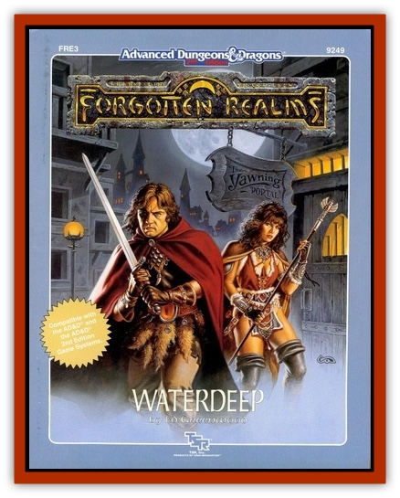

# Night Rider

| Statistic | **Night Rider** |
| --- | --- |
| **Activity Cycle:** | Any |
| **Alignment:** | Lawful Evil |
| **Armor Class:** | 7 |
| **Climate/Terrain:** | Any (guardian) |
| **Damage/Attack:** | 1-8 or by weapon type |
| **Diet:** | None |
| **Frequency:** | Rare |
| **Hit Dice:** | As in life |
| **Intelligence:** | Low (5-7) |
| **Magic Resistance:** | Special |
| **Morale:** | Very Steady (13) |
| **Movement:** | 10 |
| **No. Appearing:** | 3-24 |
| **No. of Attacks:** | As in life |
| **Organization:** | Solitary or group |
| **Size:** | M |
| **Special Attacks:** | Chill touch |
| **Special Defenses:** | <i>Protection from good</i>, <i>darkness</i> |
| **THAC0:** | As in life |
| **Treasure:** | V (magical weapons possible) |
| **XP Value:** | 650 (varies) |

These undead are created by Myrkul and a few liches and evil clerics. They are usually found as guardians or servants, and resemble zombies or (more rarely) skeletons or partially skeletal corpses. They are more powerful than both of these types of undead, and their intelligence makes them far more dangerous.

Although utterly silent in movement, night riders usually chuckle or cry out in triumph when they strike an opponent. They are so profoundly evil that they can create a *protection from good*, 10' radius at will. Night riders are turned as shadows

**Combat:** Night riders may use all sorts of weapons, but because of their relative clumsiness, they are -1 to hit with missile weapons. Unlike zombies, night riders do not necessarily strike last in a round (being faster than zombies, night riders suffer only -1 on initiative rolls).

Most night riders in the service of Myrkul are armed with *scythes of wounding +1* (treat as a *sword of wounding*), which deal a base damage of 2-8 +1.

Night riders can create *darkness* in a 15' radius at will. Their touch chills all non-undead for 1d4 hp damage, and causes a (cumulative) hour-long 1-point Strength loss

Night riders cannot use spells, potions, or magic items requiring a living touch. They suffer only half damage from edged and piercing weapons, and are unaffected by *sleep*, *charm*, *hold* and cold- based magics.

Healing spells and potions actually do damage to night riders. Such magics diminish their unlife energy, causing the loss of hit points equal to the points of healing the magic would have done to a living being. (A partial or splash hit from a potion does 1-2 hp damage.) Holy water does a night rider 2d4 damage per vial

**Habitat/Society:** Night riders are created for a purpose, and go where commanded. They have no societal organization, but are most often found with other undead—particularly gaunts (see below), normal [[Zombie|zombies]], and [[Skeleton|skeletons]]. They retain something of the intelligence they had in life, and seem drawn to areas they frequented when alive.

**Ecology:** Night Riders eat nothing, and serve no ecological niche. They may serve Myrkul or the greater undead.

**Gaunt**

AC 7; MV 24 (leap 20'); HD 2 + 2; #AT 2; Dmg 1d4; SZ L; AL LE; Morale 12; XP value 975.

Many night riders have as companions only their undead horses called gaunts. These skeletal steeds, also known as dead-mounts, are rare. Some believe them to be created only by Bane and Myrkul

Gaunts appear as skeletal horses, some with manes, tails, and even tatters of withered flesh still attached. They are of all sizes, and although their bones are as brittle as most dry bone, their unlife gives them strong and supple joints. They gallop and leap as swiftly and surely as living horses. Gaunts are turned as ghouls

Gaunts fight anything that their rider attacks, or as commanded. In battle, gaunts lash out with their hooves for 1d4 damage per attack

Their breath has a chilling effect. Living creatures within 10' must make a Constitution check every round. Failure means 1d4 hp damage and causes a (cumulative) one-point Strength loss lasting one hour

Any living being foolish enough to mount a gaunt must save vs. paralyzation every round or be paralyzed. Such paralysis can only be broken by a successful saving throw on a subsequent attempt. On the first round, the save is made at -6; on the second round, at -5; and so on. On each round of paralysis, a rider suffers an automatic 2 hp of chill damage. Helpless living riders are usually taken on a ride over a cliff. Anyone who can reach a paralyzed rider can readily pull him or her off.

Gaunts suffer only half damage from edged or piercing weapons, and are unaffected by *sleep*, *charm*, *hold* and cold- based magic. Holy water does a deadmount 2d4 damage per vial.

Some gaunts, who have lost riders far from anything that can command them, wander alone and in small bands in wilderness areas. They may even join and run with wild horses, who ignore or fear them

---
## Discovery & Documentation

**Source Publication:** FRE3 Waterdeep (1989)
**Campaign Setting:** Forgotten Realms
**Author(s):** Ed Greenwood, Allen Varney, Kim Mohan, Allen Nunis

### Other Creatures Found in This Source Book
   * [[Denizen|Denizen]]
