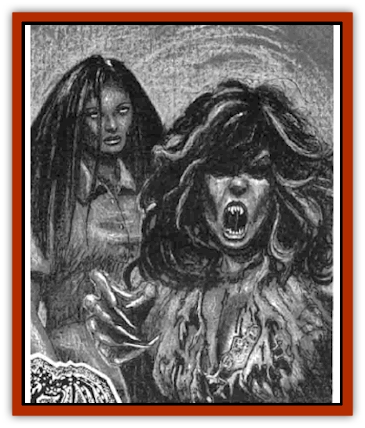

# Night Terror - Mandalain

| Statistic | **Night Terror, Mandalain** |
| --- | --- |
| **Activity Cycle:** | Night |
| **Alignment:** | Chaotic evil |
| **Armor Class:** | 3 |
| **Climate/Terrain:** | Clinic in Egertus |
| **Damage/Attack:** | 1d8+2/1d8+2 |
| **Diet:** | None |
| **Frequency:** | Unique |
| **Hit Dice:** | 9 |
| **Intelligence:** | Exceptional (15) |
| **Magic Resistance:** | 10% |
| **Morale:** | Steady (12) |
| **Movement:** | 12 |
| **No. Appearing:** | 1 |
| **No. of Attacks:** | 2 |
| **Organization:** | Solitary |
| **Size:** | M (5½' tall) |
| **Special Attacks:** | Energy drain |
| **Special Defenses:** | +1 weapon or better to hit |
| **THAC0:** | 11 |
| **Treasure:** | Nil |
| **XP Value:** | 6,000 |

The [[Nightmare_Man_The|night terror]] called Mandalain has two distinct forms. Both of these forms have ghostly qualities. The first form is that of a beautiful young woman with long brown hair and dressed in a nurse's uniform. This is how the real Mandalain looked in life. The second form is more terrifying. Her uniform becomes stained and tattered. Her hair turns wild and white streaks appear within it. Her eyes, once big and expressive, become empty pools of shadow. Her long, slender fingers take on the most dramatic change; they become surgical scalpels.

This Mandalain isn't the [[Ghost|ghost]] of the real nurse. This is a night terror constructed by the [[Nightmare_Man_The|Nightmare Man]] from the images in Dr. Illhousen's nightmares. The creature's sole purpose is to enter the waking world and torment Illhousen as it haunts his clinic.

The night terror never speaks, but it sometimes screams with such pain and agony that it sounds like Mandalain is being killed again.

**Combat:** Mandalain's scalpel hands inflict 1d8+2 points of damage when they hit, and both hands can strike in the same round. Any victim hit for maximum damage (10 points) must make a save vs. death magic or Mandalain drains 1 experience level.

The night terror can turn incorporeal at will unless in the light of the rose of midnight (see below). While incorporeal, it can't make any attacks, but neither can it be attacked. In all cases, only weapons of +1 or better can harm it. As it is not a true ghost, it can't be turned.

**Habitat/Society:** When the real Nurse Mandalain was slain by a patient at the clinic, her friend Dr. Illhousen was plagued by terrible nightmares. Some of these stemmed from the fact that the nurse had been killed with his own scalpels. The Nightmare Man took images from the nightmares and created this night terror. It has one purpose - to break lllhousen's will. It has one weakness - the rose of midnight.

**Ecology:** The night terror Mandalain has no place in the ecologies of either the waking world or the Nightmare Lands. It is a special construct designed by the Nightmare Man. It does require power, however. It gets this power by using its energy drain ability on living beings. It returns to the Nightmare Lands every day, only prowling the waking world in the middle of the night.

**The Rose of Midnight**

  All night terrors have a special weakness. If the weakness isn't exploited, a night terror can't truly be destroyed. Mandalain's weakness is a special flower that grows in only one place in the Nightmare Lands. It's called the rose of midnight. The rose grows in the middle of an empty lot situated between two tenements in [[Mullonga|Mullonga's]] Ghettoes. When the moon reaches the highest point in the sky each night, the rose of midnight blooms.

When the flower blooms, its open petals release a bright, cleansing light. The light reaches for 30 feet in all directions, and anything within the light is affected by the equivalent of a *protetion from evil* spell. In addition, the light causes members of the [[Nightmare_Court_The|Nightmare Court]] to flee for 1d6 turns. The rose remains in bloom for one hour, then its petals close for another night.

Once picked, the rose continues to function in the same manner for 1d6+1 days. Then it dies. A new rose grows in the lot 1d4+1 days after the rose dies.

As Mandalain's special weakness. the rose's light has an additional power. While the light shines upon Mandalain, the night terror can't turn incorporeal. The night terror can be destroyed while the light shines upon it. This is the only way in which Mandalain can truly be defeated.

---
## Discovery & Documentation

**Source Publication:** The Nightmare Lands (1995)
**Campaign Setting:** Ravenloft
**Author(s):** Shane Lacy Hensley

### Other Creatures Found in This Source Book
   * [[Arcane_Head|Arcane Head]]
   * [[Dreamweaver|Dreamweaver]]
   * [[Dream_Spawn_General_Information|Dream Spawn, General Information]]
   * [[Dream_Spawn_Greater_Ennui|Dream Spawn, Greater, Ennui]]
   * [[Dream_Spawn_Lesser_Morph|Dream Spawn, Lesser, Morph]]
   * [[Ghost_Dancer_The|Ghost Dancer, The]]
   * [[Human_Abber_Shaman|Human, Abber Shaman]]
   * [[Hypnos|Hypnos]]
   * [[Lost_Souls|Lost Souls]]
   * [[Morpheus|Morpheus]]
   * [[Mullonga|Mullonga]]
   * [[Nightmare_Court_The|Nightmare Court, The]]
   * [[Nightmare_Man_The|Nightmare Man, The]]
   * [[Rainbow_Serpent_The|Rainbow Serpent, The]]
