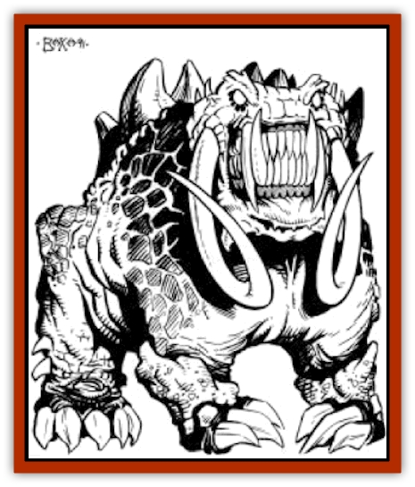

# Nightmare Beast

| Statistic | **Nightmare Beast** |
| --- | --- |
| **Activity Cycle:** | Any |
| **Alignment:** | Chaotic evil |
| **Armor Class:** | -5 |
| **Climate/Terrain:** | Any |
| **Damage/Attack:** | 2-12/2-12/2-20/2-20/4-40 |
| **Diet:** | Omnivore |
| **Frequency:** | Very rare |
| **Hit Dice:** | 15 |
| **Intelligence:** | Average (8-10) |
| **Magic Resistance:** | 20% |
| **Morale:** | Champion (15-16) |
| **Movement:** | 12 |
| **No. Appearing:** | 1 |
| **No. of Attacks:** | 5 |
| **Organization:** | Solitary |
| **Size:** | Gargantuan (30' tall) |
| **Special Attacks:** | Psionics and Spells |
| **Special Defenses:** | +1 or better to hit (see below) |
| **THAC0:** | 5 |
| **Treasure:** | Nil (F) |
| **XP Value:** | 16,000 |

**Psionics Summary**

| Level | Dis/Sci/Dev | Attack/Defense | Score | PSPs |
| --- | --- | --- | --- | --- |
| 10 | 4/4/11 | PB,MT,EW,II,PsC/M-,TS,MB,IF,TW | 17 | 180 |

**Psychokinesis -** *Science:* disintegrate; *Devotions:* ballistic attack, molecular agitation, molecular manipulation.

**Psychometabolism -** *Sciences:* nil; *Devotions:* biofeedback, double pain.

**Psychoportation -** *Sciences:* summon planar creature, teleport; *Devotion:* teleport trigger.

**Telepathy -** *Sciences:* psionic blast, tower of iron will; *Devotions:* ego whip, id insinuation, intellect fortress, mental barrier, mind blank, mind thrust, psionic crush, thought shield, contact.

Of all the creatures that roam the planet Athas, none except the [[Dragon_of_Tyr|Dragon]] is as feared, or as dangerous, as the nightmare beast.

Nightmare beasts have one immediately identifying characteristic, that being their immense size. All are nearly 20 feet tall and weigh close to 4,000 pounds each. Nightmare beasts are four-legged creatures; all these legs end in sharp claws, enabling them to climb quite well, despite their size. All nightmare beasts have similar skin coloration and texture. The skin of this creature is extremely thick and tough, very similar to that of an alligator or [[Crocodile|crocodile]], but even more durable. Though usually a dark blue/grey in color, sometimes a beast's skin will be more purple. Nightmare beasts have large red eyes, which actually glow in the dark. A nightmare beast's teeth are very long, reaching eight inches in length, and are sharp, pointed canines capable of chopping a victim in two with ease. Two pairs of a nightmare beast's teeth are nearly twice as long as the rest; one is set in the lower jaw, one in the upper. These two pairs extend outside the creature's mouth and are exposed even when its mouth is closed. The lower pair is closer together and fits inside the upper pair. Nightmare beasts have large tusk-like horns on their heads, used by the creatures to rend their victims.

**Combat:** Nightmare beasts are very dangerous combatants, capable of defeating small armies of humans by themselves.

Though huge in size, nightmare beasts are capable of fairly quick movement, allowing them to close with opponents very rapidly. Their speed on land, combined with their great weight provides them with the ability to smash through nearly any obstacle, including city walls, trees, and small natural rock formations. When a nightmare beast attempts to smash through a wall, or fortification, the DM should roll 1d20 on "Table 52: Structural Saving Throws" (see the *DMG*; use the screw or drill line). If the roll is lower than the number on the table, the wall loses � of its structural integrity. Each subsequent successful attack reduces the integrity of the wall further, until it crumbles into rubble at the beast's feet.

When engaged in melee combat, a nightmare beast is absolutely devastating. When they attack, nightmare beasts raise up onto their hind legs, enabling them to attack with their front limbs. A nightmare beast on its hind legs is approximately 35 to 40 feet tall. Nightmare beasts are capable of up five attacks per round. They attack first with their two front clawed limbs, doing 2d6 points of damage per successful attack. The beast then attacks with both its horns, each capable of inflicting 2d10 points of damage. Finally, its massive bite can cause 4d10 points of damage.

The extremely thick skin of a nightmare beast provides it with incredible protection against attack (AC -5). In addition, only +1 or better weapons have any affect on the creature. Nightmare beasts also have a small degree (20%) of magic resistance, and spells or spell-like abilities used by creatures of 4 hit dice of less do only half damage. Thus, a spell cast by a 4th-level mage that gets past the creature's magic resistance will still only do half damage. Spells which save for half damage would do � damage when cast by characters with four or less Hit Dice.

It is believed that nightmare beasts were created through use of defiler magic, and it is known that all of its spell abilities are similar in effect to defiler magic. A unique adaptation of defiler magic's life draining effects has produced the nightmare beast's ability to drain life energy from its victims. Instead of using its normal attacks in a given round, a nightmare beast can drain life energy from a victim, resulting in the victim losing 1 experience level. When a nightmare beast uses this attack, it gains the same number of hit points lost by the victim. A nightmare beast can use this its energy drain ability only three times a day.

Nightmare beasts are also capable of magical and psionic attacks. Each round, a nightmare beast may attack normally, and use either one of its spells or one of its psionic powers. The creature is able to use the following spells, twice a day, once per round: *fireball*, *lightning bolt*, *chain lightning*, *dispel magic*, *wall of fire*, *incendiary cloud*, *death fog*, and *cloudkill*. A nightmare beast is immune to the effects of it own spells and all its spells are cast at 10th level of experience. All spells used by nightmare beasts are considered use of defiler magic.

The nightmare beast is also an extremely powerful psionic using creature, capable of feats usually performed only by the eldest and most experienced psionicists of Athas. As stated above, a nightmare beast can use one of its psionic powers each round that it doesn't employ one of its spells. Also, the nightmare beast has strong psionic defense modes, all of which are considered to be always "on". Thus, any psionic attack launched at a nightmare beast is automatically defended against with the most effective defense mode. However, defense still depends upon whether or not the beast has sufficient PSPs to power the defense mode it attempts to use.

A nightmare beast will often employ the most direct and brutal attack forms it has at its disposal. Among its psionic powers, it will often favor use of its psychokinetic discipline, as it allows the creature to destroy weapons as well as buildings which may be in its way. It will frequently use its psychoportation discipline too. The teleport devotion allows the creature to instantly appear before its enemies and to vanish if it feels threatened. It will employ its summon planar creature science to summon creatures to further its destructive rampage. When it has sufficient PSPs, it will summon creatures from the outer planes first, then from the other planes as needed.

One other unique psionic ability of the nightmare beast is its "nightmare" attack. With this ability, a nightmare beast can enter the dreams of its victims and prey on their subconscious minds. This ability is used in two distinctly different manners. The first is used against future victims, those which the beast is either stalking or is intent on attacking. The beast uses this ability when these victims are sleeping. Any intended victims must save vs. spells (at -2) or suffer from nightmares of extreme horror (in which the victim is stalked, hunted, and killed by the nightmare beast). These dreams are so vivid that they prevent the victim from properly resting. The victim does not naturally heal any hit points previously lost and suffers from fatigue. Victims of fatigue suffer a -1 to all rolls, and they have their movement rates lowered as though they were "moderately encumbered". These penalties are in effect for three days, or until a *heal* spell is cast upon the victim.

The other manner in which a nightmare beast uses its "nightmare" attack is during combat. When used in combat, this ability is treated as a normal psionic ability; it can be used in the same round as the beast's melee attacks. When this ability is used, all creatures within a 50' radius of the nightmare beast must save vs. spells at -2. Those who make their saves are unaffected. Those who fail are affected the next time they go to sleep. While they sleep, victims of this attack have dreams as described above, in which they are stalked, hunted, and killed by the nightmare beast. The effects of these dreams are the same as those described above. They will also last for the same duration (three days) or until a *heal* spell is cast. Use of the "nightmare attack" ability in either manner costs the nightmare beast 50 PSPs and requires a psionic check to be employed.

**Habitat/Society:** Nightmare beasts can be encountered in virtually any terrain on Athas. Fortunately, there are very few of these creatures. Some historians think that once there were as many as a hundred of these beasts roaming the world. Now there are believed to be only half a dozen remaining.

Nightmare beasts live in their lairs for long periods of time (up to one year). After that time, they will roam the desert until they find a suitable area in which to make their new lair. When a nightmare beast settles into a new lair, it will most often settle near ancient ruins of the former civilization that once inhabited Athas. No matter where they make their lairs, nightmare beasts do so in a consistent manner. All beast lairs are very defensible and well-protected. The nightmare beast will always choose a lair that is difficult to attack from both land and air.

Nightmare beasts only rest in their lairs for short periods, usually no more that 6 hours at a time. The rest of their time is spent roaming the area near their lairs and feeding. These beasts will normally rotate between resting and roaming in 6-hour time periods. This activity cycle is maintained for days and sometimes weeks at a time. (The only time that a beast will change this cycle is when it is preparing for battle.) When resting in its lair, a nightmare beast will often use a unique variant of the psionic danger sense devotion. This ability functions as described in the *Complete Psionics Handbook* except that its range extends to cover the entire lair and the PSP cost is only 5 per hour (instead of the normal 3 per turn).

When a nightmare beast roams the area surrounding its lair, its main purpose is to feed itself. These creatures eat nearly anything, both animal and vegetable. Entire herds of [[Animal_Domestic_Athas_I|erdlus]] and [[Animal_Domestic_Athas_I|kanks]] have been killed when a nightmare beast has come across them while feeding.

There are certain creatures that a nightmare beast will not attack, even when it is searching for food. Nightmare beasts will not attack [[Drake_Athas_General_Information|drakes]] or [[Megapede|megapedes]], for example, nor would one ever try to fight the Dragon.

**Ecology:** As stated above, nightmare beasts eat almost every type of food available on Athas. However, they are unsuitable as a food source because their bodies decay rapidly after death. It is thought that this is because the magic which has sustained their lives vanishes when they die, causing an unnatural rate of decay. However, the horns, claws, and teeth of a nightmare beast make excellent weapons and are usually used in arrowheads, daggers, and (sometimes) darts. Also, the horns of a nightmare beast can be ground and mixed with water to create a paste. When consumed, the paste produces an effect similar to [[Esperweed|esperweed]], though much less powerful. The paste grants the consumer 30 additional PSPs and two wild talents. Its effect lasts for 5 rounds.

---
## Discovery & Documentation

**Source Publication:** MC12 Dark Sun Appendix I - Terrors of the Desert (1991)
**Campaign Setting:** Dark Sun
**Author(s):** Tom Prusa, Louis J. Prosperi, Walter M. Baas

### Other Creatures Found in This Source Book
   * [[Animal_Herd_Athas|Animal, Herd (Athas)]]
   * [[Animal_Household_Athas|Animal, Household (Athas)]]
   * [[Antloid_Desert|Antloid, Desert]]
   * [[Banshee_Dwarf|Banshee, Dwarf]]
   * [[Beetle_Agony|Beetle, Agony]]
   * [[Bog_Wader|Bog Wader]]
   * [[Brambleweed|Brambleweed]]
   * [[B'rohg|B'rohg]]
   * [[Burnflower|Burnflower]]
   * [[Cat_Psionic|Cat, Psionic]]
   * [[Cha'thrang|Cha'thrang]]
   * [[Cistern_Fiend|Cistern Fiend]]
   * [[Clam_Giant|Clam, Giant]]
   * [[Cloud_Ray|Cloud Ray]]
   * [[Drake_Athas_Air|Drake (Athas), Air]]
   * [[Drake_Athas_Earth|Drake (Athas), Earth]]
   * [[Drake_Athas_Fire|Drake (Athas), Fire]]
   * [[Drake_Athas_Water|Drake (Athas), Water]]
   * [[Dune_Runner|Dune Runner]]
   * [[Dune_Trapper|Dune Trapper]]
   * [[Elemental_Athas_Greater_Air|Elemental (Athas), Greater, Air]]
   * [[Elemental_Athas_Greater_Earth|Elemental (Athas), Greater, Earth]]
   * [[Elemental_Athas_Greater_Fire|Elemental (Athas), Greater, Fire]]
   * [[Elemental_Athas_Greater_Water|Elemental (Athas), Greater, Water]]
   * [[Elemental_Athas_Lesser_Air_Earth|Elemental (Athas), Lesser, Air/Earth]]
   * [[Elemental_Athas_Lesser_Fire_Water|Elemental (Athas), Lesser, Fire/Water]]
   * [[Elemental_Athas_General_Information|Elemental (Athas), General Information]]
   * [[Erdland|Erdland]]
   * [[Esperweed|Esperweed]]
   * [[Flailer|Flailer]]
   * [[Floater|Floater]]
   * [[Giant_Athas|Giant (Athas)]]
   * [[Golem_Athas_I|Golem (Athas) I]]
   * [[Golem_Athas_II|Golem (Athas) II]]
   * [[Golem_Athas_III|Golem (Athas) III]]
   * [[Golem_Athas_General_Information|Golem (Athas), General Information]]
   * [[Halfling_Renegade|Halfling, Renegade]]
   * [[Hej-kin|Hej-kin]]
   * [[Id_Fiend|Id Fiend]]
   * [[Insect_Swarm_Athas|Insect Swarm (Athas)]]
   * [[Kank_Wild|Kank, Wild]]
   * [[Kirre|Kirre]]
   * [[Megapede|Megapede]]
   * [[Mul_Wild|Mul, Wild]]
   * [[Plant_Carnivorous_Athas|Plant, Carnivorous (Athas)]]
   * [[Pterran|Pterran]]
   * [[Pterrax|Pterrax]]
   * [[Pulp_Bee|Pulp Bee]]
   * [[Pyreen|Pyreen]]
   * [[Rasclinn|Rasclinn]]
   * [[Razorwing|Razorwing]]
   * [[Roc_Athas|Roc (Athas)]]
   * [[Sand_Bride|Sand Bride]]
   * [[Sand_Cactus|Sand Cactus]]
   * [[Sand_Vortex|Sand Vortex]]
   * [[Scrab|Scrab]]
   * [[Silt_Horror|Silt Horror]]
   * [[Silt_Runner|Silt Runner]]
   * [[Sink_Worm|Sink Worm]]
   * [[Sloth_Athas|Sloth (Athas)]]
   * [[So-ut|So-ut]]
   * [[Spider_Cactus|Spider Cactus]]
   * [[Spider_Crystal|Spider, Crystal]]
   * [[Spirit_of_the_Land|Spirit of the Land]]
   * [[T'Chowb|T'Chowb]]
   * [[Thrax|Thrax]]
   * [[Tohr-kreen_I|Tohr-kreen I]]
   * [[Villichi|Villichi]]
   * [[Zhackal|Zhackal]]
   * [[Zombie_Plant|Zombie Plant]]
