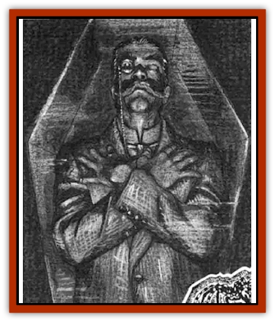
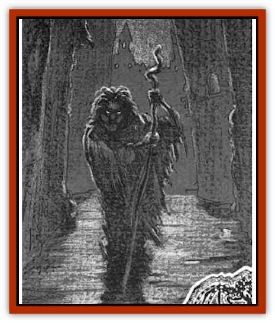
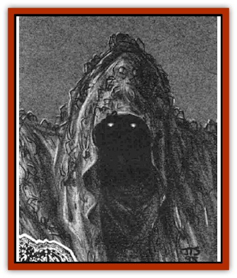
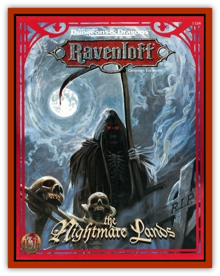

# Nightmare Court - The

[[Ghost_Dancer_The|]]The Nightmare Court is comprised of at least six distinct members, though there may be more who have yet to be identified. They dwell in the Nightmare Lands, each controlling a specific location in the domain.

One member of the Court, a being called the [[Nightmare_Man_The|Nightmare Man]], appears to be more powerful than the rest and possibly even the Court's leader. It is not known if the Nightmare Man is the sole lord of this domain, however, or if he shares this role with the entire Court. Some have even speculated that the Court is simply made up of different aspects of the Nightmare Man's personality, each given substance by the curse which binds him to the domain.

[[Hypnos|]]In any case, the Nightmare Lands' proximity to the Veil of Sleep gives the Court access to the dreams of people across the multiverse - not just those trapped within the Demiplane of Dread. The members of the Court cannot escape from the domain by crossing the Veil of Sleep, but they can pull dreamers into their mad realm.

**The Web of Dreams: **The Nightmare Court spins a mystical web whose center is the Nightmare Lands and whose threadlike filaments reach out beyond the Veil of Sleep. In the dream plane, that place which touches all worlds and is visited by the dream-selves of all people as they sleep, these mystic filements touch the passions and pathos of every dreamer. The dreams send vibrations back toward the center of the web, carrying with them images and emotions that the Nightmare Court's members can interpret.

[[Morpheus|]]Only dreams that have cores of darkness interest the Nightmare Court. The mystic web is designed to entangle such dreams and hold them for a time. A dreamer can eventually pull free of the sticky filaments, but as long as the dreamer remains entangled the web-caught nightmare plays out over and over. This may happen over the course of a single evening or through as many as six nights of troubled sleep (1d6) before the dreamer breaks free.

While trapped in the mystic web, a dreamer's dream essence provides nourishment to the Nightmare Court. Dreamers caught in this manner lose 1 point of Intelligence every night. This loss is temporary; lost points return at a rate on 1 point per day once the dreamer is no longer connected to the mystic web. See the rules book (The Nightmare Court, TSR 1124) for more details.

[[Mullonga|]]During the period that a dreamer is trapped in the Nightmare Court's web, he or she may come under the direct scrutiny of a Court member. The member sorts through the images of the dark dreams, looking for the vibrant terrors that grow best in the fertile soil of the Nightmare Lands.

Fantastic musings bordering on madness inspire Court members, as well as recent and extreme trauma and tremendous grief. These are the criteria a member uses to determine if a dreamer is seed quality. If so, the dreamer is pulled down the mystic web and imprisoned in a dreamscape, where his troubled visions serve as the seeds for dream scenes.

[[Nightmare_Man_The|]]Each member of the Court has a specific relic that serves as his or her connection to the Web of Dreams. This relic is usually hidden and protected, for the mystic energies that bind it to the web are easy to disturb. If the connection is severed, a Court member is temporarily weakened until the connection can be restored. Some believe that severing the connection is the first step necessary to destroy such a creature. See the rules book for more details on the web, relics, and the Court.

**Common Powers: **Though each member of the Court has his or her own special abilities, they all share certain common powers. These are described below.

[[Rainbow_Serpent_The|]]*Terrain Change:* A member of the Court can cause the land to change in an instant. Within a dreamscape this power has almost no limits. A Court member can automatically pull images from a dreamer's mind and use them to reshape the dream scene. In the Terrain Between, a Court member can only change the appearance of his or her particular area of influence. These changes are also given shape by the dreams of those trapped within the dreamscapes.

*Inspire Madness:* Court members can reach into a character's mind to unleash the emotions and unnamed terrors that inspire madness, thus requiring an immediate madness check. This power can be used on a specific character once per day.

*Dreamwalking:* All Court members have the ability to enter a deep trance and send their dream-selves into the dream plane. They follow the threads of the mystic web to gaze upon the dreams of the waking world beyond their cursed shores.

*Teleport Without Error:* Court members can use this spell-like power at will in their areas of influence, but are limited to three times per day in other parts of the Nightmare Lands. Court members can instantly teleport throughout the City of Nod and the Forest of Everchange, into specific dreamscapes, and even to the Outlands on the shores of the Nocturnal Sea. However, no member may teleport directly into another member's lair or into their direct area of influence (a 30-feet-diameter circle around each Court member).

*Regeneration:* As long as a Court member's connection to the mystic web remains intact, he or she can draw on the energy of the dreams caught in the web to heal damage. A Court member heals 1d4+1 points of damage per round automatically; no effort must be expended on the Court member's part to use this power.

---
## Discovery & Documentation

**Source Publication:** The Nightmare Lands (1995)
**Campaign Setting:** Ravenloft
**Author(s):** Shane Lacy Hensley

### Other Creatures Found in This Source Book
   * [[Arcane_Head|Arcane Head]]
   * [[Dreamweaver|Dreamweaver]]
   * [[Dream_Spawn_General_Information|Dream Spawn, General Information]]
   * [[Dream_Spawn_Greater_Ennui|Dream Spawn, Greater, Ennui]]
   * [[Dream_Spawn_Lesser_Morph|Dream Spawn, Lesser, Morph]]
   * [[Ghost_Dancer_The|Ghost Dancer, The]]
   * [[Human_Abber_Shaman|Human, Abber Shaman]]
   * [[Hypnos|Hypnos]]
   * [[Lost_Souls|Lost Souls]]
   * [[Morpheus|Morpheus]]
   * [[Mullonga|Mullonga]]
   * [[Nightmare_Man_The|Nightmare Man, The]]
   * [[Night_Terror_Mandalain|Night Terror, Mandalain]]
   * [[Rainbow_Serpent_The|Rainbow Serpent, The]]
