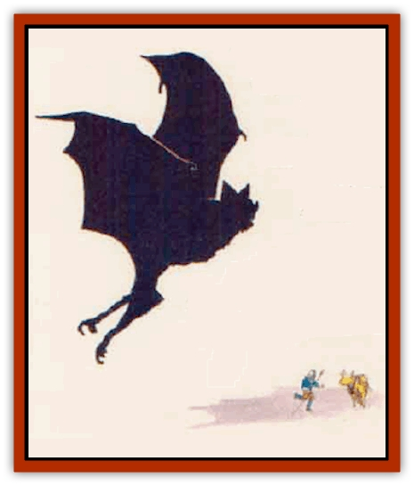

# Nightshade - Mystara

| Statistic | **Nightcrawler** | **Nightwalker** | **Nightwing** |
| --- | --- | --- | --- |
| **Activity Cycle:** | Night | Night | Night |
| **Alignment:** | Chaotic evil | Chaotic evil | Chaotic evil |
| **Armor Class:** | -4 | -6 | -8 |
| **Climate/Terrain:** | Any | Any | Any |
| **Damage/Attack:** | 2d10 (bite)/2d4 (sting) | 3d10 (fist)/3d10 (fist) | 1d6+6 (bite) |
| **Diet:** | None | None | None |
| **Frequency:** | Very rare | Very rare | Very rare |
| **Hit Dice:** | 25 | 21 | 17 |
| **Intelligence:** | Supra-genius (19-20) | Supra-genius (19-20) | Supra-genius (19-20) |
| **Magic Resistance:** | Nil | Nil | Nil |
| **Morale:** | Fearless (20) | Fearless (20) | Fearless (20) |
| **Movement:** | 12, Br 24 | 15, Fl 6 (C) | 3, Fl 24 (B) |
| **No. Appearing:** | 1 | 1 | 1 |
| **No. of Attacks:** | 2 | 2 | 1 |
| **Organization:** | Solitary | Solitary | Solitary |
| **Size:** | G (100' long) | H (20' tall) | G (30' long) |
| **Special Attacks:** | Surprise; see below | Surprise; see below | Surprise; see below |
| **Special Defenses:** | See below | See below | See below |
| **THAC0:** | 4 | 5 | 5 |
| **Treasure:** | U | U | U |
| **XP Value:** | 19,000 | 18,000 | 17,000 |

Nightshades are powerful beings from the Negative Energy who seek to spread death and destruction everywhere. Similar to undead, they are found on the Prime Material Plane only if summoned by powerful sorcerers for dark purposes.

All nightshades are jet black. The air around them is cold and smells like an open grave in winter. These creatures have no visible eyes and apparently sense their surroundings magically. They see invisible objects and *detect magic* at will.

Nightshades can read all magical writings and languages, although they cannot speak. They communicate with each other and their summoners telepathically. Nightshades never speak to their victims. Any creature that is not a nightshade or a summoner is considered a victim.

**Combat:** These aggressive monsters attack all strangers. They are usually encountered at night or in darkness. Natural daylight inflicts a -4 penalty on a nightshade's attack rolls, but light causes no other ill effects.

Because of their coloration and stealth abilities, nightshades have an increased chance to surprise opponents, as detailed in the paragraphs on each type below. This ability can, however, be negated by the chilling aura of a nightshade's presence; a nightshade noticeably chills the air within a 60-foot radius regardless of weather or temperature conditions. The chill of a nightshade is something no adventurer forgets, and an individual who has encountered a nightshade has the normal chance of being surprised by one in the future (thus, surprise penalties usually associated with the creatures are negated). The chill aura permeates solid substances, so that the aura will be felt by victims on the other side of a stone wall or above ground over a burrowing nightcrawler.

The nightshade's chilling presence spoils all consumable items within 60'. This affects rations, food, water, holy water, and magical potions, oils, and ointments. No saving throws are allowed for these items. Such materials do not become poisonous, but become so desiccated as to be useless.

The touch of a nightshade is poisonous. A victim successfully hit by a nightshade's natural attack (bite, sting, or fist) must roll a saving throw vs. poison with a -2 penalty. Failure results in instant death.

All nightshades can use the following spells at will, one per round: *charm person*, *invisibility*, *haste*, *confusion*, *cloudkill*, *darkness*, *hold person*, *cause disease*, and *dispel magic*. Once per day, nightshades can cast *finger of death*. The nightshade's spellcasting level is equal to its Hit Dice. If a nightshade uses a spell ability, it cannot make a melee attack that round.

Nightshades can summon undead once every four hours, with a 75% chance of success. The undead creatures arrive in 1d10 rounds. To learn the type of undead that responds, roll 1d8 and consult the following table:

| 1d8 Roll | Undead |
| --- | --- |
| 1-3 | 1d4+1 shadows |
| 4-5 | 1d2 wraiths |
| 6 | 1 spectre |
| 7 | 1 ghost |
| 8 | 1 spirit (hand druj) |

Nightshades can be harmed only by weapons of +3 or greater enchantment, or by spells of 6th level or greater. They are immune to all forms of poison, petrification, illusion, *charm*, *hold*, and cold spell effects.

Nightshades are partially vulnerable [[Dragon_General_Information|dragon]] breath and suffer only half damage from such attacks. If nightshades roll successful saving throws, they suffer only only one-quarter damage, rounded up.

Nightshades are turned as "special" creatures.

**Habitat/Society:** Nightshades dwell on the Negative Energy Plane, which provides them with life-sustaining energy. They can travel to the Ethereal Plane at will, but must be summoned in order to enter the Prime Material Plane.

Nightshades are all extremely clever and wise, with both Intelligence and Wisdom scores of 19. This great mental capacity is a combination of the nightshade's own wiles and the knowledge from the mind of the spellcaster who summoned it. The creature can use its summoner's knowledge to function better on the Prime Material Plane. All people, places, and objects that the summoner knows are also known by the nightshade. A nightshade uses its great intellect to plan and scheme, and to invent plots using servants (usually undead).

As solitary creatures, nightshades do not associate in packs, families, or even with mates. Nightshades have an affinity for undead. Some sages suggest that when numerous undead beings are destroyed, the energies released on the Negative Energy Plane coalesce to form a nightshade. Others speculate that nightshades are related to [[Blackball|blackballs]], and that blackballs are some sort of larval or metamorphosed form or perhaps nightshade "eggs".

Whatever their origin, nightshades can be summoned to the Prime Material Plane by use of a powerful, complex spell. Certain evil wizards of at least 16th level know this spell, but guard the secret closely. Only one nightshade can be summoned with the spell. The spell must be cast in complete darkness: summoning usually takes place deep underground or during the dark of the new moon.

**Ecology:** These unnatural, extraplanar creatures seldom interact with the environment. However, when on the Prime Material Plane, a nightshade is a destructive force capable of greatly disrupting a local ecology; a nightshade always causes death and often drives normal life forms away.

Nightshades always have treasure of great value; they swallow their treasure in order to carry it. They scorn coins, favoring instead gems, jewelly, art objects, and magical treasures. Nightshades collect treasure from their victims after a battle.

**Nightcrawler**

  Nightcrawlers are similar to [[Worm|purple worms]] in appearance, and measure about 100 feet long and 10 to 15 feet wide. Nightcrawlers are pitch black in color.

These creatures can approach an opponent by burrowing underground and attacking from below. If this is done, a -2 penalty is added to the victim's surprise roll (unless the nightshade's chill aura negates the penalty).

A nightcrawler's bite inflicts 2d10 points of damage; like any successful attack from a nightshade, the victim must succeed a saving throw vs. poison with a -2 penalty or die immediately. In addition, a nightcrawler automatically swallows its victim if the attack roll is an unmodified 19 or 20. A swallowed victim loses one level of experience per round due to the nightshade's negative energy, though a *protection from evil* or *negative plane protection* spell prevents this drain.

The nightcrawler's tail stinger causes 2d4 points of damage on a successful hit. A victim of the sting must roll a saving throw vs. poison; however, the stinger is so potent that the saving throw is made with a -4 penalty instead of the -2 penalty associated with other nightshade attacks.

Once per turn, the nightcrawler can reduce one opponent to 20% nf original size (as if casting the reversed enlarge spell at 8th level). The nightcrawler cannot attack physically in the same round that it uses the reduce power. The victim can roll a saving throw vs. spell to avoid the effect. A nightcrawler swallows a reduced victim whole on an attack roll of 15 to 20.

**Nightwalker**

  A nightwalker is a 20-foot-tal1, jet black, giant humanoid. It lurks in dark areas: opponents suffer a -2 penalty to surprise rolls. The nightwalker never carries weapons or other items; it attacks with its two massive fists each round, causing 3d10 points of damage with each successful hit. In addition, a victim must roll a saving throw vs. poison or die.

A nightwalker's attack can crush an opponent's shield or armor. Such damage is applied first to a victim's shield (if any); once it is destroyed, damage is then applied to armor. The item in question avoids the crushing effect if a successful saving throw vs. crushing blow is made; magical armors and shields add their magical bonuses to the saving throws (the bonus equals the item's bonus to Armor Class).

A nightwalker can automatically destroy any weapon or magical item simply by picking it up and smashing it flat between its hands. It cannot harm artifacts in this manner. If the item is held by an opponent, the nightshade must make a successful attack roll to grab it. No saving throw applies against this crushing effect. The nightshade cannot use its hands for anythmg else in the same round.

Once per round, a nightwalker can gaze at one opponent up to 60' away. The victim must make a successful saving throw vs. spell to avoid the gaze. If the saving throw fails, the victim is *cursed*, suffering a -4 penalty to all attack rolls and saving throws until a *dispel evil* or *remove curse* spell is cast on the victim; *remove curse* is ineffective if performed by a caster of less than 15th level. The nightwalker can use this gaze as often as it wishes, although it cannot attack while attempting the gaze. A victim can be affected by the gaze only once (until the curse is removed; after that, a victim could fall prey to the gaze again).

**Nightwing**

  The nightwing is a giant, jet black [[Bat|bat]] with a 50-foot wingspan. Its initial attack is usually a dive. It gives a -6 penalty to the victim's surprise roll (though the surprise penalty can be negated if victims recognize the nightshade's chilling aura). The dive is treated as a charge, granting the nightshade a +2 bonus to attack rolls and a +1 penalty to Armor Class, but giving opponents a -2 bonus to initiative.

Nightwings do not carry the poison effect of other nightshades. However, any victim hit by a nightwing must make a successful saving throw vs. spell or be transformed into a [[Bat|giant bat]] as if affected by a *polymorph other* spell. Anyone turned into a bat is *charmed* and will obey the nightwing. These effects last until dispelled.

A nightwing can attempt to strike a victim's magical items. It may target only shields and weapons. It suffers a -4 penalty to the attack roll. If the attack succeeds, the item is drained of one point of macrical bonus (thus, a +2 sword becomes a +1 sword). The stolen magical bonuses can be restored by a dispel evil spell, but the spell must be cast within a number of days equal to the dispelling caster's level.

---
## Discovery & Documentation

**Source Publication:** Mystara Appendix (1994)
**Campaign Setting:** Mystara
**Author(s):** John Nephew, Teeuwynn Woodruff, John Terra, Skip Williams

### Other Creatures Found in This Source Book
   * [[Actaeon|Actaeon]]
   * [[Agarat|Agarat]]
   * [[Ash_Crawler|Ash Crawler]]
   * [[Baldandar|Baldandar]]
   * [[Bargda|Bargda]]
   * [[Bhut|Bhut]]
   * [[Bird_Mystara|Bird (Mystara)]]
   * [[Blackball|Blackball]]
   * [[Choker|Choker]]
   * [[Coltpixie|Coltpixie]]
   * [[Crone_of_Chaos|Crone of Chaos]]
   * [[Darkhood|Darkhood]]
   * [[Darkwing|Darkwing]]
   * [[Decapus|Decapus]]
   * [[Deep_Glaurant|Deep Glaurant]]
   * [[Diabolus|Diabolus]]
   * [[Dimensional_Warper|Dimensional Warper]]
   * [[Dragon_Mystara_Crystalline|Dragon (Mystara), Crystalline]]
   * [[Dragon_Mystara_Jade|Dragon (Mystara), Jade]]
   * [[Dragon_Mystara_Onyx|Dragon (Mystara), Onyx]]
   * [[Dragon_Mystara_Ruby|Dragon (Mystara), Ruby]]
   * [[Drake_Mystara|Drake (Mystara)]]
   * [[Dragonfly|Dragonfly]]
   * [[Dusanu|Dusanu]]
   * [[Elemental_of_Chaos_Air_Earth|Elemental of Chaos, Air/Earth]]
   * [[Elemental_of_Chaos_Fire_Water|Elemental of Chaos, Fire/Water]]
   * [[Elemental_of_Law_Air_Earth|Elemental of Law, Air/Earth]]
   * [[Elemental_of_Law_Fire_Water|Elemental of Law, Fire/Water]]
   * [[Familiar_Mystara|Familiar (Mystara)]]
   * [[Frost_Salamander|Frost Salamander]]
   * [[Fundamental_Air_Earth|Fundamental, Air/Earth]]
   * [[Fundamental_Fire_Water|Fundamental, Fire/Water]]
   * [[Gargantua_Mystara|Gargantua (Mystara)]]
   * [[Geonid|Geonid]]
   * [[Ghostly_Horde|Ghostly Horde]]
   * [[Giant_Athach|Giant, Athach]]
   * [[Giant_Hephaeston|Giant, Hephaeston]]
   * [[Golem_Drolem|Golem, Drolem]]
   * [[Golem_Mystara_I|Golem (Mystara) I]]
   * [[Golem_Mystara_II|Golem (Mystara) II]]
   * [[Golem_Mystara_III|Golem (Mystara) III]]
   * [[Gray_Philosopher|Gray Philosopher]]
   * [[Guardian_Warrior|Guardian Warrior]]
   * [[Gyerian|Gyerian]]
   * [[Herex|Herex]]
   * [[Hivebrood|Hivebrood]]
   * [[Horde|Horde]]
   * [[Hsiao|Hsiao]]
   * [[Huptzeen|Huptzeen]]
   * [[Hutaakan|Hutaakan]]
   * [[Imp_Mystara|Imp (Mystara)]]
   * [[Jellyfish_Giant_Mystara|Jellyfish, Giant (Mystara)]]
   * [[Kna|Kna]]
   * [[Kopru|Kopru]]
   * [[Lizard_Mystara|Lizard (Mystara)]]
   * [[Lizard-kin_Mystara|Lizard-kin (Mystara)]]
   * [[Lupin|Lupin]]
   * [[Lycanthrope_Werejaguar_Mystara|Lycanthrope, Werejaguar (Mystara)]]
   * [[Lycanthrope_Wereswine|Lycanthrope, Wereswine]]
   * [[Magen|Magen]]
   * [[Manikin|Manikin]]
   * [[Mek|Mek]]
   * [[Mujina|Mujina]]
   * [[Nagpa|Nagpa]]
   * [[Neh-thalggu|Neh-thalggu]]
   * [[Nuckalavee|Nuckalavee]]
   * [[Pegataur|Pegataur]]
   * [[Phanaton|Phanaton]]
   * [[Plant_Dangerous_Mystara|Plant, Dangerous (Mystara)]]
   * [[Plasm|Plasm]]
   * [[Rakasta|Rakasta]]
   * [[Rock_Man|Rock Man]]
   * [[Sabreclaw|Sabreclaw]]
   * [[Sacrol|Sacrol]]
   * [[Scamille|Scamille]]
   * [[Shapeshifter|Shapeshifter]]
   * [[Shargugh|Shargugh]]
   * [[Shark-kin|Shark-kin]]
   * [[Sollux|Sollux]]
   * [[Spectral_Death|Spectral Death]]
   * [[Spectral_Hound|Spectral Hound]]
   * [[Spider-kin|Spider-kin]]
   * [[Spirit_Mystara|Spirit (Mystara)]]
   * [[Statue_Living|Statue, Living]]
   * [[Surtaki|Surtaki]]
   * [[Tabi|Tabi]]
   * [[Thoul|Thoul]]
   * [[Thunderhead|Thunderhead]]
   * [[Tiger_Ebon|Tiger, Ebon]]
   * [[Topi|Topi]]
   * [[Tortle|Tortle]]
   * [[Vampire_Velya|Vampire, Velya]]
   * [[White_Fang|White Fang]]
   * [[Worm_Mystara|Worm (Mystara)]]
   * [[Wyrd|Wyrd]]
   * [[Yowler|Yowler]]
   * [[Zombie_Lightning|Zombie, Lightning]]
