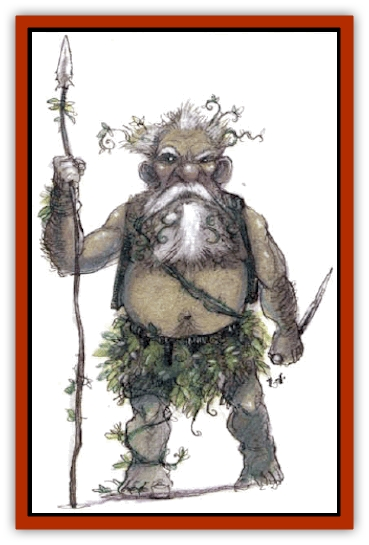

# Nightshade - Toril

| Statistic | **Nightshade (Toril)** |
| --- | --- |
| **Activity Cycle:** | Night |
| **Alignment:** | Neutral evil |
| **Armor Class:** | 7 |
| **Climate/Terrain:** | Any forests and caves |
| **Damage/Attack:** | 2-5(1d4+1) or by weapon type |
| **Diet:** | Blood and bones |
| **Frequency:** | Uncommon |
| **Hit Dice:** | 1+4 |
| **Intelligence:** | Average (10) |
| **Magic Resistance:** | Nil |
| **Morale:** | Elite (14) |
| **Movement:** | 9 |
| **No. Appearing:** | 1-4 or 3-30 |
| **No. of Attacks:** | 1 |
| **Organization:** | Tribal |
| **Size:** | M (4' high) |
| **Special Attacks:** | Poisonous sap, spells |
| **Special Defenses:** | Immune to wooden weapons, spells |
| **THAC0:** | 19 |
| **Treasure:** | B,X |
| **XP Value:** | 270 |

Nightshades, or *wood woses*, are the elemental spirits of poisonous plants like mistletoe, hemlock, foxglove, and belladonna. They live in dark, unhallowed forests and caverns.

Nightshades oddly resemble sylvan [[Dwarf|dwarves]] with dark brown skin, stocky but supple, as flexible as reeds or willows. Their thick beards and thatch-like hair are full of vines and leaves. They wear only kilts and vests of woven fibers. They carry weapons of beaten copper or bronze. They speak their own tongue, the languages of plants and fungi, and the language of [[Brownie_Quickling|quicklings]].

**Combat:** In combat, nightshades wield bronze spears or short swords. They are immune to wooden weapons like clubs, bo sticks, and staves; even magical shillelaghs or enchanted staves are useless. Nightshades suffer double damage from fire.

Wood woses use their sap to poison blades, though the poison becomes inactive after 10 rounds of contact with air. It takes one round to poison a blade, and, unless the victim makes a saving throw versus poison, the poison reduces the victim's dexterity by 1. When a victim's dexterity drops below 3, he is rendered immobile. When it is less than 1, he dies, to sprout as a nightshade the following full moon.

Striking a wood wose with a claw, fist, or kick is dangerous; their stinging poison does 1-4 hp damage to the attacker. Creatures grasped and held by a nightshade for a round lose a point of dexterity and suffer 2-5 hp damage.

Nightshades can *speak with plants* and *pass without trace* at will, and use *entangle* and *plant door* 1 time per day. In groups of six or more there is always a nightshade mage, who has the spell powers of a 5th-level druid. A group of seven or more nightshades can summon a [[Shambling_Mound|shambling mound]] once per month. To recite the magic words of the summoning spell, the wood woses must first drink blood. The summoning takes six turns; thereafter the nightshades command the shambling mound all night.

**Habitat/Society:** Nightshades in the wild are elusive nighttime hunters. By day they retreat into hollow logs, caverns, or other dark places to hide from the sun. They mate for life, though most mated pairs produce no more than two offspring.

Nightshade outposts take the form of dark, echoing groves. They dwell in small foraging groups and are semi-nomadic, leaving their groves when the forest is silent. They grow rings of poisonous plants, twist trees, and clog forests with mistletoe.

Wood woses are cold and uncaring creatures. They capture trespassers for sacrifices to their high queen; particularly dangerous prisoners are kept sedated. Nightshades are not greedy; gold and gems mean little to them. Magic potions and poisons, however, are greatly prized.

Nightshades are only active during the growing season. During fall, they become sluggish, finally crawling into dark lairs where they hibernate all winter, reawakening in the spring.

The nightshades' high queen is Ainecotte, the oldest and most intelligent of them all. She has the powers of a 7th-level druid and rules through terror and blackmail.

**Ecology:** Nightshades eat the blood and bones of living creatures. Their numbers rarely increase naturally; usually they are created by druids or priests dabbling in necromancy and the dark arts of venoms and unnatural growth.

Nightshades' only enemies are [[Treant|treants]], druids, and rangers, who root them out like weeds. No natural predator will eat a nightshade after the first bite (except [[Hook_Horror|hook horrors]]). Nightwood shades are on good terms with [[Korred|korred]], [[Needleman|needlemen]], and evil [[Myconid|myconids]]. They trade poisons to the quicklings in exchange for weapons.

---
## Discovery & Documentation

**Source Publication:** Monstrous Compendium, 1994 Annual, Volume 1 (1995)
**Campaign Setting:** Advanced Dungeons & Dragons 2nd Edition
**Author(s):** David Wise

### Other Creatures Found in This Source Book
   * [[Abyss_Ant|Abyss Ant]]
   * [[Achaierai|Achaierai]]
   * [[Afanc|Afanc]]
   * [[Al-Jahar|Al-Jahar]]
   * [[Baelnorn|Baelnorn]]
   * [[Baneguard|Baneguard]]
   * [[Banelar|Banelar]]
   * [[Bird_Talking|Bird, Talking]]
   * [[Blazing_Bones|Blazing Bones]]
   * [[Campestri|Campestri]]
   * [[Caniquine|Caniquine]]
   * [[Cat_Winged|Cat, Winged]]
   * [[Crypt_Servant|Crypt Servant]]
   * [[Death's_Head_Tree|Death's Head Tree]]
   * [[Dog_Saluqi|Dog, Saluqi]]
   * [[Dragon_Electrum|Dragon, Electrum]]
   * [[Dragon_Fang|Dragon, Fang]]
   * [[Dragon_Linnorm_Corpse_Tearer|Dragon, Linnorm, Corpse Tearer]]
   * [[Dragon_Linnorm_Dread|Dragon, Linnorm, Dread]]
   * [[Dragon_Linnorm_Flame|Dragon, Linnorm, Flame]]
   * [[Dragon_Linnorm_Forest|Dragon, Linnorm, Forest]]
   * [[Dragon_Linnorm_Frost|Dragon, Linnorm, Frost]]
   * [[Dragon_Linnorm_Gray|Dragon, Linnorm, Gray]]
   * [[Dragon_Linnorm_Land|Dragon, Linnorm, Land]]
   * [[Dragon_Linnorm_Midgard|Dragon, Linnorm, Midgard]]
   * [[Dragon_Linnorm_Rain|Dragon, Linnorm, Rain]]
   * [[Dragon_Linnorm_Sea|Dragon, Linnorm, Sea]]
   * [[Dragon_Neutral_Jacinth|Dragon, Neutral, Jacinth]]
   * [[Dragon_Neutral_Jade|Dragon, Neutral, Jade]]
   * [[Dragon_Neutral_Pearl|Dragon, Neutral, Pearl]]
   * [[Dread|Dread]]
   * [[Dragon-kin|Dragon-kin]]
   * [[Elemental_Earth_Kin_Chrysmal|Elemental, Earth Kin, Chrysmal]]
   * [[Elemental_Earth_Kin_Earth_Weird|Elemental, Earth Kin, Earth Weird]]
   * [[Elemental_Fire_Kin_Azer|Elemental, Fire Kin, Azer]]
   * [[Elemental_Sandman|Elemental, Sandman]]
   * [[Elemental_Wind_Walker|Elemental, Wind Walker]]
   * [[Elemental_Vermin|Elemental Vermin]]
   * [[Feystag|Feystag]]
   * [[Flame_Skull|Flame Skull]]
   * [[Foulwing|Foulwing]]
   * [[Gambado|Gambado]]
   * [[Garbug|Garbug]]
   * [[Genie_Tasked_Administrator|Genie, Tasked, Administrator]]
   * [[Genie_Tasked_Deceiver|Genie, Tasked, Deceiver]]
   * [[Genie_Tasked_Harim_Servant|Genie, Tasked, Harim Servant]]
   * [[Genie_Tasked_Messenger|Genie, Tasked, Messenger]]
   * [[Genie_Tasked_Miner|Genie, Tasked, Miner]]
   * [[Genie_Tasked_Oathbinder|Genie, Tasked, Oathbinder]]
   * [[Gibbering_Mouther|Gibbering Mouther]]
   * [[Gnasher|Gnasher]]
   * [[Gnasher_Winged|Gnasher, Winged]]
   * [[Golem_Brain|Golem, Brain]]
   * [[Golem_Hammer|Golem, Hammer]]
   * [[Golem_Metagolem|Golem, Metagolem]]
   * [[Golem_Spiderstone|Golem, Spiderstone]]
   * [[Gorynych|Gorynych]]
   * [[Greelox|Greelox]]
   * [[Helmed_Horror|Helmed Horror]]
   * [[Jarbo|Jarbo]]
   * [[Laraken|Laraken]]
   * [[Lich_Psionic|Lich, Psionic]]
   * [[Living_Steel|Living Steel]]
   * [[Lock_Lurker|Lock Lurker]]
   * [[Loxo|Loxo]]
   * [[Lycanthrope_Loup_de_Noir|Lycanthrope, Loup de Noir]]
   * [[Lycanthrope_Werebadger|Lycanthrope, Werebadger]]
   * [[Lycanthrope_Werejaguar|Lycanthrope, Werejaguar]]
   * [[Lythlyx|Lythlyx]]
   * [[Magebane|Magebane]]
   * [[Marrashi|Marrashi]]
   * [[Metalmaster|Metalmaster]]
   * [[Mimic_House_Hunter|Mimic, House Hunter]]
   * [[Naga_Bone|Naga, Bone]]
   * [[Nautilus_Giant|Nautilus, Giant]]
   * [[Nishruu|Nishruu]]
   * [[Noran|Noran]]
   * [[Opinicus|Opinicus]]
   * [[Ormyrr|Ormyrr]]
   * [[Parasite|Parasite]]
   * [[Pasari-Niml|Pasari-Niml]]
   * [[Plant_Vampire_Moss|Plant, Vampire Moss]]
   * [[Pteraman|Pteraman]]
   * [[Rautym|Rautym]]
   * [[Shadeling|Shadeling]]
   * [[Skum|Skum]]
   * [[Snake_Giant_Cobra|Snake, Giant Cobra]]
   * [[Snake_Stone|Snake, Stone]]
   * [[Spectral_Wizard|Spectral Wizard]]
   * [[Spell_Weaver|Spell Weaver]]
   * [[Spider_Brain|Spider, Brain]]
   * [[Suwyze|Suwyze]]
   * [[Tatalla|Tatalla]]
   * [[Tick_Heart|Tick, Heart]]
   * [[Tree_Dark|Tree, Dark]]
   * [[Tree_Singing|Tree, Singing]]
   * [[Tressym|Tressym]]
   * [[Troll_Snow|Troll, Snow]]
   * [[Tuyewera|Tuyewera]]
   * [[Ulitharid|Ulitharid]]
   * [[Undead_Dwarf|Undead Dwarf]]
   * [[Undead_Lake_Monster|Undead Lake Monster]]
   * [[Whipsting|Whipsting]]
   * [[Windghost|Windghost]]
   * [[Wolf_Dread|Wolf, Dread]]
   * [[Wolf_Stone|Wolf, Stone]]
   * [[Wolf_Vampiric|Wolf, Vampiric]]
   * [[Wraith_Shimmering|Wraith, Shimmering]]
   * [[Xantravar|Xantravar]]
   * [[Xaver|Xaver]]
