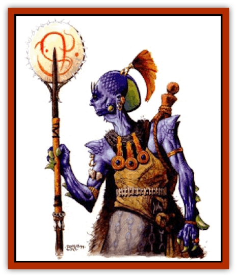

# Nikaal

| Statistic | **Nikaal** |
| --- | --- |
| **Activity Cycle:** | Day |
| **Alignment:** | Chaotic neutral |
| **Armor Class:** | 8 |
| **Climate/Terrain:** | Any land |
| **Damage/Attack:** | By weapon or 1d4/1d4 |
| **Diet:** | Omnivore |
| **Frequency:** | Uncommon |
| **Hit Dice:** | 3 |
| **Intelligence:** | Average (8-10) |
| **Magic Resistance:** | Nil |
| **Morale:** | Steady (11-12) |
| **Movement:** | 10 |
| **No. Appearing:** | 10-100 (1d10&times;10) |
| **No. of Attacks:** | 1 or 2 |
| **Organization:** | Tribal |
| **Size:** | M (6' tall) |
| **Special Attacks:** | Acid spit |
| **Special Defenses:** | Nil |
| **THAC0:** | 18 |
| **Treasure:** | Varies |
| **XP Value:** | 175 |

**Psionics Summary**

| Level | Dis/Sci/Dev | Attack/Defense | Score | PSPs |
| --- | --- | --- | --- | --- |
| 3 | 1/1/3 | PsC/MB | 7 | 20 |

**Telepathy -** *Science:* mind link; *Devotions:* contact, sight link, psionic crush.

The nikaal are a mysterious race of [[Lizard|lizard]]-like humanoids. They are far-wandering traders and explorers. Though their origin is shrouded in mystery, some Athasians believe there is a nikaal homeland beyond the Ringing Mountains.

The nikaal are 5 to 6 feet tall and weigh 150 to 250 pounds. Although their facial features are similar to humans, their scales and eyes set them apart. Their bodies are covered with fine, purple scales that regulate the body temperature in the searing desert sun and prevent evaporation of vital fluids. Nikaal need half as much water as humans, and they have twice the endurance while exposed to the harsh environment of Athas. Nikaalian eyes have a distinctly serpentine shape and color.

**Combat:** As traders, nikaal try to avoid unnecessary combat. When provoked, nikaal can be savage.

Nikaal rarely use armor as it disrupts their natural thermostats. If the situation warrants, individuals may use wooden breast plates or hide armor but never metal armor. Wearing any armor doubles the nikaal's water needs and metal armor quadruples water requirements. Frequently, nikaal use a small to medium-sized shield.

Nikaal can use any weapons, but are known to prefer blowguns, javelins, spears, clubs, swords, and polearms. The nikaal have a weapon that is unique among their race, a polearm with a circular, jagged blade called a "tkaesali" (12 pounds, size L, type S, MV 8, Dmg 1-8/1-12). Tkaesali are reserved for celebrated warriors, tribal elders, and shaman. They are frequently decorated with totems and war trophies. Nikaal carrying tkaesali are treated with reverence by other nikaal. If an individual loses his tkaesali, he is ostracized until he finds his prized weapon. If it is in the possession of a member of another race, that individual must be defeated in personal combat to regain stature among the tribe.

Nikaal frequently go into combat without the benefit of weapons. In such situations, the creatures attack with two claws for 1-4 (1d4) points of damage each. Nikaal also have the ability to spit acid. This attack causes 2-8 (2d4) points of damage and can be made once every third combat round. Victims can save vs. breath weapon for half damage. This acid attack is in addition to any other melee attack the nikaal receive.

**Habitat/Society:** The nikaal are a nomadic tribal race led by an elder council. Nikaal tribes range from 10-100 members. Tribes usually travel between major urban areas of Athas, trading goods acquired from other towns and in their journeys.

For every 10 nikaal in a tribe there is an elite warrior with 5 HD. If there are 30 or more, there is also a captain (AC 5 and 7 HD) that leads the tribe in combat.

The tribal shaman is a cleric that worships any one of the elemental planes. Rarely do these clerics reach higher than 5th level and never higher than 8th.

**Ecology:** Nikaal live an average of 50 years. Because they are nomadical tribes rarely stay in one place for more than a week except during a tribal crisis, such as the appointment of a new elder.

---
## Discovery & Documentation

**Source Publication:** Dark Sun Appendix II - Terrors Beyond Tyr (1991)
**Campaign Setting:** Dark Sun
**Author(s):** Jim Atkiss, Steve Brown, Timothy B. Brown, Andrew P. Morris, Bruce Nesmith, Wes Nicholson, Bill Slavicsek

### Other Creatures Found in This Source Book
   * [[Aarakocra_Athas|Aarakocra (Athas)]]
   * [[Animal_Domestic_Athas_II|Animal, Domestic (Athas) II]]
   * [[Aviarag|Aviarag]]
   * [[Baazrag|Baazrag]]
   * [[Baazrag_Boneclaw|Baazrag, Boneclaw]]
   * [[Bloodgrass|Bloodgrass]]
   * [[Cactus_Hunting|Cactus, Hunting]]
   * [[Cactus_Rock|Cactus, Rock]]
   * [[Cilops|Cilops]]
   * [[Crodlu|Crodlu]]
   * [[Dagorran|Dagorran]]
   * [[Dhaot|Dhaot]]
   * [[Drake_Lesser_Athas_General_Information|Drake, Lesser (Athas), General Information]]
   * [[Drake_Lesser_Athas_Magma|Drake, Lesser (Athas), Magma]]
   * [[Drake_Lesser_Athas_Rain|Drake, Lesser (Athas), Rain]]
   * [[Drake_Lesser_Athas_Silt|Drake, Lesser (Athas), Silt]]
   * [[Drake_Lesser_Athas_Sun|Drake, Lesser (Athas), Sun]]
   * [[Dray|Dray]]
   * [[Drik|Drik]]
   * [[Dune_Reaper|Dune Reaper]]
   * [[Dwarf_Athas|Dwarf (Athas)]]
   * [[Elemental_Beast_Athas_Air|Elemental Beast (Athas), Air]]
   * [[Elemental_Beast_Athas_Earth|Elemental Beast (Athas), Earth]]
   * [[Elemental_Beast_Athas_Fire|Elemental Beast (Athas), Fire]]
   * [[Elemental_Beast_Athas_Water|Elemental Beast (Athas), Water]]
   * [[Elf_Athas|Elf (Athas)]]
   * [[Fael|Fael]]
   * [[Feylaar|Feylaar]]
   * [[Fordorran|Fordorran]]
   * [[Giant_Half-giant|Giant, Half-giant]]
   * [[Giant_Shadow|Giant, Shadow]]
   * [[Golem_Athas_Magma|Golem (Athas), Magma]]
   * [[Golem_Athas_Salt|Golem (Athas), Salt]]
   * [[Golem_Athas_General_Information|Golem (Athas), General Information]]
   * [[Gorak|Gorak]]
   * [[Halfling_Athas|Halfling (Athas)]]
   * [[Human_Athas|Human (Athas)]]
   * [[Jhakar|Jhakar]]
   * [[Kaisharga|Kaisharga]]
   * [[Kes'trekel|Kes'trekel]]
   * [[Klar|Klar]]
   * [[Krag|Krag]]
   * [[Kragling|Kragling]]
   * [[Lirr|Lirr]]
   * [[Mastyrial|Mastyrial]]
   * [[Meorty|Meorty]]
   * [[Mul|Mul]]
   * [[Paraelemental_Beast_General_Information|Paraelemental Beast, General Information]]
   * [[Paraelemental_Beast_Magma|Paraelemental Beast, Magma]]
   * [[Paraelemental_Beast_Rain|Paraelemental Beast, Rain]]
   * [[Paraelemental_Beast_Silt|Paraelemental Beast, Silt]]
   * [[Paraelemental_Beast_Sun|Paraelemental Beast, Sun]]
   * [[Pakubrazi|Pakubrazi]]
   * [[Psionocus|Psionocus]]
   * [[Psurlon|Psurlon]]
   * [[Raaig|Raaig]]
   * [[Retriever_Obsidian|Retriever, Obsidian]]
   * [[Ruktoi|Ruktoi]]
   * [[Ruvoka_Athas|Ruvoka (Athas)]]
   * [[Sand_Howler|Sand Howler]]
   * [[Scorpion_Athas|Scorpion (Athas)]]
   * [[Seed_Brain|Seed, Brain]]
   * [[Silt_Horror_Black|Silt Horror, Black]]
   * [[Silt_Horror_Magma|Silt Horror, Magma]]
   * [[Silt_Horror_Red|Silt Horror, Red]]
   * [[Silt_Spawn|Silt Spawn]]
   * [[Slig|Slig]]
   * [[Spider_Athas|Spider (Athas)]]
   * [[Spinewyrm|Spinewyrm]]
   * [[Ssurran|Ssurran]]
   * [[Stalking_Horror|Stalking Horror]]
   * [[Tarek|Tarek]]
   * [[Tari|Tari]]
   * [[Thri-kreen|Thri-kreen]]
   * [[T'liz|T'liz]]
   * [[Tohr-kreen_II|Tohr-kreen II]]
   * [[Tohr-kreen_III|Tohr-kreen III]]
   * [[Trin|Trin]]
   * [[Tul'k|Tul'k]]
   * [[Undead_Athas_General_Information|Undead (Athas), General Information]]
   * [[Wraith_Athas|Wraith (Athas)]]
   * [[Xerichou|Xerichou]]
   * [[Zombie_Thinking|Zombie, Thinking]]
