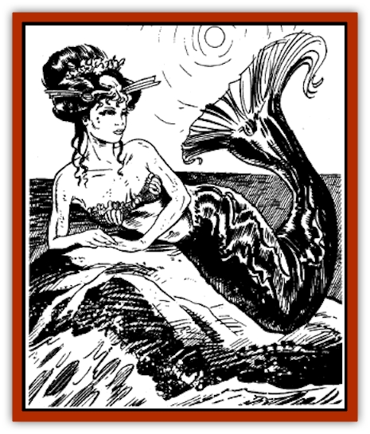

# Ningyo

| Statistic | **Ningyo** |
| --- | --- |
| **Activity Cycle:** | Any |
| **Alignment:** | Chaotic good |
| **Armor Class:** | 7 |
| **Climate/Terrain:** | Tropical, subtropical, and temperate ocean |
| **Damage/Attack:** | By weapon type |
| **Diet:** | Carnivore |
| **Frequency:** | Rare |
| **Hit Dice:** | 2 to 5 |
| **Intelligence:** | Very (11-12) |
| **Magic Resistance:** | Nil |
| **Morale:** | Average (10) |
| **Movement:** | Sw 18 |
| **No. Appearing:** | 2-20 |
| **No. of Attacks:** | 1 |
| **Organization:** | School |
| **Size:** | L (6' long) |
| **Special Attacks:** | Spells |
| **Special Defenses:** | Spells |
| **THAC0:** | 2 HD: 19 / 3-4 HD: 17 / 5 HD: 15 |
| **Treasure:** | I |
| **XP Value:** | 2 HD: 120 / 3 HD: 175 / 4 HD: 270 / 5 HD: 420 |

Eastern relatives of [[Merman|mermen]], ningyo are a reclusive, peace-loving race of intelligent sea-dwellers.

Ningyo have slender human torsos, which are covered with pale yellow or light blue skin. They also have the scaly tails of fish, which are deep green or dark blue in color. Wide fins at the end of their tails help propel the ningyo through water. Their eyes are silver or gold. Male ningyo are about 6 feet long; females measure about 5 feet.

These creatures have flaming red tresses. Males wear their hair to their shoulders. Females have hair that flows to their waists. Many ningyo adorn themselves with necklaces and bracelets made of colorful shells, strung on lengths of woven seaweed. Ningyo can breathe both water and air, but being away from the water debilitates them, and they seldom surface while swimming. Sailors and beach-combers occasionally have spotted ningyo sunning themselves on flat rocks near the ocean shore. Sometimes they leap upward through the surface of the water, spinning and twisting through the air before splashing back into the sea.

Ningyo speak the Lord of the Sea's language, as well as the trade language. They also can converse with all types of [[Fish|fish]].

**Combat:** Ningyo are generally passive, and prefer to avoid violent confrontation. However, if forced, they will fight with whatever weapons are available, swimming to safety as soon as the danger has passed or an opening presents itself.

Ningyo normally do not carry weapons, but when armed, they have either spears or tridents. Typically, 60% of an armed ningyo force carries tridents, and 40% have spears.

Ningyo have the spellcasting abilities of a shukenja and wu jen whose level equals their Hit Dice. Thus, a 3 HD ningyo has the spellcasting abilities of a 3rd-level shukenja and a 3rd-level wu jen. Typical spells employed by ningyo include *bless*, *cure light wounds*, *deflection*, *know history*, *comprehend languages*, *ghost light*, *hypnotism*, and *animate water*.

Ningyo cannot survive out of water for any length of time. Each round they spend above the surface, they suffer 1 hit point of damage.

**Habitat/Society:** Ningyo do not form permanent settlements. Instead, they roam with the currents and follow the schools of fish upon which they feed. They sometimes construct temporary shelters by lining underwater ledges with seaweed; such shelters are commonly used for spawning females.

A ningyo school comprises 1-10 males, an equal number of females, and a number of children equal to 50% of the adults. For every 10 adults, there is a leader with 2 or 3 Hit Dice. For schools with 20 or more adults, there is a chieftain with 4 or 5 Hit Dice (in addition to any leaders). Schools with 20 or more adults have a 25% chance of being accompanied by 2-8 (2d4) [[Dolphin|dolphins]], who serve as the ningyo's guards and aides.

Female ningyo give birth to 1-4 infants about once every 10 years. The infants grow quickly, reaching 3 feet in length (1 HD) within the first year. Following a season in which the females have been especially prolific, a ningyo school may split into two schools, each school going their own way. A ningyo has an average life expectancy of 200 years.

Ningyo show little interest in the surface world, preferring instead to serve the Lord of the Sea. Unlike the [[Spirit_Folk|sea spirit folk]], they are under no obligation to obey him. But the ningyo have a long tradition of loyal service, and rarely ignore the Sea Lord's summons or requests. Despite their apathy towards the affairs of men, ningyo feel kindly towards humans and often help them. Sailors consider ningyo to be protectors, and sometimes make offerings to them, especially during great storms.

**Ecology:** Ningyo have an affinity with all sea creatures who share their philosophy of peace. In addition to dolphins, ningyo have been known to align themselves with sea spirit folk, particularly when engaged in service to the Sea Lord.

Ningyo eat all varieties of small fish, enjoying an occasional oyster or crab. They supplement their diets with seaweed and plankton.

---
## Discovery & Documentation

**Source Publication:** MC6 Kara-Tur Appendix (1990)
**Campaign Setting:** Kara-Tur (Forgotten Realms)
**Author(s):** Rick Swan

### Other Creatures Found in This Source Book
   * [[Bajang|Bajang]]
   * [[Bakemono|Bakemono]]
   * [[Bisan|Bisan]]
   * [[Buso|Buso]]
   * [[Carp_Giant|Carp, Giant]]
   * [[Centipede_Spirit|Centipede, Spirit]]
   * [[Chu-u|Chu-u]]
   * [[Con-tinh|Con-tinh]]
   * [[Doc_cu'o'c|Doc cu'o'c]]
   * [[Duruch'i-lin|Duruch'i-lin]]
   * [[Flame_Spirit|Flame Spirit]]
   * [[Foo_Creature|Foo Creature]]
   * [[Gaki|Gaki]]
   * [[Gargantua|Gargantua]]
   * [[Goblin_Rat|Goblin Rat]]
   * [[Hai_Nu|Hai Nu]]
   * [[Hannya|Hannya]]
   * [[Hengeyokai|Hengeyokai]]
   * [[Hsing-sing|Hsing-sing]]
   * [[Hu_Hsien|Hu Hsien]]
   * [[Human_Kara-Tur|Human (Kara-Tur)]]
   * [[Ikiryo|Ikiryo]]
   * [[Jishin_Mushi|Jishin Mushi]]
   * [[Kala|Kala]]
   * [[Kaluk|Kaluk]]
   * [[Kappa|Kappa]]
   * [[Korobokuru|Korobokuru]]
   * [[Krakentua|Krakentua]]
   * [[Kuei|Kuei]]
   * [[Memedi|Memedi]]
   * [[Men-shen|Men-shen]]
   * [[Nat|Nat]]
   * [[Oni|Oni]]
   * [[P'oh|P'oh]]
   * [[P'oh_Gohei|P'oh, Gohei]]
   * [[Shan_Sao|Shan Sao]]
   * [[Shirokinukatsukami|Shirokinukatsukami]]
   * [[Spirit_Folk|Spirit Folk]]
   * [[Spirit_Nature|Spirit, Nature]]
   * [[Spirit_Stone|Spirit, Stone]]
   * [[Tako|Tako]]
   * [[Tengu|Tengu]]
   * [[Wang-Liang|Wang-Liang]]
   * [[Yuan-ti_Histachii|Yuan-ti, Histachii]]
   * [[Yuki-on-na|Yuki-on-na]]
