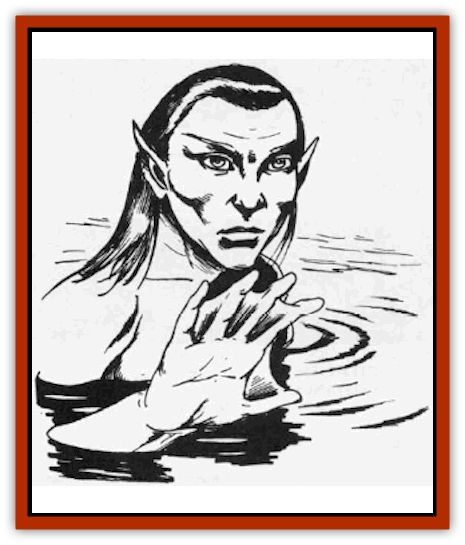

# Nixie

| Statistic | **Nixie** |
| --- | --- |
| **Activity Cycle:** | Night |
| **Alignment:** | Neutral |
| **Armor Class:** | 7 |
| **Climate/Terrain:** | Temperate lakes |
| **Damage/Attack:** | By weapon |
| **Diet:** | Fish |
| **Frequency:** | Rare |
| **Hit Dice:** | ½ |
| **Intelligence:** | Very (12) |
| **Magic Resistance:** | 25% |
| **Morale:** | Average (8-10) |
| **Movement:** | 6, Sw (12) |
| **No. Appearing:** | 20-80 (2d4&times;10) |
| **No. of Attacks:** | 1 |
| **Organization:** | Tribe |
| **Size:** | S (4' tall) |
| **Special Attacks:** | Charm |
| **Special Defenses:** | See below |
| **THAC0:** | 20 |
| **Treasure:** | Q (C) |
| **XP Value:** | 270 |

Nixies are water [[Sprite|sprites]] that live in fresh water lakes, and while they carry no grudge against humankind, they delight in enslaving men as their beasts of burden.

With webbed fingers and toes, pointed ears, and wide silver eyes, nixies bear little resemblance to their woodland cousins. Most are slim and comely, and they have lightly scale, pale green skin and dark green hair. Females are attractive, often twining shells and pearl strings in their thick hair, and they modestly dress in tight-fitting wraps woven from colorful seaweeds. The males wear loin cloths of the same materials. Nixies are naturally able to breathe water and they also retain the ability to breathe air, so travel on land is possible, although they prefer not to leave their lakes except in dire circumstances. Nixies speak their own language and the common tongue.

**Combat:** If one or more men approach within 30' of a group of pixies, the creatures will pool their magic to create a powerful *charm* spell, one such spell for every 10 nixies, which requires the victim to save versus spell at -2 on the die roll. Once a person is *charmed* but before he enters the water there is a 75% chance that a *dispel magic* spell will break the charm. Once in the water the chance of dispelling the magic drops to 10%. Nixies keep their charmed slaves for one full year, forcing them to do all their heavy labor, but thereafter the charm wears off and the victim is set free. During this enslavement, the nixies will keep a *water breathing* spell on the human captive, for pixies can cast this spell on any creature, or dispel it, once per day (duration is one day).

Male nixies carry long daggers and darts (javelins) which are used as spears under water and missiles above. Usually, each nixie has one of each weapon. The javelins can be cast a maximum of 60 yards (10 yards short range, 30 yards medium). Occasionally, nixies employ their fishing nets in battle, but it takes 10 nixies to wield the large nets and their prey must be in the water with them (roll to hit AC10 to ensnare a single man-sized creature, +2 to the AC for each additional victim, up to five total). Sometimes nixies will employ their guardian fish or pets in battle (see below).

Even with their 25% magic resistance, nixies fear fire and very bright lights, so a *flaming sword* or a *light* spell will keep them at bay. Nixies will try to negate a *continual light* spell by summoning small fish to crowd around the light and dim it.

**Habitat/Society:** Nixie dwellings are woven from living seaweed and it is only 5% likely that their lair will be noticed at any distance under 20' (it is impossible to detect from farther away than 20'). Nixies keep [[Fish_Giant|giant fish]] as guards, either 1-2 [[Fish_Giant|gar]] (20%) or 2-5 [[Fish_Giant|pike]] (80%), and these are taught to obey simple commands. Small ornamental shiners or rainbow-hued fish are kept as pets and trained to perform elaborate tricks. Trout, bass, and catfish are herded as food. Pixies can also summon 10-100 small fish (this takes 1-3 rounds).

Nixie tribes number from 20 to 80 individuals, with one third of the population being youths. Individual families number from four to eight members, and the tribe usually includes 10-15 distinct families, each related to the other through a common ancestor. These nixie tribes control an area with a radius of three to five miles, and when a tribe gets too large, two or three families split off to form a new tribe.

Nixie tribes are ruled by the Acquar (water mother) who is a direct descendant of the original founding ancestor. This is a hereditary position. She decides major disputes and chooses the most apt warrior to be the S'oquar, the warlord of the tribe responsible for the hunt and defense. The Acquar is advised by a council of elders, whose spokesperson is called the L'uquar, the keeper of the tribe's oral history. Treasures, whether the spoils of war or the results of work or luck, are divided equally by the Acquar. Intertribal rivalries are often fierce and females are sometimes kidnaped as brides, for nixies are polygamists, keeping two to three wives. Birth rates in the tribes are high but many children are lost in their first years, so the overall population grows slowly. Nixies worship water and nature powers.

**Ecology:** Lakes with nixie tribes are kept clean and well stocked, and often the human slaves are worked to improve the environment through the removal of trash and obstructions. Nixie artifacts include jewelry of shells, pearls and opals, silk from waterspiders, and *potions of water breathing*.

---
## Discovery & Documentation

**Source Publication:** MC1 Volume I (w/binder #1) (1991)
**Campaign Setting:** Advanced Dungeons & Dragons 2nd Edition
**Author(s):** Jay Batista, Scott Bennie, Grant Boucher, William W. Connors, Steve Gilbert, Heike Kubasch, James Lowder, David Edward Martin, Bruce Nesmith, Jean Rabe, Rick Swan, John J. Terra, Gary L. Thomas

### Other Creatures Found in This Source Book
   * [[Bat|Bat]]
   * [[Bear|Bear]]
   * [[Behir|Behir]]
   * [[Boar|Boar]]
   * [[Bookworm|Bookworm]]
   * [[Brownie|Brownie]]
   * [[Bugbear|Bugbear]]
   * [[Carrion_Crawler|Carrion Crawler]]
   * [[Cat_Great|Cat, Great]]
   * [[Catoblepas|Catoblepas]]
   * [[Dragon_General_Information|Dragon, General Information]]
   * [[Dragonfish|Dragonfish]]
   * [[Elemental_Air_Kin_Aerial_Servant|Elemental, Air Kin, Aerial Servant]]
   * [[Elemental_Earth_Kin_Sandling|Elemental, Earth Kin, Sandling]]
   * [[Elephant|Elephant]]
   * [[Gnoll|Gnoll]]
   * [[Hobgoblin|Hobgoblin]]
   * [[Homunculus|Homunculus]]
   * [[Hornet_Giant|Hornet, Giant]]
   * [[Horse|Horse]]
   * [[Hyena|Hyena]]
   * [[Jackal|Jackal]]
   * [[Jackalwere|Jackalwere]]
   * [[Korred|Korred]]
   * [[Lich|Lich]]
   * [[Lizard|Lizard]]
   * [[Lizard_Man|Lizard Man]]
   * [[Lycanthrope_General_Information|Lycanthrope, General Information]]
   * [[Lycanthrope_Seawolf|Lycanthrope, Seawolf]]
   * [[Lycanthrope_Werebear|Lycanthrope, Werebear]]
   * [[Lycanthrope_Weretiger|Lycanthrope, Weretiger]]
   * [[Lycanthrope_Werewolf|Lycanthrope, Werewolf]]
   * [[Manticore|Manticore]]
   * [[Medusa|Medusa]]
   * [[Mind_Flayer|Mind Flayer]]
   * [[Minotaur|Minotaur]]
   * [[Mudman|Mudman]]
   * [[Mummy|Mummy]]
   * [[Nymph|Nymph]]
   * [[Ogre|Ogre]]
   * [[Ooze_Slime_Jelly_I|Ooze/Slime/Jelly I]]
   * [[Ooze_Slime_Jelly_II|Ooze/Slime/Jelly II]]
   * [[Orc|Orc]]
   * [[Owl|Owl]]
   * [[Owlbear_I|Owlbear I]]
   * [[Pegasus|Pegasus]]
   * [[Piercer|Piercer]]
   * [[Pudding_Deadly|Pudding, Deadly]]
   * [[Rakshasa|Rakshasa]]
   * [[Rat|Rat]]
   * [[Ray|Ray]]
   * [[Remorhaz|Remorhaz]]
   * [[Satyr|Satyr]]
   * [[Scorpion|Scorpion]]
   * [[Selkie|Selkie]]
   * [[Shadow|Shadow]]
   * [[Skeleton|Skeleton]]
   * [[Skunk|Skunk]]
   * [[Snake|Snake]]
   * [[Spectre|Spectre]]
   * [[Spider|Spider]]
   * [[Sprite|Sprite]]
   * [[Toad_Giant|Toad, Giant]]
   * [[Treant|Treant]]
   * [[Troll|Troll]]
   * [[Umber_Hulk|Umber Hulk]]
   * [[Unicorn|Unicorn]]
   * [[Vampire|Vampire]]
   * [[Wight|Wight]]
   * [[Will_O'Wisp|Will O'Wisp]]
   * [[Wolf|Wolf]]
   * [[Wolfwere|Wolfwere]]
   * [[Wraith|Wraith]]
   * [[Wyvern|Wyvern]]
   * [[Yeti|Yeti]]
   * [[Yuan-ti|Yuan-ti]]
   * [[Zombie|Zombie]]
