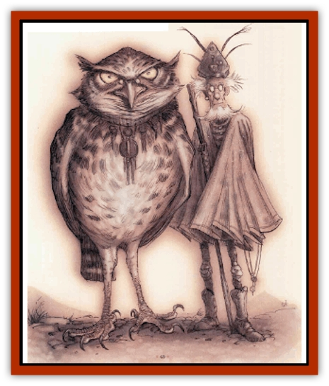

# Noctral

| Statistic | **Noctral** |
| --- | --- |
| **Activity Cycle:** | Dusk, night |
| **Alignment:** | Lawful good |
| **Armor Class:** | 1 |
| **Climate/Terrain:** | Mount Celestia |
| **Damage/Attack:** | 2d4/2d4/1d4+1 |
| **Diet:** | Carnivore |
| **Frequency:** | Rare |
| **Hit Dice:** | 5 |
| **Intelligence:** | Supra-genius (19-20) |
| **Magic Resistance:** | 30% |
| **Morale:** | Champion (15-16) |
| **Movement:** | 1, Fl 36 (C) |
| **No. Appearing:** | 1 |
| **No. of Attacks:** | 3 |
| **Organization:** | Solitary |
| **Size:** | M (20' wingspan) |
| **Special Attacks:** | Swoop, surprise |
| **Special Defenses:** | Invisibility |
| **THAC0:** | 15 |
| **Treasure:** | G |
| **XP Value:** | 3,000 |

Noctrals are creatures of Mount Celestia who act as advisers and sages to the other residents of the plane. They're an avian race, resembling great [[Owl|owls]] with golden eyes. Noctrals delight in showing off their remarkable intelligence, and they can be invaluable sources of information if a cutter doesn't mind being talked down to a little bit.

Noctrals' plumage ranges from dove gray to deep black. In twilight, their feathers cloak them in soft, silent shadow. A noctral stands about as tall as a full-grown man, and its wings span a distance of 20 feet or more. 'Course, a noctral's much lighter than a human of the same height - like all birds, their bones are hollow. Noctrals' faces are heart-shaped, like a barn owl's, and their large eyes have protective inner eyelids.

Noctrals can be found near places of knowledge or power in Mount Celestia. They often befriend [[Archon|archons]], [[Aasimon_General_Information|aasimon]], or exceptional petitioners and spend much of their time providing their companions with the benefit of their advice. This'd grow annoying quickly if it weren't for the fact that noctrals are extremely intelligent - and right more often than not.

**Combat:** Noctrals avoid combat where possible, since they're peaceful and kindly creatures by nature. Although they're physically a match for a minor fiend or a two, noctrals are intelligent enough to realize that powerful fiends or groups of skilled adventurers are far too dangerous to engage directly. When a noctral's confronted by a powerful enemy, it'll almost always retreat to muster help from nearby archons or aasimon and return leading its allies to the fight.

If a noctral does become involved in a physical fight, they're well-equipped to handle it. Like owls, noctrals are powerful and stealthy predators. They fight from the air, using their talons and hooked beak to deal with most foes. If the noctral has 50 feet of room, it can make a swooping attack once every 2 melee rounds (devoting every other round to maneuvering). When a noctral swoops, it forfeits its beak attack, but gains a +2 attack bonus with its talons and inflicts double damage with a hit. In addition, a swooping noctral is more difficult to strike, and its effective AC drops to -1.

Noctrals have the following special spell-like powers: *invisibility*, *legend lore* 3 times per day (at 15th level of ability), *speak with animals*, and *tongues*. They have a natural telepathy ability that they use to communicate with most mortal creatures, with a 1-mile range. The noctral's intelligence allows it to effectively *detect lie* when telepathically conversing with a human or demihuman.

Noctrals are well adapted for night hunting. In total darkness, they see as well as a human does by daylight, and their hearing is about 4 times better than an [[Elf|elf's]]. Noctrals cannot be surprised in normal nighttime conditions, and are surprised only on a 1 or 2 in full daylight, even when sleeping. Noctrals, like the prime owls they so closely resemble, fly in total silence; their enemies suffer a -6 penalty to their surprise checks if the noctral is aloft and it's dusk or night.

**Habitat/Society:** Here's the chant about noctrals: They're likely to know anything. Knowledge is power, after all, and noctrals know the dark of a lot of things. In Mount Celestia, they're the keepers of lore and the knowers of history. Any decent basher in Mount Celestia can go ask a noctral for help with almost any question. Noctrals are 80% likely to know any historical fact pertaining to Mount Celestia, and 20% likely to be well versed in the history of another plane.

In addition to their knowledge of history, noctrals also have areas of expertise, such as mathematics, astrology, magic, and so on, just like a sage. (In fact, most noctrals've got two or three areas of expertise - their hunger for knowledge is insatiable.) They're 80% likely to know any particular fact in their areas of expertise. As noted above, noctrals love to "help" mortals by sharing their extensive knowledge, so as long as a basher's reasonably polite and patient he's likely to find out what he needs to know. On the other hand, noctrals never share their information when it's clear that it might be turned to evil purposes.

Many noctrals act as advisers to the various powers or celestial stewards of Mount Celestia. Even a power might need a little insight on some esoteric matter every now and then, and noctrals are more than happy to oblige. As a result, some noctrals are under the protection of one of the good powers. A sod as harms one of these noctrals is 50% likely to provoke the direct retribution of the noctral's patron. If the noctral's patron intercedes, it's 95% likely that he or she sends a powerful good servant such as a [[Aasimon_Deva|deva]] or [[Aasimon_Planetar|planetar]] to the noctral's aid.

**Ecology:** Don't be fooled by the noctrals' manners and sophistication - they're still predators and need to hunt for their food. Naturally, they hunt only nonintelligent prey, and only when hunger demands it; noctrals don't kill for sport or pleasure. It's not uncommon for a stately noctral to excuse himself from a discourse on some arcane matter and swoop down upon a nearby rabbit, resuming his lesson while he dines.

---
## Discovery & Documentation

**Source Publication:** MC8 Outer Planes Appendix (1990)
**Campaign Setting:** Planescape
**Author(s):** Timothy B. Brown, Jamie LaFountain

### Other Creatures Found in This Source Book
   * [[Aasimon_Agathinon|Aasimon, Agathinon]]
   * [[Aasimon_Deva|Aasimon, Deva]]
   * [[Aasimon_Light|Aasimon, Light]]
   * [[Aasimon_General_Information|Aasimon, General Information]]
   * [[Aasimon_Planetar|Aasimon, Planetar]]
   * [[Aasimon_Solar|Aasimon, Solar]]
   * [[Air_Sentinel|Air Sentinel]]
   * [[Animal_Lord|Animal Lord]]
   * [[Archon|Archon]]
   * [[Baatezu_Lesser_Abishai|Baatezu, Lesser, Abishai]]
   * [[Baatezu_Greater_Amnizu|Baatezu, Greater, Amnizu]]
   * [[Baatezu_Lesser_Barbazu|Baatezu, Lesser, Barbazu]]
   * [[Baatezu_Greater_Cornugon|Baatezu, Greater, Cornugon]]
   * [[Baatezu_Lesser_Erinyes|Baatezu, Lesser, Erinyes]]
   * [[Baatezu_General_Information|Baatezu, General Information]]
   * [[Baatezu_Greater_Gelugon|Baatezu, Greater, Gelugon]]
   * [[Baatezu_Lesser_Hamatula|Baatezu, Lesser, Hamatula]]
   * [[Baatezu_Lemure|Baatezu, Lemure]]
   * [[Baatezu_Least_Nupperibo|Baatezu, Least, Nupperibo]]
   * [[Baatezu_Lesser_Osyluth|Baatezu, Lesser, Osyluth]]
   * [[Baatezu_Greater_Pit_Fiend|Baatezu, Greater, Pit Fiend]]
   * [[Baatezu_Least_Spinagon|Baatezu, Least, Spinagon]]
   * [[Balaena|Balaena]]
   * [[Bariaur|Bariaur]]
   * [[Bebilith|Bebilith]]
   * [[Bodak|Bodak]]
   * [[Dog_Moon|Dog, Moon]]
   * [[Dragon_Adamantite|Dragon, Adamantite]]
   * [[Einheriar|Einheriar]]
   * [[Gehreleth|Gehreleth]]
   * [[Githyanki|Githyanki]]
   * [[Githzerai|Githzerai]]
   * [[Hordling|Hordling]]
   * [[Lammasu_Celestial|Lammasu, Celestial]]
   * [[Larva|Larva]]
   * [[Maelephant|Maelephant]]
   * [[Marut|Marut]]
   * [[Mediator|Mediator]]
   * [[Mortai|Mortai]]
   * [[Night_Hag|Night Hag]]
   * [[Nightmare|Nightmare]]
   * [[Per|Per]]
   * [[Phoenix|Phoenix]]
   * [[Slaad|Slaad]]
   * [[Tanar'ri_Greater_Babau|Tanar'ri, Greater, Babau]]
   * [[Tanar'ri_Greater_Chasme|Tanar'ri, Greater, Chasme]]
   * [[Tanar'ri_Greater_Nabassu|Tanar'ri, Greater, Nabassu]]
   * [[Tanar'ri_Least_Dretch|Tanar'ri, Least, Dretch]]
   * [[Tanar'ri_Least_Manes|Tanar'ri, Least, Manes]]
   * [[Tanar'ri_Least_Rutterkin|Tanar'ri, Least, Rutterkin]]
   * [[Tanar'ri_Lesser_Alu-Fiend|Tanar'ri, Lesser, Alu-Fiend]]
   * [[Tanar'ri_Lesser_Bar-Lgura|Tanar'ri, Lesser, Bar-Lgura]]
   * [[Tanar'ri_Lesser_Cambion|Tanar'ri, Lesser, Cambion]]
   * [[Tanar'ri_Lesser_Succubus|Tanar'ri, Lesser, Succubus]]
   * [[Tanar'ri_Guardian_Molydeus|Tanar'ri, Guardian, Molydeus]]
   * [[Tanar'ri_General_Information|Tanar'ri, General Information]]
   * [[Tanar'ri_True_Balor|Tanar'ri, True, Balor]]
   * [[Tanar'ri_True_Glabrezu|Tanar'ri, True, Glabrezu]]
   * [[Tanar'ri_True_Hezrou|Tanar'ri, True, Hezrou]]
   * [[Tanar'ri_True_Marilith|Tanar'ri, True, Marilith]]
   * [[Tanar'ri_True_Nalfeshnee|Tanar'ri, True, Nalfeshnee]]
   * [[Tanar'ri_True_Vrock|Tanar'ri, True, Vrock]]
   * [[Titan|Titan]]
   * [[Translator|Translator]]
   * [[T'uen-rin|T'uen-rin]]
   * [[Vaporighu|Vaporighu]]
   * [[Warden_Beast|Warden Beast]]
   * [[Yugoloth_Greater_Arcanaloth|Yugoloth, Greater, Arcanaloth]]
   * [[Yugoloth_Lesser_Dergoloth|Yugoloth, Lesser, Dergoloth]]
   * [[Yugoloth_Lesser_Hydroloth|Yugoloth, Lesser, Hydroloth]]
   * [[Yugoloth_General_Information|Yugoloth, General Information]]
   * [[Yugoloth_Lesser_Mezzoloth|Yugoloth, Lesser, Mezzoloth]]
   * [[Yugoloth_Greater_Nycaloth|Yugoloth, Greater, Nycaloth]]
   * [[Yugoloth_Lesser_Piscoloth|Yugoloth, Lesser, Piscoloth]]
   * [[Yugoloth_Greater_Ultroloth|Yugoloth, Greater, Ultroloth]]
   * [[Yugoloth_Lesser_Yagnoloth|Yugoloth, Lesser, Yagnoloth]]
   * [[Zoveri|Zoveri]]
